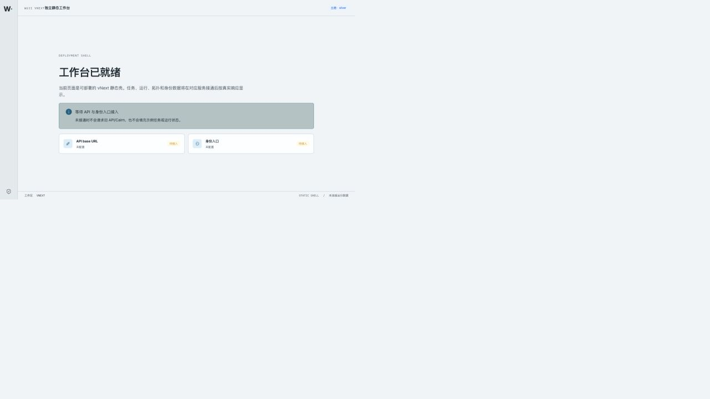

# vNext Web 静态壳真实 K8s 部署验证

- 验证日期：2026-09-14
- 工作树：`/Users/yym1ng/Documents/ChatGPT/wuji/work/worktrees/vnext-maf`
- 被测提交：`b1814a97c301e6eb650383dcf61de806dd2ee4fb`
- Kubernetes context：`docker-desktop`
- namespace：`wuji-vnext-test`
- 镜像：`127.0.0.1:56615/wuji-web@sha256:8a56b3f236adea75454128d22e43ee8f88cc929084b3b522728e9710736a31d7`
- 镜像核验：`linux/arm64`，Pod `imageID` 与上述 digest 一致
- 资源范围：仅 `ConfigMap/wuji-web-config`、`Deployment/wuji-web`、`Service/wuji-web`
- 本地访问命令：`/opt/homebrew/bin/kubectl --context docker-desktop -n wuji-vnext-test port-forward svc/wuji-web 44180:80`

## 结果

真实 `kubectl apply` 退出码为 `0`。Pod `wuji-web-5c97458f56-4xrl2` 为 `Running`、`1/1 Ready`、`0` 次重启；Pod UID 为 `efdace7a-70ca-49a2-ada7-b3bd96061204`。Service selector 只匹配该 Pod，EndpointSlice 地址为 `10.1.0.25`，`ready=true`，因此三个 HTTP 响应均可归属本次 `wuji-web` Service 的 port-forward。

port-forward 在验证期间输出 `127.0.0.1:44180 -> 8080` 并记录了请求连接；验证完成后以 Ctrl-C 清理，包装进程退出码为 `1`，原因和原始 stdout/stderr 已单独保存。Deployment、后端、runtime、scheduler、gates 与 C2 均未修改。

## 截图证据



浏览器页面显示“工作台已就绪”、`API base URL 未配置`、`身份入口 未配置`，并显示“等待 API 与身份入口接入”。真实 API/auth、任务、运行数据链路仍未接通，本次没有请求或伪造这些数据。

截图 SHA-256：`d2d4931215a1f3ba16ca9ab3b826604f9a84fa0a7c7bd4115f1d729aeb0cea0f`

## 完整 HTTP 报文

以下报文由本地 HTTP 客户端经 `127.0.0.1:44180` 取得，方法、请求头、请求体和响应体均完整保留；三个请求均无请求体。原始文件分别为 [`http-healthz.http`](evidence/k8s-static-shell-20260914/http-healthz.http)、[`http-root.http`](evidence/k8s-static-shell-20260914/http-root.http) 和 [`http-config.http`](evidence/k8s-static-shell-20260914/http-config.http)。

### healthz

```http
REQUEST
GET /healthz HTTP/1.1
Host: 127.0.0.1:44180
User-Agent: wuji-web-k8s-verifier/1.0
Accept: */*
Connection: close

RESPONSE
HTTP/1.1 200 OK
Server: nginx/1.29.1
Date: Mon, 14 Sep 2026 06:19:10 GMT
Content-Type: text/plain
Content-Length: 3
Connection: close

ok
```
### root

```http
REQUEST
GET / HTTP/1.1
Host: 127.0.0.1:44180
User-Agent: wuji-web-k8s-verifier/1.0
Accept: */*
Connection: close

RESPONSE
HTTP/1.1 200 OK
Server: nginx/1.29.1
Date: Mon, 14 Sep 2026 06:19:11 GMT
Content-Type: text/html
Content-Length: 431
Last-Modified: Mon, 14 Sep 2026 05:59:10 GMT
Connection: close
ETag: "6aa78d2e-1af"
Accept-Ranges: bytes

<!doctype html>
<html lang="zh-CN">
  <head>
    <meta charset="UTF-8" />
    <meta name="viewport" content="width=device-width, initial-scale=1.0" />
    <title>Wuji</title>
    <script src="/config.js"></script>
    <script type="module" crossorigin src="/assets/index-COOnV0rV.js"></script>
    <link rel="stylesheet" crossorigin href="/assets/index-D6JwkvWU.css">
  </head>
  <body>
    <div id="root"></div>
  </body>
</html>
```
### config.js

```http
REQUEST
GET /config.js HTTP/1.1
Host: 127.0.0.1:44180
User-Agent: wuji-web-k8s-verifier/1.0
Accept: */*
Connection: close

RESPONSE
HTTP/1.1 200 OK
Server: nginx/1.29.1
Date: Mon, 14 Sep 2026 06:19:11 GMT
Content-Type: application/javascript
Content-Length: 64
Last-Modified: Mon, 14 Sep 2026 06:11:39 GMT
Connection: close
ETag: "6aa7901b-40"
Accept-Ranges: bytes

window.__WUJI_CONFIG__ = {"apiBaseUrl":"","authEntrypoint":""};
```


漏洞点：本次是静态 Web 部署和可达性验证，没有发现漏洞，也没有执行目标数据写入、持久化或越权扩散。空的 API/auth 配置保持静态壳行为，不会请求旧 API/Cairn 或填充示例运行数据。

## 命令证据

所有命令均保存在 [`evidence/k8s-static-shell-20260914/`](evidence/k8s-static-shell-20260914/)；每条关键命令均有对应 stdout、stderr 和 exit 文件：

- 构建与发布：`build.*`、`tag.*`、`push.*`、`image-inspect.*`
- 清单与应用：`web-manifest.json`、`manifest-validation.*`、`apply.*`
- Pod 就绪与状态：`wait-pod-ready.*`、`rollout.*`、`pods.*`、`pods-wide.*`、`events.*`
- Service 归属：`service-endpoint-verification.*`、`service-endpoint-verification.service.json`、`service-endpoint-verification.endpointslice.json`
- 访问验证：`port-forward-44180.command.txt`、`port-forward-44180.stdout`、`port-forward-44180.stderr`、`port-forward-44180.exit`、`http-check.*`

本次未发现清单之外的新目标资产或接口；已验证资产均为 Web 清单中既有的 namespace 内资源和静态路径，状态为“未利用（部署/可达性验证）”。
