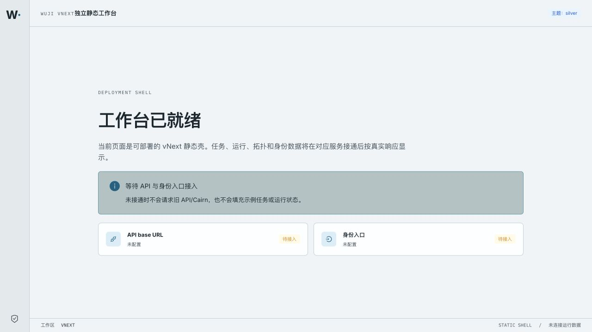

# vNext Web 静态壳验证记录

- 验证日期：2026-09-14
- 工作树：`/Users/yym1ng/Documents/ChatGPT/wuji/work/worktrees/vnext-maf`
- 被测提交基线：`cdda7f425355f6500f5f8e5252836674300d68a2`
- 镜像：`wuji-web:vnext-shell`，构建目标 `linux/arm64`
- 访问方式：`http://127.0.0.1:4180/`（本地 Docker 映射；K8s 对应 `kubectl -n wuji-vnext-test port-forward svc/wuji-web 4180:80`）
- 结果：静态构建、arm64 镜像、manifest、浏览器空状态均通过；真实 API/auth 未接通，未进行任务或运行数据请求。

截图证据：



截图中可见：`工作台已就绪`、`等待 API 与身份入口接入`、API/auth 均为`未配置`，页面没有任务或运行示例数据。

## 完整 HTTP 报文

以下报文来自运行中的 `wuji-web:vnext-shell` 容器；请求均为 GET，无请求体，响应体完整保留。

### 1. Health probe

```http
GET /healthz HTTP/1.1
Host: 127.0.0.1:4180
User-Agent: curl/8.7.1
Accept: */*

HTTP/1.1 200 OK
Server: nginx/1.29.1
Date: Mon, 14 Sep 2026 05:59:22 GMT
Content-Type: text/plain
Content-Length: 3
Connection: keep-alive

ok
```

### 2. Runtime configuration

```http
GET /config.js HTTP/1.1
Host: 127.0.0.1:4180
User-Agent: curl/8.7.1
Accept: */*

HTTP/1.1 200 OK
Server: nginx/1.29.1
Date: Mon, 14 Sep 2026 05:59:22 GMT
Content-Type: application/javascript
Content-Length: 70
Last-Modified: Mon, 14 Sep 2026 05:59:10 GMT
Connection: keep-alive
ETag: "6aa78d2e-46"
Accept-Ranges: bytes

window.__WUJI_CONFIG__ = {
  apiBaseUrl: '',
  authEntrypoint: '',
};
```

### 3. Static entry

```http
GET / HTTP/1.1
Host: 127.0.0.1:4180
User-Agent: curl/8.7.1
Accept: */*

HTTP/1.1 200 OK
Server: nginx/1.29.1
Date: Mon, 14 Sep 2026 05:59:22 GMT
Content-Type: text/html
Content-Length: 431
Last-Modified: Mon, 14 Sep 2026 05:59:10 GMT
Connection: keep-alive
ETag: "6aa78d2e-1af"
Accept-Ranges: bytes

<!doctype html>
<html lang="zh-CN">
  <head>
    <meta charset="UTF-8" />
    <meta name="viewport" content="width=device-width, initial-scale=1.0" />
    <title>Wuji</title>
    <script src="/config.js"></script>
    <script type="module" crossorigin src="/assets/index-COOnV0rV.js"></script>
    <link rel="stylesheet" crossorigin href="/assets/index-D6JwkvWU.css">
  </head>
  <body>
    <div id="root"></div>
  </body>
</html>
```

漏洞点：本次是部署壳验证，无漏洞结论；空配置路径明确阻止旧 API/Cairn 请求和伪造运行数据。
