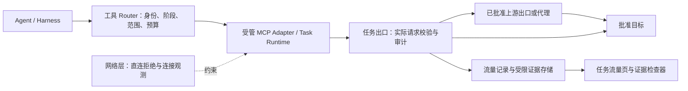

# Wuji 场景、执行边界与流量工作台修订方案

状态：**review-draft**。2026-09-10 用户反馈后的设计修订；需求已明确，具体工程选型、契约及分批 Spec / Plan 待评审。本文件优先替代旧交互方案中“HTTP 首批闭环 / Agent 完整体验”的产品入口设计，不宣称五类场景已开发。

用户同轮进一步确认：**删除路径级强制访问限制**。执行范围保留域名/子域、协议、端口及已批准资产；路径仅可作为测试重点与流量筛选条件。HTTPS 内容可见性是独立需求，不因删除路径限制而自动具备。

基准：业务 `381ae3a`，上一原型候选 `2e35177`，上一检查记录 `c027427`。本轮只做文档和静态审查；不改页面、不运行集群或目标测试、不扩大上轮测试预算。

## 1. 产品入口与场景

任务页保留创建、搜索、状态/场景筛选和任务列表。移除两块开发阶段入口；HTTP Adapter 与 Agent 是执行能力，不能作为用户的任务类型。创建第一步先选任务类型，再按类型展示输入。实际部署只开放能力已通过验收的场景；评审原型可展示全部五类并标明规划状态，不能伪装可执行。

| 任务类型 | 必要输入 | 主要过程与人工关口 | 平台边界 |
| --- | --- | --- | --- |
| CTF | 题目说明、附件或靶机入口；比赛规则/有效时间 | 分析题目→选择方法→隔离验证→输出解题依据；按题型裁剪输入 | 题目环境和附件范围；不因 CTF 名称解除平台禁令 |
| Web 单点渗透 | 单个系统入口、域名/子域选择、目标描述；可选接口资料与测试身份 | 建立攻击面→生成可调整计划→验证→汇总结论/限制 | 只在批准的系统范围内工作；不发现并深入客户内网，不将共用 IP 当作整机授权 |
| 综合渗透 | 已批准的外部/内部资产或网段、接入环境、阶段目标及禁止项 | 分阶段验证与关联分析；扩大资产/方法前进入授权关口 | 内网范围必须明确；任务标签不自动赋予内网或横向能力，平台基础设施始终隔离 |
| 攻防演练 | 单位名称、可选已知域名、演练时间与目标 | 已批准信息源收集→候选资产归属核对→人工勾选并批准测试对象→分阶段验证 | 单位名称只用于调查；候选资产不等于已授权资产；主动探测也需要相应授权 |
| 代码审计 | 上传源码或 Git 地址、分支/提交、审计目标；动态阶段需要环境配置 | 显式导入固定源码→静态分析→隔离构建/运行→验证→定位源码与结果 | 源码导入、依赖下载、样例服务和目标测试分别授权；仓库文字不授予执行权限 |

完整场景使用可版本化的阶段模板，规定输入、能力和授权关口；阶段内由黑板与 Agent 决定下一步工作，不把探索写死为角色流水线。“单点”指单系统，不意味着只允许一个 HTTP 请求；“允许子域”也不意味着获得内网权限。

## 2. Web 单点创建示例

### 步骤一：任务类型与目标

先显示五类场景。选 Web 单点后填写系统入口和关注点；名称自动建议，可编辑。默认提供场景说明及当前版本可执行的检查维度。高级项才展开自定义完成标准/明确不做的事项。无需先理解 HTTP Adapter 或多 Agent。

### 步骤二：对象与授权范围

| 用户可理解的配置 | 默认 | 明确语义 |
| --- | --- | --- |
| 入口 | 用户输入 `https://app.example.test` | 入口地址不是整项目或整服务器授权 |
| 域名范围 | 仅 `app.example.test` | 包含其子域需主动选择且上级授权允许；不自动包含父域或兄弟域 |
| 子域选择 | 关闭 | 可选“所有已授权子域”或“指定子域”；UI 展示根域是否包含及当前批准范围 |
| 重点入口（可选） | 入口 URL 的路径 | 仅引导测试计划，不是访问白名单；同一批准域名的其他路径仍属于网络可访问范围 |
| 排除项 | 继承禁止域名、资产与操作类别 | 用户可缩小域名/资产范围；不提供“禁止访问某路径”的强制承诺 |
| 协议与端口 | 入口的协议与端口 | 其他端口、HTTP→HTTPS 跳转分别核验，不默认为全端口 |
| 测试身份 | 匿名；需要登录才选择已保存身份 | 显示适用系统与有效性，凭据不进入普通日志或模型上下文 |
| 时间与方法 | 继承有效授权、非破坏性方法限制 | 是否可用取决于工具与方法能力，不是 GET/POST 名称就能证明安全 |

域名白名单不是 IP 白名单：DNS 的 CNAME/CDN 解析只提供连接地址，不授权访问别的虚拟主机。跳转、页面资源、接口调用、WebSocket 和下载逐项检查；外部登录、CDN 脚本等缺失依赖应显示阻断，可另行批准受限辅助访问，不自动列为测试对象。

范围分为“候选资产”“已批准测试对象”“辅助服务”三个语义类别；资产卡可以提出授权申请，Agent 和黑板 Fact 不能直接改批准状态。IP 目标和内网已部署的单系统需要相应显式入口策略；不能将所有私网地址一概开放。平台 Pod/Service/Node、宿主和元数据地址不属于客户目标授权。

### 步骤三：运行配置

| 面向用户的配置 | 是否需要每次填写 | 默认与高级内容 |
| --- | --- | --- |
| 模型方案 | Agent 场景必须有可用方案，正常只确认预选 | 显示实际模型、用途、额度、数据处理位置；高级可从项目允许方案选择规划/复核模型。Provider/Base URL/密钥在配置中心管理 |
| 资料与身份 | 可选；所选方法有依赖时必需 | 选择版本化接口资料、登录身份等；缺少时展示未覆盖项，不能冒充登录后验证 |
| 工具能力 | 场景自动装配 | 默认显示浏览器、HTTP、接口分析等能力摘要；高级可关闭可选能力。MCP 地址、版本、凭据、危险参数由管理员统一管理 |
| DNSLog / 带外验证 | 方法需要且服务已配置时选择 | 默认项目受管服务或关闭；按任务/验证分配唯一回调标记、过期时间与查询权限。未启用时带外依赖项标为不可验证 |
| 出口与代理 | 默认项目受管出口 | 显示出口位置/来源标签及可用代理策略；高级选择允许的固定代理或批准的代理池，不能给 Agent 任意代理 URL |
| 执行环境 | 通常默认即可 | 用户看到“本地 Kubernetes / 指定测试网络”等逻辑环境、连通范围与能力；资源镜像/namespace/Pod 不进入创建表单 |
| 预算与节奏 | 默认项目标准，摘要始终可见 | 时间、请求上限、总速率/并发、模型额度、停止条件；高级调整不得超过项目/目标聚合限制 |
| 人工介入 | 场景默认关口 | 授权范围变化必须由有权限用户批准；普通提示和问题回答不能替代审批 |

代理池用于受管来源选择、固定会话和已批准的故障切换。目标 403/429/WAF 阻断时默认降速、暂停或请求人工处理；不把遇到拦截自动轮换出口继续请求设为默认策略。建议在演练准备中与授权方配置测试来源许可。不同出口共用同一任务和目标预算，不能通过切换代理重置计数。

这些配置发布为 ModelProfile、ToolsetProfile、OASTProfile、EgressProfile、RuntimeProfile 等版本；任务固定逻辑引用与内容摘要，密钥由控制组件解析。任务页不是管理员配置中心。

### 步骤四：确认与创建

摘要显示具体场景、对象/排除项、阶段和人工关口、模型/工具、出口、预算、预期结果及未支持项。保存草稿只保存配置；创建形成待启动任务；显式启动才启动当前已批准阶段。攻防演练可先启动批准的信息收集阶段，资产未批准时不能进入主动测试阶段。

## 3. 分阶段授权与黑板

建议新增 TaskStage 和 StageGate 领域对象。Task 是一次作业，阶段状态与 Task 生命周期分开：信息收集完成可以进入“等待对象授权”，不需要伪装任务已结束或普通暂停。

1. Agent 将资产及归属依据写为候选 Observation/Fact；多个来源不自动代表归属确认。
2. 授权页显示候选对象、归属依据、希望使用的方法、时限及相对现有范围的变化。
3. 有 Scope 权限的用户批准具体资产集合与规则；回答聊天问题或输入 Hint 均不能批准。
4. 平台保存新 Scope 版本，撤销旧执行许可；Router/Runtime/出口完成版本绑定，再签发当前阶段许可。失败保持阻断。
5. Dispatcher 只派发其前提已满足且范围允许的 Intent。范围变更、预算等待和证据冲突是不同的阻断原因。

未展开执行的后续阶段可保存配置，不提前建立广域出口。综合渗透的内网接入及代码审计动态环境分别需要专用 Runtime/出口能力，不靠扩大 Web Profile 完成。

## 4. 出网强制路径

### 4.1 现有架构可复用与必须补齐

现有 architecture §4 已选择“受控 HTTP 请求转发”，并明确不开放任意 CONNECT；§5 已有工具许可；§6 已有 Runtime 隔离。此次不重写调度框架，补齐场景编译、工具接入资格、审计数据与 UI 契约。

- Router 将场景与阶段的能力、项目授权、任务选取范围、工具能力和预算求交，产生有版本的 EffectivePolicy。模型只提议操作。
- 出口验证可信工作负载和 call/attempt 许可，自己解析实际 URL 的域名/协议/端口与工具方法；路径只记录和展示，不参与访问授权；拒绝自行伪造 Host 或不一致的 authority；多路复用也逐请求核验。
- 解析、地址分类、连接选择在同一受管执行路径完成；重定向、重试、新连接重新核验，不能检查一次域名后让工具自主再次解析。
- 网络层默认拒绝 Runtime 直连，限制 DNS、UDP/QUIC、外部代理、节点和宿主路径；不能只设置 HTTP_PROXY 环境变量。工具不能更改策略或拿到平台凭据。
- 本地 Docker Desktop Kubernetes 已存在，但其具体网络实现是否满足这些限制仍是待验证事实。NetworkPolicy 的存在不证明已生效；不能默认安装或更换 CNI。
- 原生 NetworkPolicy 对节点、同 Pod、现有连接和日志都有局限，需在选型中明确补充节点路径过滤、工作负载身份、网关连接撤销及连接观测。全部能力未满足时，该 Runtime 不具备执行资格。

Kubernetes 官方说明 NetworkPolicy 主要控制 L3/L4，依赖支持它的网络插件，且不自带网络事件日志；Cilium 提供 DNS/FQDN 与 Hubble 观测能力，但这里只列为候选，不宣称当前 Docker Desktop 已具备。[NetworkPolicy](https://kubernetes.io/docs/concepts/services-networking/network-policies/)、[Cilium DNS 策略](https://docs.cilium.io/en/stable/security/dns/)、[Hubble](https://docs.cilium.io/en/stable/observability/hubble/)。

### 4.2 HTTPS、浏览器与非 HTTP 的能力边界

首个 HTTP Adapter 把结构化请求交给受信网关，由网关建立目标 TLS、校验证书并取得请求/响应明文；它校验域名范围并记录流量，不执行路径白名单。域名范围控制和内容采集分别验收；加密连接或 PCAP 本身不能展示完整 HTTP 内容。

浏览器/通用 HTTP 工具如需展示 HTTPS 请求和响应明文，可评估任务内受信 CA 的 HTTPS 检查代理；只在隔离 Runtime 内配置信任，并继续验证上游证书，不安装到用户宿主信任库。证书固定或不兼容协议时，应显示内容不可见或该能力不可用；若无法证明域名范围强制成立则仍拒绝接入。未来仅连接级模式必须单独声明不具备完整请求/响应观察，不伪装完整采集。CONNECT/SNI 可辅助判断连接目标，但在共享 IP、不同 HTTP authority 等情况下不能独自证明实际访问的应用域名；选型应验证受信客户端绑定或 L7 校验，而非借删除路径限制直接放行任意隧道。mitmproxy 文档解释了两段 TLS 与代理解密机制；是否选择该实现仍待 Phase 1C 选型。[mitmproxy 原理](https://docs.mitmproxy.org/stable/concepts/how-mitmproxy-works/)。

WebSocket 帧、HTTP/2、HTTP/3、原始 TCP/UDP 应按 Adapter 能力分别开放。未支持 HTTP/3 时明确阻断 QUIC；不能因页面仍能加载就声称所有浏览器通道受控。综合场景需要的网络协议记录连接与字节摘要，只有有解析器的协议才展示应用内容。

平台能控制自己发起的流量，不能据此保证第三方目标服务器内部的后续网络行为。带外回调提供另一端的观察证据，不能当作目标内部全网流量镜像。

### 4.3 MCP、代理与带外服务的边界

MCP 是工具接入协议，本地和远程 Server 都可提供工具；网络隔离和完整请求审计是 Wuji 对执行方的附加要求。[MCP 架构](https://modelcontextprotocol.io/docs/learn/architecture)。

| 接入方式 | 产品规则 |
| --- | --- |
| 自有 Runtime 中的目标工具 MCP | 实际网络请求必须经同一出口；注册时声明协议、目标提取、取消和审计能力，并由平台核验 |
| 远程目标执行 MCP | 只有部署于受管执行域并执行相同范围/许可/审计协议才可用于严格受控测试；仅凭远端自报日志不承诺全流量受控 |
| 模型、公开信息源、资料导入 | 独立的基础服务/数据出口策略，固定用途和数据分类；不能把其服务域名加入目标测试范围 |
| 上游代理 | 在策略网关之后接入；任务记录代理 Profile 与路由变化。代理自行 DNS 解析时本地不能保证真实目标 IP，严格模式需受信远端出口执行相同地址校验，否则不具备该模式资格 |
| DNSLog/OAST | Broker 分配关联标记与有效期，MCP 只暴露分配/查询能力；事件关联验证操作，迟到结果只补证，不重新启动任务。原始凭据及外部管理权限不交给 Agent |

OAST 回调来源可能是递归 DNS 解析器或中间服务，必须保留来源与不确定性，不能仅凭一次命中自动认定完整漏洞或影响范围。

## 5. 流量记录和展示

“每个出网”先定义为平台控制域内每次获准目标请求和可观测连接，以及被拒绝尝试。网关 L7 记录负责请求级事实，网络层观测负责发现直连和拒绝，二者互相核对。网络采集可能丢事件，必须显示覆盖能力、丢失计数和缺口，不把日志空白解释为没有网络活动。

每条获准 HTTP 请求至少有任务、阶段、Agent/人工主体、tool_call/attempt、request_id、策略版本、时间、规范化目标、方法、已选解析地址、出口 Profile、决策、状态码/失败原因、耗时和收发字节。重定向和重试保留父请求关系并单独计量。关联 ID 由受信服务派生，不能信任工具自报 task header。

出网前持久记录准入与预算预占；完成后追加发送/响应/失败结果。崩溃留下的记录标为未知并核对，不声称成功或未发送。审计写入不可用或可靠缓冲到达上限时停止新的目标请求；网络观测故障单独标注覆盖缺口，严格 Profile 阻止继续执行。

明文请求/响应按证据策略处理：常规列表和 Agent 输出脱敏 Authorization/Cookie/Token；原始敏感内容单独权限、加密和保留期限。响应过大保存上限内内容并标记截断；不静默丢失。目标查询字符串同样可能敏感，不能原样进入普通日志。PCAP 是可选诊断产物，不能替代结构化 HTTP 记录，也不默认无限采集。

任务详情增加独立“流量”页签：

- 顶部显示当前采集能力、实际请求/连接数、失败/拒绝数、速率、收发量和可见缺口，不展示无依据的总进度。
- 默认列表显示时间、阶段/Agent/工具、目标、方法、状态/拒绝原因、耗时、大小、出口。按域名、路径、工具、结果和时间筛选；目标流量、辅助服务流量、带外回调分组。
- 选择记录后右侧展示请求、响应、来源、策略判定和关联证据；大内容按需鉴权读取，列表不批量下载原文。
- 从计划/黑板/漏洞可定位相关流量；从流量反查发起的工具和验证目的。被拒绝请求显示策略原因与申请入口，不提供绕过按钮。
- 自动滚动可以暂停，只影响浏览；“暂停任务”是独立命令。历史查看不发包；未来重放必须创建受授权、预算控制的新执行操作。
- 分页与增量同步复用已有事件恢复原则；Task 事件只发送流量记录引用/摘要，不把所有响应体塞入 Outbox 或 LangGraph State。

## 6. 数据和接口影响（未发布契约）

| 现有基础 | 需要修订/新增 |
| --- | --- |
| TaskDraft 以单 URL、http_observe 和限额为中心 | 场景版本 + 类型化输入；Web 对象、CTF 附件、单位调查和源码输入分别建模，保留当前严格 DTO 的迁移策略 |
| ScopePolicy 当前含 origin/path/method | 新目标设计删除路径级网络权限，增加子域语义、资产集合、阶段绑定、服务/目标用途；历史路径限制的批准记录需独立兼容处理 |
| ScenarioProfile / ConfigSnapshot | 纳入阶段模板、required capabilities、Profile 引用与实际能力矩阵 |
| Task / ToolCall / ToolAttempt / Outbox | 增加 TaskStage/StageGate、TrafficRequest/NetworkFlow/EgressDecision 引用；不将每个包写为任务状态版本 |
| Asset / Fact / EvidenceLink | 候选归属、批准记录、回调证据、请求因果链；批准仍经独立业务命令 |
| 任务与事件 API | 创建选项/场景能力、阶段授权、流量分页/详情/摘要、受限证据读取；接口路径与权限在具体 Spec 冻结 |
| 任务页 / 创建页 / 详情 | 移除开发阶段入口；场景驱动表单；运行配置用业务语言；资产批准卡、流量页与请求检查器 |

当前数据库与 0.4.0 仍含已有路径限制，本轮不修改存量记录或悄悄扩大原批准范围；正式迁移时将旧任务保留原约束或阻止其执行，需新的域名级授权后才能进入新执行模型。API 版本、迁移和前端字段删除在对应 Spec 一并明确。

不要直接对已发布 0.4.0 塞入未来字段，也不把原型的 query state 当作真实任务状态。旧 queued 与显式 start 的兼容迁移仍按既有前置方案处理。

## 7. 开发顺序与有限验证

先评审本修订，随后由主代理在应用 Plan 模式准备新的阶段 Spec / Plan。当前不启动后端开发。

1. 产品修订原型：五类场景入口，完整展开 Web 单点，其他场景体现差异输入/人工关口；运行配置与流量页可点击，不用五套独立工作台。
2. Phase 1C：先落实场景/创建启动前置契约与 HTTP 出口、审计闭环。HTTP 固定执行保留为开发验收夹具，不作为正式任务类型营销；用户选择 Web 单点时明确当前支持的检查维度。
3. Phase 2：验证 Harness 并接单 Agent、最小黑板和真实计划/证据关系，形成有限但真实的 Web 场景。
4. 后续依赖：浏览器与受管代理/OAST；CTF 专用输入/工具；代码静态审计→隔离动态；综合/攻防演练需要阶段授权、资产归属与隔离网络。排序可在各阶段按优先级调整，不预先开放未受控工具。

强制网络边界属于必须验证的核心功能，但不扩大为无限故障矩阵。后续一次最小检查需要覆盖：范围内请求及流量证据；范围外/直连被拒；域名/子域边界与跨域跳转校验；阶段未批准不执行；取消撤销及审计缺口不误报。仅在相关 Adapter 接入时检查其新通道。仍共享 600 秒；关键未通过则标为不可执行，停止追加测试并记录后续集中项。

## 8. 静态审查处置

独立审查使用 GPT-5.6 SOL / xhigh，只读核对，无测试。其报告基于修订前内容；主代理按用户最新指示筛选：

- 接受远程 MCP、代理/DNS/OAST、流量账本、阶段审批和动态代码沙箱的缺口，已纳入本方案。
- 不采纳报告中继续要求 HTTPS 路径白名单的建议，该需求已被用户明确删除。
- 阶段审批先使用 TaskStage/StageGate，不因审查建议立即增加 Engagement 和每阶段独立 Task 两套生命周期；跨任务演练编排需要时再立项。
- 不把“Web 单点”机械等同“公网”：已授权的客户内网单系统可以使用专用隔离出口，仍禁止扩展到其他内网资产或平台基础设施。
- 对动态源码验证只定义必需隔离与依赖准备边界，本轮未选择沙箱产品或测试其安全性。
