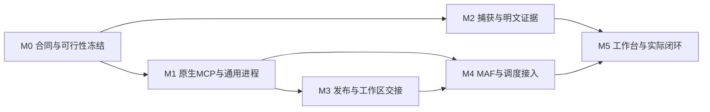

# Core CTF 开发 Plan

状态：in-progress，用户已授权补齐全局设计后连续本地实施；总体合同见同目录 [Spec](spec.md)§2/8。D-NET已选严格HTTP(S)明文，原始扫描后置；未执行项目仍为not_run。
日期：2026-09-22；基准 `3682eda`。主代理负责架构、公共合同、锁文件、迁移和集成。2026-09-23用户指定后续新开子代理使用 **GPT-6 Sol / high**；此前Astra/high讨论、Sol/xhigh开发保持实际记录，不因模型交接重复验证。

## 1. 可交付终点

一个新 core-ctf Task 在正式工作台创建并显式启动；真实 MAF 原生 MCP 执行 Kali 命令，长进程可读/输入/停止；受支持 HTTP(S) 有完整明文和原包；A发布脚本、B在独立Session按固定版本执行；结果有依据，取消真实停止。先单操作者/单项目，保留现有Task边界，组织多租户扩展后置。

不以“更多单元测试”“Pod Ready”“机制模型说成功”替代这个终点。新捕获保证、实际CTF效果及文档检查分别记录。

## 2. 依赖与分工

- A0 主代理：冻结所有对外字段、公共表/迁移、依赖锁、Task模板、集成和最终判断。
- A1：MCP/进程执行；A2：capture/网络/明文；A3：黑板/共享产物。三者只有在M0合同冻结后才并行实施，不各自发明身份或回执。
- M4由A0集成MAF和Scheduler；M5串行部署/验收。测试、数据库、镜像和集群不能并发各改一套。
- 子代理可做交叉审查，但不以另一代理同意代替实测；不另建开发会话。

2026-09-23实施队列（均为Sol/xhigh开发，A0集成审查）：

本表记录原分工。原三个Sol/xhigh代理因额度中断后，由两名GPT-6 Sol/high代理分别接Runtime/前端和公共合同/黑板/F3后端；机制driver由主代理接续。共享PG仍单槽，旧失败与未测项保留。

2026-09-23最新执行队列：用户要求主代理只做架构、分工、审查，所有开发与测试交子代理。Core后端子代理接Launch失败修复、Reason-first与内存修正、统一本地提交、固定镜像构建、独立`wuji-core-ctf`更新及机制driver实测；前端子代理冻结UI/BFF并在新镜像部署后做F4浏览器验证。此前主代理完成的driver/renderer和首次真实运行仍按原实际执行者记录；旧`wuji-vnext-test`保持不变。

| 当前负责人 | 当前切片 | 收口后的连续任务 | 状态边界 |
| --- | --- | --- | --- |
| A1：通用执行 | M1主链局部通过；新core配置、独立执行许可及Task证书、Launch装配 | 复用实际执行链的Core CTF机制入口，与Runtime清理接线 | 完整Task尚未验收，不因Kali接口存在就称Task停止通过 |
| A2：工作台/采集 | M2a与UID网络局部通过；M2b-2采集控制及Runtime就绪/停止实施中 | F3前端/BFF接真实数据及F4 | Docker网络机制不替代完整Task Pod或浏览器验收 |
| A3：上下文/共享 | M3与0039采集存储代码已落；有界ContextV4、幂等入库和公共schema收口 | M3/通知/采集定向联合节点；F3后端只读聚合与后继材料消费 | 采集节点部分业务已执行，完整节点仍待测，不记通过 |

M2b归A2，独占TaskRuntime模型/manifest/controller及pod_runtime、pod_task_config；A1负责Gate/Kali部署、主Dockerfile及core catalog/Launch。M2c归A3，同时作为公共schema唯一生成者；A0审查合同，A1获授权串行更新部署依赖锁。采集身份与控制协议已冻结在Spec§4.5，M2b-2正在接线，不因端口监听就宣称完整ready。新core Profile只在真实能力装配和必要检查完成后发布；本表是连续任务安排，不是完成记录。

F3后端只读聚合已从A2转交A3，范围为`execution/task_read_views.py`、相关定向检查及公共合同；A2保留前端/BFF。命令按Work/进程、共享脚本按asset/revision、HTTP按exchange展示，PCAP与全部part保留分页下钻，避免将全量库存灌入overview。两者直接按同一公共schema接线，不分别定义视图或重复存储。

## 3. M0：冻结接口及高风险接缝

用户已明确授权本会话完成整体讨论后开发，不重复询问开工；当前应用为Default，不声称切换过Plan模式。D-NET已选严格明文，先完成下述M0a再连续推进工具/采集/协作。

### M0a：先闭合全局任务执行链

整体分工已经过Astra/high的Cairn、调度及MAF源码交叉核对；主代理裁定见Spec§2.1/2.2/8。先做以下独立代码切片，再接M1—M5：

1. **调度切片（Sol/xhigh）**：冻结新RuntimeProfile可选角色限额及Task所选Explore并发，旧Profile序列化/digest不变；按现有Task锁/活动Work、Run及未结算操作限制配置数量的Explore和最多1个活动Reason，不固定Explore=2；Reason-first；Claim增量/结果消费统一进展与去重，补齐真实终态与有效输入触发。不得新增角色服务、调度数据库或任务池。源码以`admission/registry.py`、`scheduling/{claims,triggers,policy}.py`为主。
2. **上下文与结果切片（Sol/xhigh）**：保留raw，规范化WorkResult本批引用并如实保留invalid_refs/effective_outcome；把可见前序结果及正在进行的问题按派发snapshot交付Brief，追踪确实进入MAF的内容。先复用V3/V1，不修改Session codec，不把索引当正文已读。源码以`blackboard/committer.py`、`execution/worker_bridge.py`及snapshot/knowledge读取为主。
3. **核心入口/配置（主代理统筹，Sol/xhigh开发）**：新core-ctf配置与旧first-use分开，工具/额度/并发/采集模式明确，工作台能创建CTF任务；Goal/判据/起点/预算来自同一definition，经现有Profile与Brief交付。没有capture能力时不得把完整core-ctf配置标为可运行。
4. **实时协作接缝（Sol/xhigh）**：board_publish提交即共享；其他运行中Agent在下一模型安全边界取得有界更新提示和固定引用，再按需读正文；使用MAF公开扩展点及现有event_seq/delivery，不更新初始快照冒充已读，不让每条工具日志唤醒Reason。

最小验证先覆盖：旧配置摘要不变；分别配置2与4个Explore时准入对应数量，超过配置的工作等待，未结算操作继续占用；Reason仍受共享池限制；新Claim只记一次进展；A的有效/无效依据在B的实际初始上下文中正确呈现。未改原生Session路径复用原证据；不启动全套回归或收费模型。

公共契约由主代理冻结，一个指定实施者修改/生成；文件归属明确后并行。每个切片交付实际diff、定向验证和限制，主代理检查跨模块调用再继续工具与采集，不把孤立函数完成当整链完成。

实施前执行：核对HEAD/dirty/worktree；读取当前迁移head与活动Profile；记录固定模型/运行环境。不得移动其他已绑定运行SHA的目录、手改run-file或把旧Task自动升级。

文件归属：

- 公共schema唯一正文：`packages/contracts/openapi-v2.yaml`，由A0生成Python/TS，禁止手改generated.py/generated.ts。
- Worker依赖：`packages/maf-worker/pyproject.toml`、`uv.lock`；部署依赖：`ops/vnext/pyproject.toml`、`uv.lock`，由A0串行更新。
- 新执行/采集Profile：建议新增 `ops/vnext/core_ctf_catalog.py`，复用task_launch的发布与装配，不复制另一套生命周期脚本。
- Task模板：`packages/task-runtime/.../{models,manifest,controller}.py`、`wuji_core/execution/pod_runtime.py`、`ops/vnext/pod_task_config.py`。

必须冻结：ProcessReply、四原语schema、MCP保留_meta、计数口径；Artifact运行期来源；WorkspaceBundleManifest/publication约束；ContextV4；capture协议矩阵/额度/启停。运行限额以Profile必填值给出，未配置就拒绝发布，不在代码中猜生产预算或长期默认。

依赖锁定门：MAF保持core1.18.0/openai1.14.3；MCP选一个满足已固定MAF要求的精确发行版，先做一次无模型付费的原生MCP工具发现/调用/重发接缝检查（初始候选mcp==1.24.0）；capture固定mitmproxy（初始候选12.2.3）、tcpdump/libpcap及tshark包版本、镜像digest，并验证当前公开hook/协议支持。2026-09-23采集选型改为同一tcpdump进程的可查询统计，取代未证明能提供当前采集drop统计的dumpcap方案；理由见review。若不兼容，报告具体接口，不升级整套SDK或改私有源码蒙混。

M0不是大型框架探针项目：只核对将直接使用的能力、固定版本与数据字段。依赖和capture基础不成立时不得先全面重构业务。

## 4. M1：原生MCP与Kali通用执行

负责人A1，A0负责合同/迁移。

主要修改：

- `maf-worker/tools.py`：保留ModelCallIdentity与FunctionBudget，新增MCP metadata桥；新Profile不再注册同名旧HTTP FunctionTool。
- `maf-worker/factory.py/runtime.py`：原生MCP连接生命周期、discovery与冻结schema核对、进程工具回复类型；native.v2会话不重写。
- `wuji_core/http/`：在现有Gate进程装配MCP ASGI入口；直接调用同进程服务，不HTTP自调用。
- `wuji_core/admission/tools.py/registry.py/remote_workspace.py`：新增process能力、动作与handle归属、清理准入；保留旧Profile路径。
- 新最小模块：`wuji_core/execution/processes.py`（许可/账本适配）、Kali固定`process_supervisor.py`。不得新写Agent循环。
- `ops/vnext/images/Dockerfile`与新Profile模板：Kali root/dropALL、Task限定签名permit、公钥与私有凭据外置，修正就绪集合。

持久化：增加process_execution，以原exec attempt为主键；短动作使用既有tool_call/attempt，增加parent handle/action字段，不建第二套独立调用账本。PID、PGID、birth/incarnation、leader与job状态、deadline、输出位置及最终回执分别保存。

关键检查：MCP自动重发只spawn一次；输入重发不重复写；长输出增量读；已知未结算操作不能done；Task取消后新exec/input拒绝、平台stop仍可用；Kali不收到平台共享bearer/collector权限，本地报告不能直接写账本或伪造平台准入/发送/Runtime终止事实，接收内容仅作为executor_reported观察保存。仅这些主流程/直接失败路径，不扩全部Kali工具矩阵。

停止条件：真实原生MAF工具调用到MCP和Kali闭合，四原语及上述边界通过。不得把上游execute_command同步返回包装成已完成长进程支持。

## 5. M2：独立流量采集与明文证据

负责人A2；与M1并行开发模块，模板/迁移由A0集成。

主要修改：

- 新 `services/wuji-capture/`：固定PID1 supervisor、tcpdump分段/同句柄统计、代理addon/writer、manifest与健康回执。不新增集群controller。
- `ops/vnext/images/`：独立capture镜像；`task-runtime`/`pod_task_config`：三容器+可信init的新模板版本，精确volumes/capabilities/UID规则。
- `wuji_core/evidence/`：新增runtime capture适配；既有ArtifactStore复用字节存储。
- `wuji_core/http/`：受信Task-scoped ingest/health/seal接口；平台API新增按Task读取capture session/items及下载。
- `wuji_core/execution/pod_runtime.py/runtime_dispatcher.py`：capture ready准入、失败共停、正常封口顺序、终止事实和PVC保留。

实现接缝已定位：`TaskRuntimeController.stop`旧分支将Pod缺失视为stopped，`services/wuji-runtime/main.py`继续把该状态交给`note_ended_environments`。新core模板必须区分“对象缺失”与“已观察该UID下的容器终态”；只缺失时维持核对，不能借旧分支释放执行前沿。正常停止使用Kali的Task级签名清理/退出接口，再由Runtime观察容器终态；该接口不依赖仍活跃的AgentRun或原exec许可，不进入模型工具列表。采集普通容器终态、init容器成功和精确容器集合同时进入新模板的就绪/所有权核对，旧双容器模板摘要保持兼容。

迁移：capture_session/capture_item；Artifact与Observation增加独立来源绑定。必须审查有效迁移后的表结构，保留model_output的agent_run_id/run_writer分支，不能按最初schema误改成只有tool_attempt。

实现顺序：先本地隔离代理有限HTTP交易的持久化屏障，再Task Pod网络路径与root能力规则，再Task来源入库和下载。不要边写GUI边猜TLS与网络能否成立。

2026-09-23运行接缝修订：capture非root+NET_RAW/no_new_privs的实际探针未得到有效采集能力；采用固定tcpdump文件cap_net_raw=ep及capture专用allowPrivilegeEscalation=true，bounding仍仅NET_RAW，Kali限制不变。保留失败记录，只验证此修正和UID网络路径；详见Spec§4.3。

关键检查：curl/requests/urllib正常HTTP/TLS正文与hash；代理变量清空/直连/IPv6等明确不能旁路；请求体与响应体/重复头/二进制原字节；正在进行的连接遇capture退出或writer超时停止并标缺口；正常停止capture最后封口。若提供基础probe，验证真实open/closed端口不被代理伪造。

停止条件：受支持协议交易完整性和实际停止通过；不支持项有明确拒绝/缺口，PCAP故障窗口不冒称零漏。该阶段不要求外部真实目标或模型。

## 6. M3：工作目录、发布物与黑板交接

负责人A3，复用M1通用执行与现有Artifact/Claim/knowledge delivery，采用用户确定的副本编辑与版本CAS。

主要修改：

- `wuji_core/blackboard/{claims,committer,knowledge_reads}.py`：受信board_publish wrapper、批内引用规范化、WorkResult后继消费、manifest renderer。
- `wuji_core/evidence/`：workspace_publish/materialize服务；从执行端接收明确来源的字节及已发布Artifact传输，权威内容不由Kali路径决定。
- `persistence/schema`新增publication六个绑定/版本字段、版本CAS及新kind守卫；Artifact正文和引用表不复制。
- `execution/worker_bridge.py`、`maf-worker/context.py/remote_host.py/runtime.py`：ContextV4、workspace/environment/asset index、可信工具材料交付。

公开模型产出仍是AgentPayloadV3；保留IntentPlanning，不再增一个handoff payload。强化的是引用可消费、脚本可复现、工作状态可共享。

关键检查：A在work/src写脚本→publish→Claim→Intent→B按精确publication装载运行；B复制修改后CAS发布新版；两个Agent同base发布只有一个推进head，另一个保留工作副本；改shared缓存不改变sealed权威；返回丢失重放同publication；成员访问级别聚合；无效client_ref不假接纳；新manifest不能凭创建就标“已读”；同attempt可用文件、跨attempt不自动续用旧session/草稿。一个双Agent场景覆盖多数主路径，不逐字段另写一套测试。

停止条件：真实A→B交接、原始文件摘要及结果一致；其他Task不可装载该发布物；metadata、实际阅读和执行记录区别清楚。

## 7. M4：MAF、提示词与调度收口

负责人A0，A1/A3定向配合。

- 新核心只选一个工具transport=MCP，模型仍通过现有ModelGate/LiteLLM，金额账本不另造。
- Explore具备通用执行、知识读/发布、发布物交接；Reason只读及提出方向。默认不开MAF background_agents，避免双重调度。
- 沿用problem.v2/native.v2；Profile引用与工具表更新，新数据不静默套到旧任务。Context升级不等于Session codec升级。
- `scheduling/policy.py/claims.py/triggers.py`沿用公平选择、去重和事件合并；只在canonical知识/明确输入/关键结果变化触发Reason。发布进度的纯文本状态不制造付费循环。
- 一项Work允许多个工具步骤；只有独立问题产生新Intent。完成/无进展/需要输入等结果必须可诚实结束，不机械“无待办就再开题”。
- 结果raw、组件接纳、session checkpoint、操作退出分别显示；规范化有效依据。业务判断失败不是执行许可错误，反之不可把权限失败喂给模型诱导无限重试。
- ContextV4按Spec§7.1筛选有界知识：required依据优先，最近HTTP为可缩减项，原始PCAP留在分页库存；已提交共享manifest可发现。refresh保持原query形状，process最终回执只给metadata，正文必须显式交付。用超过1000个原始capture引用的轻量数据检查容量，不制造网络压测。

最小检查：复用已有native.v2证据；仅对Context新分支、MCP恢复调用绑定和publish回读补测。结果提交时尚有后台进程、采集持续跨Work、Reason合并这三个接缝需要真实集成断言。

## 8. M5：产品闭环、必要删减和效果验证

复用 `apps/web/src/features/{first-use,exploration,task-execution,completion}` 与现有API；增命令列表/输出、共享文件版本、采集完整性和下载，不做新主题、布局引擎或报表平台。

用户追加的前端整体改造与开发登录纳入本阶段，权威行为见Spec§10.1/10.2。调研使用用户指定Astra/low，业务开发仍Sol/xhigh。登录与基于已有API的任务布局可与核心后端并行，后续接M1—M3的真实新数据，不能因API尚无数据造演示成果。

- F1登录：`services/wuji-web-gateway/main.py`、`VNextWorkbench.tsx`、`v2WorkbenchApi.ts`及web部署配置；新增明确密码模式/私有scrypt文件/持久会话，支持多浏览器；旧模式不改运行。3项组合检查覆盖错误口令、多浏览器与单会话退出、重启保持与旧模式兼容。
- F2任务骨架：概览默认、固定状态和动作、活动/工作区/发现与证据分区；将内部ID/摘要/就绪检查收进技术详情。保留任务选择/请求取消/幂等，文案使用用户可理解术语。
- F3活动/工作区：复用现有事件与记录，必要时增加最小只读聚合接口，不新建第二事件存储。按工作折叠工具步骤、来源/固定版本下钻；M1/M2/M3完成后接真实命令/流量/共享版本。
- F4浏览器验收：登录、多任务切换、活动筛选和证据下钻、空/失败/暂停/完成；仅受影响路径。截图必须来自实际页面，参考平台截图不充当Wuji验收。

先跑一条稳定机制联合链，再在明确有效的模型/数据/时间/金额授权下做固定CTF题。机制上游证明协议，真实上游证明效果，两者不能替换。用户示例中的外部地址不因出现在文本中就自动成为本阶段测试目标。

本地联合环境使用独立namespace、PostgreSQL与部署身份/CA，复用现有renderer、证书及安全apply helpers；不升级或替换旧`wuji-vnext-test`实例。A1提供最小core装配入口，镜像清单包含capture，私有材料写入ignored目录。服务须支持零Task启动，再经正式API/Launch动态装配首个Task；移除本路径对可执行占位Task、非空executor绑定的启动依赖，不复制另一套release系统。业务镜像由A0在源码收口后统一构建，原生工具二进制缓存可复用，但旧业务镜像不充当新实现证明。

效果对照仅两种：相同模型/环境/工具/额度的单MAF Agent；双Agent通过板和脚本交接。不承诺协作必然更快。记录成功判据、模型次数、费用、目标/工具时间、平台等待及重复动作。

## 9. 删减与保留清单

| 对象 | 本期动作 | 何时能删 / 验证 |
| --- | --- | --- |
| 上游Kali MCP 10个逐程序wrapper、Flask桥 | 不引入 | 只借鉴通用命令体验 |
| 新Profile旧worker HTTP FunctionTool路径 | 替换为原生MCP | 确认没有同名双注册或自动fallback |
| 原两类工具的专用schema分支 | 留给旧Profile；新核心不用它扩几十种CLI | 旧运行退出且消费者无引用后才物理删 |
| 新路径逐模型调用完整checkpoint | 保持native.v2已取消的方向 | 不回填旧v1流程；旧reader保留 |
| 新增Bootstrap常驻Agent、每命令一个Work | 不实现 | 一次Work的连续工具循环实测 |
| Session/graph/UI重复真相、asset新正文表 | 不新增 | publication/Artifact/Claim唯一引用关系 |
| 全局workspace互斥锁 | 不套在全部exec上 | 只保护发布原子性/具体状态；A/B能并行独立文件 |
| 海量raw、PCAP、历史消息装入Prompt | 从上下文主路径排除 | Agent拿索引并按需读，正文交付有据可查 |
| `services/cairn-dispatcher`、旧task-workers、cairn-bridge/agent-integration | 不进入新镜像和执行入口 | 用现有release inventory核对；保留历史源码/证据，物理删除另列消费者清单 |
| first-use夹具专用目录/条件 | 新核心仅复用基础设施；合成模型通过显式模式选择 | 不在真实模型路径运行夹具剧本，不删除全部已有测试 |
| report delivery、retention、archive、ViewStream、组织IAM扩展 | 本期冻结，不追加开发 | 保留已有读取/权限，不拿外围完善阻挡核心闭环 |
| Task身份、预算、幂等、Outbox、真实退出、现有RLS键 | 保留 | 禁止以删这些来减代码或提速 |

源文件只有满足“新核心无引用、历史运行不依赖、必要检查通过”才删除。没有根据的删行数/提速百分比不作为交付指标。

## 10. 迁移、回退与分支

沿用 `codex/vnext-maf` 工作树；本阶段代码可在经确认的阶段分支实施，但不能移动运行绑定的原目录或另开开发会话。A0按实施时head分配新迁移号，不预占正在开发的0036以后编号。所有迁移append-only、有真实旧数据升级检查，不删库重建。

新Profile、新模板版本、新tool refs并行保留旧读取。回退是停止/封存新Task并恢复旧发布配置供新任务选择，不重放未知命令、不把MCP失败回退成HTTP再执行。旧Task状态/历史证据不能改写；导入/删除/远端发布均不自动执行。

## 11. 最小验证安排

使用[验收表](acceptance.md)的8组场景。现有未变路径复用原SHA证据；每次修复只重跑受影响项。共享数据库/集群/固定端口串行；脚本同类故障最多两轮定向排查，失败保持待测，不反复重建全环境。

预计新增测试文件为计划路径，并非已经存在/通过：

- `tests/vnext/test_core_process.py`：MCP与进程账本、幂等、停止、root边界。
- `tests/vnext/test_core_capture.py`：有限HTTP持久化及Task来源；容器真实网络由联合入口覆盖。
- `tests/vnext/test_workspace_bundle.py`：发布/装载/引用/权限与WorkResult消费。
- `tests/vnext/run_core_ctf.py`：一个可复用真实联合入口，分mechanism/real两种显式模式。

不要再建独立测试框架、通用探针DSL或成套镜像矩阵。新增测试必须揭示本次真实边界，不能只镜像实现。

## 12. 实施放行与结束

D-NET和协议范围冻结、M0必要能力确认后，按M1—M5连续推进。预算/真实模型授权仍检查其当前有效性；不沿用过期Task授权时间。

完成时交付：固定代码与镜像SHA、迁移head、已用Profile、工作台入口、示例Task、A/B脚本交接、HTTP/PCAP/命令证据、真实停止事实、全部未覆盖项。若机制已过而真实CTF未过，分别写“开发交付”和“效果未通过”，不写整体accepted。
