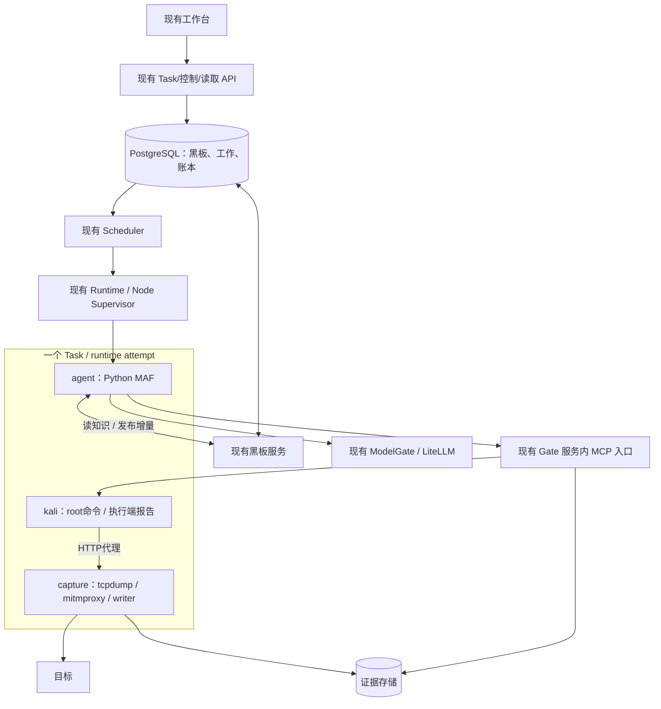
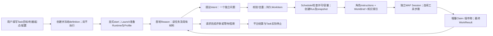

# Core CTF：通用执行、流量证据与黑板协作 Spec

状态：**in-progress：全局合同已补充，核心切片实施中**。日期：2026-09-22。用户已授权整体讨论后连续本地开发；D-NET已选严格受支持HTTP(S)明文模式。实际完成范围见[验收](acceptance.md)，不把设计写成实现。
源码基准：`codex/vnext-maf@3682edae86ddd438892e0961803aae3eb6fa6bb2`。
配套：[Plan](plan.md)、[开发指令](implementation-instructions.md)、[验收](acceptance.md)、[研究与裁定](review.md)。

## 1. 目标、优先级与适用范围

交付一条可实际使用的核心链：用户创建 CTF Task → 显式启动 → MAF 连续操作 Kali → 保留命令及网络证据 → Agent A 发布发现/脚本 → Agent B 在独立 Session 中复用 → 依据结果结束或诚实说明未完成 → 真正停止执行。

本期先做单操作者、单项目内的多个 Task 与同 Task 多 Agent。组织管理、多租户产品、SSO、跨租户公平性和大规模 HA 后置。保留现有 tenant/project/task 存储键、RLS 与 Task 边界，避免日后重写归属与迁移；这不等于承诺多租户可一键开启。

MAF、现有 PostgreSQL、ArtifactStore、Task/Work/Run、Scheduler、ModelGate/LiteLLM、Runtime Controller 继续复用；不恢复 Cairn/Pi 运行依赖。借鉴 Cairn 的提示词和探索策略，不移植其服务。

用户明确：目标站点自动授权拦截暂不作为前置；HTTPS URL、请求头/体与响应正文必须明文留存。任务授权文本仍保存，当前是否执行站点限制如实表达；不伪称已拦截。Task 与平台控制面、其他 Task 的隔离不取消。

### 1.1 有效能力边界

用户已选择 `strict-http-v1`：通用 shell/本地文件处理与代理兼容HTTP(S)，保证受支持交易明文，不能采集的连接明确失败。直接构造网络报文的SYN/UDP扫描、任意nmap/NSE及基础端口探测后置；首批不追加probe工具。普通Python HTTP批量请求属于支持方向，不因批量而排除。不支持指协议/采集能力，不是站点授权名单。

首期完整交易范围：固定客户端 curl、Python requests/urllib，经显式代理的 HTTP/1.1，以及经过单独验证的 HTTP/2；TLS1.2/1.3；有限文本/二进制/压缩正文、有序重复头。HTTP3/QUIC、h2c、HTTP/1 trailers、WebSocket、无限 SSE、mTLS、证书固定、任意加密隧道、畸形 HTTP/TLS 指纹题型不计入本期能力。首期拒绝 Expect:100-continue；上游1xx必须被识别、记录并按未支持交易处理，不能吞掉后把最终200称为完整响应。若固定代理不能暴露这些情况，M0阻断发布，先完成最小检测适配或明确调整协议合同。不得默默直连或宣称完整；实际被截断/中断的交易保留 partial 与原因。

代理会改变连接、TLS 指纹及部分协议行为；代理结果不能冒充直连原包。若用户选择原始网络模式，须以独立能力和不同采集保证修订本节，不能在严格模式里增加旁路。

## 2. 最小部署与唯一所有者



新 Profile 使用三个常驻容器及一个短生命周期可信 initContainer。capture 是普通 app container，Pod `restartPolicy=Never`，不用自动重启的 Always sidecar；Runtime 决定整个 attempt 生命周期。既有双容器 Profile 的历史模板及读取规则不变。

MCP 端点放在现有 Gate ASGI 服务内，直接调用 Gate Python 服务对象，再复用现有 remote executor 通道到 Kali。不是“MCP代理再HTTP调用自己”，也不同时启用 Agent→Kali 直连第二条执行路径。Kali 是唯一 spawn 所有者，Gate 是唯一准入所有者，Runtime 是唯一 Pod 生命周期所有者。

既有 `controller.py` / `pod_runtime.py` 的双容器就绪假设必须按新 Profile 的精确容器集合调整；模板摘要与 ownership 校验一并升级，不能只改 Deployment YAML。新配置必须带模板版本；旧模板摘要算法和历史配置不被默认字段变化隐式改写。

平台允许零Task空闲启动：先提供catalog、API/登录、Launch及空闲Runtime/Gates/Scheduler，用户创建并显式启动后，Launch才写入具体Task绑定。不能为了启动服务制造一个可执行占位Task，也不能要求创建首个Task后再手工开启后台服务。复用现有配置刷新加载新增绑定；固定MCP和内部清理路由在服务启动时装配，工具/身份准入仍按实际Task配置核验。

### 2.1 从任务配置到Agent的完整链路



- Task是完整任务，Intent是待回答的问题，WorkItem是该问题的持久执行单元，AgentRun是一次获准执行的尝试，MAF Session是该Work的原生会话。一次shell命令不是一个Work；一个角色也不是一个常驻Worker进程。
- 新核心默认Reason-first：start只触发首轮Reason，由它根据真实Goal与现有材料提出必要问题。不新增Bootstrap角色，不预写固定CTF路线。已有明确发布的seed保持其原合同；夹具seed只属于显式机制模式。
- 角色核心为Reason与Explore。现有枚举/Profile还包含report，当前报告由平台冻结已保存事实；本期不增加第三个常驻报告Agent。Conclude只是当前Session的有限收尾阶段。
- Scheduler只负责选择、去重和持久准入；现有Outbox/Runtime/Supervisor负责派发与进程，MAF负责单个Agent内部工具循环。禁止两层同时分派子Agent。
- 结果JSON被接受、某问题answered、Task完成、进程退出是不同事实；Reason只请求完成评审，平台按已有完成与停止守卫推进。

### 2.2 配置与上下文的来源

| 内容 | 权威来源 | 实际交付位置 |
| --- | --- | --- |
| 场景、Goal、完整判据、入口、授权文本、预算及Task硬限额 | 创建时definition及发布Profile；启动前固定版本 | 现有task_context_block生成Task专属instructions；不另建Task上下文表 |
| 角色职责、工具能力、输出规则、局部函数限额 | 同Task冻结的角色Profile | MAF agent_instructions及实际tools；工具表必须与文字一致 |
| 当前问题、预期产出、planning、相关依据 | 固定Intent revision及Work绑定 | WorkBrief和当前Intent的真实knowledge delivery |
| 其他正在进行的问题、前序结果、反证与未解项 | 派发snapshot中可见的Work/结果/知识 | 有界Brief摘要、知识索引及按需读取；不能直接遍历实时库冒充派发快照 |
| 工作目录、环境、共享发布物版本 | 当前runtime attempt绑定与已提交publication | 接入workspace时扩Context；目录与字节来源可核对 |

首次Reason读取instructions、Brief与索引，没有虚构的当前Intent；Explore额外读取自己的固定Intent。配置能存进数据库还不算交付，必须在原生MAF请求中核对模型实际收到了目标、判据、起点和当前问题。完整聊天/私有Memory不在Agent间广播。

第一批先使用现有WorkerContextV3/WorkBriefV1补齐结果消费与在做问题，不为文字整理升版；只有实际接入workspace/environment/asset新结构时再引入§7的V4/V2分支。恢复原生Session时messages=None不会注入新Brief；新知识通过现有knowledge返回或真实输入delivery进入原生会话，不旁路修改历史。

## 3. 通用 Kali 进程合同

不集成上游 MCP-Kali-Server 的逐程序 wrapper 或同步 Flask 服务。采用 MAF 原生 MCP，公开以下已版本化工具；工具名不是用户随意注册的插件系统。

| 工具 | 模型提供的参数 | 返回/语义 |
| --- | --- | --- |
| `kali_exec` | command、可选 cwd、timeout_seconds | 固定 shell 执行一次；短等待后返回 handle，不等整个扫描结束 |
| `kali_read` | handle、cursor、max_bytes、可选 wait_ms | 读取固定字节位置的增量输出或有限等待；不重新执行 |
| `kali_input` | handle、data、可选 eof | 向活进程 stdin 写入一次；同可信动作键不重复写 |
| `kali_stop` | handle | 幂等请求终止，执行端报告退出后返回terminal，可信度仍为executor_reported |
| `workspace_publish` | purpose、files、entrypoint、依赖/验证说明、更新时的 expected_base_publication_id | 固定产物并按CAS发布新版本，返回 manifest 与 publication 引用；冲突不覆盖 |
| `workspace_materialize` | publication_id、manifest_ref | 将固定版本放入本 Work imports，返回实际路径和摘要 |
| `board_publish` | 一条新增 ClaimProposal、可选简短进展说明 | 发布候选发现并返回可信材料交付；不写 FactAssessment、Observation 或执行许可 |

知识 list/read/refresh 沿用现有能力。四个进程原语不是整个工具表；完整 MCP discovery 必须与冻结 capability manifest 比对。首期不单独新增通用文件 CRUD/浏览器/NSE 工具，shell 已能写脚本，知识/产物读取承担正式交接。

### 3.1 执行语义

- `exec` 每次是独立 `/bin/bash --noprofile --norc -c`，环境由平台白名单组装；显式传递冻结的代理和CA文件变量，不读登录profile重置解释器PATH或继承平台秘密。跨调用通过文件共享，不承诺持续 shell 的 cd/env。stdin 使用 pipe，不承诺 PTY。
- 默认 cwd 为本 Work 根目录，模型 cwd 仅可指向当前 Task 的工作区，禁止将平台文件作为 cwd。允许 shell 在同 Task 工作区内协作；目录名不充当恶意 Agent 隔离。
- timeout 不超过冻结的 command 限额和 Task 剩余期限。未提供 timeout 时采用 Profile 值。进程输出、等待、输入、并发与存储限额均在 Profile 中必填（执行端限额是正常软件行为；root篡改后的硬停止由外部Task控制承担），不能继承上游 180 秒或测试夹具魔数。
- 返回 `ProcessReplyV1`：handle、state、started_at、finished_at、exit_code/signal（未知为 null）、stdout/stderr chunk、cursor/next_cursor、has_more、output_completeness、reason_code。state 为 prepared/running/stopping/exited/unknown；RPC 成功不等于进程成功。
- handle 复用 exec 的 tool_attempt_id。stdout/stderr 以字节块排空到 spool，模型只接收有界表示；二进制以编码/文件引用保留。达到硬输出/存储上限时停止并标 partial，不能持续丢日志还标 complete。
- MCP transport timeout 不取消后台进程。平台取消、预算/期限停止不依赖 Agent 是否调用 stop 或 read。

### 3.2 身份、重发和账本

MAF 1.18.0 在部分 MCP 连接失败时会重连并重发 tools/call。FunctionMiddleware 从 native metadata 取得 call_id/occurrence，复用 ModelCallIdentity 校验后注入 `context.kwargs["_meta"]["wuji.dev/invocation"]`；仅写context.metadata不会传到MCP。服务端还原完整ToolCallRequest（session_lineage/message_id/provider_call_id/tool_definition_ref/arguments，以及实际sdk_content_id/sdk_approval_id/approval_ref），另保留native occurrence绑定；不能原样调用漏字段的旧invoke_mcp helper。不是把模型 arguments 中的 task_id 当身份。MCP request id/session id 不替代业务操作键。受控 tools/list 禁止声明或覆盖该保留 metadata 名称。

同可信调用键、同参数返回同 handle；不同参数冲突。MCP重发不创建新 ToolAttempt、不重复扣函数/任务调用额度。FunctionBudget 统计 SDK 逻辑函数发生，AdmissionLedger 统计真实操作，活进程槽统计尚未确认退出的 exec；三者不得混成“每次 read 又起一次执行”。

read/input/stop 记动作回执并关联 parent handle。input 的 OS write 与数据库不具备跨系统原子性：中间失败返回 unknown，禁止自动重复输入。准备登记后 spawn 或 PID 回执不明时也保持 unknown，不能按“没找到 PID”重跑。

`ToolCallReceipt` 保持最终证据收据语义，ProcessReply 独立表达运行中状态。当前 worker 对“complete + accepted evidence”的强制条件仅对旧同步工具保留；新工具不得假 complete。最终native_tool_receipt_refs只纳入平台已定稿的完整证据回执，不能提交exec最初返回的running回执；running handle、read/input/stop动作回执留在操作前沿/日志中。提交raw不等待这些回执，但Work.done受未结算父exec约束。

普通 read/input 受额度和当前许可控制；平台 stop/query/reconcile/证据结算使用专用清理许可，不被已耗尽的模型预算或 `current_run` 新执行拒绝阻断。禁止给所有用户工具开放无限豁免。

### 3.3 用户已选：Kali root，平台权威外置

用户明确采用Kali内UID/GID0，平台密钥和权威日志外置，重点保证Task级实际停止。新Profile的Kali `runAsUser/runAsGroup=0`、capabilities.drop=[ALL]且不添加、allowPrivilegeEscalation=false/no_new_privs；实际bounding/effective/permitted等集合须验证为空。不给SETUID/SETGID/NET_ADMIN/NET_RAW/SYS_ADMIN/SYS_PTRACE，不用privileged、hostPID/hostNetwork或宿主socket。UID0不等于完整特权Kali；raw/SYN扫描、改路由、切换用户及任意apt/post-install不承诺可用，所需常规工具预装到固定镜像。

删除此前“两种容器内用户、固定降权helper”的候选前置。Kali执行服务与命令都在不可信Task环境内：root可以修改本地文件/回执、结束执行服务，甚至自行重复命令。平台不把这些本地记录当不可篡改的执行事实。ProcessReply明确assurance=executor_reported；平台账本记录自己准入/发送的操作、收到的原始响应及摘要，而不是宣称证明了每条命令的内核执行过程。

Kali不挂数据库、模型Key、collector写token、平台签名私钥或跨Task共享服务bearer。现RemoteToolAdmission的collector回调与Gate→Kali共享Authorization bearer不能原样沿用：复用平台既有签名设施，签发ExecutorActionPermitV1，绑定Task、runtime_attempt、execution_epoch、receiver、动作、调用键、参数摘要及有效期；query/stop有独立用途，不能把stop许可变成exec。执行及shutdown许可使用区别于平台API的专用audience，通用平台TokenVerifier必须拒绝，不能仅靠executor_action角色名避免服务subject的读取权限被复用。Kali只持公钥校验；签名防外部非法调用，不使root可修改的验签器变可信。旧permit_digest只是摘要，不冒称现成签名。

可保留仅该Task/attempt的TLS服务端私钥，不能兼任平台客户端写身份或用于其他Task。新core每attempt独立key和精确Service SAN，禁止复用旧部署的namespace通配证书私钥；签发权留在可信平台侧。Gate校验端点绑定/代次，旧证书不授权新attempt。Kali无权直接写权威Artifact/黑板/采集存储；由平台拉取结果，独立capture上报网络事实。

readOnlyRootFilesystem保持，workspace/tmp为可写卷。/workspace/work和shared是协作空间，root可修改本地缓存，不能承诺容器内防恶意篡改；权威sealed副本始终在平台。capture证据卷和CA私钥不挂Kali。可信init为固定新代次卷做必要CHOWN/FOWNER及NET_ADMIN初始化，结束后不留可被Kali继承的权限。

进程服务仍提供进程组、TERM/KILL、deadline及正常回执，作为正常软件行为与操作体验；正常未篡改执行器重发必须去重，但不声称能约束root自行启动第二个进程。已发送结果不明时平台只query既有handle，不自动重发exec。

Work完成表示模型结果及已报告操作已结算，assurance保持executor_reported，不表示整个Task环境没有后台进程。平台已知running/unknown操作仍阻止Work正常结算；超过核对窗口触发Task级停止，不用猜测清零。Task真正停止必须由外部Runtime核对对应Pod/容器代次终止；Pod delete accepted、失联404或Kali自报stop不是证明。未确认维持reconciling、禁止新attempt。这是对旧逐命令强证明的明确调整。

Core Task的P12关闭准备及最终应用均须核对当前runtime attempt的完整外部容器终态；仅AgentRun退出/结算不足以写入`closed`。此检查放在close阶段，不能阻断先quiesce撤权。已持久化的同Task/attempt/epoch/Pod UID四容器记录可在Pod删除后或Runtime重启时恢复停止事实；缺项、混合代次或UID不一致仍保持未确认。

### 取消后的Task业务收口

用户受权的Task取消先撤销执行并停止环境，再由平台在同一Task下创建取消专属CompletionEpoch，保存当时的P12目标审查快照。取消不要求Goal判据已满足，也不把已有成果判作Goal成功；关闭原因固定为`user_cancel`，结果保守记`not_assessed`，冻结报告仍列出已持久化的判据、Work与Run。Runtime确认的故障撤权走独立受信入口，关闭原因为`system_failure`；自由文本reason、命令ID或模型输出不能改变来源。公开Goal完成入口及其ready判据保持原样。

平台仅对新取消请求写入持久待结算标记；现有Launch执行循环有界扫描并可在崩溃后从Task与决策回执继续，不自动扫尾旧Task。最终`closed`须同时有该代次四容器真实终态、Run及相关操作结算；缺失或结果不明维持`quiescing`/`reconciling`。确证未启动是另一条窄路径：Task未激活，Launch持久步骤可证明没有进入wire/Pod创建及外部效果，并且无receiver、Pod绑定、Run或未结算操作；已受理但在prepare前置检查失败可符合，单纯Pod 404不符合。旧Task仅能经逐Task受审计回填，不能因新代码部署自动关闭。

## 4. 流量与 HTTPS 明文采集合同

### 4.1 网络路径

可信 init 在任何模型命令前安装 netns OUTPUT UID 规则。Kali UID0只可连接本地受信显式代理及必要的精确工具回复路径，不能任意直连、DNS/UDP或IPv6旁路；清空代理变量应导致网络失败。规则不依据目标域名授权名单。代理/采集 UID 与Kali UID0分离；agent/control 通道只保留固定平台 TLS 连接，不是通用转发器。

不能简单放行全部loopback或ESTABLISHED；Kali服务对平台的回复按真实服务tuple与连接方向精确豁免。Kali不再持collector token主动回调平台。证书/代理配置不能被命令修改。固定版本代理禁 rawtcp、ignore_hosts、任意CONNECT隧道与未支持升级。覆盖任意目标端口的受支持 HTTP，而非只记录80/443。

不用全 TCP 透明 NAT 作为首条实现：本地代理握手可能污染 nmap connect 扫描的 open 判断。若用户选严格模式，基础端口探测只能使用受信 `port_probe`，固定无应用载荷扫描，不接受任意NSE/-sV/额外命令；原始网络模式的取舍由§1.1决定。

### 4.2 抓取、明文与完整性

- 2026-09-23选型收口：原包采集采用固定Linux版本tcpdump，持续写PCAP分段，tshark离线/后台解析，不对每包运行数据库事务。对同一实际采集进程读取SIGUSR1统计；使用不覆盖的递增分段，固定接口/linktype/snaplen/版本及统计采样水位。不得将另一进程或pcap句柄的统计当作本次采集drop证明。首期不为pcapng外壳fork dumpcap；PCAP与pcapng记录实际格式，不伪造转换后的原包。
- mitmproxy记录真实协议、在线URL、方法、有序重复头、request/response实体字节、编码、状态、错误与时序。压缩实体原字节是权威，解压预览是派生；不把H2伪造成原始HTTP/1报文。
- 为受支持有限HTTP交易，请求完整落盘成功后才允许转发上游；最终响应完整落盘成功后才交付下游。落盘包括数据flush/fsync及可恢复索引，不是用户态buffer写成功。1xx/Expect按§1.1处理，不让完整最终响应屏障错误阻塞一个未声明支持的握手。存储失败不返回正常完整交易。使用固定代理钩子与writer顺序验证，不以默认flow结束存文件冒充这一保证。
- 正文超过发布限额、取消、连接错误、磁盘不足、未支持协议均留下 partial/unknown + 缺口原因；不能“截断后 complete”。无限流不在有限完整交易合同内。
- 有限HTTP/1.1 chunked交易仍在支持范围内，不笼统拒绝全部Transfer-Encoding。Trailer声明和框架可见的实际trailers明确拒绝并记录gap。固定mitmproxy12.2.3在部分含trailers的同批输入中会先于公开HTTPFlow钩子抛错；该情况下代理崩溃监测立即关断并把采集窗口/总体manifest记为failed或incomplete，保留原包与原因，不能伪造未取得的逐交换ID或明文。首版不为这一未支持协议增加前置解析器或fork代理。
- 代理CA私钥仅在capture，公证书安装到选定Task客户端的系统/requests/urllib信任配置；不改宿主机、不关闭上游校验。证书固定/不配合客户端明确拒绝或标缺口，不承诺通用解密。
- PCAP被动抓取与真实网络没有原子提交，不承诺断电或内核丢包时零漏。drop>0、指标不可读、writer失败或进程退出，使对应采集窗 incomplete 并停止新流量；所有已落盘内容仍保留。

### 4.3 启停与采集故障

启动：默认拒绝规则 → 私有存储/证书/身份 → 原包采集实际启用且统计可读 → proxy/writer就绪 → 能力自检 → capture ready 回执 → 执行准入。

capture PID1监督 tcpdump/proxy/writer，任何一个失败即关闭代理并退出；另有有界writer落盘/采集健康检查及liveness兜底，卡住/检查超时与退出同等处理，不能只看PID或监听端口。普通 capture container 不自动重启；PID1退出使其PID namespace子进程终止。静态规则仍禁止Kali直连，已建代理连接必须关闭，不能仅禁止新SYN。Runtime收到故障后停止命令，并按§4.5核对和持久化容器终态后删除该Task Pod；确认前维持reconciling。

capture固定UID/GID10004。2026-09-23隔离环境核对发现：只在Pod securityContext声明NET_RAW且设置no_new_privs时，实际非root进程的effective/permitted集合仍为空，tcpdump不能打开采集socket。实施改为仅固定只读tcpdump二进制带`cap_net_raw=ep`，capture容器bounding仅允许NET_RAW，并为该可信采集容器设置allowPrivilegeEscalation=true；supervisor/proxy/writer不带文件capability，不增加SETUID/SETGID/NET_ADMIN。这项例外只用于capture，Kali仍dropALL/no_new_privs。须实际核对各进程能力和采集成功，文件标记或清单不能代替运行证据；不支持此机制的环境拒绝启动。

正常停止：撤销新exec/input与新HTTP准入 → 平台有界停止并排空已知exec，拉取命令输出归档 → 请求Kali PID1有界清理并退出 → Runtime从外部确认Kali容器终止 → 有界收尾/中断已准入交易 → 关闭目标连接 → proxy/writer flush → 原包采集最后封口并取得终态统计 → 记录manifest/缺口 → Runtime清理剩余Pod。先归档已知命令，再退出Kali，避免执行端spool先消失；归档失败保留缺口，不无限阻塞停止。无法确认Kali退出走故障清理与incomplete，不循环等待“先完全封口再允许停止”。清理不删除证据PVC。停止优先于等无限响应；捕获故障先关断再尽力封口。

capture与Kali不共享PID namespace，不能假设capture能直接kill Kali。现有Controller负责整Pod终止，不新增集群级控制器或动态网络租约系统。无法验证UID规则、存储和停止边界的环境返回 `capture_enforcement_unavailable`，不悄悄降级。

### 4.4 Task 级采集身份与存储

独立抓包不能伪造一个AgentRun或ToolAttempt来满足现有FK。新增 `RuntimeCaptureEnvelopeV1`，由Task/execution_epoch/runtime_attempt/pod_uid/collector绑定认证，并核对current/revoked状态。停止后只允许该固定session的清理结算，不恢复采集执行权。同session/item_seq同内容重试返回原引用，不同内容冲突。新增最小 `capture_session` 与追加式 `capture_item`（pcap_segment/http_exchange/gap）索引；字节仍用现有ArtifactStore。

Artifact与Observation增加nullable capture_session引用；仅provenance=capture应用tool_attempt与capture_session二选一，均有owner复合FK。必须保留有效迁移后已有的model_output分支（agent_run_id + writer_subject/run_writer，tool_attempt=NULL且capture_session=NULL），import既有语义不改。Observation的采集来源二选一。旧CaptureEnvelope/工具采集不变；新stage/ingest方法只能由受信runtime collector调用，Agent/model_output不能伪造。用户读取继续走现有Task授权。

Task采集持续整段attempt，不能等Task采集封口才允许每个Work完成。HTTP完整交易和PCAP分段逐项封存、可读；Task结束才封总体manifest。必要事实可引用已封存交易，不能引用未完整写入的tail。

Task级归属可靠；Run归属若仅凭PID/时间/自报代理头则为hint或unknown。命令、代理连接、交换各保存独立ID；不伪造精确关联。全Pod原包可能包含平台流量，现有平台TLS不能改成明文；原包受限保存，不向普通黑板广播。

### 4.5 采集与Runtime接线（2026-09-23实施冻结）

采用平台Runtime拉取，不给capture挂平台写入凭据。capture在8445提供固定TLS控制/读取端点，proxy8080及health8085仍只监听loopback。控制连接使用专用Runtime客户端证书，capture校验证书链及配置的客户端证书指纹；Kali的服务证书不能调用。Runtime校验capture服务证书、固定端点及返回的Task/attempt/epoch/Pod UID。复用现有CA发行设施，新增CLIENT_AUTH证书，不修改旧模板的服务证书用途；私钥不进镜像或普通配置。

- capture启动从固定配置与Downward API得到身份，status始终返回该绑定；平台先核对Pod UID，再登记capture_session。新core执行准入同时需要容器与采集session就绪，监听端口不足以派发模型。
- 固定操作为status、按单调item_seq列已封存item、按固定item/part读取字节、drain、seal。读取不接受任意文件路径，不暴露CA私钥、控制配置或进程环境。相同控制操作重复调用不重复创建item。文件元数据带长度/hash；传输可以按有界块读取，平台按完整字节复核后入库。
- HTTP item在最终response或明确gap后形成；封口时把仍有request但无最终response的交易明确列partial。PCAP只发布已关闭段，活动tail在最终封口后发布；统计水位及缺口与item固定保存，不能把一个活动文件标sealed。
- drain撤销新HTTP准入，已准入交易在有界窗口内完成或中断；seal关闭proxy/writer/tcpdump，持久化manifest并保留只读控制服务供平台最后拉取。sealed状态不再接纳任何网络执行；平台确认入库后再终止剩余容器。
- 整次停止共享一个有界清理窗口，以已有平台撤权/控制记录的固定时间为锚点；重复stop与Runtime重启不延长窗口。正常采集拉取每轮有页/字节边界，单item分块传输也有总时限；重启从已入库连续水位继续，不重新搬运全部历史。清理超时记录缺口后继续外部终止，不能因逐进程/逐chunk分别等待而无限拖延。多次撤权推进epoch后，受信控制者仍可清理精确绑定的旧attempt，不能将清理权限限定为仅相邻一代epoch。
- Runtime使用自己的Task限定collector身份把封存item交给既有ArtifactStore及新capture索引；同session/item_seq重试复用原引用。capture不直写平台数据库，Kali不取得collector身份。接口与内部调用复用同一服务，不增加第二套证据真相。
- 新capture item事件只更新采集/证据视图，不因每个HTTP响应或PCAP段启动Reason。Agent可显式刷新/读取已封存Observation，取得确切事实后board_publish；该Claim才走实时协作触发。原工具采集事件语义保留。
- 新core配置显式对齐PCAP段、HTTP正文、Artifact和下载上限。普通JSON/API限额不为大文件全局放大；完整文件采用受授权的有界字节下载，预览继续截取并标明。不能仅缩小测试正文来隐藏默认64MB段/8MB正文与旧8MB存储、2MB BFF的冲突。

Task最终停止使用Kubernetes的外部终态观察。正常收尾后或故障服务失联时，Runtime可带UID/resourceVersion前置条件缩短该Pod的activeDeadlineSeconds，让Kubelet终止容器并保留Pod状态；只有实际观察该UID下精确容器集合的终态并持久化后才删除对象、结算环境。终态记录直接绑定Task/attempt/epoch/Pod UID，由已登记Runtime controller写入，采集session关联可选；init或capture启动失败不能使停止证明依赖一个从未成功创建的采集session。未启动的容器与运行后terminated分别记录，前者必须由固定Pod终态、init及当前/历史容器状态核对，不编造退出码或结束时间。重复轮询同一终态保留首次observed_at，不因采样时间变化创建冲突。只见404且无已有权威终态仍unknown。该路径须在隔离环境实测，不能用API接受patch代替终止证明。官方能力依据见[Pod API](https://kubernetes.io/docs/reference/kubernetes-api/core/pod-v1/)与[Pod更新规则](https://v1-34.docs.kubernetes.io/docs/concepts/workloads/pods/)。

## 5. 黑板与 Agent 产出：保留现有字段，补足消费链

| 现有合同 | 字段 | 本期裁定 |
| --- | --- | --- |
| IntentProposalV3 | client_ref, question, basis_refs, expected_output, planning | 保留；不是每条shell命令创建Intent |
| IntentPlanningV3 | goal_criterion_refs, public_rationale, information_needed, exit_conditions, required_capability_refs | 保留可选planning；新增问题必须给明确方向与结束条件，不扩成DSL |
| ClaimProposal | kind, assertion_role, text, basis_refs, limitations；可选revises/structured_assertion | 候选发现可直接共享；Fact评估由平台另行负责 |
| WorkResultV3 | outcome, summary, answer_basis_refs, unresolved_items, capability_gaps | 保留五种outcome；规范化批内local_ref，交付后继brief |
| AgentPayloadV3 | claims, intent_proposals, reason_decision, work_result, input_acknowledgements | 本期不重造AgentPayloadV4；管理身份由Worker生成 |

Reason有decision且work_result=null；Explore有work_result且decision=null；沿用现有限量。模型只写业务内容，不提供租户、Run身份、执行许可或采集者身份。

`board_publish`使用专用current-Run wrapper核对MCP调用、epoch、attempt和绑定Agent subject，再复用ClaimService.append及引用解析；不能直接把通用principal交给旧ClaimService.propose。每次发布一条关键Claim，Claim/回执/知识事件同事务提交，单纯进展说明不生成新Claim。返回canonical引用和内容并准备可信knowledge delivery；MAF实际收到函数结果时才标returned_to_framework，重放复用Claim与delivery。它不完成Work、不标Goal、不创建Observation。原参数/结果属于model_output，不是现场捕获。Kali脚本/命令输出的来源注明executor_reported；独立capture才承担真实网络采集来源，不将本地路径或作者验证自述升级为现场事实。

publication/Claim、prepared delivery与成功动作回执在同一数据库事务提交；先固定delivery_id/representation_digest，不允许成功提交发布却没有可交付材料。prepare失败不提交发布/Claim，已封存底层文件可以保留待重试；transport丢回复后同invocation直接读回原发布和delivery，不发新版本。returned_to_framework仍只在实际交付边界更新。

同一调用重放返回原引用；发布成功后最终产出引用这些canonical refs，不重复抄写已发布内容。发布消息只在形成新canonical知识时触发合并Reason，心跳、token、读日志、Todo变化不触发新的Reason。

修复当前WorkResult的消费链：将answer_basis_refs中的批内client_ref规范化到实际接纳的引用；保留原始payload，新写入work_result_json使用有版本投影（declared_outcome、canonical_refs、invalid_refs、effective_outcome、summary/unresolved/capability_gaps）。有无效依据时不能支持answered完成判断，effective_outcome降为inconclusive并记录原因，不静默删掉坏引用后假成功；旧无版本记录有旧reader。后继WorkBrief读取有效投影。raw、结果接纳、恢复点与进程结算分别表达；平台已知running/unknown的父exec未结算时可保留模型结果，但不能Work.done；不把executor_reported冒充内核级证明。

## 6. Agent 工作区与脚本发布

### 6.1 目录与代次

```text
/workspace/inputs/                         用户输入的只读/固定副本
/workspace/work/<work_id>/                 当前问题的可写cwd
  src/                                    脚本和实验文件
  notes/                                  私有工作笔记（非黑板权威）
  tmp/<run_id>/                           临时命令文件
  imports/<publication_id>-<digest>/        精确发布版本的本地副本
/workspace/shared/<asset_id>/vN-<digest>/   可丢共享缓存，非权威存储
```

work_id稳定，run_id只划分临时执行；session用于恢复身份。相同Work同代次恢复前必须fence旧Run。所有Agent命令同UID，因此“私有”是协作约定，不是相互恶意隔离；Task之间仍隔离。

保留当前按runtime_attempt分代PVC。当前attempt内工作文件可保留；新attempt只保证从sealed发布物/用户输入重新materialize。未发布草稿或完整可写目录不承诺跨attempt恢复，旧卷保留供人工核对而不自动挂到新执行。workspace generation不匹配时禁止原native Session自动恢复：现有恢复可能messages=None，新brief并不会自动进入模型。必须通过明确的材料重建/新Session或受支持恢复输入继续，不重放旧工具；codec仍为native.v2。

### 6.2 发布的权威与数据模型

不新建asset/handoff正文数据库。复用publication/publication_ref，增加kind=workspace_bundle.v1及六个nullable字段：source_tool_attempt_id、manifest_artifact_id/revision、asset_id、asset_revision、parent_publication_id。新kind必填规则/owner复合FK、source attempt唯一、owner+asset_id+asset_revision唯一。新资产id由平台生成，版本1/parent=NULL；更新由平台计算版本，parent必须属于同owner/asset。全部文件和manifest登记publication_ref。

新kind只能由匹配workspace_publish调用的受信publisher创建，不能借旧session/snapshot入口或可追加成员的worker_host._publish。publication、manifest和成员ref继承旧head与新成员最高访问级别，不允许新版降级。成员全sealed且校验后同事务发布集合及workspace.published事件；已有publication不补成员。ArtifactStore.stage每次新ID，因此原操作回执先固定refs，重放必须复用。

普通sealed Artifact列表可能看见尚未组成发布集合的文件；本期保证的是“可发现/可消费的发布集合原子性”，不承诺所有底层中间Artifact不可见。`published_asset_index`只列已提交workspace_bundle；session/model私有产物不能混入。

### 6.3 WorkspaceBundleManifestV1

必须含：schema_version、asset_id/asset_revision/parent_publication_id（平台填）、purpose、producer_work_ref（平台填）、environment_ref/image_digest（平台填）、files[]（relative_path/ref/sha256/bytes）、entrypoint（相对脚本路径与解释器argv）、inputs_description、outputs_description、dependencies（版本说明或lockfile引用）、validation_statement、limitations。

validation_statement区分作者自述与平台实际检查引用；“作者说运行成功”不自动变成verified。依赖说明是复现资料，不触发自动安装或执行。固定Manifest renderer让知识读取可以获取字段/正文，不能因自定义media type导致不可读。

发布路径须是普通文件、无路径穿越/外部symlink；平台固定自己从执行端收到的确切字节与摘要；Kali路径是执行端报告，不冒称root文件系统不可篡改。发布接口不能阻止任意shell并发改文件：检测到源变化返回source_changed，作者应先停写或原子rename；只承诺sealed副本的字节和摘要，不承诺任意并发写者的意图一致。

### 6.4 A 到 B 的完整交接

1. A在自己的work/src写脚本，本地验证；草稿不自动共享。
2. A调用workspace_publish，平台固定文件、manifest和publication并返回证据引用。
3. 新manifest不在初始snapshot，不能直接调用现有snapshot限定knowledge_read。新增受信prepare_environment_material分支，绑定发布attempt、固定manifest字节与原snapshot锚点；每native occurrence只生成一份manifest delivery。RPC时为prepared，MAF函数结果真实交付边界才记returned_to_framework。board_publish采用同样的受信当前Run发布材料路径，但ref是agent Claim，delivery通道不把其来源升级为capture。
4. A发布Claim说明脚本用途，basis指manifest/捕获Observation。后继Intent引用这个Claim或Observation；现有Intent明确不接受直接Artifact basis，不偷偷放宽。
5. B的published_asset_index只列本次固定snapshot包含的已提交manifest，按该snapshot读取；运行中用显式refresh发现新版。发布者A的当前Run材料交付与B的snapshot读不能混用，metadata可见不等于已读正文。
6. B调用materialize，从权威sealed bytes校验并复制到自己的imports目录。其后如需修改，复制到src并发布新版本，不覆盖A。
7. shared是可丢缓存，不能以chmod声称在root下不可变。B由materialize取得平台sealed字节的独立副本，不用hardlink共享inode，不把可写latest当执行引用；根路径/符号链接仍检查以防误写，不能声称抵御Task内恶意root。平台记录下发材料摘要和执行端报告；正式版本不受本地缓存修改影响。

### 6.5 允许修改：复制、版本CAS、同步黑板

用户已确认共享脚本应可修改，优先复制后发新版本。本期不加长时编辑锁：两个Agent各改自己的副本，不在同一物理文件上编辑；短时版本CAS防止发布覆盖。

更新时提供expected_base_publication_id。先检查原invocation回执，成功或冲突重放返回原结果；再在Task锁内核对当前head和执行许可，成功产生vN+1、parent=vN，并与workspace.published事件同事务提交。大文件读取/封存在锁外，提交时重检base。head按最高已提交版本确定，不能因purge/权限过滤而回退旧版本。

若其他Agent先发布，返回可处理publication_conflict，保留当前工作副本/候选，不移动head、不自动合并、不让Agent因为普通版本冲突被强制终止。返回当前引用前鉴权；不可见新head只给不泄露的head_unavailable。Agent读base/current/自己的修改，显式合并后用新调用键再发布。

同Task具有当前写许可的Agent可更新共享资产，原作者不独占编辑权。黑板同步发布版本元数据与manifest引用，不自动声称脚本正确或完成Goal；业务发现仍由Agent另发Claim。已运行B固定所选vN，不热替换；后继Agent或显式refresh可以选择vN+1。

## 7. 新 Agent 的上下文合同

当前WorkerContextV3/WorkBriefV1已包含Goal、授权摘要、能力、问题/预期输出、planning、已有工作、反证和尝试摘要。本期新增WorkerContextV4/WorkBriefV2读取分支，旧reader保留；MAF Session继续native.v2，不新增第三套Session格式。

新增平台派生字段：

- workspace_binding：Task、runtime_attempt、work/session绑定、cwd、inputs/work/imports/shared路径、workspace_generation、恢复可用性。
- execution_environment：镜像digest、OS/架构、已安装能力清单、shell/解释器、进程/输出/时间额度、网络采集模式及明确不支持项。
- published_asset_index：已提交publication、asset_id/asset_revision/parent_publication_id、manifest ref、用途、入口、环境、验证声明、小型文件统计。其head仅为当前snapshot中可见最高版本，不代表实时最新；发布CAS始终检查平台真实已提交head。
- 后继work结果摘要：前序summary/outcome/unresolved/有效answer refs及当前正在执行的相关问题，避免重复工作。

索引不灌入脚本全文/全量PCAP，也不扩大read_set。材料在实际读取/可信工具返回后记delivery。其他Agent的完整聊天、Memory、凭据、模型Key不共享。Agent获得自己Task的确定环境，不读取宿主机开发者HOME或未固定本机文件。

### 7.1 采集库存与有界知识快照

新ContextV4使用有界知识形状，旧Profile保持原语义。Task持续采集产生的每个HTTP正文/元数据或PCAP段不自动进入默认快照；全量库存通过§4.5的分页采集接口读取，不能让高频请求耗尽现有snapshot记录限额并阻断派发。

- 优先保留当前Intent、显式required refs及其依据闭包，以及可见canonical Claim/Intent、明确需要的用户输入、本Work命令日志Observation。所有正文仍须实际knowledge delivery，不因进程最终回执包含引用就自动标为已读；旧同步工具的交付语义不变。
- 可选加入最近最多64个HTTP exchange Observation及其固定part引用。64是筛选上限，遇总记录或字节限制先减少这些可选项并记录omitted，不能挤掉当前问题/required依据或因可选流量导致LIMIT_BLOCKED。
- 已提交workspace publication的manifest须有界进入published_asset_index，即使尚未被Claim引用。索引固定派发/refresh水位，不能把运行中实时head冒充快照版本。
- snapshot状态记录capture session、latest item_seq、included/omitted及raw_inventory_omitted；refresh沿用原manifest的query形状，不能重新退回全Task流量扫描。Agent的显式刷新额度与knowledge函数额度一致，不沿用演示配置的固定两次。

最小容量检查直接登记超过1000个原始capture引用，核对新core派发及refresh仍只携带上述有界材料；无需为该检查发送1000条网络请求。

## 8. 调度与提示词收简

不另造调度器。当前纯policy选择、准入、Runtime分别维护：问题最多一个活动Run；独立问题在Task额度内并行；每Task最多一个Reason；实质新知识/人工输入/关键失败/工作收敛合并触发Reason；没有新信息就等待或明确blocked/no_progress。

Reason只读取板和发布方向；Explore围绕一个问题在同一Session连续调用工具，可中途发布关键发现；Conclude是收尾指令，不是额外常驻Agent。Task.start触发首轮Reason，不增加Bootstrap模型调用。

### 8.1 角色、容量与触发

代码支持reason/explore/report三种kind，不等于三个常驻进程。现first-use发布global/model容量为1，只能串行。用户已否决固定2Explore：新Task的Explore并发上限由任务配置，受发布RuntimeProfile允许上限约束；Scheduler按真实独立问题、容量与预算动态启动，不为凑数创建问题。测试中的2仅是场景参数。每Task同时最多1个Reason，原因是避免多个全局规划者重复派题；它可与Explore并行、可随新知识多轮运行，并非总共只执行一次。旧Profile保留原语义。

角色上限使用现有Task锁及活动Work/Run与操作结算记录校验，不再建task/role池；进程已退出但操作仍unknown不能释放该Work执行机会。部署共享global/model/tenant池必须允许所配置的并发；跨Task满载时仍等待，不承诺专属Reason席位。MAF不会替Wuji决定平台并发，Task配置和当前容量应能在工作台查看。

MAF各Run单独Session；max_inflight_model_requests=1和max_inflight_tools按现实现是每Run上限，不等于Task只能一个模型请求。Task级max_pending_operations需要与长进程及控制动作分开；read/stop不得因自己的父exec占槽而永久无法执行。Scheduler容量不足复用可自动重查的blocked；工具容量不足不能诱导模型重发或再造Work。

触发使用现有持久generation：start；新有效知识/反证；有效输入；非Reason工作关键结算；完成评审反馈。Reason运行期间的新事件保留到下一代，Reason自己提出Intent不立即触发自己，日志/token/心跳/Todo不触发。沿用500ms合并、5s最迟安排及有限无进展窗口，不为本期再做一套消息总线。

增量Claim与最终结果走同一进展记账规则；同一canonical内容最终再次引用不计新进展。修正当前claim_shared只唤醒却未更新进展的缺口。无变化等待必须有真实固定条件；已耗尽预算、缺少能力或需要用户输入应明确结束本轮，不无限重试。

### 8.2 输出规范与MAF的职责

首批继续采用**角色提示词 + 同源JSON Schema + 平台严格校验**：MAF执行工具循环，最后返回AgentPayloadV3文本；Worker先保存原文，再严格解析、for_work_kind校验、引用/交付检查、组件接纳。Reason必须reason_decision且work_result=null；Explore相反。无效JSON、错误角色、拒绝、截断、无效引用均不能写成成功。

固定MAF版本原生支持response_format与tools/stream组合，但当前Wuji ChatCompletionRequest未开放该字段。仅改factory会被Gate拒绝。首批不把未经具体模型路线验证的native JSON约束设为开工前置，也不另外增加格式修复Agent。后续若启用native模式，必须同步Gate合同、固定角色schema/能力及拒绝语义；不能静默降级重跑工具。格式合规始终不等于事实成立。

Cairn固定版本同样是提示词指定JSON、driver取最终文本、parser/validator校验后由Dispatcher写图；其Explore的incremental指最终新增事实，不是token流式写板。本方案明确新增board_publish才提供运行中共享。

### 8.3 运行中共享与更新交付

Agent获得有依据的新发现、重要负结果、可复用发布物或阻塞时立即board_publish，不等待最终AgentPayload。返回canonical引用和可信delivery，原证据按独立采集链保留；中途发布不结束Work，不额外要求先跑Fact评估Agent。

其他运行中Agent在下一次模型调用的安全边界获知有界、相关、可访问的黑板更新提示和固定引用；使用MAF公开middleware/context接口，不修改其私有消息状态。提示让Agent按需knowledge_read/refresh，只有真实正文delivery才算已读。最终结果、原生Session恢复与初始snapshot仍保持原合同。

通知分页在数据库中先筛选可通知事件，采集库存等无关事件不能占满每轮扫描额度并延迟关键Claim。每次poll先固定事件高水位，在该范围内分页；不足一页时可推进到这个固定水位，满页停在实际扫描位置，不能在读取后取新的max水位跳过并发发布。

复用现有Outbox/event_seq与knowledge delivery记录通知进度，合并重复更新，不新增消息队列或全量黑板广播。当前Intent依据的变化、反证、前置工作结算、与问题相关的发现/共享版本优先；当前Run自己的发布回复不再次通知。无新模型调用时不会强行中断正在运行的命令；命令返回/增量读取后到下一模型边界交付。发布、通知、正文读取三个时间分别可观测，不承诺未经测量的毫秒SLA。

保留现有去重、event_seq、Outbox、租约、Task预算和实际停止。将UI、报告、旧会话兼容的装配从核心决策入口隔开；不把“简化”实现成取消幂等/身份校验。不同时启用MAF后台子Agent与第二套Wuji派发。

## 9. 持久化、兼容与删减边界

最小新数据：process_execution（key=exec attempt）、capture_session/capture_item；现有tool_call/attempt追加parent handle/action绑定；publication追加六个绑定/版本字段；artifact/observation追加运行期采集来源且保留model_output原分支。WorkResult增加有版本投影而不另存一套正文。迁移append-only，实施者按当前head统一编号，不改0001—0035或重新建库。

旧Task/Session/Artifact保留原语义，历史查看不启动执行。新核心Profile固定唯一MCP工具路径；旧HTTP工具仅为已有Profile兼容，禁止自动fallback或双注册。旧服务/实验代码仅在证明新入口无引用且旧运行已明确退出后隔离/移除，不删除历史证据、卷或用户数据。

本期后置：组织IAM、多租户UI、跨集群、全量HA、完整浏览器、任意MCP插件市场、向量数据库、第二黑板库、通用工作流DSL、完整报告交付系统扩展。现有读取功能不主动拆毁。

## 10. 可观察结果与完成条件

最低UI增量：命令/进程状态及输出、共享脚本版本与生产者、采集状态/缺口、PCAP与HTTP明文下载、当前问题/发现/引用、Task停止核对。复用现有工作台，不新增主题或全画布重做。

### 10.1 用户追加：任务工作台整体改造

用户明确不满意当前布局、内容及交互；本期不再将界面工作限定为给旧页面追加几个区块。Astra/low已只读实地访问用户提供的参考平台，观察任务/时间线/工作区/黑板，未执行任何目标测试。其任务全图压缩后不可读，不照搬；借鉴按工作组织活动、证据下钻、文件搜索与来源。研究记录在ignored的`work/research/frontend-reference/review.md`，截图在浏览器工具输出，未虚构本地图片路径；参考实例Runner离线，在线文件编辑/终端/版本能力未验证。

任务列表保留名称、场景、状态、最近活动；选择任务进入固定标题/状态/主要动作的详情。首屏默认概览，以“现在在做什么、得到什么、缺什么、接下来能做什么”组织内容。ID、epoch、runtime attempt、schema/digest、回执键、完整就绪诊断移到技术详情，不再默认展示“不会补造”“不补写200”“受权固定记录”等实现说明。

| 页面 | 默认内容与交互 | 数据约束 |
| --- | --- | --- |
| 概览 | 目标/完成条件；当前工作；最新发现；关键活动；阻断或等待原因；启动/暂停/继续/停止 | 读现有Task definition、exploration、completion；没有权威消耗数据时不显示假0或百分比 |
| 活动 | 关键事件默认；按工作/类型筛选；一行结论+时间/状态，展开看步骤/原因/证据 | 平台事件与执行记录形成确定性投影，不让模型额外总结；同Work连续工具步骤可折叠，失败/新发现始终可见 |
| 工作区 | 工作文件、共享版本、正式证据三个入口；列表/树+内容预览；来源详情可展开；底部命令输出 | 仅展示后端实际支持的操作；pipe称命令输出，不假称PTY；固定版本/完整性/原文下载可核对 |
| 发现与证据 | 问题/主题分组；结论、验证状态、支持/反对依据和未解项；局部关系图下钻 | 展示层聚合不改canonical知识；未评估Claim不得自动归“已确认” |

活动历史浏览不自动滚回底部，出现新活动时显示提示；任务切换取消旧请求，不串数据。空、加载、断连、无权限、确实无记录分别表达。暂停/停止受理与真实停止保持不同状态，但用简短用户语言表达。完成任务突出成果、完成依据与未覆盖项；失败任务保留已得到的成果。

不做全图自动回放、复杂图布局或另一套主题；继续使用Ant Design与现有五套主题token。提供真实状态下的浏览器检查，不能用静态假数据截图代替接入。

### 10.2 用户已选：开发/测试账号密码登录

新开发/测试入口采用普通用户名/密码，不再要求用户复制平台访问码或理解bearer；固定本地操作者的后端身份/项目/角色，暂不开发组织IAM。用户已明确要求保持会话、多个浏览器并存。

- 新`local_password`模式使用私有配置中的带随机salt的scrypt密码摘要；最小管理命令通过getpass/stdin设置，不在命令参数、普通日志或Git保存密码。不得复用参考平台凭据。
- 成功登录使用现有HttpOnly/SameSite cookie；不撤销其他浏览器会话；退出只撤销当前会话。持久会话状态使用专有SQLite文件与已固定签名key，开发服务重启后在有效期内继续可用，退出状态也保留。开发会话期限明确配置，初始建议8小时；不承诺多副本HA。
- 本机开发允许明确配置的localhost/127.0.0.1/::1 HTTP Origin，不要求先部署TLS终止；非loopback密码入口要求HTTPS与Secure cookie，平台上游API继续TLS。新密码部署提供专用持久会话卷，不能用emptyDir假称Pod更新后仍保持登录。
- 旧访问码模式保留兼容，不自动转换当前运行配置。新模式需显式配置凭据和持久卷；缺失时给可操作配置错误，不回退为匿名管理员。
- 浏览器Origin/现有CSRF边界、Task权限、模型/工具服务身份与RLS保持；简化的是用户入口和开发配置，不让Kali得到平台凭据。
- 复用开发启动配置准备默认身份/项目/会话目录，普通界面不展示用于搭建环境的技术诊断；只在实际错误时给原因与下一步。登录后返回原任务位置。
- 空项目也必须能查询可选配置并创建首个Task。新增最小project_access授权，仅绑定tenant/project/subject的can_create与clearance，不要求先存在一个有Task权限的占位任务，也不赋予组织管理权。继续保留旧项目内Task权限的兼容读取/创建路径；创建后按既有Task ACL运行。权限变化通过新迁移追加，不能改写历史迁移的函数正文。

本段是开发/测试简化，不把单操作者实现宣传为已完成多用户/租户认证。

开发完成与效果通过分开。必须完成：真实MAF→MCP→Kali；长命令输入输出与可靠停止；HTTP(S)请求响应字节证据；A发布脚本B按固定版本复用；取消后Gate不再准入新exec/input；已发送及容器内自行派生活动由Task级停止收敛，最终由外部Runtime确认终止。真实CTF效果必须在固定题目/模型/工具/预算下单独验证，不能用合成模型或截图代替。详细判据见[验收](acceptance.md)。

## 11. 未决项与发布阻断

- D-NET：已确认严格受支持HTTP(S)明文；不支持连接明确失败，原始扫描与基础probe后置，不发布原始网络缺口模式。
- D-ROOT：已由用户选择Kali直接root、权威外置与Task级停止；不再等待此项，也不实施旧双UID候选。
- 执行依赖版本与capture镜像digest在M0固定；未验证的MCP/代理组合不发布。
- Kali root能力边界、无平台共享凭据、UID网络规则与外部Task停止必须有真实隔离环境证据；语法/清单检查不足。
- 当前应用为Default模式，用户已明确授权补齐方案后连续本地开发，不声称自行切换模式。生产切换、远端发布与收费模型仍遵守独立授权边界。
