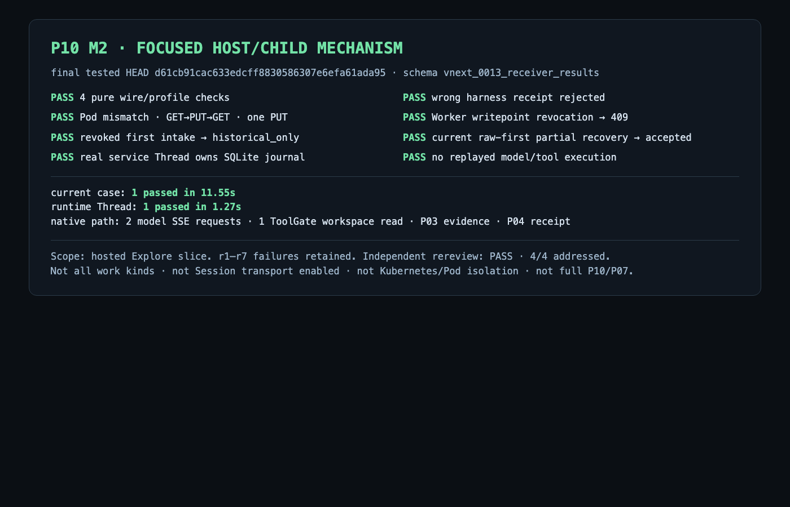

# vNext 当前进度审核与后续开发安排

日期：2026-09-13。性质：只读进度审核与已批准范围内的实施排序；本轮没有重新运行产品测试，没有完整产品通过结论。

审核工作树为 `work/worktrees/vnext-maf`，分支 `codex/vnext-maf`，代码截面 `6f6892aa92f41e53ccf97718265d5fcfd9c259df`。该截面无 tracked dirty；未跟踪的既有 P06/P10 原始资料和其他 Agent 的进度报告保留。主目录旧分支没有集成或切换。开发者已暂停启动新任务，现无其报告的在运行测试或 child。

依据：[有效背景](../../project-context.md)、[已批准 Spec](../../vnext/SPEC.md)、[P00–P20 Plan](../../vnext/PLAN.md)、[75 项 AC](../../vnext/ACCEPTANCE.md)、[实施决定](../../vnext/decision-register.md)、[交付里程碑](../../vnext/delivery-milestones.md)及以下实际代码和原始记录。原始导入文件保持不变。本文件中的后续安排尚不是已完成事实。

## 审核结论

继续采用 **Wuji Blackboard + Wuji Scheduler + MAF Worker**。现有证据支持这条组合的基本机制可行，无需换框架或重写已经验证的核心。现在处于“执行链路已有真实验证、产品闭环尚未完成”的阶段。

下一步优先解决会话恢复的剩余核心要求，并交付真实任务创建、控制和可信完成。不能继续以新增基础模块数量代表产品进度，也不能把 hosted Explore、固定 DTO 画布或 Kubernetes 就绪度当作完整任务平台验收。

## 当前完成范围

| 范围 | 已有事实 | 明确边界 |
| --- | --- | --- |
| P00–P06 基础 | 身份、证据、知识接纳、控制状态、模型/工具准入已有各自范围验收；P06 修复至 `78095e6`，35 项本项及 1 项消费者通过 | 局部 accepted，不表示所有下游 AC 完成；完整 MCP、外部目标和真实模型效果未验证 |
| P07 / M1 | 真实 MAF 经 Gate 读取无害文件、保存原始证据、提交 Claim 的 hosted 路径通过，修复 `5cfd581` | 框架和实际工具往返成立；完整会话及所有 work kind 不能继承此结论 |
| P09 / P10 / M2 | 真实 Scheduler/Outbox → Node → Python child → MAF/Gates → P03/P04；撤销后的历史补交、原始结果半提交恢复和真实进程观察已验证；原四项 P2 关闭 | 限定 hosted Explore；不同用例绑定不同 SHA，不能合称当前 HEAD 的一次全量通过；未验证新架构 K8s Pod |
| P08 会话/审批 | 最新两条 approve/reject 路径均由前后两代真实 child 完成，批准原调用一次、拒绝零执行；2 passed / 60.37s / exit 0 | 测试时 HEAD 为 `dd400bf` 加保存的 dirty diff，随后提交为 `6f6892a`；不是提交后另跑。approve 的 P04 accepted，reject 的最终 P04 为 rejected/INVALID_SCHEMA，测试未断言结果接纳。原生压缩、真实 child 记忆、并发与原子失败路径仍缺 |
| P08 权限 | `dd400bf` 对源 ACL 撤销、clearance 降低、同 Profile 不同 capability 资格来源共 3 项真实 PG 检查通过 | `6f6892a` 也修改生产 SQL，旧权限结果不自动覆盖新增 SQL 路径；历史 F1–F6 未整体终判 |
| P11 API | 审批路由已用于上述真实 HTTP 路径；`f6cad17` 已提交 Task/Work command 路由与 0015 locator | 控制 API 两项仅 collection；0015 尚未纳入统一迁移。正式 TaskCreate、项目创建权限、浏览器身份装配未完成 |
| P12 可信完成 | 已有冻结定义和前置领域能力 | 规划中的 completion 服务/真实完成协议测试尚未交付，不能用 Agent 输出或进程退出代替 Task 完成 |
| P13 投影 | 持久受权快照后端通过 12 项及后续 3 项定向修复；两项审查发现已关闭 | 后续 Goal/Completion 类型、Layout/ViewStream 和正式界面整合尚未验收 |
| P14 画布 | 正式 React Flow 组件固定 DTO 切片通过 16 Vitest、2 项受影响 Chromium 及 typecheck；保留五主题 | 真实身份/API、流、历史选择、完整详情、布局持久化与 p95 未完成 |
| P15–P20 | 已有设计与部分前置基础 | 流、治理、整套机制验收、离线归档、发布物和离线评测工具尚待实现；真实效果及生产切换各自独立 |

最新 P08 原始记录位于受限本地 [两代 child 结果](../../../work/p08/two-generation-child-approve-reject-3/stdout.txt)、[测试 HEAD](../../../work/p08/two-generation-child-approve-reject-3/head.txt)和 [测试时差异](../../../work/p08/two-generation-child-approve-reject-3/source.diff)。这些还在忽略目录，不能把本审核文档当成已经完成的永久成果包。之前 `dd400bf` 的 5 项混合批次保留：其中初始边界在 pytest 进程内，不能冒称两代独立进程；最新两项补齐了这个具体缺口。

本轮 SOL/xhigh 定向只读审核核对了上述 diff 及三份源文件哈希与 `6f6892a` 的对应关系。approve PID `79858→80439`，reject PID `82170→82765`，各代均有匹配 birth/start/exit 与 exit 0。每代分别装配 Node/controller；审批请求使用真实路由和 PG，但客户端为进程内 ASGI，不能声称浏览器登录或全链路远程网络部署。机制夹具使用合成模型，memory/compaction 关闭，单对象上限已从 16 KiB 改为 32 KiB。上述环境变化不能省略成“同一个旧候选配置”。

拒绝场景的 [controller 原始报文](../../../work/p08/two-generation-child-approve-reject-3/evidence/809102b4208e/p08-controller-459660a8-f648-427e-9f46-b70fd582526e.jsonl)记录 `rejected / INVALID_SCHEMA`。当前 [拒绝测试](../../../tests/vnext/test_session_approval.py)验证原调用、Session、零 ToolAttempt、退出和撤销，却没有验证最终结果接纳。因此目前只能确认该机制切片通过；本轮尚未定位拒收是模型夹具的最终输出、Worker 转换还是结果合同接线问题。

M2 已有完整永久包：[结果与各 SHA](../../vnext/evidence/P10/M2/README.md)、[完整 HTTP 报文入口](../../vnext/evidence/P10/M2/review-fix/http-reproduction.md)。下图复用该次验证截图，未为此次审核重跑：

## 当前需要处理的问题

1. **拒绝场景的最终结果尚未接纳，当前测试没有检查这一出口。** 先沿原始 payload/receipt 定位 `INVALID_SCHEMA` 并补正确结果断言。不能仅凭 child exit 0 或 pytest 2 PASS 宣称该业务闭环完成，也不能放宽 P04 校验来消除拒收。
2. **P08 尚有核心验收缺口。** 按实际 AC 收口半发布不混入新记忆、同 revision CAS/旧新 writer/lock 不兼容、批准消费与 ToolAttempt/Outbox 回滚、取消后旧批准不能复活、原生压缩后的依据与消息配对、完整图 GC 保护。已有成功路径不替代这些直接相关反例。F5 每次模型请求的完整有序因果也须有对应负例，不能靠后续请求的并集证明。
3. **新退出撤销 SQL 及迁移需要明确边界。** `6f6892a` 新增 SECURITY DEFINER `revoke_session_writer_on_exit`，正常退出撤销已运行；错误 receiver、错配 Session/input、未 settled 等不应撤销的负例未覆盖。它仍在0014定义中，迁移器会跳过已有0014的库。后续明确仅开发夹具重建，还是用新的增量迁移升级已有库；不能声称再次 migrate 就会自动安装新 trigger。旧三项权限检查的守卫未改，其历史范围仍有效，无需为新 SHA 单独重跑；它们不能证明新 trigger 的权限。
4. **框架配置仍是候选。** 最新路径关闭 compaction，真实 child 的固定版本记忆保存/恢复未证明，尚未形成新的 immutable verified capability。先证明目标组合，再发布新的 ref/digest；不改写原候选或旧 M1 Profile。
5. **公开产品入口有实质接缝。** TaskCreate 缺真实起始输入表达；离线任务与必填 HTTP Scope 不一致；项目级创建权及初始 Task ACL 没有正式生产者；浏览器 cookie/CSRF 与新核心签名身份尚未接线。这些应在正式入口这一批解决，不能用测试身份或假 URL 绕过。
6. **文档状态滞后。** 阶段表仍把 M2 写为未通过，把 P08 写在 `f4c3b76` 四残留截面。旧审查记录保留；当前表改为“后续实现和局部实测已推进、剩余证据待收口”，不能直接把旧发现全标关闭。
7. **验证效率仍需改善。** 最近 `6f6892a` 虽以 test 命名，实际含生产 SQL。后续按真实 diff 判断影响；先定位实际失败，再最小复测。首 RED、接口就绪通知、多轮 SOURCE_ONLY 和报告归档都不是独立交付关口。

## 下一步开发顺序

沿用已批准的 P/AC 和 M3–M5，只调整交付顺序。近期以两条相互独立的实现线并行推进；共享迁移、数据库和固定端口由单一集成人串行使用。并发按文件和依赖决定，不设人为数量上限。

| 批次 | 具体工作与依赖 | 完成时交付什么 | 最小必要验证与停止条件 |
| --- | --- | --- | --- |
| 1A：P08 恢复收口 | SOL 先定位 reject 最终拒收、补结果断言及新退出撤销 trigger 的负控，明确旧0014升级策略；接通固定版本 memory 和原生 compaction 的真实 child 保存/恢复，再补直接相关原子性、CAS/旧 writer、半发布/GC、过期批准及 F5 反例。恢复资料仍使用 MAF 公开接口，Wuji 只核对证据/权限/前沿 | 可明确声明支持哪一种固定框架/客户端/Profile 组合的恢复能力；原始记录一次归档，完整前提满足后新建 verified capability | 先只复测受影响 reject 出口，复用 approve 和未受影响权限证据；新增权限测试覆盖新trigger，不重复全套。相同两轮脚本问题未解决则记录真实阻塞，不再盲跑整套。未通过的核心项不降级成通过 |
| 1B：P11 正式创建与控制 | 主代理先一次性固定起始输入、项目创建权、身份装配三个接口；随后实现独立新入口，复用现有 ControlService/ApprovalService。0014 候选固定后纳入 0015，不并发改共享迁移 | 用户能通过真实授权入口创建待启动任务、启动、hold/pause/resume/cancel、提交批准或拒绝，并看到执行观察回执 | 真实 PG+签名 HTTP；创建者无项目权限、重放/版本冲突、pause 不解除 hold、取消与真实退出分开、旧批准不复活。先执行现有两项 control API 检查，再补产品路径缺口，不重跑已过 M2 |
| 2：P12 与多工作类型闭环 | 在控制/Session 端口稳定后实现可信 precheck、quiescing、settlement、ReportCommit/Delivery。补真实 Reason → Intent → Explore → 证据/评估 → Reason/完成提案消费；需要 report 工作时也走同一受控 Worker 和预算 | 一项离线夹具任务从创建到可信关闭、固定结果及报告可读；必要工作未完可等待，迟到反证生成补充，失败报告不重启执行 | 一条完整真实路径，加必需工作阻止提前关闭、关闭最后校验遇到新反证、未知进程不能宣称停止等直接边界。验证所有实际启用 work kind；不能只把 deployment allowlist 扩大就称完成 |
| 3：P13–P15 正式工作台 | 复用现有 Ant Design/五主题/React Flow；先固定 view_id+revision 的详情定位及 layout 读写，再实现流/重连/历史与真实身份入口。P12 引入真实 Goal producer 后同步投影，不能继续无条件用初始 goal_revision=1 | 从同一真实 Task 看运行、证据、审批、完成；刷新保留布局，历史只读，权限改变后旧流失效 | 真实 API/浏览器；可见变化递增、隐藏事件不泄漏、断流/gap/duplicate、历史分页不漂移、Layout CAS、记录详情一致；沿用五主题，只复查受影响项，按原 AC 做一次规模测量 |
| 4：P16/P19 与部署装配 | 完成引用保留/GC/purge、受限衍生件与下载、审计/观测；旧数据只读副本归档；生成新链路独立镜像和装配。发布清单稳定后使用本地 arm64 K8s 隔离 namespace | 可保留、可审计、可离线查历史的新运行包；实际 Task Pod 双容器证据 | 治理覆盖已发布引用与无引用对象，归档不产生可执行工作；K8s 验证真实启动/停止/身份/出口约束。集群 Ready 与镜像构建均不能单独代替 Pod 结果 |
| 5：P17/P18/P20 交付收口 | 汇总逐 AC 的真实证据及版本适用性，补必要跨模块端到端；离线评测计费汇总与对照工具；扫描实际传递依赖、镜像命令及归档启动 | 新机制交付、明确未运行项、独立发布物和离线演练结果 | 统一执行一次所需集成入口；旧证据不受影响则复用，关键缺项不计通过。真实模型试验、生产切换和旧数据删除保持各自授权边界 |

1B 的接口方案优先采用不可变起始输入引用、服务端项目权限与 Task ACL 初始化、现有独立身份能力到新核心 Principal 的受信适配；不导入旧应用入口。具体 wire 字段在单一合同源中确认后生成 DTO，不从测试夹具反推产品接口。3 的实时流状态与不可变历史 materialization 分开，布局只写用户偏好，不写领域结果。

近期第一个可展示终点是：**真实创建 → 受控执行 → 原调用审批/恢复 → hold/pause/cancel 可观察 → 可信完成与证据读取**。正式流式工作台接着消费这条路径，不等待 P17 才第一次把各层接起来。

## 执行与质量约定

- 主代理负责接口裁定、共享变更和集成。修复、验证、复核及轻量工作用 `gpt-5.6-sol/xhigh`；仅核心新功能或重大复杂问题使用 `gpt-6-astra/xhigh`。当前审核没有派发新的开发批次。
- 每批固定少量直接相关用例和真实出口，完成后做一次有针对性的 diff/权限检查；修复只跑受影响项。分配子代理必须有不重叠的写入范围，不为流程本身创建代理。
- 生产 SQL、迁移、锁文件和合同变化显式列出。旧 fixture 即使 migration head 相同，也不能证明后来修改的 SQL 已安装；按实际源码/DDL摘要固定运行前提。
- 持续保存完整 stdout/stderr、HTTP、SQL和进程事件；成果包引用至少一张实际截图和可复现的完整 HTTP 请求/响应，凭据显式脱敏。一次成果收口时归档，避免每次状态通知复制整套证据。
- 本文不新增测试成果、资产发现或运行权限。下次开发从 1A/1B 的现有代码继续，不重新进行全仓审计、不重开已关闭 M2、不恢复 Superpowers 流程。
