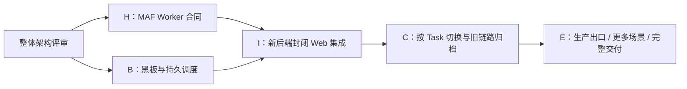

# Wuji MAF 架构设计工作与后续阶段分解

- 状态：`draft`；本轮只执行架构文档准备，以下业务分解不是已批准实施计划。
- 日期：2026-09-12；负责人：当前会话主代理，保留应用当前模型设置。
- 对应设计：[`spec.md`](spec.md)；基准：`1d73a767599732d9a53f81ad2cc553f4bf11d84e`。
- 批准依据：用户要求先设计完整架构、不急于重构；具体重构实施批准为“无”。
- 本轮沿用工作树 `/Users/yym1ng/Documents/ChatGPT/wuji`，不创建开发任务、分支或运行环境；未自行切换应用模式。

## 1. 背景与承接

已核对 [项目背景](../../project-context.md)、[协作约定](../../../AGENTS.md)、W1 的 Spec/Plan/Acceptance、Cairn/Worker 控制代码及 MAF 固定源码。现状仍是 Cairn/Pi/LiteLLM 的 W1 交付；新方案说明未来如何拥有黑板和调度，不将参考会话里的建议全部视为已批准约束。

框架复用：MAF 提供单项 Agent 循环、模型客户端、Session 序列化、Todo、记忆/历史 Provider、压缩与工具审批协议；LiteLLM 继续管模型与 USD 预算。现有 Task、身份、模型配置、Scope、执行账本、Runtime Controller、Kali 工具、Observation、验证/覆盖和工作台保留。

平台补充：Wuji 黑板领域模型、持久 WorkItem、调度策略、run_epoch、会话存储接入、单 Run 模型准入、结果接纳、人工输入/审批、恢复核对及前端状态。它们服务于具体业务，不实现厂商模型协议、通用 Agent 循环或另一套模型计价。

兼容影响：每 Task 固定一个后端；新黑板不与 Cairn 双写，旧 Task 保持原语义；迁移为增量，不改历史 Scope/queued、Pi 会话、W1 判据和已测试 SHA。数据库复合归属、RLS、活动 Run 约束、公共契约和镜像版本都要在对应阶段共同修改。

## 2. 本轮设计交付

- [x] 核对当前分支、HEAD、工作树和初始变更；确认本检出无 CodeGraph，使用源码回退。
- [x] 读取参考会话中完整的最新架构解释与用户方向，核对实际 W1 状态及主要控制链。
- [x] 对照 MAF 固定源码与官方文档，不根据名称猜 Harness/Session/Workflow 能力。
- [x] 在 Spec 中给出方案比较、模块所有权、部署、领域对象、调度/结果/恢复合同及演进边界。
- [x] 将新方案和当前 Cairn/Pi 实现明确分开，补充索引与相关设计入口。
- [ ] 用户评审整体草案；后续由应用进入 Plan 模式，主代理冻结首个业务阶段的详细 Spec/Plan。

本轮只使用 diff、相对链接和文本一致性检查。没有业务成果、测试目标或新资产发现，不制作虚假的截图或 HTTP 验证包；后续实际测试交付必须按 Spec §13 的证据要求执行。

## 3. 建议的后续阶段及依赖

H 与 B 逻辑上可分开验证；默认仍在当前会话按依赖推进，不因此要求两个子代理或两个工作树。公共契约、迁移和共享环境由主代理串行收口。按需使用子代理时仅用用户指定的 `gpt-6-astra` / `low`，不可用则报告，不静默替换。

### H：MAF Worker 合同与控制能力

终点：在受控夹具中以 MAF 完成一个独立工作，证明工具/模型准入、持久 Session、审批、输入与取消合同可用。此阶段不改变生产 Scheduler 或写入 Cairn。

| 建议文件归属（尚未创建） | 职责 |
| --- | --- |
| `packages/agent-runtime/src/wuji_agent_runtime/assignment.py` | 与 Wuji 业务协议对接；不向公开 API 泄露 MAF 类型 |
| 同包 `factory.py` / `profiles.py` | 按冻结 Profile 组装 Reason/Explore Harness；无默认旁路工具 |
| 同包 `session_repository.py` / `context.py` | 原生会话序列化、历史 Provider、checkpoint 和范围化记忆 |
| 同包 `tools.py` / `runner.py` | 函数工具适配、一次受控 run/stream 和事件转换；不重写工具循环 |
| `services/task-workers/supervisor.mjs` 与独立启动适配文件 | 保留旧 Pi 启动，增加新受控 Python 启动、输入/停止与回执合同 |
| `services/execution-control/model_access.py` | Run 准入、ModelCall 记录、LiteLLM 标准协议转发；不计价 |

在 H 的详细 Plan 中先固定实际运行 Python、MAF 发布包/摘要和最小依赖，不无约束跟随 main 或安装全部 integrations。准入层的流式转发、Session hook 位置、审批续接与压缩必须以真实框架行为验证；如不满足，记录具体不支持边界并回到设计，不写第二套 Harness。

最小验证对应 A03/A05/A06/A08 的 Worker 部分：一次函数往返、一个必要拒绝、审批/安全边界重启续接、原生压缩后受限读取、停止后旧 Run 请求拒绝、辅助调用同预算。合成上游不证明自主推理效果；不得为兼容测试沿用已耗尽的真实调用额度。

### B：Wuji 黑板与持久 Scheduler

终点：用历史快照和合成结构化结果验证新领域状态与调度，无模型或目标访问权限。

| 建议文件归属（尚未创建） | 职责 |
| --- | --- |
| `packages/blackboard/src/wuji_blackboard/` | Claim/Intent/快照、类型化关系、结果提交和版本检查 |
| `packages/scheduling/src/wuji_scheduling/` | WorkItem、候选/排序策略、持久领取、Reason 触发与无进展规则 |
| `services/wuji-scheduler/main.py` | 持久扫描、派发 outbox、失败核对；保持服务入口精简 |
| `services/execution-control/` 对应准入/结果模块 | Task/Run 许可、结果接纳、完成反馈，复用现有 Store 事务 |
| `apps/api/migrations/versions/` | 由主代理从实际头分配增量迁移；RLS、外键、唯一活动持有者一并落地 |
| `packages/contracts/` | 草案转成真实 DTO/Schema；公开行为与内部消息分开 |

阶段详细设计须固定字段、状态迁移、锁顺序、去重键、错误类型和 outbox 消费边界。首版单活动 Scheduler；数据库仍拒绝重复持有者。影子调度输出只写隔离的建议记录，不给真实 Run 凭据。

最小验证对应 A02/A04/A07/A09 的状态部分：公平选择与硬拒绝、两个领取者竞态、结果同键重投/异参冲突、旧 Run 提交、并行追加与旧完成失效、Reason 触发不丢失及无进展结算。只围绕直接受影响路径，不扩展全故障注入矩阵。

### I：新后端封闭 Web 集成

终点：新建一个明确选择新后端的内部候选 Task，从用户创建到有限评估、证据和停止闭环。保留现有 W1 三类结果，不预写探索顺序或目标答案给 Agent。

主要范围：`services/execution-control/core.py` 的 backend 分支及拆分模块、`packages/task-runtime/` 的必要绑定、`services/task-workers/` 新镜像、现有模型配置与 Task 快照、`apps/api/src/wuji_api/` 执行/评估查询、`apps/web/src/features/task-execution/`、Kubernetes 部署配置。

H/B 都有受支持证据后才能集成。先确认版本和场景边界，再集中执行 A01/A03/A04/A07/A08/A09/A10 的联合覆盖；H/B 已验证且未变化的路径引用原 SHA，不把单提交记录变化当作重跑整套理由。

未来可新增的验证入口（名称为计划，不是当前可运行命令）：`tests/agent-runtime/`、`tests/blackboard/`、`tests/scheduling/` 和一个新后端封闭 Web 联合入口。其参数、夹具、预期输出及测试代码由各阶段详细 Plan 冻结。本草案不要求执行不存在的脚本。

### C：按 Task 切换和旧链路退出

终点：新 Task 可采用新后端，旧 Task 与原证据可查；不存在同 Task 双调度。

先确认活动/待核对 Task 清单及 backend 归属，再停止新增 legacy Task；现有任务沿原引擎结束，或显式冻结并核对停止。归档 Cairn 原始快照、原 ID 和引用，不将其自动导入为新可信事实。仅在没有活动/未知旧执行且归档读取通过后退役旧 Dispatcher/Server。

回退按新 Task 选择发生；禁止对已有执行改 backend、倒回数据库或翻译框架 Session 来假装继续。删除旧依赖之前核对 legacy 查询与部署入口，不提前清理历史代码/资料。

最小验证为一组新旧 Task 读取、历史 queued 不派发、旧图来源定位和新 Task 选择回退；不重新执行历史安全测试或模型请求。

### E：完整产品能力扩展

生产出口与流量能力、真实模型效果、更多场景、Goal 方法映射、受限凭据共享、Finding/Report 各自有明确接口边界。它们不都是首批迁移前提，也不能因为逻辑设计完整就被标为可执行。

生产出口启用前，必须对部署环境验证域名/DNS/重定向、直连阻断、撤销/停止与实际采集能力；同 Pod 网络限制不能只靠 YAML 宣称。真实模型效果需明确已发布模型版本、公司价格、允许数据和新增 USD 授权。完整报告按截图/完整请求响应和受限证据政策验收。

## 4. 验证、集成和停止规则

每个后续阶段实施前在应用 Plan 模式完成具体合同，批准后再落盘进入开发；本草案不含数据库 DDL、业务代码或伪精确的开发工时承诺。阶段主代理独立负责架构、公共契约、迁移编号、锁文件与最终集成。

最低验证只覆盖主流程、直接受影响失败与权限边界；不设累计检查时间预算，单命令可设防卡死超时；同类脚本问题最多两轮定向排查，必要项通过即停止。业务变更复测受影响项；未变证据保留原 SHA 与适用理由。

实际测试报告必须记录被测代码 SHA、环境、命令、退出码、对应单位 `screenshots/` 的图片链接和完整 HTTP 交互包；关键数据不得截断。未知、未执行、机制通过、真实效果通过分别记录。敏感原文不进入 Git 或普通报告。

纯文档阶段不运行后端/集群/模型、不更新代码索引。当前目录无 CodeGraph；将来代码集成后若主工作区已有索引，再核对所属工作树与新鲜度，不能拿别的索引代替当前 HEAD。

本轮完成条件是形成可评审的整体方案和后续分解，并通过文档一致性检查。用户评审、框架集成可用、业务阶段批准、实际运行验收是后续独立状态。
