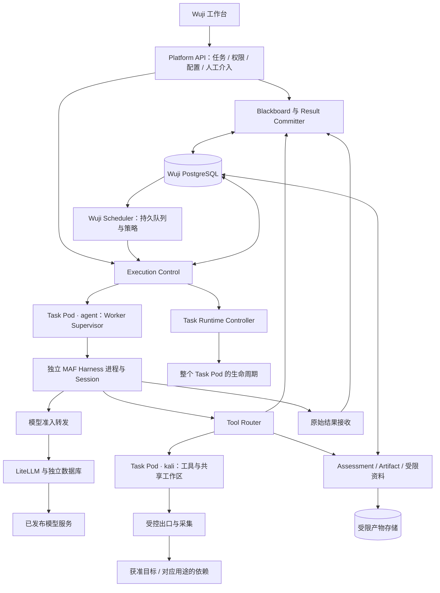

# Wuji Blackboard / Scheduler / MAF 整体架构草案

- 状态：`review-draft`；设计请求已收到，具体方案尚未批准，不是重构执行合同。
- 日期：2026-09-12；负责人：当前会话主代理。
- 用户本轮要求：先设计完整架构，不急于重构。参考讨论表达的目标方向为 Wuji Blackboard + Wuji Scheduler + MAF Agent/Harness。
- 现状核对：`codex/github-upload@1d73a767599732d9a53f81ad2cc553f4bf11d84e`，开始时工作区干净；本机仅有 `/Users/yym1ng/Documents/ChatGPT/wuji` 这一工作树，无 `.codegraph/`，以 `rg` 和源码读取核对。
- 本轮只交付设计。当前应用为 Default 模式；没有自行切换 Plan 模式，没有批准或实施新业务阶段。
- 导航：[背景索引](../../project-context.md)、[设计工作及后续分解](plan.md)、[评审与验收状态](acceptance.md)。

## 1. 目标、依据与方案选择

目标是让 Wuji 自己表达探索知识、决定调度规则并控制每个 Agent，同时继续复用成熟框架的模型客户端、工具循环、会话和压缩。保留 Task 产品主体、五类场景、版本化配置、授权、共享 Kali、证据和金额预算。

本设计依据包括实际读取的 [PRODUCT](../../../PRODUCT.md)、[现行架构](../../architecture.md)、[Cairn 决策](../../cairn-architecture-decision.md)、[黑板](../../cairn-blackboard-design.md)、[Harness](../../agent-harness-decision.md)、[评估模型](../../assessment-model.md)、[场景](../../scenario-execution-design.md)、[流量方案](../../traffic-evidence-design.md)，以及 W1 的 [Spec](../phase-2-web-assessment/spec.md)、[Plan](../phase-2-web-assessment/plan.md)、[验收](../phase-2-web-assessment/acceptance.md)。参考会话“分析 Agent Framework Go”的用户需求用于理解方向，助手建议和框架自述不作为已批准决定或实现证据。

| 选择 | 收益 | 代价与结论 |
| --- | --- | --- |
| **Wuji 黑板和调度 + Python MAF Harness（推荐）** | 业务知识、执行与评估关系由 Wuji 定义；规则有自己的公开接口；复用 Agent 内部机制 | Wuji 要承担持久调度和一致性；通过本文约束规模，先实现单调度实例 |
| 继续 Cairn，替换 Worker 为 MAF | 更少改变现有黑板，便于隔离验证 Harness | 核心调度和完成语义仍受 Cairn 约束，无法充分解决用户痛点；可作为受限实验，非最终目标 |
| MAF Workflow 同时负责全局探索与黑板 | 对控制关系明确的流程组合方便 | 仍要另建业务知识、授权、账本和恢复；Workflow 状态与业务状态混合，扩展探索时边界更难维护，不采用 |

现有 PostgreSQL 与 Cairn SQLite 分别承担业务记录和探索图，**不应简单定性为错误双写**。具体改造理由是现有 Dispatcher 适配替换了阶段函数、Pi Driver 和图快照交付，并以 `CompletionHandled` 绕开原生失败分支来表达 Wuji 完成反馈。新方案将这些控制语义放回 Wuji 自有接口。

Python 是推荐执行语言：现有控制面为 Python，MAF 提供可组合的 `create_harness_agent`；官方目前未提供同等打包的 Go Harness。此选择不要求重写现有 Node Kali 工具或前端，也不把 MAF Workflow 变成必选项。[官方 Harness 说明](https://learn.microsoft.com/en-us/agent-framework/concepts/harness)

## 2. 总体结构与部署



图中是逻辑模块，不是每个方框一个微服务。首版部署建议如下：

| 部署单元 | 包含模块 | 所有权 |
| --- | --- | --- |
| 现有 web / API | 工作台、用户命令、查询、配置和权限入口 | 用户只能经 API 操作 Task |
| execution-control | 准入、黑板写命令、结果接纳、工具路由、模型准入、评估、恢复核对 | 平台可信服务；在现有服务内按职责拆模块 |
| wuji-scheduler | 读取候选、策略选择、领取和交付 WorkItem | 首版一个活动调度进程；持久状态在 PostgreSQL |
| Runtime Controller | Pod 期望状态调谐、UID 核对、代次切换、回收 | 唯一管理整个 Pod；不运行模型循环 |
| 每 Task 一个 Pod | `agent` 容器的 Supervisor + 多个独立 Harness；`kali` 容器的工具 Supervisor + 共享目录 | 仍固定两个容器；一个有效 runtime_attempt |
| LiteLLM | 上游协议适配、凭据、费用和 Task USD 预算 | 独立数据库，原生计费权威 |
| 数据与基础服务 | PostgreSQL、产物存储、身份服务；后续受控出口、OTel 接收后端 | 先复用已有部署，按实际能力开放 |

Scheduler 可与控制服务复用镜像/代码包但分别启动，避免 API 请求生命周期决定调度。首版不引入 Redis、Kafka、图数据库、向量数据库或通用工作流引擎。通知丢失由持久队列扫描补偿，不依靠内存 Future 判断是否正在执行。

双容器共享 Pod 网络；独立卷和凭据挂载不等于容器间网络隔离。同 Task 共享 Kali 是协作环境，不能承载相互不信任的任意代码并宣称强隔离。

## 3. 模块分工：保留三层决策

| 层 | 决定什么 | 不能决定什么 |
| --- | --- | --- |
| Reason Harness | 当前知识说明什么、缺什么、有哪些下一步建议 | 直接访问目标、扩大授权、创建后台 Agent、将 Task 判成功 |
| Scheduler + Admission | 哪个已接纳工作现在执行、使用哪个已发布 Profile、何时等待/停止 | 用确定性代码臆造安全结论，或以高优先级越过硬约束 |
| Explore Harness | 本项工作内部怎样使用允许工具，怎样分解 Todo、整理结果 | 把 Todo 直接变成全局任务，绕过 Scheduler 委派，自己授予工具权限 |

Bootstrap 保留“初始化”的职责：普通代码固定 Origin、Goal 合同、输入与场景初始覆盖，再生成首个 Reason 工作。无需强制调用一个 Bootstrap Agent，也不在初始化中隐式请求目标。某场景确需模型分析附件时，作为明确的受控 WorkItem 处理。

Explore 可以在阶段结果中附后续 Intent 提案；它们进入统一接纳和调度。Verification 是业务核实对象，可由普通规则或另一个受控 Explore 执行，不固定为永远存在的第三个 Agent。报告渲染优先使用确定性模板；只有需要模型起草且仍在有效执行和预算内时，才安排专门工作。

MAF Workflow 保留为可选的单项工作内部实现，例如读取归档 → 摘要 → 引用检查。它不得独立领取全局工作、持有另一套 Task 状态或无登记地产生子 Agent。首版核心闭环直接使用 Harness，不需要 Workflow。

## 4. 黑板：一个业务权威，多种信息语义

新执行后端的黑板由 Wuji PostgreSQL 中的领域记录构成。Blackboard 是这些记录的统一读写与关系视图，不再复制一套“图节点数据库”，也不保存所有 Agent 聊天。

| 对象 | 语义 / 写入者 | 与现状关系 |
| --- | --- | --- |
| Task / Origin / GoalContract | 目标、起点、自定义完成文字及可执行判据；来自创建快照与明确变更 | 保留 Task 和场景快照；Goal 判据关系增量设计 |
| Observation / Artifact | 工具实际观察及原始内容；由可信采集链登记 | 复用 W1 实体与 ID，不从模型文字制造 Observation |
| Claim / ClaimRevision | 对观察的解释、假设或共享知识，含来源、条件、支持/反驳引用 | 新增，承担新链路的共享知识；避免 Fact 与 Hypothesis 两套重复表 |
| Intent / IntentRevision | 希望解决的问题、依据、目标引用、方法/能力要求、预期产物、依赖 | 新增；文本、前提和适用依据有明确版本 |
| Hint / HumanInput | 人工线索、回答或建议；标注作者、时间、适用工作 | 新增统一记录；不是授权或执行命令 |
| VerificationRun / ResultRevision / EvidenceLink | 在固定条件下核实主张，证据支持/反驳/限制哪个版本 | 复用 W1 并扩展关系，不重造验证引擎 |
| CoveragePlan / CompletionReview | 有限分母、缺口、完成提案的程序核对 | 复用并增加新黑板版本引用 |
| Asset / CredentialRef | 对象关系与受限凭据引用 | 完整资产/密钥共享仍属扩展模块；发现不等于授权 |
| FindingRevision / ReportCommit | 对外结论与交付的冻结版本 | 后续产品模块，不能冒称 W1 已实现 |

Claim 的 `kind` 可表达 observation-summary / hypothesis / derived-conclusion；证据状态分为 unassessed / supported / contradicted / inconclusive。模型可提出 kind 和主张，证据状态由评估或明确人审产生。没有规则支持的共享笔记可以保存为 unassessed，不能被命名为 Fact 就升级成事实。

所有实体携带 tenant/project/task 归属、作者或采集主体、来源 Run、版本与时间。关系使用类型化外键或受约束的引用表，不允许任意 JSON ID 跨 Task 串接。来源关系与 Intent 依赖分开：知识图允许反证和交叉关联；阻塞执行的依赖必须无环。

纠错采用追加 revision / supersedes，不改写已被报告引用的正文或证据。相反结论并存时保留冲突，覆盖项可以变为 inconclusive。原始 Artifact 不随摘要或笔记变化。

### 4.1 版本、快照和进展

- `board_revision`：Task 黑板语义提交的递增序号；黑板写入、相关关系及事件在同一 PostgreSQL 事务内生效。
- `assessment_revision`：覆盖与验证的版本；继续保留，不能拿一次 Agent 启动冒充评估进展。
- `progress_digest`：对新有效观察、结论变更、可行动缺口和已解决阻断的摘要；不包含 Token、心跳、重复提交、仅改措辞的 Hint。
- `BoardSnapshot`：固定 board/assessment 版本与引用清单。Agent 可显式刷新，记录访问的 revision；不在工具背后静默切换 latest。

完整快照先在短读事务内固定引用清单，大正文在事务外按不可变引用读取。并行 Explore 新增不冲突的观察无需因整个黑板前进而作废；依赖被撤回、主张被替代或完成依据过期时，相关控制决定须重新核对。

原始数据全量入库不等于全部进入模型上下文。查询按工作依据、相关实体、变化范围分页；大内容返回受限引用。后续全文/向量索引是可重建的检索层，不能改变证据或授权权威。

## 5. Intent、WorkItem、AgentRun 与 Session

四者分别回答“想做什么”“排队执行什么”“哪次进程在执行”“续接哪段上下文”。

| 对象 | 生命周期与约束 |
| --- | --- |
| Intent | 业务探索问题；接纳状态 proposed / admitted / rejected / superseded。执行进度从关联 WorkItem 投影，不再维护第二份执行队列 |
| WorkItem | Scheduler 唯一持久工作单元；kind 为 bootstrap / reason / explore，扩展时可注册 report。Explore 必须关联一个固定 IntentRevision；Reason 关联触发和快照 |
| AgentRun | 一次实际进程执行段；一个 WorkItem 可顺序产生多个 Run，同时最多一个拥有写许可。进程状态、结果状态分别记录 |
| AgentSession | 同一 WorkItem 的可续接上下文；兼容续接可跨 Run，不能同时被多个 Run 写。每轮独立 Reason 使用新 Session，减少旧规划锚定 |

WorkItem 建议状态：ready → leased → running → done；旁路为 waiting_input / blocked / reconciling / failed / cancelled。暂停时保留 checkpoint 与 resume_required；只有已核对安全的工作才能重新 ready。done 表示工作已结算，不代表漏洞成立或整个 Task Goal 达成。

`execution_epoch` 撤销整个 Task 执行许可；`runtime_attempt` 标识整个 Pod 环境代次；新增 `run_epoch` 标识某项工作的执行持有者代次。单个 Agent 停止/替换只推进自身 run_epoch，不必撤销其他正常工作的 Task 许可。所有模型、工具、会话写入和结果接纳同时核对这些身份。

领取租约到期仅说明需核对，**不能直接重新执行**。确认旧进程及工具停止、旧许可失效、结果结算无未知后，才能为同 WorkItem 创建新 Run；环境重建还须核对工作文件是否可用。已有 Token 不能因换 Session 重新获得权限。

## 6. Scheduler：规则可改，执行有据

### 6.1 硬准入和策略排序分开

硬准入依次检查：显式 start、Task 可运行、当前授权及配置未撤销、正确 backend/epoch/attempt、依赖已满足、没有冲突 Run/未知调用、模型与工具能力匹配、时间/调用/资源上限、预算未阻断。任一拒绝返回稳定 reason_code 与解除条件。

策略模块只在 eligible 集合中排序。推荐接口为 `select(snapshot, candidates, capacity, policy_version) -> DispatchDecision[]`，作为 Wuji 自有纯代码接口；输入是已校验的只读数据，输出是选中项、Profile 和可展示的理由。它不访问目标、调用模型、写数据库或提升能力。

首版排序采用明确层级：必需依赖就绪 → 完成缺口/反证核实等场景优先级 → 已批准的人工优先级 → 等待老化 → 创建顺序。任务间采用公平轮转，Task/租户/Worker 容量都受总上限约束。Reason 同时最多一个；它与 Explore 共享 Task 并发上限，调度时给已就绪控制工作公平机会，不让后台推理无预算增长。

同 Task 的共享可变资源（文件发布、端口、浏览器身份 Context、工具全局配置）由 Runtime 工具服务按 resource_key 租约协调。声明独占资源的工作不能并发占有同一资源；普通只读查询可并行。不把共享目录本身视为并发控制。

规则变化分三类：优先级/并发/触发阈值由 SchedulerPolicyVersion 表达；新排序算法修改独立策略模块；新增模型推理策略属于 ReasonProfile。配置由管理员显式发布，Task 固定版本。普通更新仅用于新 Task；紧急撤销停止受影响执行。首版没有在线任意 Python/DSL 上传或自动热换活动策略。

### 6.2 持久领取与派发

1. 扫描持久 ready WorkItem；数据库通知仅作唤醒优化。
2. 在短事务内锁 Task/候选行，重新核对准入、容量和唯一活动持有者，写 DispatchDecision、AgentRun、run_epoch、lease 和派发 outbox。
3. 事务提交后向当前 Pod Supervisor 发送具有稳定 operation_id 的启动请求；事务内不等待网络。
4. Supervisor 先保存启动记录，重复 operation_id + 相同摘要返回原记录，不重复 spawn；同 ID 不同输入拒绝。
5. 启动响应丢失，查询原 operation_id；无法确定则 reconciling，禁止换 ID 重投执行。

结果提交、队列变更和 outbox 有数据库唯一约束；任务级短锁及 `FOR UPDATE SKIP LOCKED` 可用来避免并行领取碰撞。即使以后有多 Scheduler 副本，旧持有者仍需被执行端的 epoch 检查阻断；首版不以单进程为由取消这些约束。

### 6.3 Reason 触发与无进展

Reason 的触发来源为初始化完成、新有效知识/验证、依赖结算、有效人工输入、完成反馈和已记录阻断被解除。Tool wait、日志、Token、心跳不触发全局规划。

每 Task 持久保存 pending 原因集合、待处理最高 board_revision 和已消费 revision。同一时刻最多一个 Reason；运行期间的变化合并到下一轮。只有其结果接纳或明确结算后才消费对应触发；崩溃不能丢掉待办触发。

Reason 返回类型固定为 propose_intents / wait / propose_completion / blocked。wait 必须指向可观察事件、依赖或人工问题，不能只返回“稍后再看”形成定时空转。CompletionReview 的反馈进入下一次 Reason，不重新调用旧模型结果。

Intent 去重使用规范化的目标、身份、方法族、问题、依据版本和预期输出；文本相似仅提示合并。已有执行中的等价工作复用关系，不能改标题重新获得额度。必须有新的有效依据、明确不同方法或显式复测理由，才允许产生后续重复方向。

无进展以 progress_digest 判定；当前 W1 的“同评估 revision 两次重复完成提案后部分结束”保留为 W1 Policy 的既有规则，不推广为所有场景永久常量。新的 Profile 必须给出有限阈值、工作轮次、时限、ToolCall 和产物配额；缺少必要限制不可发布。Budget 耗尽时使用已有记录结束，不再付费要求模型总结。

## 7. MAF Harness 组装与上下文

### 7.1 采用矩阵

| 能力 | Reason | Explore | 控制方式 |
| --- | --- | --- | --- |
| 模型/函数工具循环 | 使用 | 使用 | MAF 原生实现；显式有限迭代，平台累计请求/工具上限再次约束 |
| Todo | 默认关闭 | 启用 | 仅本 WorkItem 进度；清单自报完成不触发业务完成 |
| Plan/Execute Mode | 关闭默认交互 Mode | 关闭默认交互 Mode | 任务已分配后自主执行；局部计划仍可表达，不额外每轮问人 |
| Session/history | 每次 Reason 独立 | 同一工作可受控续接 | 原生序列化 + Wuji 持久存储与单写者约束 |
| 文件记忆 | 默认关闭 | 启用受限 AgentFileStore | 仅该 Task/WorkItem，不挂宿主目录、不与 Kali 证据混用 |
| 压缩 | 显式配置 | 显式配置 | 用 MAF 策略和已验证容量；不自研摘要/裁剪算法 |
| 工具审批 | 需要时走平台决定 | 同左 | 关闭 Harness 常驻/启发式自动批准，保留函数工具审批协议 |
| 内部后台 Agent / 外层 Todo 循环 | 不启用 | 不启用 | 全局派发只有 Wuji Scheduler |
| 默认 Web Search / Shell / 通用文件工具 | 不启用 | 不启用 | 只提供注册的函数工具；目标命令经 Kali 受控执行 |
| Skills | 受信版本按需只读 | 同左 | 目录/版本/摘要固定，不允许脚本通过知识加载执行 |
| 观测和消息注入 | 使用可控接入 | 同左 | 绑定持久事件，限制来源、内容、额度；不以消息注入替代撤销 |

此矩阵是 Wuji 选择，不是 MAF 默认值。固定源码可见 `history_provider`、`file_memory_store`、`context_providers`、`middleware` 及各 disable 参数；工厂默认 InMemoryHistoryProvider、默认 Session 文件记忆，有条件自动加 Web Search，且始终装配 MessageInjectionMiddleware。未给容量或自定义策略时压缩可能不启用。[固定工厂源码](https://github.com/microsoft/agent-framework/blob/3c670707766a8455da6491a9049cc9d575e019f0/python/packages/core/agent_framework/_harness/_agent.py)

### 7.2 Session 和持久化

框架提供 `AgentSession.to_dict/from_dict` 和 HistoryProvider 扩展点；默认 SessionStore 是内存实现，不能替代平台可靠存储。[固定 Session 源码](https://github.com/microsoft/agent-framework/blob/3c670707766a8455da6491a9049cc9d575e019f0/python/packages/core/agent_framework/_sessions.py)

推荐 Wuji SessionRepository 保存 checkpoint_revision、session_id、WorkItem、拥有者 Run/run_epoch、框架/客户端/Profile 版本、消息序列和受限快照引用。框架历史使用可替换 HistoryProvider 接入；会话 state（Todo、待批请求、Provider 状态等）另外完整序列化，不能只存消息。

持久化边界：模型响应及工具调用提议、工具结算、待人工输入、正常工作段结束。每次更新按旧 checkpoint_revision 比较写入；存储失败则禁止下一次模型或目标操作并进入核对。历史和 Provider 状态可能在不同 hook 更新，因此只有边界内必要数据齐全的快照才标 resumable；不把“每次模型调用保存历史”当成任意崩溃点无损恢复保证。

原始调用/结果账本与“发给模型的压缩历史”分开。压缩只改变上下文工作副本，原始证据、输入版本和结果回执不被裁剪。使用框架原生压缩处理工具调用/返回配对；若候选策略不能保留恢复所需控制消息，禁用该 Profile 的自动续接，不自行拼造工具结果。

审批/安全暂停后可续接同 Session；进程崩溃后先核对，再从兼容 checkpoint 续接。不存在可证明完整的 checkpoint 时，从已接纳黑板建立新工作或交人工处理；原未知 ToolCall 不能被新上下文重跑。框架跨版本快照默认不兼容，除非升级检查证明兼容；不转换 Pi session.jsonl 成 MAF Session。

### 7.3 运行中指引

用户给 Task 留线索时，持久化 Hint 并触发 Reason。用户给某个运行工作指引时，生成 HumanInput（原文、作者、适用 WorkItem、delivery_id）；Worker 单一执行上下文在安全边界将它交给 MAF 消息注入或下一次 run 输入。标记 pending / delivered / acknowledged，不伪造模型已经理解。

注入可能触发额外模型请求，因此所有相关调用仍经过模型准入和 Task 预算。高频 Hint 合并通知，额度照常累计。修改授权、撤销工具、停止执行使用控制命令，不等待模型读到一条聊天消息。当前运行硬改目标/方法则先取消或结算原工作，新建版本与后续 WorkItem。

## 8. 模型配置、准入和 LiteLLM

```text
Wuji ModelConfigVersion / CapabilityCheck
             ↓ 固定到 Task / AgentProfile
MAF 原生 ChatClient
             ↓ Run 凭据
Wuji 模型准入转发（Execution Control 内）
             ↓ 平台持有的同一 Task 限定 Key
LiteLLM → 上游模型
```

四层职责分别是：Wuji 配置决定允许用什么；MAF 客户端转换框架消息到选定协议；薄准入层核对谁现在可以请求；LiteLLM 负责上游转换、Key、用量和预算。准入层按标准协议转发并透传流，不实现厂商协议、会话压缩、模型路由策略或另一套计价器。

增加准入转发的理由是单 Agent 控制：只有共享 Task Key 时，不能仅撤销某个 Run 而让其他 Run 继续并在服务端保证旧 Run 不新增请求。目标方案由准入层保管 LiteLLM Task Key，Harness 仅拿 Run 限定凭据；Kali 两者都没有。LiteLLM 的工作负载入口仅接受受信准入层，防止通过网络可达直接绕过。

每个模型请求先持久登记 ModelCall：可信 Task/Run、三种代次、Profile、逻辑请求 ID、实际 attempt、模型别名、开始状态；再发往 LiteLLM。拒绝模型别名或能力超出冻结配置的请求。辅助摘要、最终整理、消息注入和全部重试使用同一路径；Token、轮次、工具数分别计数。

首个候选协议推荐 MAF `OpenAIChatClient` → OpenAI Chat Completions 兼容入口 → LiteLLM，便于保持应用侧历史。客户端、网关、实际模型、结构化输出、工具、流式、用量、取消和压缩组成同一能力检查记录；协议连通不够。需要 Responses/Anthropic 等其他协议时按 Profile 独立启用，禁止静默降级或丢字段；本轮未选择或验证具体公司模型。

继续使用管理员填写的公司价格、同版本显式连接检查和发布流程。Task USD 预算由 LiteLLM 原生累计，所有角色、续接、运行代次共用；不周期重置，不自建金额预占/结算引擎。平台记录引用与控制状态，Trace 不当账单。并发在途结算可能超出最后观察值，继续保留“不保证零超支”的实际边界。

配置错误/权限拒绝不自动换模型，SDK/网关隐式重试显式收敛。可能已发送的请求若响应丢失，保留 unknown 并核对网关；没有可获取正文不等于未计费。对账只能确认费用时，不编造原模型输出，后续请求必须作为新的有预算工作明确记录。停止流不能承诺取消上游已开始的推理或退款。

## 9. 工具、授权、Kali 与出口

MAF 函数工具是首版内部适配；外部已采用 MCP 的服务可通过受信 MCP Adapter 注册，两者调用同一 Tool Router 准入逻辑。MCP 解决工具协议，不能替代授权、网络隔离或证据采集。禁止 Agent 自填 MCP URL、加载宿主 stdio 服务或直连外部目标工具。

工具注册版本包括 Schema、适用阶段、用途、目标解析、方法限制、时限、资源锁、取消能力、重复执行策略和证据能力。工具集合是平台/组织/项目/Task/WorkItem/Profile 的交集；Reason 只有已有记录读取。Todo/记忆属于无目标访问的会话工具，也有配额和持久化边界，但不必全部经 Kali。

ToolCall 逻辑身份跨恢复稳定。将框架原生 call ID 与 WorkItem/Session/消息序列映射到平台 ToolCall，并保留 source_agent_run_id；新 Run 续接只能领取有证据的历史操作，不能把新 run_id 当成新的调用键。相同键不同参数冲突；参数相同但操作键不同仍是新操作，不能据参数哈希推断已执行或自动放行。

Runtime Supervisor 收到绑定参数摘要、任务/Run/epoch/attempt/receiver/deadline 的许可后登记 ToolAttempt，再启动受管进程。长工具返回稳定句柄；查询/等待句柄不重发目标请求。结果不明先核对实际回执。停止旧 Run 后，受限结果查询/归档可继续，但它不产生任何新目标或模型访问。

工作文件保持 `/workspace/agents/<agent_run_id>/`、`/workspace/shared/`、`/workspace/inputs/`；跨 Run 续接通过显式前驱工作目录引用读取，不静默假定旧文件存在。共享发布采用临时文件写完后原子发布和内容摘要；产物进入正式证据再登记 Artifact。

### 9.1 生产出口设计边界

首个生产能力建议采用受控 HTTP 转发：Router 签发调用用途和许可，Kali Adapter 经出口建立经验证的目标连接、采集请求响应，逐跳重验 DNS/地址/重定向和授权。Task Pod 不允许直接到目标、平台基础设施或任意代理。策略按域名/子域、协议、端口和批准资产表达，路径仅作定位和关注点。

外域静态依赖仅由受管加载上下文访问，不赋予普通测试工具同域权限。候选核验、资料导入、模型访问分别有独立用途和能力。受管浏览器/CLI 代理采集、原始网络协议、OAST 按 Adapter 扩展，不靠开一个通用 CONNECT 绕过。

出口是完整架构的必要组件；具体 CNI 与浏览器代理选型需后续环境证据。当前 W1 仅有固定自建站点与受控 HTTP，不能因为引入 MAF 就开放任意 Shell/MCP/外部目标。生产能力未通过则 Profile 不发布；保留单 Pod 双容器，不为本轮架构设计擅自安装 CNI 或增加业务容器。

## 10. 人工审批、暂停、取消与恢复

| 用户动作 | 平台语义 | 对其他工作影响 |
| --- | --- | --- |
| 补充线索 | Hint 或指定 WorkItem 的 HumanInput | 不改变授权；适用工作在安全边界接收 |
| 回答问题 / 批准具体操作 | 绑定问题/待批调用、参数和版本的决定 | 等待工作可重新准入；无依赖的工作继续 |
| 停止单个 Agent | 撤销该 Run，停止进程及归属工具，核对结果 | Task 不整体取消；后续是否另派由策略和核对结果决定 |
| 暂停 Task | 撤销 Task epoch，冻结派发，停止/核对活动请求，保存可续接状态 | 全 Task；paused 只在停止得到证明后显示 |
| 恢复 Task | 显式用户命令，重验授权/配置/预算/环境与 checkpoint，签发新许可 | 不能自动恢复 unknown 操作或重置金额 |
| 取消 Task | 撤销许可、停止核对、保留证据并回收 | 终态不可恢复；续作创建关联新 Task |
| 变更 Scope | 权限化的新版本，先停受影响执行并完成版本切换 | Hint、工具批准、模型回复都不能代替 Scope 命令 |

MAF 工具审批返回待处理请求，应用收集决定后向兼容 Session 回传；它不是现成的 Wuji 审批数据库或 UI。[官方函数审批](https://learn.microsoft.com/en-us/agent-framework/agents/tools/tool-approval)

平台 ApprovalRequest 绑定：Task、WorkItem、Session/checkpoint、原工具 call ID、参数摘要、工具/Scope/Profile 版本、提出 Run、批准主体资格与有效期。决定和消费分别去重。审批后仍需检查当前许可；参数/版本改变或原操作已取消则失效。恢复 Run 时显式将待批操作移交给新 run_epoch，不把批准记录当成可跨工作复用的通行证。

普通已授权操作自动执行。需要人审的操作由已发布工具策略确定；禁止操作直接拒绝；范围外工作记录待授权，不能由一次工具批准扩大 Scope。没有“以后一直允许所有工具”的全局入口。

Task、Run、ToolCall、模型请求与清理分别有 observed_state。撤销先落库并阻断新请求，再发停止信号；取消请求被接受不等于停止已确认。Worker 和 Kali 短租约失效后停止接新操作并结束受管进程；TTL、停止时限和可证明的残余窗口由 RuntimeProfile 固定并实测。

控制服务/调度器重启，扫描未结算持久记录并核对 Supervisor、Pod UID、ToolCall、结果及会话。任一实际执行未知保持 reconciling，冻结相关冲突工作；不能以租约过期、连接断开或 PID 数字复用判断它已结束。恢复期间已持久结果可补交，允许的是结果接收，不是新执行。

## 11. 结果接纳、幂等和并发

Agent 的最终响应先按原文保存为不可变 ResultSubmission，再由 Committer 解析和验证。不能只保留解析后的 JSON；格式失败仍保留原输出及明确错误，不自动付费再问一次。

### 11.1 建议的内部合同

以下为 Wuji 领域合同草案，不是已发布 HTTP API，也不是 MAF 类型。实施阶段再固定路由、完整 Schema 和迁移。

| 合同 | 核心字段与返回 |
| --- | --- |
| WorkerAssignment | schema_version、Task/WorkItem/IntentRevision、agent_run_id、三种代次、Session/checkpoint、BoardSnapshot、Profile/模型/工具版本、目标和完成要求、deadline/调用限额、恢复原因；凭据走受限独立通道 |
| WorkerControl | operation_id、expected_run_epoch、start/cancel/input 类型及摘要；返回 received / running / exited / unknown 与持久回执 |
| AgentResult | schema_version、输入快照/已读取引用、工作结论、候选 Claim、证据/Verification 引用、限制、后续 Intent 提案；归属由服务端可信上下文派生 |
| ReasonResult | propose_intents / wait / propose_completion / blocked；附依据、理由、依赖/等待条件或完成缺口说明 |
| ResultReceipt | submission_id、canonical_digest、received / accepted / rejected / conflict / historical_only、接纳对象及新 revision、错误项；同请求只读恢复 |
| DomainEvent | event_id、tenant/project/task、aggregate_id/version、event_type、causation_id、关联 operation/submission、时间与脱敏引用 |

### 11.2 提交顺序

1. 认证归属，再按 submission_id 和完整规范输入摘要核对原回执；同 ID 不同输入冲突。过期执行凭据只允许受信 Supervisor 代交历史结果，不能继续发工具。
2. 保存原始正文和内容摘要。大对象先上传并校验完整后登记可用引用；暂存对象不作为已接纳证据，失败显示 pending。
3. 短事务锁定 Task / WorkItem / 相关实体版本，核对 run_epoch、依据与证据归属、输出 Schema、规则/前提和已有重复提案。
4. 保存追加版本、验证/覆盖变更、WorkItem 结算、ResultReceipt、board_revision 和 OutboxEvent；同库关系同步生效。
5. 调度器与 UI 读取事件引用。通知可重投，消费者以 event_id 去重，不因重复通知重新执行。

原始提交保存与语义接纳允许分两步，因此每一步都有状态、摘要与重试核对。对象存储和 LiteLLM 不参加 PostgreSQL 事务；不得宣称跨系统 exactly-once。结果响应丢失可重复提交同一原输入取得回执，这只重投结果，不重跑 Agent/目标。

旧快照的追加观察可在归属和来源有效时接纳并记录真实读取版本；修改/取消已改变的 Intent 或完成 Task 必须检查 expected revision。新反证出现时，旧完成提案失效并回传缺口。取消前已发生的调用结果可作为历史收录，`historical_only` 不创建新的可执行 Intent，也不重新启动终态 Task。

JSON 合法、来源 ID 存在、另一个模型赞同都不能单独证明主张真实。Claim 的共享接纳与 Verification 的证据结论分别处理。

## 12. 覆盖、Goal 与结束

结束必须区分三件事：当前探索是否还有行动、执行是否已经停止、评估条件是否满足。Reason 只提出结束建议，CompletionReview 用当前权威版本判断。

检查项包括：当前覆盖分母/required 方法、有效正负结果和冲突、待办依赖与人工输入、活跃/未知工具和模型请求、未提交结果、Goal 判据映射、范围/预算/时间限制。结论可为 continue_with_gaps / wait / finish_with_results；实际停止和资源回收另走控制链。

Coverage evaluated 要有对应方法完整执行及有效结论。blocked、not_run、inconclusive 不改成 not_reproduced 或 excluded 来提高评估率。已有 W1 `assessment_outcome=complete/partial/inconclusive/not_assessed` 保留；新架构不采用旧长期文档中不同名的 criteria_met 覆盖当前 API 枚举。

GoalContract 保留用户完整文本，另关联可检验条件：每项有 criterion_id、适用对象/条件、规则版本或人工判断责任、证据要求、required、结果。无法映射的自然语言要求明确为 unknown；模型的自评可展示但不自动写 met。总 Goal 只有所有必需条件都有可接受依据才可为 met。W1 迁移复用原 Profile 时仍保持总 Goal unknown，不借框架更换改变历史结论。

预算或无进展可触发 partial 结束，并给出未完成清单。真实执行未知仍 reconciling；确认已停但证据缺失可结束为部分/不确定结果。终态不自动 reopen；新证据的纯历史补录不触发目标请求，重新验证另建关联 Task。

## 13. 证据、存储、报告和观测

### 13.1 存储归属

PostgreSQL 保存业务权威、执行账本、会话元数据/版本及审批；受限产物存储保存证据正文、完整 Session 快照、日志和报告。短小状态可以先存受限 JSON，超限使用内容引用。开发期已有 PVC 仅用于已声明的封闭环境；生产对象存储、加密与敏感权限须验证后启用。

Agent 记忆是可修订笔记；Session 是继续交互所需状态；黑板是共享业务记录；Artifact 是归档证据。各自可以引用彼此，但不能互相替代。跨 Task 复用必须明确来源与当前访问权限，不自动加载其他任务记忆或凭据。

HTTP 证据保存方法、实际 URL、Headers、请求体、响应状态/Headers/响应体、编码、时间、身份、采集点、完整性与 ToolCall 关联。采集的是解析消息或客户端解码字节时如实标注，不声称是原始 TLS/TCP 包。未发送、截断、响应未知分别标记；证据缺失不能靠模型重造。

成果交付遵循用户现有要求：每个成果至少一张验证截图，放在对应单位的 `screenshots/` 并用图片链接引用；附完整可复现 HTTP 请求/响应，关键数据不得截断，标注漏洞点。完整性不足时该项不能标为完整交付。实际敏感原文进入受限证据区，以有权限的附包提供；普通报告只给脱敏视图和引用，不将有效密钥写入 Git。源码/非 HTTP 成果保留原生证据，同时给出实际相关的服务接口交互；确无 HTTP 交互时记录完整包要求尚未满足，待用户确定适用交付格式，不能伪造报文或自行放宽交付条件。

发现新资产/接口时同步资产文档与来源，明确已利用 / 未利用 / 已修复；“已修复”必须有复测依据。该展示状态与资产授权状态、Finding 研判和修复工作流分开，未获许可的发现保持未利用。

ReportCommit 固定 Scope、配置、覆盖、Claim/Finding/Verification 的具体版本、证据清单、正文和限制。生成或查看报告只读取冻结记录；模型起草若需要，安排在有效执行期间并共用预算。默认模板足以在预算耗尽后交付已有结果，不额外请求模型。

### 13.2 可观测性与 UI

MAF 提供 Agent、Chat、Function 中间件扩展点；Wuji 在入口和边界记录调用身份与状态，服务端依然核对权限。[固定中间件源码](https://github.com/microsoft/agent-framework/blob/3c670707766a8455da6491a9049cc9d575e019f0/python/packages/core/agent_framework/_middleware.py)

Trace 连接 Task → WorkItem → AgentRun → ModelCall/ToolCall；Metric 统计队列等待、执行时长、拒绝原因、待核对数、证据缺失和取消时间；审计记录关键决定、配置与权限变化。OTel 接收后端是运行配套，不成为业务或费用权威；默认不输出完整 Prompt、密钥、原始敏感内容，不公开隐藏推理。

工作台保留 Ant Design 五主题和现有黑板/时间线/工作区。黑板显示观察、主张、假设、工作依赖和证据；Agent 卡显示当前 WorkItem、简短决策摘要、局部 Todo、模型/工具调用、阻断和停止状态。用户无需选择 Cairn/MAF 实现，后台按 Task backend_version 路由。

人工问题、具体审批、范围申请分别展示。UI 流断开只影响观察，不自动取消执行；Worker 独立消费框架输出并持久化。事件通过持久游标重连，迟到事件不回退状态；历史回放不调用模型/目标。只有能力真实具备且允许的动作进入 allowed_actions。

## 14. 五类场景怎样共用架构

| 场景 | 初始化与探索特点 | 完成与关口 |
| --- | --- | --- |
| Web 单点 | 匿名入口、同授权系统内动态产生 Intent | 有限计划与证据；新域/端口/资产不自动扩权 |
| CTF | 题目、附件、靶机和规则快照；按题型匹配工具 | 题目目标及可核对解题依据；规则不解除平台禁令 |
| 代码审计 | 固定仓库 commit/文件快照；静态分析优先 | 源码位置与主张依据；依赖下载、构建、动态验证分别准入 |
| 综合渗透 | 已批准资产集合、阶段目标、显式内网接入配置 | 阶段关口由授权决定，阶段内动态探索；禁止未授权扩散 |
| 攻防演练 | 已批准信息源调查、候选资产及归属依据 | 候选核验和纳入测试分别批准；不因单位名称获得测试许可 |

各场景使用相同 Scheduler / Blackboard / Harness，差异在 ScenarioProfile、GoalContract、方法/工具和阶段准入。TaskStage 只表达粗粒度业务阶段与关口，不固定 Planner→Explorer→Verifier 顺序。首批迁移只验证现有封闭 Web 能力，不同时承诺五类场景全部执行。

## 15. 兼容与迁移方案

每 Task 固定 `execution_backend_version`（例如 legacy-cairn-pi-v1 / wuji-maf-v1），这是内部路由属性。同一 Task 始终只有一个可写黑板和一个调度所有者；没有运行中双写、同时调度或失败后静默切换引擎。

| 现有部分 | 处置 |
| --- | --- |
| Task、身份/项目、模型配置、Scope、ready/start、金额预算 | 保留语义和 ID；按新后端增量绑定配置 |
| W1 Observation、Artifact、验证、覆盖、CompletionReview | 复用；新增 Claim/WorkItem 引用与新完成入口 |
| `services/cairn-dispatcher/main.py` | 新后端退出使用；legacy Task 生命周期结束前保留原链路 |
| `packages/cairn-bridge`、Cairn Server/SQLite | 保留 legacy 查询与必要旧执行，未来只读归档；不修改 Cairn 核心 |
| `services/task-workers/supervisor.mjs` | 抽离 Pi 专用启动适配；复用进程回执/幂等/停止合同，新增受控 Python Harness 启动 |
| `trusted-extension.ts` | 旧 Pi 链路保留；新函数工具适配复用服务端 ToolCall 规则 |
| `services/execution-control/core.py` | 按黑板、调度准入、结果接纳、模型准入与恢复拆出模块；旧 native 路径按 backend 保留 |
| `packages/task-runtime`、Kali helper | 沿用 Pod 所有权与工具实现；只在合同实际变化处补适配/验证 |
| 前端与 OpenAPI | 版本化增量读取/控制，历史 Task 按原语义展示；不伪造 Cairn 原生 ID |

现有 `one_active_intent_run` 等约束按旧 phase/intent_id 表达，新 WorkItem/RunEpoch 必须设计对应唯一约束和租户复合归属；不能只给新表加字段而遗漏旧约束阻止新行为。迁移编号在实施阶段从实际迁移头分配，不提前占号。

推荐按以下顺序降低风险，详见 Plan：

1. 独立验证 MAF Worker 合同，使用已有自建夹具和合成上游，不强行把新 Agent 塞入旧 Cairn 返回格式。
2. 以历史快照/合成结果验证新黑板和 Scheduler；影子计算没有执行凭据、不能派发目标或调用模型。
3. 显式创建新后端封闭 Web Task，贯通新调度、双容器、预算、证据和工作台。
4. 旧 Task 原链路结束或冻结，归档原图与 ID 映射；新任务逐步采用新后端。先停止新增 legacy Task，再在没有活动/待核对记录后退出旧服务。

新任务失败时的回退是停止并保留结果、让后续新任务选择 legacy 后端；不将已运行新 Task 改回 Cairn，也不把 MAF Session 翻译成 Pi 历史。旧 queued 没有 start 记录永远不自动激活。历史 Fact 导入只作带 source_task_id、原始 ID 和采集时间的只读资料，不自动视为新 Claim 的已验证结论。

## 16. 验收目标、外部依据与待决边界

### 16.1 未来实现必须满足的最小可观察结果

| ID | 条件 | 证据边界 |
| --- | --- | --- |
| A01 | 单闭环从初始化→Reason→Explore→观察→评估反馈→结果结束，不要求固定 Agent 数或预写探索答案 | 合成上游先验证机制；真实效果另需模型/金额授权 |
| A02 | 修改已发布排序策略后，新 Task 顺序按策略变化；不修改 Cairn/MAF 内部源码 | 对照 DispatchDecision 与 Profile 版本 |
| A03 | Reason 的目标工具请求及错误 Run/Task/epoch 被服务端拒绝；单 Run 停止不阻断无关 Run | 模型准入、Tool Router 与 Supervisor 的实际请求/回执 |
| A04 | 原结果重投、启动响应丢失和旧 Run 迟到提交不会产生第二次执行或两份结论 | 稳定 operation/submission ID、数据库和进程回执 |
| A05 | 人工批准后仅恢复原待批操作；取消后的旧批准无效；Session 单写者且可在受支持边界续接 | 完整审批、checkpoint、ToolCall 链路 |
| A06 | 实际 MAF 压缩后仍能读取固定合同与证据、工具集合未扩大 | 原生框架事件与受限读取；不借 Pi 的历史证据替代 |
| A07 | 并行追加结果不误拒，反证能使旧完成提案失效；重复无进展能按 Policy 停止 | board/assessment revision、原结果与 CompletionReview |
| A08 | 多 Run 和辅助调用共用原 Task USD 累计；取消/重启不产生新预算 | LiteLLM 记录及平台 ModelCall；不宣称并发零超支 |
| A09 | 历史 Task 只读、旧 queued 不启动、新旧后端无双派发 | 后端路由、运行清单和旧 ID 读取 |
| A10 | 工作台能从主张定位验证和完整证据，区分待输入、已停、未知及部分结束 | 一次代表页面查看和请求/响应；不要求全主题回归 |

以上均未在本轮执行。文档本身只做 diff、引用和一致性检查；纯设计不制造截图/HTTP 成果包。未来测试报告须遵循 §13.1 的截图和完整交互证据要求。

### 16.2 版本与静态核查

2026-09-12 获取的 MAF 主仓库 HEAD 为 `3c670707766a8455da6491a9049cc9d575e019f0`（提交时间 2026-09-11T23:53:32Z）；其 core pyproject 声明 `1.18.0`、Python `>=3.10`。这是源码参考，不是已安装、已锁定或集成通过的依赖版本。[固定元数据](https://github.com/microsoft/agent-framework/blob/3c670707766a8455da6491a9049cc9d575e019f0/python/packages/core/pyproject.toml)

源码抽查覆盖 Harness 组装、Session/HistoryProvider、MessageInjection 和中间件；官方文档核对 Harness、Session 与函数审批。没有执行 MAF、真实模型、目标请求、集群或性能测试。源码支持扩展点不证明 Wuji 已完成适配。

### 16.3 尚未批准或需要验证的内容

整体推荐是本草案的完整逻辑方案，以下明确留在后续决策/验证节点，不让实施者自行猜测：

| 项目 | 当前建议 / 已知边界 | 收口时点与责任 |
| --- | --- | --- |
| Python Harness、Claim 模型、WorkItem 与模型准入层 | 本文推荐，未获逐项批准 | 用户评审整体架构；主代理在 Plan 模式冻结阶段合同 |
| MAF 发布包、客户端与压缩策略精确版本 | 源码能力已查，发布包与网关组合未验证 | Worker 适配阶段按现有运行 Python 固定锁和产物；失败报告不换框架 |
| 会话持久 hook、审批续接、真实取消 | 已定义目标和失败规则，原生组合仍须验证 | Worker 合同验证；不能支持的恢复边界明确不可续接 |
| 自定义 Goal 自动判断 | 只自动执行已发布、可核实规则；其余 unknown/明确人审 | 场景评估扩展；不把自由文本解析结果视为执行事实 |
| 生产出口/CNI、浏览器/通用工具、敏感存储 | 逻辑边界固定，具体环境实现未选定/未验收 | 独立生产能力阶段；通过前维持封闭 Profile |
| 真实模型效果与容量数字 | 无新增 USD 授权，无吞吐/质量证据 | 明确模型版本、公司价格、允许数据和额度后安排最小验证 |

现有 Cairn/Pi 文档继续解释已交付系统；本草案经批准并开始相应实施后，才逐项替换目标基线。历史验收 SHA、失败、费用和未覆盖项始终保留。
