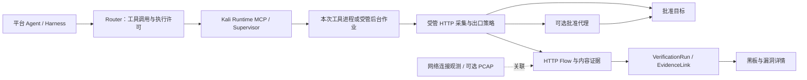

# Kali 工具流量与漏洞证据关联方案

状态：review-draft，2026-09-10。基于用户明确保留的“平台 Agent + Kali MCP 执行环境”，补齐可评审后端设计。架构主线不变，不运行任何渗透工具、不部署代理、不做测试。

前提：域名/子域、协议/端口与已批准资产为主动测试边界；正常外域 JS 等页面依赖走单独的加载能力，详见场景方案 §4.4，不能把依赖域名加入测试白名单；**没有路径级访问控制**。路径和参数仍需保存在受限流量证据中，供定位和复核。

## 1. 明确分工

Agent 推理和多 Agent 调度留在平台；Kali MCP 暴露运行工具、查询受管作业、停止、读取产物等能力。Router 记录调用和许可，Supervisor 启动对应进程、维护后台作业归属；不把所有 CLI 重写成平台算法。

采集器必须记录操作用途（目标测试、页面依赖、候选核验、平台服务）及实际命中的许可；网页依赖流量既要可见，也不能升级为外域测试权。

HTTP 采集层在现有 Egress 逻辑边界内实现，可与其同进程/同部署，避免每层各建一个微服务。先采用结构化 HTTP Adapter 的明确请求/响应，后续 Kali 浏览器/CLI 接入可评估 mitmproxy 的受管显式代理。mitmproxy 是候选采集引擎，不能代替 Wuji 的权限、预算、数据归属和证据模块。

## 2. 三类记录各司其职

| 层 | 默认收集 | 解决什么 | 不作什么承诺 |
| --- | --- | --- | --- |
| HTTP Flow | 每次受支持的 HTTP 请求、响应或错误；头、body 引用、时序、状态、字节 | 从发现定位实际请求，并比较基线/验证/对照 | 解析后的 HTTP 消息不等于逐字节线上 TCP/TLS 包，HTTP/2 字段不能伪装为原始 HTTP/1 文本 |
| NetworkFlow | 连接五元组、方向、工作负载、策略判定、字节与时间；拒绝/未关联活动 | 核对工具是否直连或走未登记通道；非 HTTP 基础观察 | 加密内容不可见；Pod 级事件不自动知道发起 Agent |
| PCAP | 按诊断策略保留有配额的片段或有界环形缓冲 | 协议排查、必要时定位字节层数据 | 不默认无限全量抓包，也不能事后恢复从未保存或已经覆盖的包 |

网络包与应用消息存在分段、重组关系，HTTP/2 还可能在单连接复用请求；所以不能将一个 packet 等同一个请求。[Wireshark 重组说明](https://www.wireshark.org/docs/wsug_html_chunked/ChAdvReassemblySection.html)。

mitmproxy 的 HTTPFlow 包含一对 request/response 及 error；body 可能因 streaming 缺失。适配器必须显式保存所需 body，并区分完整、截断、缺失和未解密，不能认为拿到 Flow ID 就已拿到完整证据。[HTTPFlow / Message API](https://docs.mitmproxy.org/stable/api/mitmproxy/http.html)。

HTTPS：普通 CONNECT 仅转发加密数据。要展示请求/响应明文，受管客户端须经过能够观察明文的 Adapter 或受信检查代理；后者仅在隔离任务环境配置信任并校验上游证书，不修改用户宿主证书库。[mitmproxy HTTPS 原理](https://docs.mitmproxy.org/stable/concepts/how-mitmproxy-works/)。

不兼容 TLS 检查、代理或协议的工具明确标记采集能力。若域名控制仍可证明成立，可按已发布的受限能力运行并展示“仅连接级”；若两者都不能保证则暂不接入。不能把仅连接级工具返回的“已发现漏洞”包装成完整 HTTP 证据。

## 3. 请求归属必须在执行前建立

1. Router 持久化 ToolCall/attempt 和关联 Task、AgentRun、Intent、VerificationRun（如已有），签发受限许可。
2. Supervisor 创建受管 ToolJob，把本次进程/子进程组与 job/attempt 绑定；后台任务持续归属这个 job。后续 MCP 查询进度不是新的目标执行，也不把同一进程重复启动。
3. 每个 job/attempt 使用独立受限的出口会话；由可信 Supervisor 和出口注册身份/通道映射。HTTP 采集器按实际接入会话生成 flow_id 和 request_id，再绑定服务端归属。
4. 不能用 Agent 自填的 task_id 请求头或“同一时间窗口”作强关联。内部关联头/代理认证信息不转发目标，也不进入普通证据原文。
5. 一个工具产生多次网络请求：每次请求独立计数并关联同一 job/attempt；重定向和重试建立父子关系。HTTP/2 流分别关联 request，不按 TCP 连接粗略合并。
6. 连接观测通过可信进程/网络标识与出口会话映射补充关联；无法映射时保留 unassigned，不强挂到最近一个 Agent，形成待核对记录。

同一 Task 可以复用一个 Kali Runtime。不同 Agent 的进程目录、浏览器上下文与出口会话分别管理；共享 Pod IP 无法满足精确并发归属。若某个工具只能使用全局共享代理且无法可靠区分调用，先对它的网络执行串行化；不为并发伪造精度。需要更强隔离的工具使用独立执行单元。进程组、目录、不同代理端口不自动构成恶意代码安全边界；同 Task 共用 Runtime 的信任假设须保留。

采集与策略组件位于工具权限之外，工具不能删除记录、关闭采集或获得控制身份。默认不新增目标请求头作追踪，避免改变被测行为。

## 4. 流量记录的最小领域结构

以下是待纳入阶段 Spec 的字段含义，不发布新 API 或数据库迁移。

- `TrafficExchange`：request_id、flow_id、tool_job_id、tool_attempt_id、task/stage/agent 归属、实际目标、协议/端口、解析地址、出口路由、策略版本、发送状态、响应或失败、时序、大小。
- `TrafficArtifact`：采集位置、请求/响应头与 body 的受限对象引用、摘要、编码、完整性、截断/缺失原因。保留“工具输入”“出口实际发送视图”和“出口收到响应”的来源区别，代理改写必须留差异；没有原始线速字节时不称为线上原包。
- `EvidenceLink`：验证/发现版本 → request_id 或 artifact 版本；角色为 baseline、verification、control、limitation 等，并记录引用哪一段支持什么主张。不是所有漏洞都必须凑齐同一种三请求模板。
- `CaptureManifest`：采集能力、采集范围/时间、缺失或丢弃计数、日志归属和可用内容，防止空记录被误解为没有发包。

元数据与查询索引用现有 PostgreSQL；原文/大内容用现有对象存储。最初不引入 Kafka、ClickHouse 或全量抓包检索平台，真实吞吐证据需要时再扩展。

流量准入先写有界可靠记录再允许目标请求，结束后追加结果；崩溃或连接中断保留 unknown/partial。证据上传未完成只返回 pending，不生成完整证据标记。存储或可靠缓冲到达上限时停止新增目标请求，不能静默丢证继续执行。

## 5. 从漏洞结论定位请求：以 SQL 注入验证为例

这里仅说明数据关联，不规定攻击载荷或自动执行方法。

1. Agent 提出某个接口参数存在 SQL 注入的假设，形成 VerificationRun。
2. Kali 工具在该 VerificationRun 对应 job 内发起所选方法的基线、验证及必要对照请求。采集器保存每次交换，形成真实 request_id 集合。
3. 工具返回候选结果与日志。受信 Adapter 对工具自带请求记录和采集器结果做关联，Agent 通过受限查询工具选择具体依据。匹配不唯一时保留候选集合或缺口，不自动任选一个。
4. Agent 提交“哪些请求支持什么结论”；服务端验证 request_id 的任务/版本/访问归属及产物可用性。领域规则和必要复核决定结论可信度；有一个 request_id 不等于漏洞成立。
5. 漏洞详情显示验证方法摘要、关键请求集合、响应变化、对照结果及限制。点击任一请求可看 Query/Header/Body、响应、耗时和发起工具；比较时展示相关参数或响应差异。

时延类结论要关联必要的多次样本和对照；单次慢响应不是充分证据。带外方法关联 OAST 标记和回调记录。无法确定关键请求时标记“证据待补齐”，保留原始工具日志，不从自然语言总结重造请求后冒充历史证据。

证据在发包时采集；发现确认后为其实际依赖的 artifact 建立保留引用，防止被普通流量轮转清理。其余流量遵循任务策略和容量上限。不能指望发现之后才启动抓包补出历史。

## 6. 用户怎么查看

任务“流量”列表默认按请求浏览，支持阶段/Agent/工具/目标/状态/出口筛选。被拒绝和未关联记录分组可见，列表不把全部 PCAP 逐包倾倒出来。

漏洞详情中的“验证依据”直接展示相关请求集合；用户可在基线/验证/对照之间切换，右侧检查器查看请求和响应，另有工具日志、网络连接与可选抓包片段入口。黑板 Fact 通过 EvidenceLink 跳到同一记录，不复制第二份流量。

页面原文是只读且按权限脱敏；必要的敏感原文走单独授权读取和审计，凭据不进入列表或普通事件。路径保留用于观察，不再存在路径级授权按钮。重放必须是新的受控命令，不能在“查看依据”中暗发请求。

## 7. 集成顺序与有限验证

Phase 1C 固定 request/job/attempt/证据关联契约，并在受控 HTTP 闭环采集真实消息。接入 Kali HTTP CLI/浏览器时复用同一流量模型，再增加受管代理 Adapter；不先完成所有协议抓包系统。

相关开发批次只验证一条工具执行→多请求→结果引用→详情定位链；补一个并发归属或串行限制检查、一个内容缺失/拒绝显示检查。共享 600 秒，未覆盖的 TLS/协议/压力矩阵记录集中测试，不为本文启动新检查。本轮实际测试数为 0。

## 8. 独立静态审查处置

SOL/xhigh 审查确认：attempt 级可信归属、HTTP 交换与连接分层、版本化请求证据链、TLS 可见性和 MCP 返回值不能替代采集事实。主代理已纳入。对不支持代理的工具，可在后续评估独立网络执行单元/受管转发；没有经验证的方案时保持不可接入，不直接在当前共享 Kali 中赋予特权。评审不构成任何组件已测试或已部署的证据。
