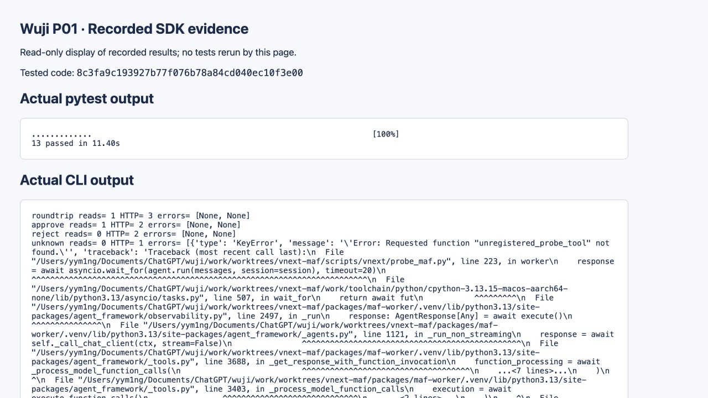

# P01 current implementation and fix round1 report

Current status: **3 Important findings addressed; ready for scoped re-review.** SDK evidence remains bound to 8c3fa9c; watchdog fix/tests are bound to 1d77954 (initial fix af4f609). Required screenshot is now resolved by the later main-controller capture. G2/G4/product integration remain separate.

Durable owner: Wuji vNext P01. Current evidence lives under [evidence/P01](evidence/P01/relocation.json), independent of SDD scratch cleanup. See [CapabilityRecord](capability-record.json) and [stage acceptance](../stages/vnext-maf/acceptance.md). The [original 9186c1b report](evidence/P01/historical/P01-report-9186c1b.md), original checksum list and denial/check results are byte-preserved. The section below is a readable historical copy with current links and corrected coordination attribution; its earlier blocked verdict is historical. The round1 addendum at the end records the current resolution.

# P01 implementation report — historical implementation section

日期：2026-09-13。范围：仅 P01；工作树 `/Users/yym1ng/Documents/ChatGPT/wuji/work/worktrees/vnext-maf`，分支 `codex/vnext-maf`。

**状态：实现完成，SDK 局部可行性验证通过；交付证据未齐，截图项 blocked。不得据此登记 P01 全部交付验收或 G2/G4 通过。** 没有发现本轮所需 MAF 公开能力缺失；当前阻塞来自截图工具权限，而非 MAF。

## 1. 基线、授权与提交

- 首先实际读取 `.superpowers/sdd/vnext-v2/P01-brief.md` 及其 AC-002/003/004/037/040 全文，再读取 `decision-register.md` D04、SPEC S08/S09/S17、`implementation-baseline.md`、阶段入口与背景索引。
- 开始时 HEAD 为 `c9871a66dcebb0ac74205bbae8e94ed00cd1892e`，工作树干净；该树没有 `.codegraph/`，按规则使用 `rg` 与文件正文。没有使用其他工作树索引。
- 主控制器交接确认：P00 已由 GPT-6/xhigh 审查通过、无发现，基准仍为 c9871a6；Node24.20.0/pnpm10.32.1 已实测；PostgreSQL16.2 Unix socket 夹具供 P02 以后使用。这些是协调输入，本任务没有重做该审查或连接数据库。
- 代码提交：**`8c3fa9c193927b77f076b78a84cd040ec10f3e00`**，`feat(vnext): isolate released MAF dependencies and verify public SDK boundaries`。
- 首次报告与 capability-record 证据提交：`1eccff9`。随后仅补充本条提交记录与原始证据空白检查说明；不预填最新文档提交自己的 SHA。
- 13 项测试发生于代码提交前，测试后未修改代码；逐个使用 `git show 8c3fa9c:<path>` 核对全部 9 个代码/锁/测试文件字节一致。摘要见 [capability-record](capability-record.json) 的 `code_file_sha256`。之后 CLI 在该提交上实际运行，退出码 0。没有因只新增 SHA/报告而重跑整套测试。
- 没有子代理、远端推送、生产切换、付费模型、真实 Key、目标请求、数据库或 Kubernetes 操作。

## 2. 文件与隔离方式

代码提交显式暂存了以下文件，未使用无范围 `git add`：

| 文件 | 用途 |
| --- | --- |
| `packages/wuji-core/pyproject.toml`、`src/wuji_core/__init__.py` | 最小可安装核心包，无业务实现/旧依赖 |
| `packages/maf-worker/pyproject.toml`、`src/wuji_maf_worker/__init__.py` | 真实 MAF 精确版本与本地 core 依赖 |
| `packages/maf-worker/uv.lock` | 新项目自己的冻结 lock |
| `scripts/vnext/uv.sh` | 使用真实本地 uv、受管 Python，固定新项目与独立 `.venv`，保留调用者 cwd |
| `scripts/vnext/probe_maf.py` | 发行物/安装文件检查、公开签名、真实 SDK 子进程、能力门控和完整原始记录 |
| `tests/vnext/maf_fixture.py` | 仅合成模型服务；绑定临时 `127.0.0.1` 端口，完整捕获 HTTP |
| `tests/vnext/test_dependency_probe.py` | 12 个 test 函数、13 个实际用例（审批参数化） |

两个新项目声明自己的空 uv workspace，使 worker 的 path dependency 和 lock 与旧根 workspace 隔离。**无需根 pyproject exclude；根 `pyproject.toml`、根 `uv.lock`、`scripts/uv.sh`、旧 Supervisor 与旧依赖均未修改。** D04 对 Plan 命令的实际映射是 `./scripts/vnext/uv.sh run --frozen ...`，不能用旧根包装去解析新测试依赖。

沿用已存在的 `work/toolchain/bin/uv` 和受管 Python，不修改旧 bootstrap。新包装禁止自动下载 Python，并检查 uv 版本；`probe_maf.py --prepare-wheels` 是最小发行物准备入口，缺失 wheel 时对每个固定发行版各做一次有限 PyPI 元数据与文件下载（20 秒单次超时），下载后校验固定摘要。缓存齐备后测试无需访问 PyPI。未开发其他平台的从零工具链安装矩阵。

## 3. 实际依赖与发行物证据

本轮实际工具链：Python **3.13.15**，uv **0.12.11**（`4b53f66b7`，aarch64-apple-darwin），Node **v24.20.0**，macOS15.7.5 arm64。Node 仅读取版本，无 JS 业务测试；pnpm10.32.1 来自主控制器交接信息。

| 安装物 | 发布 wheel SHA-256 | 安装文件逐字节匹配数 |
| --- | --- | --- |
| agent-framework-core 1.18.0 | `75f2fac5eed229c62f0665630cf1478eb45204bde41200a4c94dab57d441cc84` | 111 |
| agent-framework-openai 1.14.3 | `b24b19b641531ef09e5cf52d5e5d20ba1be7299477d721e3516fc2da55e7f1ef` | 11 |
| 负对照 core 1.17.0（未安装） | `75958ff692a38bf0c627aaa910bae6c4a89569dfec68e1e79eac8e206d88874d` | 用真实另一版 wheel 触发固定摘要检查失败 |

lock SHA-256：`fda695281f2d03639380bdb2c58c68d572270283f7e60e03a58f1d2f345dbcec`。

来源为 [core 发布页](https://pypi.org/project/agent-framework-core/1.18.0/) 与 [OpenAI adapter 发布页](https://pypi.org/project/agent-framework-openai/1.14.3/)，没有使用 Git HEAD。实际 wheel 下载 URL、wheel 摘要、METADATA/RECORD 摘要、逐文件摘要及完整传递依赖在 capability-record 的 `dependencies`；28 个解析条目，26 个实际安装 distribution，包含本地两个包。没有 Cairn/Pi/Claude CLI，未加载旧内核；lock 无 git source。构建后端 hatchling1.29.0 固定在新 pyproject，uv lock 的 runtime/dev 条目不冒称包含所有隔离构建期临时环境。

使用 `distribution()` 定位工厂所属安装文件，`inspect.signature()` 记录完整工厂、Agent.run、Session.to_dict/from_dict、Content.from_dict/to_function_approval_response、tool、OpenAIChatCompletionClient 与 AsyncOpenAI 签名。wheel 中除安装时重写的 RECORD 外所有文件逐字节匹配；RECORD 本身另行记录摘要，不把它和 wheel 内 RECORD 错作相同。

## 4. 真实 SDK 结果

调用链是 **真实 create_harness_agent → OpenAIChatCompletionClient → AsyncOpenAI → localhost HTTP → MAF 原生函数分发 → read_record → 第二次 HTTP**。合成服务只脚本化模型回复，不替代 SDK。read_record 实际读取 `record.json`，记录 fixture 摘要、读取结果、PID 与 SDK 调用栈；没有 `sdk_was_real` 或相似成功布尔证明。

合成输入完整文本：`{"id":"synthetic-001","value":"offline-p01-record"}`；SHA-256 为 `291fbef005d5ee67038cf975ed19a4ebfa2d9169885c236e4834fd7fb3573a63`。

| 场景 | HTTP 次数 | 真实读取数 | 观察 |
| --- | ---: | ---: | --- |
| roundtrip + settled restore | 3 | 1 | 前两次完成函数往返；新进程第三次请求包含原历史、工具结果与最终回复 |
| approval → approve | 2 | 1 | 原进程返回真实审批并保存退出；新进程读回同 Session 与审批，批准后一次读取 |
| approval → reject | 2 | 0 | 同样跨进程恢复；原生工具结果为 `Error: Tool call invocation was rejected by user.` |
| unknown tool | 1 | 0 | SDK KeyError：`Error: Requested function "unregistered_probe_tool" not found.` |
| HTTP 503 | 1 | 0 | SDK ChatClientException，原始上游 InternalServerError 和完整响应已保存，无隐式重试 |
| nonexecuting stub | 2 | 0 | 模型仍能得到普通结束回复，但真实读取计数断言失败，不能通过工具往返门控 |

每轮探针共 9 个 SDK 子进程、11 次 HTTP 交换。原生返回、全量 Session 前后字典、审批请求/响应、子进程命令/退出码/stderr、PID、完整请求/响应在 capability-record 的 `raw_sdk_and_http`；pytest 那一轮原始观察另外保留 [pytest-probe.json](evidence/P01/pytest-probe.json)。没有用新建无关 Session 充当恢复。

审批 ID 的实测区别：原生 `approval_request.id` 等于嵌套 `function_call.id`（`af-call-...`），模型协议关联值是 `function_call.call_id`（`call-p01-read`）。恢复后逐一保持两者及完整原调用一致；不能把二者合成一个字段。Session 状态仅通过公开 to_dict/from_dict 不透明保存/恢复；没有编辑其中内部状态键，也没有调用 SDK 私有接口或补丁源码。

所有 HTTP 请求都检查非空工具定义，准确只有 `read_record(record_id)`，没有隐藏 additional_tools。Todo、Mode、file memory、file access、skills、background agents、shell、WebSearch、工具自动批准和外层自主循环显式关闭；原生单工具审批仍启用。完整 Profile、工具 JSON Schema 均在 capability-record。

HTTP 重试 0；单请求超时 5 秒；SDK 工具循环最多 3 次模型轮转、2 次函数调用、15 秒；Agent.run 外层 20 秒、子进程 30 秒。SDK 函数调用上限是批次后的 best-effort，不能当成后续平台严格权限/预算边界。只有单工具合成夹具，不宣称验证任意并发上限。

## 5. Red / green 与精确命令

所有命令在本报告的工作树根目录执行；重现时使用新的 evidence 目录，避免覆盖前次运行。

```sh
./scripts/vnext/uv.sh lock
./scripts/vnext/uv.sh sync --frozen --no-build-package agent-framework-core --no-build-package agent-framework-openai
./scripts/vnext/uv.sh run --frozen python scripts/vnext/probe_maf.py --prepare-wheels
./scripts/vnext/uv.sh run --frozen pytest tests/vnext/test_dependency_probe.py -q
./scripts/vnext/uv.sh run --frozen python scripts/vnext/probe_maf.py --output-dir work/p01/reproduction-01
```

上方 lock/sync 已执行成功；`--prepare-wheels` 是重现准备入口，首次实际 wheel 获取先以同样的 PyPI JSON/摘要校验完成，测试又实际调用 prepare_wheels 获取真实负对照发行包。没有将上方整组命令冒称为一条已执行脚本。

| 实际步骤 | 命令 | 退出码 / 结果 | 原始输出 |
| --- | --- | --- | --- |
| RED，尚未实现实际往返 | `./scripts/vnext/uv.sh run --frozen pytest tests/vnext/test_dependency_probe.py::test_real_harness_tool_roundtrip -q` | 1；NotImplementedError，1 failed | [red.txt](evidence/P01/red.txt) |
| 首轮实现检查 | `P01_EVIDENCE_DIR="$PWD/work/p01/green-1" ./scripts/vnext/uv.sh run --frozen pytest tests/vnext/test_dependency_probe.py -q` | 1；9 passed / 2 failed | [initial-green-failures.txt](evidence/P01/initial-green-failures.txt) |
| 定向纠正审批 ID 断言 | `P01_EVIDENCE_DIR="$PWD/work/p01/green-2" ./scripts/vnext/uv.sh run --frozen pytest tests/vnext/test_dependency_probe.py -q` | 0；11 passed in 11.29s | [green-11.txt](evidence/P01/green-11.txt) |
| RED，证据门控反例 | `P01_EVIDENCE_DIR="$PWD/work/p01/gate-red" ./scripts/vnext/uv.sh run --frozen pytest tests/vnext/test_dependency_probe.py -k cli_gate -q` | 1；2 failed / 11 deselected，门控函数尚未实现 | [gate-red.txt](evidence/P01/gate-red.txt) |
| 最终直接受影响检查 | `P01_EVIDENCE_DIR="$PWD/work/p01/final" ./scripts/vnext/uv.sh run --frozen pytest tests/vnext/test_dependency_probe.py -q` | 0；13 passed in 11.40s | [green-13.txt](evidence/P01/green-13.txt) |
| 提交上的 CLI 出口检查 | `./scripts/vnext/uv.sh run --frozen python scripts/vnext/probe_maf.py --output-dir work/p01/cli` | 0；5 项局部门控 passed；两个预期错误按原样保留 | [cli.txt](evidence/P01/cli.txt) |

首轮失败来自测试把审批内容 ID 和协议 call_id 混同。核对原生请求、恢复响应、HTTP 工具消息和 wheel 内公开方法后，只做一次有依据的修正：同时断言两个字段各自不变及整个原函数调用保持一致，未削弱批准/拒绝计数要求。

门控反例进一步删除实际捕获的原审批请求或清空实际 HTTP 的工具广告表，必须得到 blocked；不能因为进程退出 0 或模型普通结束回复就宣称能力通过。真实旧 wheel、真实不执行 stub 和模拟旧启动命令也是失败对照。所有必要项通过后停止扩展。

## 6. AC → test_name 与边界

下列 `test_name` 均位于 `tests/vnext/test_dependency_probe.py`，capability-record 同步机器可读映射。

| AC | 实际 test_name | 本任务状态 / 未覆盖 |
| --- | --- | --- |
| AC-002 | `test_factory_is_from_installed_distribution`；`test_released_wheel_and_installed_files_match_lock`；`test_other_released_wheel_fails_pinned_digest_check` | 运行要求通过；截图交付项阻断 |
| AC-003 | `test_real_harness_tool_roundtrip`；`test_nonexecuting_stub_cannot_pass_call_count` | P01 真实 SDK 机制通过；P07 产品适配未实施 |
| AC-004 | `test_isolated_runtime_has_no_legacy_kernel` | 当前安装/锁/实际子进程命令及模块通过；P20 镜像、挂载、启动与归档查询未运行 |
| AC-037 | `test_explicit_nonempty_tool_advertisements_and_unknown_call`；`test_cli_gate_requires_observed_nonempty_tool_table` | 当前真实 Harness 工具广告与未知调用通过；P07 Profile 集成未实施 |
| AC-040 | `test_native_approval_restores_original_call_across_processes[approve-1]`、`[reject-0]`；`test_cli_gate_blocks_incomplete_native_approval_evidence` | P01 跨进程审批可行性通过；P08/P11 完整持久合同未实施 |
| S09 settled boundary | `test_session_restores_history_in_fresh_process` | 当前 history Session JSON 冷进程恢复通过 |
| S08 finite retries | `test_http_failure_has_no_hidden_retry_or_tool_execution` | 单次 HTTP503、零读取、零重试通过 |

不运行旧相邻业务回归：新项目隔离、没有修改旧代码或导入旧 app，新包只提供可安装外壳。当前没有 P02 公共 wire 合同可回归。以上是自行测试与自行代码审查，没有独立测试或子代理审查声明。

## 7. 完整请求包、资产与截图

**完整 HTTP 报文：**[http-reproduction.md](evidence/P01/http-reproduction.md)，11 次交换全部包含方法、完整 URL、全部 Headers、完整请求体、响应状态/Headers/响应体。Authorization 是明确的 `synthetic-localhost-only`，不存在真实 Key。该文件注明各验证点；本次是 SDK 机制探针，没有声称目标漏洞，不虚构漏洞点。

**资产更新：**capability-record 的 `assets` 登记本轮唯一接口 `POST /v1/chat/completions`，实际临时 loopback URL 全部列出，状态“已利用”仅表示合成流程已 exercised。服务已随夹具退出，不是扩大 Scope 或新增真实目标资产。

**截图：blocked，当前没有验证截图。** 浏览器安全策略拒绝 `file://` 本地证据页；Computer Use 明确拒绝 Terminal 和 Codex app。Codex 文件打开工具只返回 queued，不能声称日志已经可见。没有绕过策略改用另一浏览器、raw CDP、shell 截屏或生成图片假装截图。详细记录：[screenshots/README.md](evidence/P01/historical/screenshot-blocked-9186c1b.md)。未生成图片，因此不提供不存在的图片链接。

该缺项违反“截图 + 完整请求包缺一不可”的交付条件，故**只记录代码/SDK 检查通过，交付证据状态保持不完整**。后续在允许截图的环境里对原始 green-13.txt 和 capability-record 的实际观察截图，放入本目录 screenshots 并引用即可；不需要因此重跑未改动的 SDK 测试。未请求用户批准工具已禁止的操作。

证据文件摘要清单：[sha256.json](evidence/P01/sha256.json)。全部精确选择的证据都是合成数据；venv、下载 wheel、工具链与工作目录运行文件不进入 Git。

## 8. 关注项与后续任务

1. **截图是本次唯一交付缺项**；核心公开 SDK 能力没有未通过项。不能把缺图写成完整 accepted。
2. P08/P11 仍需完整 SessionManifest、持久 memory/history、单写者、审批原子消费、重复恢复、撤销与当前许可检查。这里的“批准一次”只证明一次原生恢复路径，不证明产品 exactly-once 或任意崩溃点恢复。
3. 压缩、Provider 远程状态、持久 file memory、运行中注入、细粒度 checkpoint、Responses 与其他协议均未测。当前采用公开 `OpenAIChatCompletionClient` 明确验证 Chat Completions，没有静默换 SDK 或协议。
4. SDK 状态中的原生内容 ID 与模型 call_id 必须一同保留；切勿手工裁剪 Session 或只存 call_id。当前 checkpoint 保存 Session 及完整审批 Content，原进程实际退出后才恢复。
5. 隐藏默认工具已裁剪，但这不替代后续平台服务端权限与工具准入。SDK 工具调用批次上限不承诺严格并发零超支。
6. 新 lock 无旧内核并不证明未来镜像/Node Supervisor/挂载/归档没有旧链路；AC-004 的完整发布验证留 P20。
7. 遵循主控制器最新交接，不读取或使用 PostgreSQL16.2 夹具；不扩大 P01 范围。P00 审查通过是主控制器交接的协调事实，不称为本任务独立复核。

自行代码审查已核对：文件所有权、根依赖未变、wheel 与安装文件一致、公开 API 使用、非空工具表、读计数反例、审批两个 ID、子进程恢复、合成凭据、有限失败和退出状态。没有源补丁；没有在最小包里提前实现后续业务。

原始证据格式核对：`git diff --check c9871a6 HEAD -- .superpowers/sdd/vnext-v2/P01-evidence` 退出 2，只报告 HTTP CRLF 和 pytest 原始输出行尾空格（http-reproduction.md、initial-green-failures.txt、red.txt）。这是保留原始报文/日志字节，不清洗或改写已登记的证据摘要。排除该证据目录后，`git diff --check c9871a6 HEAD -- . ":(exclude).superpowers/sdd/vnext-v2/P01-evidence/**"` 退出 0；代码和报告正文无空白错误。

## P01 fix round1 addendum — 2026-09-13

本轮基准 `9186c1b895d3a1e710b495e03295cd43fc413710`。已实际读取 P01-review.md，恰好处理其 **3 个 Important/P2**；没有扩大原 P01 范围。状态为 **addressed / ready for scoped re-review**，不是自称主控制器已复审通过。

代码修复与新定向测试提交：**`af4f609c28483de40df816bf57a299851923823b`**。本节和永久归档是后续文档提交，不预填自己的 SHA。原有 SDK 成功证据仍绑定 **`8c3fa9c193927b77f076b78a84cd040ec10f3e00`**，本轮没有重跑该提交的 13 项 SDK 用例或 5 项 CLI SDK 门控。

### Finding 1 — 持久证据归属（已处理）

永久所有者为 **Wuji vNext P01 文档/证据**，不受 SDD scratch 清理流程管理。当前报告发布在 `docs/vnext/P01-report.md`，原始日志、全量 HTTP、pytest JSON、截图及修复记录位于 `docs/vnext/evidence/P01/`。CapabilityRecord 和阶段验收/计划入口已发布当前链接。

- 原有 10 个证据文件与原报告先复制再核验；其中原截图缺失说明归档为 `historical/screenshot-blocked-9186c1b.md`，原报告为 `historical/P01-report-9186c1b.md`。
- 另外逐字节保留基准 capability-record 与初审报告。原始 `sha256.json` 的内容与其 scratch 路径键不改写；9 个原条目全部与原始摘要一致。全量 HTTP 的 **264 个 CRLF** 和原始 pytest 行尾空格保持不变。
- [relocation.json](evidence/P01/relocation.json) 为每项保存来源、永久位置、原始摘要和基准；旧 SHA 清单仍位于 [sha256.json](evidence/P01/sha256.json)。当前可读报告的链接与交接来源标签有明确更新，历史原件不动。
- 完成永久副本、摘要与当前链接核验后，仅使用 `git rm --cached` 取消 `.superpowers/sdd/vnext-v2/P01-*` 原交付文件的跟踪。scratch 实体文件保留；原 scratch 报告只追加本节。之后不 force-add scratch。
- 原 `git diff --check` 对原始 HTTP CRLF/pytest 空格退出 2 的结果也按原样保留，不将换路径记成旧检查变绿。新非原始证据的代码/文档使用单独 diff/link/hash 检查。

### Finding 2 — 外层 watchdog 记录丢失（已处理）

`run_process` 直接捕获真实 `subprocess.TimeoutExpired`，记录实际命令、timeout、UTC 开始/期限/观察时刻、stdout/stderr 文本与原始字节 base64，以及超时时已存在的原始 worker 结果。没有伪造返回码：超时 `exit_code=null`、`outcome=timed_out`、`execution_outcome=unknown`。即使结果 JSON 已存在，也标记 `available_at_timeout`，不把它当成完成证明。

case 和聚合报告在 `finally` 中发布；已有 HTTP 交换与可读 event 前缀保留，event 原字节也保存。超时 case 的 `events=null` 表示最终执行次数未知；可用观察另外保存为 `available_events`，缺少观察时计数为 null，CLI 显示 unknown。观察列表为空只表示未捕获条目，不证明零执行。

超时后发布 blocked，CLI 入口返回 2；不重试、不恢复该调用、不启动后续五个 SDK 场景，也不执行无关发行包核验。本轮只改 subprocess/evidence publication 路径，没有修改 SDK `worker()`、工厂/工具 Profile、Session/审批处理、合成 SDK 模型夹具、依赖版本、锁文件或旧 SDK 测试。

两个新用例调用真实 CLI 主入口，仅在 OS 测试边界把 payload/deadline替换为 `tests/vnext/watchdog_child.py` / 0.75 秒，并调用原始 `subprocess.run`。子进程真实输出 stdout/stderr 后最多等待 10 秒（回归时也有自身上限）；不是人工抛出 TimeoutExpired，不返回伪造 CompletedProcess，不导入 MAF 或声称 SDK 通过。包含观察的变体确实发出一次 loopback HTTP、读取合成文件并写入观察；另一变体在未产生这些观察时超时。两个变体各只启动一个子进程；其 CLI 入口返回值均为 2，pytest 命令整体退出 0。

| 验证 | 精确命令（工作树根目录） | 结果 |
| --- | --- | --- |
| 外层超时 RED | `P01_WATCHDOG_EVIDENCE_DIR="$PWD/work/p01/fix-round1-red" ./scripts/vnext/uv.sh run --frozen pytest tests/vnext/test_probe_watchdog.py -q` | 退出 1，2 failed in 2.27s；原代码让真实 TimeoutExpired 逃逸 |
| 首次修复 GREEN | `P01_WATCHDOG_EVIDENCE_DIR="$PWD/work/p01/fix-round1-green" ./scripts/vnext/uv.sh run --frozen pytest tests/vnext/test_probe_watchdog.py -q` | 退出 0，2 passed in 2.12s |
| CLI unknown 文案反例 RED | `P01_WATCHDOG_EVIDENCE_DIR="$PWD/work/p01/fix-round1-summary-red" ./scripts/vnext/uv.sh run --frozen pytest tests/vnext/test_probe_watchdog.py -k unknown-observations -q` | 退出 1，1 failed / 1 deselected；JSON 已是 unknown，但 CLI 仍显示 HTTP observed=0 |
| 同路径 GREEN | `P01_WATCHDOG_EVIDENCE_DIR="$PWD/work/p01/fix-round1-summary-green" ./scripts/vnext/uv.sh run --frozen pytest tests/vnext/test_probe_watchdog.py -k unknown-observations -q` | 退出 0，1 passed / 1 deselected in 1.03s |
| 修复 SHA 上的最终定向检查 | `P01_WATCHDOG_EVIDENCE_DIR="$PWD/work/p01/fix-round1-verified" ./scripts/vnext/uv.sh run --frozen pytest tests/vnext/test_probe_watchdog.py -q` | 在 af4f609 上实际执行；退出 0，**2 passed in 2.12s** |

实际 test_name：`test_outer_watchdog_publishes_blocked_cli_evidence[available-observations]` 和 `[unknown-observations]`，文件为 `tests/vnext/test_probe_watchdog.py`。

原始新日志：[RED](evidence/P01/fix-round1/fix-round1-red.txt)、[最终 GREEN](evidence/P01/fix-round1/fix-round1-verified.txt)。完整新观察：[有观察聚合 JSON](evidence/P01/fix-round1/true/probe.json)、[有观察全量 HTTP](evidence/P01/fix-round1/true/http-reproduction.md)、[无观察聚合 JSON](evidence/P01/fix-round1/false/probe.json)。无观察变体没有可交付 HTTP 交换，记录为未知，不补造报文。每个变体的子目录包含命令、期限、进程记录、完整 stdout/stderr 和可用本地观察。

### Finding 3 — 实际截图与来源标签（已处理）

**当前截图缺项已解决。** 主控制器在初审锚定的 9186c1b 之后，通过被允许的 loopback 浏览器页面安全捕获原始 green-13 与 CLI 记录并交接实际 JPEG。本修复轮只读取已存在文件、核对 JPEG/1280×720/摘要并检查图像内容；未采取 UI 操作、未重新截图或重跑 SDK。



SHA-256：`0e85d91474dbd586b83d886bb5b74efe3533a88f7adeab358642cca0a2a8b7a7`。完整 [capture provenance](evidence/P01/screenshots/provenance.json) 记录主控制器来源、实际格式/尺寸、所显示日志及其 SHA、原 SDK 被测提交和历史缺图边界。截图是原始输出的视口；完整日志/HTTP 没有截断，仍分别归档。

原 file://、Terminal 与 Codex app 拒绝保留在 [历史说明](evidence/P01/historical/screenshot-blocked-9186c1b.md) 和原始报告中；不声称这些拒绝发生过变化，也不声称截图在 9186c1b 已存在。当前 capability/stage 链接改为 resolved，同时保留历史副本。

环境协调事实（P00 复核、Node/pnpm、未来 PostgreSQL 夹具）的当前来源标签已改为 **main-controller handoff**。这仅纠正来源归属，不修改人类对原任务、常规本地提交、禁止付费/生产切换等授权与边界。

### 本轮复用、提交和剩余关注项

旧 13 项 SDK/5 项 CLI 成功结果只以原 8c3fa9c 证据复用；新 watchdog 用例只以 af4f609 实测。原 `raw_sdk_and_http`、依赖记录、旧文件摘要和历史检查结果不改写为新 SHA 的结果；当前源码差异只涉及失败记录路径。报告变更、证据搬迁与截图引用没有触发旧测试重跑。

本轮实际修改只有：watchdog/报告代码与两个测试支持文件；正常 docs 报告/CapabilityRecord/阶段入口；永久证据及迁移/来源清单；取消 scratch 交付物的 Git 索引跟踪。无子代理、付费模型、外部目标、数据库、UI 操作、推送或生产变更。

三个 Important 项均已在本轮处理。剩余事项是主控制器按此记录进行范围内复审；P07/P08/P11/P20 和 G2/G4 的产品合同未因此宣布完成。外层超时仍不能证明副作用回滚或最终调用数；正确结果是 unknown/blocked，供后续核对，不能自动重投。

### Round1 发布保护补充与最终提交验证

在 af4f609 完成两个 watchdog 用例后，自查确认新增 finally 发布逻辑会在传入已有 evidence 目录时覆盖原聚合文件。该问题属于 Finding 2 的报告发布边界，已用纯文件反例复现并增加运行前拒绝；没有引入第四项范围或 SDK 回归。

补充代码提交：**`1d779540f11bc9ce1aeaf0aa9357ff3e2f71c9d0`**。`./scripts/vnext/uv.sh run --frozen pytest tests/vnext/test_probe_watchdog.py -k does_not_overwrite -q` 的 RED 为退出 1、1 failed / 2 deselected in 0.06s，GREEN 为退出 0、1 passed / 2 deselected in 0.04s；原证据字节不再被 finally 改写。

在最终代码 SHA 1d77954 上实际执行 `P01_WATCHDOG_EVIDENCE_DIR="$PWD/work/p01/fix-round1-final" ./scripts/vnext/uv.sh run --frozen pytest tests/vnext/test_probe_watchdog.py -q`，退出 0，**3 passed in 2.10s**。新增 test_name 为 `test_reporting_does_not_overwrite_an_existing_evidence_run`。两个真实子进程超时用例和纯文件发布保护均通过；没有运行原 13 个 SDK 用例。

最终 [GREEN 日志](evidence/P01/fix-round1/fix-round1-final.txt)、[有观察 JSON](evidence/P01/fix-round1/final/true/probe.json)、[完整 watchdog HTTP](evidence/P01/fix-round1/final/true/http-reproduction.md)、[无观察 JSON](evidence/P01/fix-round1/final/false/probe.json) 使用新的独立目录；先前 af4f609 的两个通过记录保持原样。CapabilityRecord 分别保存这两个修复提交的实际证据及旧 8c3fa9c 的 SDK 复用依据。
