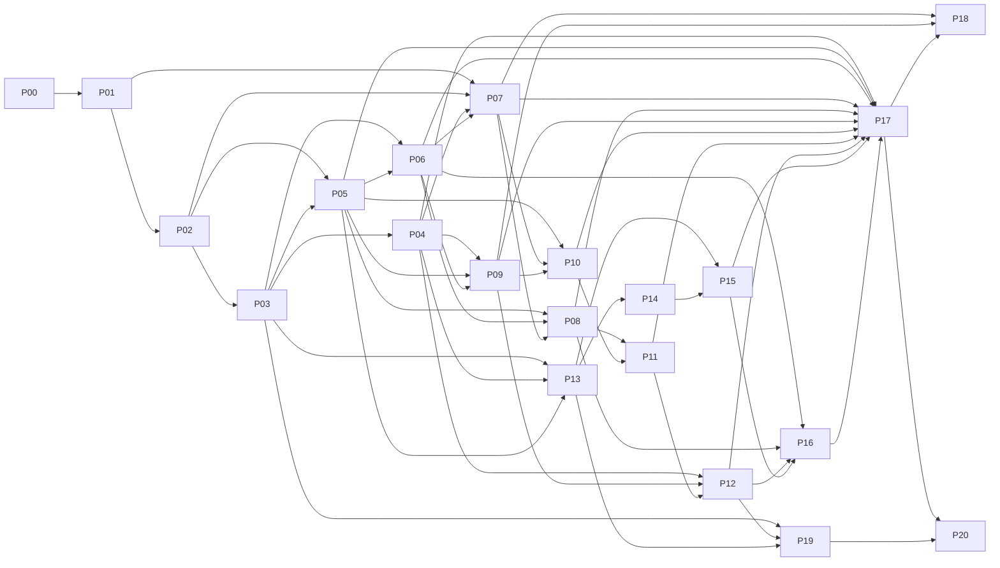

# Wuji vNext Implementation Plan · 第二轮审订版

> **供实施 Agent：**按任务逐项实现、测试和评审；执行时可使用 superpowers:executing-plans 或 subagent-driven-development。它们不是产品依赖。本文修改的是设计合同，不授权自动生产变更。

**Goal：**退出 Cairn 执行内核，交付可控制 MAF Worker、支持 Agent 提炼知识的黑板、自有持久调度和 React Flow 画布。  
**Architecture：**ClaimRevision 保存断言正文，Fact 为版本化评估读视图；Wuji 控制身份/工作/结果，MAF 执行单项 Agent；原始证据、会话与投影各有独立持久边界。  
**Tech Stack：**Python/FastAPI/PostgreSQL/uv、Python MAF；React/Ant Design/@xyflow/react、pnpm、Vitest/Playwright。旧版本号仅作为来源，P00/P01按真实本地环境与发行物锁定。  
**Spec：**[SPEC.md](SPEC.md) `2.0-review`；接口枚举见 `contracts.json`，验收见 [ACCEPTANCE.md](ACCEPTANCE.md)。  
**状态：**产品代码未实施，下面命令是未来步骤，不是本轮执行结果。

## 全局约束

Agent可提出candidate_fact但不能自行写FactAssessment或伪造Observation。未验证Claim可驱动受控探索；权限/Goal判据独立。新运行链无Cairn/Pi依赖；保留历史但不自动续跑。所有操作未知先核对，Session恢复不等于副作用回滚。UI状态与布局无业务权威。当前任务停止与全局暂停分别保存，不允许自动复活。真实SDK/数据库/浏览器的通过证据不能用布尔自报或语法检查代替。任何收费、真实环境切换与数据删除另行批准。

## 分阶段交付

- G0：P00–P02固定来源、依赖和合同；P01仅证明实际SDK能力探针，不代表产品已恢复。
- G1/G2：P03–P12构建领域、受控Worker、审批/会话和故障边界；P01不允许绕过核心审批要求。
- G3：P13–P16完成受权画布、流和数据治理。
- G4：P17/P19/P20验证新闭环、归档与无旧运行依赖；P20实际切换仍需单独授权。
- G5：P18提供效果测量工具；真实模型/场景/生产结果各自评估，未运行标not_run。

## 文件与接口约定

新核心路径 `packages/wuji-core/src/wuji_core/`，MAF适配 `packages/maf-worker/src/wuji_maf_worker/`；外部合同只在 `packages/contracts/openapi-v2.yaml` 维护并生成类型。vnext为新测试数据库schema，不改旧库权限/迁移head。用户本地同名画布由P00核对。新Supervisor先独立文件，切换时再移除旧入口，禁止开发一半就改旧生产启动器。

## 测试底座不得模拟被测结论

`api_client`调用实际ASGI路由与认证；`db_conn`是每例独立、真实PostgreSQL连接；`test_tokens`由测试身份服务签名并通过正常验证。对象服务fixture执行真实临时磁盘/受限对象存储；模型夹具仅脚本化模型响应并记录请求。Supervisor harness启动真实无害子进程。除这些边界外不mock Committer/权限/状态机/持久化。

本文的代表性代码用于固定一个核心断言，依赖各任务新建的代码。它们不是当前旧仓库可直接运行的测试，也不单独证明全部AC通过。完整AC包含真实状态读回、正向路径和故障反例；每项必须登记实际 test_name。

## 每个实现任务的操作顺序

1. 根据本任务代码与关联AC增加失败用例；确认失败来自目标行为缺失，环境错误另记。
2. 实现下述具体合同；测试驱动器不得提供与产品同名的假业务实现。
3. 跑该用例及AC中的正/反向和故障路径；保存真实SQL/请求/进程/文件观察。
4. 重跑直接依赖模块和合同生成检查；更新AC→test_name，不将局部通过推广为端到端通过。
5. 单独评审后提交本任务明确文件，不使用无范围 git add 或自动覆盖用户改动。

这些步骤是任务内流程，下面列出的端口、文件、最小实现和测试具有独立验收出口。

## 任务依赖




<a id="P00"></a>
## P00 · 核对实际基线与变更授权

**依赖：**无。**验收：**AC-001, AC-072。

**文件（目标路径）：**
- `docs/vnext/implementation-baseline.md`
- `docs/vnext/decision-register.md`

**输入/输出接口：**输入：本包 source 原件、用户实际仓库和只读部署清单。产出：BaselineRecord（HEAD、未提交差异、实际依赖、TopologyFlowCanvas位置、历史运行状态、批准范围）。

**最小实现与边界：**只读核查本地HEAD、工作区、现有画布props及新旧迁移头；将“用户确定技术路线”与“批准停机/付费/删除”分开。旧公开SHA只列为历史参考。核对原稿中五场景、主题、Task主体等要求，不把不相关重写塞进本轮。

**代表性检查：**
```bash
git status --short
git rev-parse HEAD
git ls-files '*TopologyFlowCanvas*'
git grep -n '@xyflow/react'
```

**测试说明：**grep无匹配的退出码1表示未发现，不能据此断言本地没有未跟踪组件。此任务只产出基线记录。

- [ ] 对应 AC 的所有正向、反例和故障路径已实现并登记 test_name。
- [ ] 真实命令、退出码、输入摘要、观察回执和未测项已保存。
- [ ] 合同与相邻模块回归通过并单独评审；尚未完成项保持 fail/not_run/blocked。


<a id="P01"></a>
## P01 · 隔离依赖与真实 MAF 公开能力探针

**依赖：**P00。**验收：**AC-002, AC-003, AC-004, AC-037, AC-040。

**文件（目标路径）：**
- `packages/wuji-core/pyproject.toml`
- `packages/maf-worker/pyproject.toml`
- `scripts/vnext/probe_maf.py`
- `tests/vnext/test_dependency_probe.py`
- `docs/vnext/capability-record.json`

**输入/输出接口：**输入：BaselineRecord。产出：CapabilityRecord（发行包/lock摘要、inspect签名、SDK运行原始记录、工具广告表、支持/不支持的边界）；不产出虚构的 sdk_was_real 布尔证明。

**最小实现与边界：**先安装隔离的已发布包，记录发行文件与传递依赖，不用移动main替代发布锁。通过真实SDK+合成服务验证函数往返、默认工具配置、Session导出/恢复和审批返回。探针对审批跨进程所需状态做可行性验证，完整持久产品合同由P08/P11完成。核心公开API不满足时阻断而非私有补丁。

**代表性检查：**
```python
from importlib.metadata import distribution
import inspect
from agent_framework import create_harness_agent

def test_factory_is_from_installed_distribution():
    dist = distribution("agent-framework-core")
    assert dist.version
    assert dist.files
    assert "client" in inspect.signature(create_harness_agent).parameters
```

**测试说明：**这段只验证安装与签名。必须另附真实模型请求/函数计数/Session往返记录才能通过AC-003，不能以此smoke代替。

**本任务命令：**
```bash
./scripts/uv.sh run --frozen pytest tests/vnext/test_dependency_probe.py -q
```

- [ ] 对应 AC 的所有正向、反例和故障路径已实现并登记 test_name。
- [ ] 真实命令、退出码、输入摘要、观察回执和未测项已保存。
- [ ] 合同与相邻模块回归通过并单独评审；尚未完成项保持 fail/not_run/blocked。


<a id="P02"></a>
## P02 · 版本化合同与可审计测试底座

**依赖：**P01。**验收：**AC-019, AC-075。

**文件（目标路径）：**
- `packages/wuji-core/src/wuji_core/contracts/knowledge.py`
- `packages/wuji-core/src/wuji_core/contracts/execution.py`
- `packages/wuji-core/src/wuji_core/contracts/envelopes.py`
- `packages/wuji-core/src/wuji_core/contracts/views.py`
- `packages/contracts/openapi-v2.yaml`
- `scripts/vnext/generate_contracts.py`
- `tests/vnext/conftest.py`
- `tests/vnext/test_contract_shapes.py`
- `tests/vnext/support/http_capture.py`
- `tests/vnext/support/identity_provider.py`

**输入/输出接口：**输入：Spec S03–S13、contracts.json和examples。产出：ClaimProposal、ResultEnvelope、RunIdentity、ViewEventBatch及各枚举；OpenAPI生成Python/TS的明确产物；测试夹具只管理真实连接和身份，不实现被测业务。

**最小实现与边界：**把本包required字段与枚举转为完整JSON/OpenAPI schema，禁止额外权威字段。生成脚本明确输出packages/contracts/src/v2/generated.ts和验证模型，更新contracts:check:v2。定义api_client为真实ASGI测试客户端、db_conn为独立PostgreSQL连接、test_tokens为独立签名身份服务生成的令牌；禁止测试专用“跳过权限”生产开关。测试清单显式包含tests/vnext与Node/browser路径。

**代表性检查：**
```python
import pytest
from pydantic import ValidationError
from wuji_core.contracts.knowledge import ClaimProposal

def test_candidate_cannot_supply_its_assessment():
    payload = {"client_ref":"c1", "kind":"observation-summary",
               "assertion_role":"candidate_fact", "text":"version 为 17",
               "basis_refs":[], "limitations":[], "evidence_state":"supported"}
    with pytest.raises(ValidationError):
        ClaimProposal.model_validate(payload)
```

**测试说明：**fixture均需记录实际请求/SQL/签名主体，不提供 world.send 任意操作字符串解释器；P17从实际测试清单收集结果。

**本任务命令：**
```bash
./scripts/uv.sh run --frozen pytest tests/vnext/test_contract_shapes.py -q
```

- [ ] 对应 AC 的所有正向、反例和故障路径已实现并登记 test_name。
- [ ] 真实命令、退出码、输入摘要、观察回执和未测项已保存。
- [ ] 合同与相邻模块回归通过并单独评审；尚未完成项保持 fail/not_run/blocked。


<a id="P03"></a>
## P03 · PostgreSQL领域版本与独立原始证据

**依赖：**P02。**验收：**AC-008, AC-011, AC-012, AC-013, AC-016, AC-054, AC-065, AC-066。

**文件（目标路径）：**
- `packages/wuji-core/src/wuji_core/persistence/schema.py`
- `packages/wuji-core/src/wuji_core/persistence/uow.py`
- `packages/wuji-core/src/wuji_core/persistence/snapshots.py`
- `packages/wuji-core/src/wuji_core/evidence/artifacts.py`
- `packages/wuji-core/src/wuji_core/evidence/observations.py`
- `tests/vnext/test_capture_transactions.py`
- `tests/vnext/test_rls.py`
- `ops/vnext/migrations/README.md`

**输入/输出接口：**输入：CaptureEnvelope/KnowledgeRef。产出：EvidenceService.ingest(authenticated_collector,envelope)->EvidenceReceipt；SnapshotRepository.create(task_id,access)->SnapshotManifest；新独立迁移head。

**最小实现与边界：**创建claim_revision/observation/artifact/assessment/entity_revision_registry、Task聚合计数与Outbox；确保复合FK和原子registry写。采集先封存真实字节，再登记Observation；没有抽取器时也成功。用非owner无BYPASSRLS应用角色和真实两连接测试；RR快照必须持久manifest，不能保持跨HTTP长事务。

**代表性检查：**
```python
def test_agent_cannot_use_capture_endpoint(api_client, test_tokens, capture_envelope, db_conn):
    response = api_client.post("/internal/v2/evidence", json=capture_envelope,
                               headers={"Authorization": "Bearer " + test_tokens.agent})
    assert response.status_code == 403
    assert response.json()["code"] == "FORBIDDEN_COLLECTOR"
    count = db_conn.execute("SELECT count(*) FROM vnext.observation").fetchone()[0]
    assert count == 0
```

**测试说明：**capture_envelope由真实夹具字节和摘要构成；本测试独立空数据库。另测合法collector正向入账、重复/冲突、partial内容和GC提交租约。

**本任务命令：**
```bash
./scripts/uv.sh run --frozen pytest tests/vnext/test_capture_transactions.py -q
```

- [ ] 对应 AC 的所有正向、反例和故障路径已实现并登记 test_name。
- [ ] 真实命令、退出码、输入摘要、观察回执和未测项已保存。
- [ ] 合同与相邻模块回归通过并单独评审；尚未完成项保持 fail/not_run/blocked。


<a id="P04"></a>
## P04 · 候选知识、Fact视图与版本化评估

**依赖：**P03。**验收：**AC-005, AC-006, AC-007, AC-009, AC-010, AC-011, AC-012, AC-014, AC-016, AC-017。

**文件（目标路径）：**
- `packages/wuji-core/src/wuji_core/blackboard/claims.py`
- `packages/wuji-core/src/wuji_core/blackboard/assessments.py`
- `packages/wuji-core/src/wuji_core/blackboard/fact_view.py`
- `packages/wuji-core/src/wuji_core/blackboard/relations.py`
- `packages/wuji-core/src/wuji_core/blackboard/committer.py`
- `tests/vnext/test_knowledge_admission.py`

**输入/输出接口：**输入：ClaimProposal、ResultEnvelope、FactAssessment。产出：ClaimService.propose(...)->ComponentReceipt；AssessmentService.record(...)->AssessmentReceipt；fact_view_eligible(claim_kind,grounding,evidence,applicability,method)->bool。

**最小实现与边界：**先实现Agent候选正向共享，ClaimRevision只有一份正文；FactLedger为评估视图，不另写Fact正文。实现引用存在/内容支持/适用性独立检查；模型review保留意见，不自升等级。支持无解析器文本、未验证假设驱动Intent；按版本追加，反证/环境变化失效相关评估，旧关系不迁移新版本。

**代表性检查：**
```python
from wuji_core.blackboard.fact_view import fact_view_eligible

def test_origin_of_words_does_not_decide_fact_status():
    assert fact_view_eligible("observation-summary", "content_checked",
                              "supported", "current", "deterministic")
    assert not fact_view_eligible("observation-summary", "linked",
                                  "unassessed", "current", "model_review")
```

**测试说明：**此纯规则接口刻意不把producer=agent当拒绝原因。AC-005必须通过实际API创建候选、独立重读证据后查投影视图，不能仅用该布尔单测证明接纳链。

**本任务命令：**
```bash
./scripts/uv.sh run --frozen pytest tests/vnext/test_knowledge_admission.py -q
```

- [ ] 对应 AC 的所有正向、反例和故障路径已实现并登记 test_name。
- [ ] 真实命令、退出码、输入摘要、观察回执和未测项已保存。
- [ ] 合同与相邻模块回归通过并单独评审；尚未完成项保持 fail/not_run/blocked。


<a id="P05"></a>
## P05 · WorkItem/Run控制状态与依赖守卫

**依赖：**P02, P03。**验收：**AC-008, AC-015, AC-018, AC-019, AC-020, AC-021, AC-022, AC-023, AC-033, AC-034, AC-035, AC-052。

**文件（目标路径）：**
- `packages/wuji-core/src/wuji_core/execution/states.py`
- `packages/wuji-core/src/wuji_core/execution/control.py`
- `packages/wuji-core/src/wuji_core/execution/dependencies.py`
- `packages/wuji-core/src/wuji_core/execution/capacity.py`
- `tests/vnext/test_work_state_guards.py`

**输入/输出接口：**输入：固定枚举、控制命令、观察回执。产出：can_settle_done(result_accepted,process_exited,operations_settled)->bool；ControlService.apply(command)->CommandReceipt；WorkDependency固定条件。

**最小实现与边界：**实现所有S05转移，initial ready未start不得派发；结果accepted不释放进程容量。Work desired与suspension_causes分开；Task pause只增加task_pause，resume不解除user_hold。依赖按settled/accepted_result/criterion判定，取消和失败不当成功。单事务循环检查防并发成环。

**代表性检查：**
```python
from wuji_core.execution.states import can_settle_done

def test_accepted_result_is_not_process_exit():
    assert not can_settle_done(True, False, True)
    assert not can_settle_done(True, True, False)
    assert can_settle_done(True, True, True)
```

**测试说明：**真实进程与数据库联动在P10/P11；该纯函数单测只证明规则。必须枚举hold/pause嵌套、input未答和未定义superseded状态。

**本任务命令：**
```bash
./scripts/uv.sh run --frozen pytest tests/vnext/test_work_state_guards.py -q
```

- [ ] 对应 AC 的所有正向、反例和故障路径已实现并登记 test_name。
- [ ] 真实命令、退出码、输入摘要、观察回执和未测项已保存。
- [ ] 合同与相邻模块回归通过并单独评审；尚未完成项保持 fail/not_run/blocked。


<a id="P06"></a>
## P06 · 模型/工具准入与累计账本

**依赖：**P03, P05。**验收：**AC-025, AC-032, AC-036, AC-044, AC-045, AC-068。

**文件（目标路径）：**
- `packages/wuji-core/src/wuji_core/admission/models.py`
- `packages/wuji-core/src/wuji_core/admission/tools.py`
- `packages/wuji-core/src/wuji_core/admission/ledger.py`
- `services/execution-control/v2_model_gate.py`
- `services/execution-control/v2_tool_gate.py`
- `tests/vnext/test_run_admission.py`

**输入/输出接口：**输入：RunIdentity、冻结Profile、当前控制状态。产出：ModelAdmission.authorize(...)->ModelPermit；ToolAdmission.authorize(...)->ToolPermit；ModelCall/ToolCall/ToolAttempt账本。

**最小实现与边界：**只持Run凭据到Worker，Task网关Key留准入层。维护模型发送/响应/费用分轴，隐式重试明确关闭或计额。工具身份跨恢复稳定，同operation同摘要回执、不同摘要409；新ID同参数是新操作。函数/MCP共用服务端策略；工具结果在Fact抽取前可返回。

**代表性检查：**
```python
def test_revoked_run_cannot_request_model(api_client, test_tokens, revoked_run_request, model_capture):
    before = len(model_capture.requests)
    response = api_client.post("/internal/v2/model/chat/completions",
        json=revoked_run_request, headers={"Authorization":"Bearer " + test_tokens.revoked_run})
    assert response.status_code == 409
    assert response.json()["code"] == "STALE_EXECUTION"
    assert len(model_capture.requests) == before
```

**测试说明：**model/chat/completions为薄准入协议入口，P02将其纳入完整合同；本例只观测受控模型夹具，不访问真实Provider。

**本任务命令：**
```bash
./scripts/uv.sh run --frozen pytest tests/vnext/test_run_admission.py -q
```

- [ ] 对应 AC 的所有正向、反例和故障路径已实现并登记 test_name。
- [ ] 真实命令、退出码、输入摘要、观察回执和未测项已保存。
- [ ] 合同与相邻模块回归通过并单独评审；尚未完成项保持 fail/not_run/blocked。


<a id="P07"></a>
## P07 · MAF Worker与受限上下文工厂

**依赖：**P01, P02, P04, P06。**验收：**AC-003, AC-036, AC-037, AC-043。

**文件（目标路径）：**
- `packages/maf-worker/src/wuji_maf_worker/factory.py`
- `packages/maf-worker/src/wuji_maf_worker/runtime.py`
- `packages/maf-worker/src/wuji_maf_worker/context.py`
- `packages/maf-worker/src/wuji_maf_worker/tools.py`
- `packages/maf-worker/src/wuji_maf_worker/entrypoint.py`
- `tests/vnext/test_maf_runtime.py`

**输入/输出接口：**输入：WorkerAssignment/ContextBundle。产出：AgentRuntimePort.execute/cancel/deliver_input；build_context_bundle(records,read_set)->ContextBundle；SDK原始观测证据。

**最小实现与边界：**将MAF类型限制在适配包，按Reason/Explore/Report配置公开factory。以实际工具广告表和真实函数执行确认默认工具裁剪。Context保留反证/来源/状态；有限模型循环与输出体积。Worker自己消费stream，与UI断开无关。应用不得实现第二套工具循环或修改SDK私有函数。

**代表性检查：**
```python
def test_sdk_advertises_only_profile_tools(maf_invocation, published_profile, model_capture, tool_capture):
    maf_invocation.run(published_profile.profile_id)
    advertised = {t["function"]["name"] for req in model_capture.requests
                  for t in req.get("tools", [])}
    assert advertised
    assert "read_record" in advertised
    assert advertised <= set(published_profile.tool_names)
    assert tool_capture.count("read_record") == 1
    assert len(model_capture.requests) >= 2
```

**测试说明：**published_profile从独立发布配置读取，不从本次advertised反向生成白名单；原生Todo工具名由P01实际SDK核验后固定到配置，不猜测框架工具名。真实工具表非空且实际调用read_record，避免空集合测试通过。

**本任务命令：**
```bash
./scripts/uv.sh run --frozen pytest tests/vnext/test_maf_runtime.py -q
```

- [ ] 对应 AC 的所有正向、反例和故障路径已实现并登记 test_name。
- [ ] 真实命令、退出码、输入摘要、观察回执和未测项已保存。
- [ ] 合同与相邻模块回归通过并单独评审；尚未完成项保持 fail/not_run/blocked。


<a id="P08"></a>
## P08 · SessionManifest与指定调用审批

**依赖：**P05, P06, P07。**验收：**AC-023, AC-035, AC-038, AC-039, AC-040, AC-041, AC-042, AC-043, AC-066。

**文件（目标路径）：**
- `packages/maf-worker/src/wuji_maf_worker/sessions.py`
- `packages/maf-worker/src/wuji_maf_worker/history.py`
- `packages/maf-worker/src/wuji_maf_worker/approvals.py`
- `packages/wuji-core/src/wuji_core/execution/inputs.py`
- `packages/wuji-core/src/wuji_core/execution/approvals.py`
- `tests/vnext/test_session_approval.py`

**输入/输出接口：**输入：SDK序列化数据、原生待批调用、可信持久对象。产出：SessionRepository.publish(manifest,expected_revision)->SessionReceipt；ApprovalService.decide(...)/bind_operation(...)->ApprovalReceipt。

**最小实现与边界：**完整history/state/memory固定版本后CAS；检测半提交和单写者。真实原生审批返回后退出Run，重启同工作可批准/拒绝原调用。批准消费与唯一ToolOperation+Outbox同一事务，恢复沿用逻辑call身份。pending input不是模型可伪造控制标志。

**代表性检查：**
```python
def test_partial_manifest_does_not_mix_new_memory(session_repository, complete_manifest, staged_manifest):
    first = session_repository.publish(complete_manifest, expected_revision=0)
    session_repository.stage_objects(staged_manifest)
    restored = session_repository.load_published(first.session_id)
    assert restored.checkpoint_revision == first.checkpoint_revision
    assert restored.memory_manifest_ref == complete_manifest.memory_manifest_ref
    assert restored.history_root == complete_manifest.history_root
```

**测试说明：**session_repository为真实持久实现fixture，stage_objects不发布manifest。另须真实SDK跨进程审批与ToolOperation故障事务测试，不把revision不变单断言当完整恢复证据。

**本任务命令：**
```bash
./scripts/uv.sh run --frozen pytest tests/vnext/test_session_approval.py -q
```

- [ ] 对应 AC 的所有正向、反例和故障路径已实现并登记 test_name。
- [ ] 真实命令、退出码、输入摘要、观察回执和未测项已保存。
- [ ] 合同与相邻模块回归通过并单独评审；尚未完成项保持 fail/not_run/blocked。


<a id="P09"></a>
## P09 · 持久Scheduler、generation与等待

**依赖：**P04, P05, P06。**验收：**AC-007, AC-015, AC-018, AC-024, AC-025, AC-026, AC-027, AC-028, AC-029。

**文件（目标路径）：**
- `packages/wuji-core/src/wuji_core/scheduling/policy.py`
- `packages/wuji-core/src/wuji_core/scheduling/triggers.py`
- `packages/wuji-core/src/wuji_core/scheduling/waiters.py`
- `packages/wuji-core/src/wuji_core/scheduling/claims.py`
- `services/wuji-scheduler/main.py`
- `tests/vnext/test_scheduler_generations.py`

**输入/输出接口：**输入：候选WorkItem、SchedulingSnapshot和真实容量。产出：SchedulerPolicy.select(...)->SelectionProposal[]；TriggerRepository.record/consume；Scheduler.tick()->TickReceipt。

**最小实现与边界：**纯策略不授予permit；原子准入重验全局/租户/Task容量。触发独立generation防同board_revision漏依赖事件，领取/结算水位分离；wait登记与谓词检查原子，避免丢唤醒。Reason自建Intent不立即自触发；有限失败重试、精确key与有限hard limits防无限运行。

**代表性检查：**
```python
def test_new_trigger_survives_inflight_reason(trigger_repository, task_id):
    first = trigger_repository.record(task_id, "input_received")
    lease = trigger_repository.begin_reason(task_id)
    second = trigger_repository.record(task_id, "dependency_settled")
    trigger_repository.consume(task_id, lease.processing_generation)
    state = trigger_repository.read(task_id)
    assert first < second
    assert state.pending_generation == second
    assert state.consumed_generation < second
```

**测试说明：**repository使用真实DB。必须另以两连接并发容量、依赖环、事件先到/后到顺序验证；进展规则不得依靠模型声明new_info。

**本任务命令：**
```bash
./scripts/uv.sh run --frozen pytest tests/vnext/test_scheduler_generations.py -q
```

- [ ] 对应 AC 的所有正向、反例和故障路径已实现并登记 test_name。
- [ ] 真实命令、退出码、输入摘要、观察回执和未测项已保存。
- [ ] 合同与相邻模块回归通过并单独评审；尚未完成项保持 fail/not_run/blocked。


<a id="P10"></a>
## P10 · 新Supervisor、Outbox与prepared故障窗口

**依赖：**P05, P07, P09。**验收：**AC-020, AC-030, AC-031, AC-032。

**文件（目标路径）：**
- `services/maf-supervisor/main.mjs`
- `packages/wuji-core/src/wuji_core/execution/dispatch_outbox.py`
- `packages/wuji-core/src/wuji_core/execution/reconcile.py`
- `tests/task-workers/maf-supervisor.test.mjs`
- `tests/vnext/test_dispatch_crash_windows.py`

**输入/输出接口：**输入：稳定start_operation与RunIdentity。产出：Supervisor PUT/control/query回执；Reconciler.inspect(run)->ObservedExecution。新文件独立，不提前改旧生产Supervisor。

**最小实现与边界：**持久prepared后spawn，再running回执。覆盖prepared前、prepared后spawn前、spawn后running前、running后响应前四窗口；不明则unknown禁止重启同操作。真实无害子进程记录出生/退出和独立计数，不能用PID存在当所有权。撤销后仍可能在运行则占容量/资源。

**代表性检查：**
```python
def test_ambiguous_spawn_window_is_not_replayed(supervisor_harness):
    op = supervisor_harness.prepare_record_reader()
    supervisor_harness.fail_once("after_spawn_before_running_receipt")
    supervisor_harness.start(op)
    supervisor_harness.restart_receiver()
    receipt = supervisor_harness.query(op.operation_id)
    assert receipt.state in {"running", "exited", "unknown"}
    supervisor_harness.redeliver(op)
    assert supervisor_harness.actual_start_count(op.operation_id) <= 1
```

**测试说明：**harness管理真实独立Node进程与无害子进程，count读文件或可信进程回执，不由模拟返回。额外执行 node --test tests/task-workers/maf-supervisor.test.mjs。

**本任务命令：**
```bash
./scripts/uv.sh run --frozen pytest tests/vnext/test_dispatch_crash_windows.py -q
node --test tests/task-workers/maf-supervisor.test.mjs
```

- [ ] 对应 AC 的所有正向、反例和故障路径已实现并登记 test_name。
- [ ] 真实命令、退出码、输入摘要、观察回执和未测项已保存。
- [ ] 合同与相邻模块回归通过并单独评审；尚未完成项保持 fail/not_run/blocked。


<a id="P11"></a>
## P11 · 控制操作、恢复和失败域联调

**依赖：**P08, P10。**验收：**AC-021, AC-022, AC-023, AC-032, AC-040, AC-041, AC-042, AC-044, AC-046, AC-049。

**文件（目标路径）：**
- `packages/wuji-core/src/wuji_core/execution/control_api.py`
- `apps/api/src/wuji_api/v2/commands.py`
- `apps/api/src/wuji_api/v2/approvals.py`
- `tests/vnext/test_control_integration.py`

**输入/输出接口：**输入：Task/Work控制命令、ApprovalDecision。产出：真实暂停/恢复/取消回执与被限定失败域的Incident；API路由符合Spec。

**最小实现与边界：**联通hold→撤销→停止核对，不因tick重新ready。Task.pause保持工作原desired与wait，resume只解除task_pause。费用unknown不一概锁住全部资源；副作用unknown仍核对。真实审批消费、跨Run移交与当前版本授权重验，旧结果可historical_only。

**代表性检查：**
```python
def test_task_resume_preserves_work_hold(control_service, task_with_held_work):
    task, work = task_with_held_work
    control_service.pause_task(task.id)
    control_service.resume_task(task.id)
    current = control_service.read_work(work.id)
    assert current.desired_state == "hold"
    assert "user_hold" in current.suspension_causes
    assert current.state == "suspended"
```

**测试说明：**fixture通过真实API/数据库建立状态，不直接mockread返回。取消接受与进程退出必须分别观测，不能仅看HTTP状态。

**本任务命令：**
```bash
./scripts/uv.sh run --frozen pytest tests/vnext/test_control_integration.py -q
```

- [ ] 对应 AC 的所有正向、反例和故障路径已实现并登记 test_name。
- [ ] 真实命令、退出码、输入摘要、观察回执和未测项已保存。
- [ ] 合同与相邻模块回归通过并单独评审；尚未完成项保持 fail/not_run/blocked。


<a id="P12"></a>
## P12 · 可信完成评审、关闭与报告冻结

**依赖：**P04, P09, P11。**验收：**AC-007, AC-046, AC-047, AC-048, AC-049, AC-050, AC-051, AC-052, AC-053, AC-069。

**文件（目标路径）：**
- `packages/wuji-core/src/wuji_core/completion/criteria.py`
- `packages/wuji-core/src/wuji_core/completion/precheck.py`
- `packages/wuji-core/src/wuji_core/completion/settlement.py`
- `packages/wuji-core/src/wuji_core/completion/reports.py`
- `tests/vnext/test_completion_protocol.py`

**输入/输出接口：**输入：GoalContractRevision、CompletionProposal、当前证据/执行状态。产出：CompletionReview、CompletionEpoch、ReportCommit/ReportDelivery、AssessmentAmendment。

**最小实现与边界：**precheck在可信服务不绑定提出者Run，必要工作未完返回wait，不提前冻结。进入quiescing后新动作禁止但查询/上传/退出可结算，有界终止不要求付费总结。新反证使旧决定失效；abort-close保留user_hold。终态剩余工作cancelled+reason，结果轴独立，迟到反证补充报告不改原正文不重启。

**代表性检查：**
```python
def test_required_work_prevents_early_quiesce(completion_service, task_with_required_work):
    task = task_with_required_work
    review = completion_service.precheck(task.id)
    assert review.decision == "wait"
    assert completion_service.read_task(task.id).observed_state == "running"
```

**测试说明：**必须另用并发DB证明关闭最后校验不覆盖新反证；空Goal测试应通过持久Goal版本创建，不允许测试请求直接覆盖required列表。

**本任务命令：**
```bash
./scripts/uv.sh run --frozen pytest tests/vnext/test_completion_protocol.py -q
```

- [ ] 对应 AC 的所有正向、反例和故障路径已实现并登记 test_name。
- [ ] 真实命令、退出码、输入摘要、观察回执和未测项已保存。
- [ ] 合同与相邻模块回归通过并单独评审；尚未完成项保持 fail/not_run/blocked。


<a id="P13"></a>
## P13 · 受权图投影、持久快照与视图身份

**依赖：**P03, P04, P05。**验收：**AC-054, AC-055, AC-056, AC-059, AC-060, AC-063。

**文件（目标路径）：**
- `packages/wuji-core/src/wuji_core/projection/builder.py`
- `packages/wuji-core/src/wuji_core/projection/snapshots.py`
- `packages/wuji-core/src/wuji_core/projection/access.py`
- `apps/api/src/wuji_api/v2/topology.py`
- `tests/vnext/test_view_snapshots.py`

**输入/输出接口：**输入：SnapshotManifest、AccessContext、ViewQuery。产出：TopologySnapshot、固定revision节点/边、可回放历史快照目录；不输出内部task_event_seq。

**最小实现与边界：**Fact/Claim共用claim节点身份，评估只是display_kind；@revision端点不可迁移。保存真实snapshot状态/关系引用后分页。过滤节点、边、摘要及计数，派生内容默认继承严格权限。历史只列存在的manifest，未保存时间点返回明确错误；查询digest与权限绑定。

**代表性检查：**
```python
def test_fact_projection_keeps_statement_identity(project_claim, claim_v1, supported_assessment):
    before = project_claim(claim_v1, assessment=None)
    after = project_claim(claim_v1, assessment=supported_assessment)
    assert before.node_id == after.node_id
    assert before.display_kind == "claim"
    assert after.display_kind == "fact"
```

**测试说明：**project_claim是P13生成的纯投影函数fixture引用，不重写逻辑；真实权限和分页在API/DB用例运行。

**本任务命令：**
```bash
./scripts/uv.sh run --frozen pytest tests/vnext/test_view_snapshots.py -q
```

- [ ] 对应 AC 的所有正向、反例和故障路径已实现并登记 test_name。
- [ ] 真实命令、退出码、输入摘要、观察回执和未测项已保存。
- [ ] 合同与相邻模块回归通过并单独评审；尚未完成项保持 fail/not_run/blocked。


<a id="P14"></a>
## P14 · TopologyFlowCanvas与独立布局

**依赖：**P13。**验收：**AC-055, AC-056, AC-057, AC-058, AC-064。

**文件（目标路径）：**
- `apps/web/src/features/topology/TopologyFlowCanvas.tsx`
- `apps/web/src/features/topology/TopologyContainer.tsx`
- `apps/web/src/features/topology/toFlowElements.ts`
- `apps/web/src/features/topology/layout.ts`
- `apps/web/src/features/topology/TopologyListView.tsx`
- `tests/topology/projection.test.ts`
- `tests/topology/fixtures.ts`

**输入/输出接口：**输入：固定TopologySnapshot/LayoutPreference。产出：受控ReactFlow组件、toFlowElements、逻辑LayoutAnchor与revision布局、列表视图。

**最小实现与边界：**沿用用户组件或单一新建；受控nodes/edges，不自动fitView或覆盖pinned。禁用自由连接/重连与业务删除；稳定回调和完整节点类型。Fact角色变化不多出节点；新revision默认位置可继承但旧关系不迁移。五主题/键盘/列表均支持。

**代表性检查：**
```typescript
import { expect, test } from 'vitest';
import { toFlowElements } from '../../apps/web/src/features/topology/toFlowElements';
import { snapshot, layout } from './fixtures';
test('layout edits preserve business references', () => {
  const a = toFlowElements(snapshot, layout);
  const b = toFlowElements(snapshot, { ...layout, positions: {} });
  expect(b.nodes.map(n => n.id)).toEqual(a.nodes.map(n => n.id));
  expect(b.nodes.map(n => n.data.ref)).toEqual(a.nodes.map(n => n.data.ref));
});
```

**测试说明：**若需ELK，先记录候选和实测后锁定；简单确定布局即可完成核心，不为UI选择重构后端。

**本任务命令：**
```bash
pnpm exec vitest run tests/topology/projection.test.ts
pnpm --filter @wuji/web typecheck
pnpm --filter @wuji/web build
```

- [ ] 对应 AC 的所有正向、反例和故障路径已实现并登记 test_name。
- [ ] 真实命令、退出码、输入摘要、观察回执和未测项已保存。
- [ ] 合同与相邻模块回归通过并单独评审；尚未完成项保持 fail/not_run/blocked。


<a id="P15"></a>
## P15 · ViewStream、重连、历史与浏览器验证

**依赖：**P13, P14。**验收：**AC-058, AC-060, AC-061, AC-062, AC-063, AC-064。

**文件（目标路径）：**
- `packages/wuji-core/src/wuji_core/projection/view_stream.py`
- `apps/web/src/features/topology/topologyReducer.ts`
- `apps/web/src/features/topology/useTopologyStream.ts`
- `apps/web/src/features/topology/panels/RecordPanel.tsx`
- `tests/topology/view-stream.test.ts`
- `tests/e2e/topology/topology.spec.ts`
- `playwright.vnext.config.ts`

**输入/输出接口：**输入：ViewStreamSpec、受权快照、内部Outbox。产出：外部ViewEventBatch、applyViewBatch、当前/历史查询隔离和浏览器证据。

**最小实现与边界：**外部view_revision只随可见数据变化；不发送全局空白水位批。cursor不透明绑定query/access/view；视图切换/权限变更关闭旧流，丢流reset。整批原子应用、缺base resync、BigInt安全比较。历史视图不执行，新数据不影响已保存历史。

**代表性检查：**
```typescript
import { expect, test } from 'vitest';
import { applyViewBatch } from '../../apps/web/src/features/topology/topologyReducer';
import { stateA, batchFromB } from './fixtures';
test('another query stream cannot mutate this view', () => {
  const next = applyViewBatch(stateA, batchFromB);
  expect(next.state).toEqual(stateA);
  expect(next.reason).toBe('VIEW_MISMATCH');
});
```

**测试说明：**真实浏览器测试包含隐藏事件流量、权限变化、duplicate/gap、大水位、两组规模、五主题和证据面板。目标p95不是事先通过。

**本任务命令：**
```bash
pnpm exec vitest run tests/topology/view-stream.test.ts
pnpm --filter @wuji/web typecheck
pnpm --filter @wuji/web build
pnpm exec playwright test --config playwright.vnext.config.ts
```

- [ ] 对应 AC 的所有正向、反例和故障路径已实现并登记 test_name。
- [ ] 真实命令、退出码、输入摘要、观察回执和未测项已保存。
- [ ] 合同与相邻模块回归通过并单独评审；尚未完成项保持 fail/not_run/blocked。


<a id="P16"></a>
## P16 · 数据保留、衍生权限、交付与观测

**依赖：**P06, P08, P12, P15。**验收：**AC-053, AC-059, AC-065, AC-066, AC-067, AC-068, AC-069。

**文件（目标路径）：**
- `packages/wuji-core/src/wuji_core/audit/redaction.py`
- `packages/wuji-core/src/wuji_core/audit/retention.py`
- `packages/wuji-core/src/wuji_core/audit/delivery.py`
- `packages/maf-worker/src/wuji_maf_worker/telemetry.py`
- `tests/vnext/test_retention_and_delivery.py`

**输入/输出接口：**输入：DataRetentionProfile、Artifact引用、ReportCommit、访问政策。产出：GC/purge/tombstone、脱敏派生件审查、AuditRecord、Trace/Metric导出和ReportDelivery。

**最小实现与边界：**临时对象GC尊重提交租约；已发布引用不能普通回收，显式purge留下失效与报告提示。派生摘要不能自动降密；下载有TTL或可撤销网关。审计不可依赖Trace采样；Metric不默认用TaskID高基数标签。按媒介要求交付，缺必需资料明确incomplete。

**代表性检查：**
```python
def test_purge_leaves_an_explicit_evidence_tombstone(artifact_service, retained_artifact):
    artifact_service.purge(retained_artifact.id, reason="approved_retention_action")
    meta = artifact_service.read_metadata(retained_artifact.id)
    assert meta.state == "tombstoned"
    assert meta.content_available is False
    assert meta.purge_reason == "approved_retention_action"
```

**测试说明：**purge需具资格身份，测试只能无敏感夹具。另检引用报告是否显示缺失；仅对象404不足以证明审计闭环。

**本任务命令：**
```bash
./scripts/uv.sh run --frozen pytest tests/vnext/test_retention_and_delivery.py -q
```

- [ ] 对应 AC 的所有正向、反例和故障路径已实现并登记 test_name。
- [ ] 真实命令、退出码、输入摘要、观察回执和未测项已保存。
- [ ] 合同与相邻模块回归通过并单独评审；尚未完成项保持 fail/not_run/blocked。


<a id="P17"></a>
## P17 · 核心端到端与故障矩阵

**依赖：**P04, P05, P06, P07, P08, P09, P10, P11, P12, P15, P16。**验收：**AC-045, AC-070, AC-075。

**文件（目标路径）：**
- `scripts/vnext/run_acceptance.py`
- `tests/vnext/test_end_to_end.py`
- `tests/vnext/test_fault_matrix.py`
- `.github/workflows/vnext.yml`
- `docs/vnext/acceptance-results.md`

**输入/输出接口：**输入：所有AC定义、实际服务版本和夹具。产出：逐AC EvidenceResult与GateReport；空项/not_run/blocked不得计pass。

**最小实现与边界：**真实SDK、真实PG、真实受控Supervisor与工具读取，合成模型答案驱动多个正负路径：Agent候选→独立核验→Fact视图、假设→Intent、无Fact抽取、控制与完成、画布。注入prepared/spawn、半Session、结果提交丢响应、授权撤销、反证和旧流等故障。

**代表性检查：**
```python
def test_every_required_case_has_runtime_evidence(acceptance_report):
    required = acceptance_report.required_core_case_ids
    assert required
    assert set(required) <= set(acceptance_report.results)
    for case_id in required:
        result = acceptance_report.results[case_id]
        assert result.status == "pass", case_id
        assert result.command and result.exit_code == 0
        assert result.evidence_refs, case_id
```

**测试说明：**该汇总只验结果结构；测试结果必须从实际命令生成，不能手写pass。逐AC行为仍由对应模块测试证明，不能用汇总自身作为执行证据。

**本任务命令：**
```bash
./scripts/uv.sh run --frozen pytest tests/vnext/test_end_to_end.py -q
```

- [ ] 对应 AC 的所有正向、反例和故障路径已实现并登记 test_name。
- [ ] 真实命令、退出码、输入摘要、观察回执和未测项已保存。
- [ ] 合同与相邻模块回归通过并单独评审；尚未完成项保持 fail/not_run/blocked。


<a id="P18"></a>
## P18 · 真实效果评测工具与单Harness对照

**依赖：**P07, P09, P17。**验收：**AC-013, AC-070, AC-071。

**文件（目标路径）：**
- `scripts/vnext/run_evaluation.py`
- `tests/vnext/test_evaluation_accounting.py`
- `docs/vnext/evaluation-protocol.md`
- `packages/wuji-core/src/wuji_core/evaluation/accounting.py`

**输入/输出接口：**输入：受控数据集、明确计分规则、同模型/工具/预算；真实调用需批准。产出：EvaluationRun逐次结果、失败分类、费用/延迟与独立评分记录。

**最小实现与边界：**先离线验证评测运行器和预算汇总。A单Harness/B黑板配置都含相同总额度，B的Reason/摘要/核验计入。模型自述不计成功；重复试验保留每次结果，禁止只展示最佳一次。真实模型试验未批准标not_run，不阻断机制代码交付但阻断自主效果宣传。

**代表性检查：**
```python
from decimal import Decimal
from wuji_core.evaluation.accounting import total_cost

def test_reason_and_summary_are_part_of_total_budget():
    calls = [{"cost":"0.02", "role":"reason"},
             {"cost":"0.03", "role":"explore"},
             {"cost":"0.01", "role":"summary"}]
    assert total_cost(calls) == Decimal("0.06")
```

**测试说明：**实现路径同时新增 packages/wuji-core/src/wuji_core/evaluation/accounting.py；这里汇总网关已记录费用，不实现第二套单价计价器。

**本任务命令：**
```bash
./scripts/uv.sh run --frozen pytest tests/vnext/test_evaluation_accounting.py -q
```

- [ ] 对应 AC 的所有正向、反例和故障路径已实现并登记 test_name。
- [ ] 真实命令、退出码、输入摘要、观察回执和未测项已保存。
- [ ] 合同与相邻模块回归通过并单独评审；尚未完成项保持 fail/not_run/blocked。


<a id="P19"></a>
## P19 · 离线历史归档与切换演练

**依赖：**P03, P12, P13。**验收：**AC-013, AC-072, AC-073, AC-074。

**文件（目标路径）：**
- `scripts/vnext/export_legacy_readonly.py`
- `scripts/vnext/import_archive.py`
- `packages/wuji-core/src/wuji_core/archive/importer.py`
- `apps/api/src/wuji_api/v2/archives.py`
- `tests/vnext/test_archive_roundtrip.py`
- `docs/vnext/cutover-checklist.md`

**输入/输出接口：**输入：离线副本、原始ID和权限/产物manifest。产出：ArchiveImporter.import_archive(manifest)->ArchiveReceipt；归档查询无Cairn服务。

**最小实现与边界：**先只在副本开发dry-run，不停生产。新库独立head与旧库读取分开，读取SQLite归档不要求启动Cairn。保留LegacyClaim标签和原关系；后续有新核验可追加新评估但不改来源。真实切换须P20授权和旧执行核对。

**代表性检查：**
```python
def test_archive_import_does_not_create_executable_work(archive_importer, archive_manifest, db_conn):
    receipt = archive_importer.import_archive(archive_manifest)
    assert receipt.imported_records > 0
    count = db_conn.execute("SELECT count(*) FROM vnext.work_item WHERE source_archive_id=%s",
                            (receipt.archive_id,)).fetchone()[0]
    assert count == 0
```

**测试说明：**采用import_archive合法Python名称，不用v1文本中的ArchiveImporter.import。测试输入不可有活动身份或可用凭据。

**本任务命令：**
```bash
./scripts/uv.sh run --frozen pytest tests/vnext/test_archive_roundtrip.py -q
```

- [ ] 对应 AC 的所有正向、反例和故障路径已实现并登记 test_name。
- [ ] 真实命令、退出码、输入摘要、观察回执和未测项已保存。
- [ ] 合同与相邻模块回归通过并单独评审；尚未完成项保持 fail/not_run/blocked。


<a id="P20"></a>
## P20 · 新发布物、最终合同检查与显式切换

**依赖：**P17, P19。**验收：**AC-004, AC-074, AC-075。

**文件（目标路径）：**
- `scripts/vnext/assert_release_inventory.py`
- `scripts/vnext/check_all.sh`
- `ops/vnext/release.yaml`
- `tests/vnext/test_release_inventory.py`
- `docs/vnext/release-evidence.md`

**输入/输出接口：**输入：G0–G4实际证据、离线迁移演练、独立停机批准。产出：ReleaseEvidence、保留数据的切换回执；没有运行中legacy回退枚举。

**最小实现与边界：**扫描实际Python/npm传递依赖、镜像命令、Cairn挂载/读接口、健康检查与归档启动。新库和历史副本都验证。先停止并核对旧执行，再切入口；失败维护只读，不自动启动旧引擎。删除旧数据单独批准。最终文档标明哪些用户本地实现已复用与哪些Gate未运行。

**代表性检查：**
```python
def test_inventory_excludes_legacy_execution(release_inventory):
    assert "cairn" not in release_inventory.python_distributions
    assert "@mariozechner/pi-coding-agent" not in release_inventory.npm_packages
    assert not release_inventory.legacy_runtime_entrypoints
    assert not release_inventory.cairn_service_dependencies
    assert release_inventory.source_artifact_hashes
```

**测试说明：**inventory来自lock、镜像与部署清单实际解析，不可写死空集合。历史文档文字和离线SQLite导出本身不视为旧运行依赖。

**本任务命令：**
```bash
./scripts/uv.sh run --frozen pytest tests/vnext/test_release_inventory.py -q
bash scripts/vnext/check_all.sh
```

- [ ] 对应 AC 的所有正向、反例和故障路径已实现并登记 test_name。
- [ ] 真实命令、退出码、输入摘要、观察回执和未测项已保存。
- [ ] 合同与相邻模块回归通过并单独评审；尚未完成项保持 fail/not_run/blocked。


## 最终统一验证入口

P02新增合同生成和测试收集配置，P17实现 `scripts/vnext/check_all.sh`，P20验证其实际覆盖。建议脚本至少依次执行下列命令，任一失败即非通过；明确跳过某类环境的结果仍记not_run，不能exit 0后汇总全部pass。

```bash
./scripts/uv.sh sync --frozen
./scripts/uv.sh run --frozen pytest tests/vnext -q
node --test tests/task-workers/maf-supervisor.test.mjs
pnpm contracts:check:v2
pnpm exec vitest run tests/topology
pnpm --filter @wuji/web typecheck
pnpm --filter @wuji/web build
pnpm exec playwright test --config playwright.vnext.config.ts
./scripts/uv.sh run --frozen python scripts/vnext/assert_release_inventory.py
```

必须保存pytest实际collected清单，根旧testpaths不自动覆盖新目录；正式web构建不可被frontend spike构建替代。单独的v2合同命令必须真的调用生成器，不只在文档列出。集成成功后仍需保留实际MAF工具广告表、原生调用/审批回执、PG多连接竞态和真实Node退出证据。

## 不可自动化越过的决定

实际SDK能力不符：记录原始错误与受影响合同，阻断必要Gate；可选组件仅按Spec关闭。无法核对旧执行：停止切换，不删卷。用户本地有更新：回P00更新基线，不强行覆盖。真实效果未测：明确not_run，不以机制验收代替。源码更改不会自动批准付费和部署。

## v1任务与本版关系

本版不是在旧P00–P18上逐号追加。P03/P04重写知识与Fact；P05/06/08/10/11细分状态、准入、会话、进程与控制；P12重写完成；P13–P15重写受权视图；P18新增明确效果评估；P19/20将归档开发和生产切换分开。旧任务通过状态不继承。详细缺陷位置和覆盖见 REVIEW 与 AUDIT_COVERAGE。
