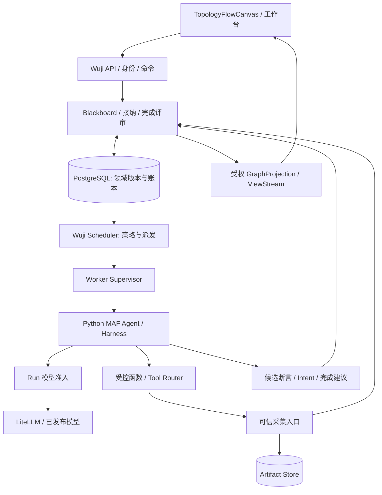
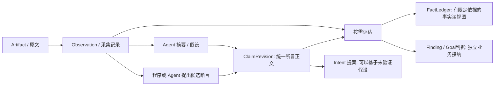
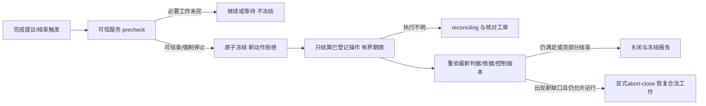

# Wuji vNext Spec · 第二轮审订版

**版本：2.0-review · 日期：2026-09-13**  
**状态：设计与实施依据，未实施、未部署、未证明真实任务效果。**  
**替代范围：**替代本包 `source/V1_SPEC.md`；不覆盖历史文件，不把新建议冒充原稿已有要求。配套：[Plan](PLAN.md)、[复审报告](REVIEW.md)、[验收合同](ACCEPTANCE.md)、[来源](SOURCES.md)、[改动记录](CHANGELOG.md)。

**2026-09-22 Session 增量替代：**新发布的 `wuji.harness.problem.v2` 明确使用 `wuji.session.native.v2`。MAF 原生 Session/History/Provider 是新会话消息权威；Wuji 只固定原生 state、Memory 依赖、操作 fence、CAS 与当前恢复许可。S09 中逐消息坐标、每次模型调用前完整 checkpoint、Provider 文本重建及 knowledge `attached` 依赖仅保留给旧 v1 会话。v2 只在 `run_return`/`approval_wait` 发布恢复点；原始结果与 `returned_to_framework` handoff 独立留存，checkpoint 失败不得触发模型重跑。旧数据不原地升级，未知 codec 拒绝。

本文保留用户已选路线：Wuji 自有 Blackboard / Scheduler，Python MAF Agent/Harness，基于 `@xyflow/react` 的 `TopologyFlowCanvas`，新系统不使用 Cairn Server/Dispatcher/黑板或 Pi/Claude Code CLI。现有独立身份、工具、主题、预算及运行环境在接口核验后可复用。“完全重构”不等于删除证据或重写所有独立业务模块。[U1/O1]

本版最关键的修订不是降低真实性要求，而是分开 **谁提出断言、如何保存依据、谁按什么标准接纳、接纳到什么适用范围**。新名称和行为是本版设计决定 [D]；框架能力依据标为 [E]；旧文档陈述标为 [O]，各自见 SOURCES。文档中的示例仅使用离线材料和受控夹具。

## S01 · 目标、范围与实施边界

### 1.1 三条执行边界

- Wuji 决定全局工作、授权、状态、证据接纳和结束；MAF 管单个 Agent 的模型—工具循环与会话。
- Blackboard 是领域记录的统一访问层，不是另一套可编辑的图数据库；画布、布局、执行队列不能成为知识权威。
- Artifact/Observation 记录实际捕获与来源；Agent 可以提炼候选事实和解释，不能伪造采集记录、回执或自行授予证据等级。

### 1.2 首个核心发布与后续能力

**核心重构必须具备：**候选知识共享、事实评估、单活动调度、持久工作与回执、有限 Agent 执行、显式审批、受支持边界的会话恢复、完成评审、React Flow 画布、只读历史导入和无 Cairn 干净启动。

**首批验证环境：**离线资料、固定代码/文档快照、自建封闭夹具。真实 MAF SDK 配合合成模型证明机制；授权真实模型的独立试验才可评价任务效果。CTF 等既有场景标签保留，但不因此宣布相应能力全部完成。[O1 §14]

**不作为核心前置条件：**向量数据库、图数据库、多活动 Scheduler、通用 DSL、后台自动派生无登记 Agent、任意外部工具、完整分布式持久执行、任意历史时间点回放。局部 MAF Workflow、ELK 布局、语义去重提示为可选扩展。

**核心不可降级项：**真实采集身份、权限检查、单工作控制、明确错误与未知状态、审批的指定调用绑定、结果/进程分别结算。不得用“不支持该 Profile”无限延期这些核心能力；若 MAF 公开接口不支持必须的审批/恢复合同，则 G1 阻断发布并列出需要修改的合同，而不是悄悄取消审批。

### 1.3 运行许可不是设计许可

本版未授权停机、删除数据、生产发布、收费调用或外部目标操作。历史工具链版本属于旧快照参考，不认定为当前本机版本。P00 记录实际代码/数据库/组件位置；P01 锁定经过真实包验证的组合。

## S02 · 逻辑架构与所有权

| 模块 | 唯一所有者 | 约束 |
|---|---|---|
| Task/Scope/Profile/审批 | Platform API + Control | 浏览器或模型不修改权威状态 |
| ClaimRevision/Observation/评估/关系 | Blackboard | 不复制一份可写 Fact 正文或 graph.nodes 真相 |
| WorkItem/Run/配额/触发 | Scheduler + Control | 纯策略选择，事务准入，执行端再检查 |
| MAF Agent/Session 内容 | MAF 适配层 | MAF 类型不泄漏为公开业务合同 |
| 进程、接收者、退出回执 | Supervisor | 不管理业务结论；PID 不是唯一执行身份 |
| Pod/环境代次 | Runtime Controller | 保留既有责任，不让 Agent 管基础设施 |
| 图投影/流/快照 | Projection 服务 | 可重建；必须有固定版本与权限边界 |
| 坐标/视口/固定节点 | 每用户 LayoutPreference | 不能改变证据或关系有效性 |
| 费用与 Task 金额预算 | LiteLLM | 平台调用额度不是第二套财务计价器 |

逻辑模块可位于同一 Python 服务；Scheduler 为独立入口，不依附 HTTP 请求或 SSE 连接。先保留一个活动实例，但凭持久 leader_epoch 和执行端检查防止重启后的旧进程继续派发。首版不声称多活动调度支持。

若沿用每 Task 的 agent/tool 双容器，同 Pod 网络共享；独立进程/卷不等于强网络隔离。可信采集应记录它实际看见的内容与采集点，不能将 Agent 可改写的工具程序输出签名后就称为外部事实真相。

## S03 · 知识语义：允许 Agent 提炼，不允许自我认证

### 3.1 不是七级强制流水线

**保留 ClaimRevision 作为所有可修订断言的唯一正文记录。** Agent 提出的候选事实也写 ClaimRevision，不再为相同文本分别维护 Fact 和 Claim 两个主表。FactLedger 是 `ClaimRevision + 有效 FactAssessment` 的读视图；Fact 仍可在画布上显示，但不拥有另一份正文。原 v1 独立 FactDraft/FactLedger 写入规则被此合同显式替代。

| 对象 | 内容 | 产生者 / 接纳者 |
|---|---|---|
| Origin | 用户提供的起点、附件、约束与来源 | 受权 Task 命令；不是已核验断言 |
| GoalContract | 原始目标文本和批准的可检验判据 | 用户/管理员确认版本 |
| Artifact | 捕获的字节或冻结产物 | 受信采集/导入流程；模型不能替换原字节 |
| Observation | 某采集主体在特定条件看到的记录 | 采集入口根据真实回执登记 |
| ClaimRevision | 候选事实、观察摘要、假设或推导 | Agent/人工/已发布程序均可提出 |
| FactAssessment | 对固定断言版本的内容、依据和适用范围的评估 | 版本化检查服务或具备资格的明确人审 |
| FactLedger | 当前满足事实展示政策的断言视图 | 无直接创建权限，来源仍显示 Agent/程序/人工 |
| VerificationRun | 一次核验活动及结果，不必是 Agent | 程序、人审；模型复核另标 model_review |
| FindingRevision | 业务接纳的结论与限制 | 领域评估服务；不等于所有事实的必经阶段 |

**例：**Agent 阅读记录后提出“文件 A 的版本字段是 17”。平台可重新核对 JSON Pointer、文件摘要和字段值，再将该候选列入 Fact 视图，保留 `producer_kind=agent`。这是正常路径，不因内容由模型首先提出就拒绝。

**反例：**Agent 从相同字段推出“两个系统行为完全相同”。引用存在只证明来源可找到，不证明推论成立。保存为 hypothesis/derived-conclusion，证据不足时仍可用于提出后续问题，不能自动成为已接纳事实或 Goal 达成依据。

### 3.2 ClaimRevision 最小载荷

`claim_id/revision`、Task 归属、`kind`、`assertion_role`、text、可选 structured_assertion、basis_refs、limitations、producer_kind、producer_ref、created_at、supersedes。

- kind 沿用 observation-summary / hypothesis / derived-conclusion。
- assertion_role = candidate_fact / explanation / hypothesis；只是内容意图，不是证据等级。
- producer_kind = agent / human / extractor / import。身份由可信上下文赋值。
- structured_assertion 可空；自然语言摘要不因缺少通用 predicate schema 被拒绝。没有可靠解析器时不强迫编造结构字段。
- basis_refs 可以为空以保存明确的猜想；引用不存在则拒绝该关系，保留原始提交和组件错误，不创建伪外键。无依据的记录明确显示“未关联证据”。
- Agent 可以提交候选 Fact，但请求内不接受 assessment/status/collector 身份等权威字段。`FactAssessment` 和采集入口的直接写入对 Agent 拒绝。

### 3.3 四个独立判断轴

| 轴 | 固定值 | 不可混同 |
|---|---|---|
| grounding_state | unchecked / linked / content_checked / invalid | 引用存在≠内容支持结论 |
| evidence_state | unassessed / supported / contradicted / inconclusive | 模型置信度≠证据支持 |
| applicability_state | current / stale / disputed / retracted | 曾被支持≠当前仍适用 |
| producer_kind | agent / human / extractor / import | 来源类型不是可信度排序 |

FactAssessment 固定被评估 ClaimRevision、输入引用及版本、适用条件、检查方法与版本、负责人、判定理由、created_at。`method_kind` = deterministic / reproduced_check / human_attestation / model_review。model_review 仅为复核意见，不能单独写 supported 或满足受保护 Goal 判据；其他方式也只在明确范围内有效，不代表绝对真理。

Fact 视图条件：非 hypothesis 的固定断言版本，grounding_state=content_checked，evidence_state=supported，applicability_state=current，且 method_kind 不是仅 model_review。人工确认必须有可审计责任人与依据范围，不能靠另一个模型冒充人审。历史 Fact 视图保留当时评估状态。

多条评估并存时不采用最后写入者自动胜出。按已发布 AssessmentPolicyVersion 聚合：只考虑匹配该断言版本、环境和证据条件的评估；仅模型意见不贡献 supported；尚未撤销的有效支持与反证冲突时为 disputed/inconclusive，退出当前 Fact 视图。明确撤回或经过责任人核对的替代评估必须追加理由与 supersedes，不删除旧判断。没有适用评估即 unassessed。

### 3.4 生成、核验与使用的政策

| 用途 | 政策 |
|---|---|
| 共享笔记/提出 Intent | 可使用未验证 Claim；保留不确定性、原始来源及限制 |
| 发起受控工作 | 除知识依据外独立检查能力、授权、预算与依赖；Fact 本身不授予权限 |
| 展示“采集事实/已核对事实” | 必须满足 S03.3；工具文本自称成功不自动满足 |
| Goal/正式交付 | 按 GoalContract/DeliveryProfile 的证据规则；不能将模型自评当默认判据 |

程序抽取是可选加速器，不要求每个工具预先实现领域 FactExtractor。工具退出 0 最多支持“该执行返回了退出码 0”；不支持“业务正确”。截断内容可以支持已捕获局部值，不能支持依赖全量内容的否定断言。

核验按重要性触发，不要求每个 Claim 经过一个验证 Agent。用相同证据被多个模型重复引用，不增加独立证据数量。摘要、压缩、引用传播必须继承来源与证据等级；不能通过反复转述洗成 Fact。

### 3.5 采集、模型与环境来源

Observation 保存 capture_id、tool_attempt_id、可信采集身份、ArtifactRef、capture_layer、observed_at/received_at、environment_ref、conditions、completeness、evidence_origin。Evidence origin 为 live_capture / fixture_capture / imported_unverified；Run 另记录 model_mode=synthetic / real / unknown。真实 SDK 调用合成模型、真实工具读取夹具字节，可以同时成立，不能用一个 true/false 代替这三条来源。

Capture 身份由认证通道得出；Agent 的引用不能给自己创造 Observation。模型最终输出可以保存为原始 ResultSubmission 产物，但它的 provenance 是 model_output，不作为 trusted live_capture。Fact 输入完整性按具体断言需要的范围判断，不用“文件下载成功”代替内容核验。

### 3.6 失效与冲突

正文追加修订，不覆盖。评估固定 revision；新 ClaimRevision 默认重新评估，不继承旧 supported。同一环境事实的反证、环境重置、输入版本变化触发相关评估标记 stale/disputed，并重新检查依赖该记录的待执行工作与完成提案。旧 Observation 仍是真实历史采集，不因环境改变删除。

反证不等于自动删除原结论；两者并存并显示条件。以原采集回执/Artifact 摘要识别共同来源，不能以 Agent 个数伪造“多源一致”。导入資料保留 imported 未核验状态，后续经过独立检查可以获得新的评估，但不得冒充新的现场采集。

## S04 · 领域关系、版本与数据库责任

### 4.1 引用与关系

KnowledgeRef 固定为 `{entity_type,id,revision}`。Fact 的规范引用仍为其 ClaimRevision；旧 `entity_type=fact` 仅在 v1 导入映射中解析，不进入新规范写接口。UI 的 display_kind=fact 不是新实体类型。

| 关系 | 来源 → 目标 | 责任与检查 |
|---|---|---|
| cites | ClaimRevision → Observation/Artifact/ClaimRevision | 引用，不隐含支持 |
| extracted_from | ClaimRevision → Observation | 程序抽取/模型候选的可追溯路径 |
| input_to | Origin/ClaimRevision/Observation → IntentRevision | 可含假设；不授予执行许可 |
| produced_by | Observation → ToolAttempt；ClaimRevision → AgentRun/Actor | 采集与模型来源分开 |
| assessed_by | ClaimRevision → FactAssessment/VerificationRun | 固定版本，检查记录主体可信 |
| supports/contradicts | FactAssessment/VerificationRun → ClaimRevision/GoalCriterionRevision | 已记录评估，不由拖线生成 |
| depends_on | WorkItem → WorkItem | 仅执行依赖；DAG；带满足条件 |
| supersedes | 新实体 revision → 同实体旧 revision | 追加修订，旧关系不可自动迁到新版本 |
| proposes | AgentRun → IntentRevision | 结果接纳登记 |
| evaluates | CompletionReview → GoalContractRevision | 固定评审版本 |

Intent 提案可描述依赖，但接纳后转成 WorkDependency。不要同时维护 Intent DAG 和 WorkItem DAG 两个可独立编辑的权威。一个 IntentRevision 默认一个未结算 Explore WorkItem；续接换 Run，不另建等价工作。

WorkDependency 条件：`settled`、`accepted_result`、`criterion_satisfied`。done 只满足 settled；accepted_result 还需有效 ResultReceipt；criterion_satisfied 指固定判据的当前判定。前驱失败/取消时，settled 可满足，其余进入 blocked，并记录解除方式，不自动当成功。

### 4.2 数据库与原子性

同 Task 领域写遵循固定锁序：平台容量→租户容量→Task→WorkItem→Session→按 key 排序的 Resource。可不需要的锁跳过，但不能反向取锁。全局/模型容量跨租户时必须有共享容量行，不能只锁 Task。

同 Task 语义写、相关 revision、内部 event_seq 与 Outbox 在一事务提交。心跳只更新租约和必要运维状态，不增加 board_revision。认证身份与 scope 从服务端解析；FK 包含 tenant/project/task，不能仅依赖 UUID。

实现可用一个 EntityRevisionRegistry 对合法版本引用建立复合 FK，领域表与 registry 原子提交；不能只声明任意 JSON Reference “受约束”而不检查真实类型、存在性和归属。依赖环检查在对应 Task 锁内，防止两个并发事务分别形成半条环。

RLS 使用非 owner、无 BYPASSRLS 的应用角色测试；迁移角色独立。只有管理员角色通过的测试不能证明租户隔离。[E5]

### 4.3 快照与幂等

短 Repeatable Read 只保证同一个读事务的可见性；它不让后续 HTTP 分页自动回到该事务。必须保存 SnapshotManifest，固定引用、必要的状态/关系 revision 和查询范围。大正文按不可变引用读取。[E4]

幂等键作用域为 tenant/task/operation_kind/id；先认证当前读权限再返回旧回执。同键同载荷返回已有结果，同键不同载荷 409。规范化只忽略 JSON 对象键顺序和结构外空白，**字符串内部空格、换行和数组顺序保留**。原文摘要对捕获字节计算。水位用十进制整数字符串；浏览器用 BigInt 或等价安全比较，不能字典序比较或转不安全 Number。

## S05 · 生命周期：业务结果、进程与外部状态分开

### 5.1 核心身份

IntentRevision=要解决的问题；WorkItem=可调度工作；AgentRun=实际执行尝试；Session=某项工作的交互状态。初始化是 `Task.start` 的事务/幂等初始化工作，不伪造 Bootstrap AgentRun。MAF WorkItem.kind 固定 reason / explore / report；Verification 是领域活动，可由程序、人审或获准 Explore 提供，不固定新增永久 Verifier。

一次独立 Reason 使用新 Session；同 WorkItem 的输入/审批续接可在支持条件下复用。Profile/模型/工具/Goal 版本固定；变更产生明确的新配置版本及 WorkItem，而非静默修改在途 Assignment。

### 5.2 固定状态（机器权威见 contracts.json）

| 对象/字段 | 值 |
|---|---|
| Intent.acceptance_state | proposed / admitted / rejected / superseded |
| WorkItem.desired_state | run / hold / cancel |
| WorkItem.state | ready / leased / running / waiting_input / blocked / stopping / suspended / reconciling / done / failed / cancelled |
| AgentRun.process_state | registered / starting / running / stopping / exited / unknown |
| AgentRun.result_state | none / received / accepted / rejected / historical_only / incomplete |
| Task.desired_state | run / pause / cancel / finish |
| Task.observed_state | ready / running / quiescing / paused / reconciling / closed |
| Task.close_trigger | goal_satisfied / user_cancel / budget_exhausted / time_limit / no_progress / system_failure / operator_finish |
| Task.result_outcome | complete / partial / inconclusive / not_assessed |
| Goal.status | met / not_met / unknown / not_applicable |

新 Task 为 ready，desired_state=pause，无 activated_at，不允许执行；显式 start 后才进入 running。Task.close_trigger 与 result_outcome 分开；预算耗尽也可能已有部分结果。Task.closed 不等于 Goal.met。

### 5.3 WorkItem 转移守卫

| 转移 | 必要条件 |
|---|---|
| ready→leased | Task 激活可运行、依赖满足、容量与权限重验、原子建立 Run/outbox |
| leased→running | 当前接收者确认实际开始；不能仅凭启动 HTTP 200 |
| leased/running→reconciling | 是否执行或是否停止不明 |
| running→waiting_input | 已保存完整输入请求/审批与可恢复边界，当前 Run 已退出、无未知副作用 |
| running→done | 结果已接纳、进程退出、相关操作结算；不要求主张一定被证明正确 |
| running→failed | 明确执行失败且进程/操作停止；仍可保留合法观察和候选结果 |
| ready/blocked/waiting_input→suspended | 没有可能在运行的 Run，持久登记暂停原因 |
| ready/blocked/waiting_input/suspended→cancelled | 未在执行，撤销待批与待派发；已退出 |
| active→stopping | 明确 hold/cancel 或 Task 层停止，先撤销许可 |
| stopping→suspended | 停止已确认，且有 user_hold/task_pause/completion_epoch 等暂停原因 |
| stopping→cancelled | 停止已确认、WorkItem.desired=cancel |
| waiting_input→ready | 输入有效、已落库；hold 未被设置；重新准入 |
| suspended→ready | 明确 ResumeWork；Task 可运行；恢复边界合法 |
| blocked→ready | 对应解除条件已成立，不靠 tick 自动清空 |
| reconciling→done/failed/suspended/cancelled | 已核对真实回执并按上述守卫结算 |

无 `WorkItem.superseded` 状态。替代工作写 cancelled + reason=intent_superseded；Intent 自己可 superseded。终态不得重新 ready；需要重做时产生带关联的新工作，旧未知操作不因此被遮蔽。

结果 accepted 可以早于进程 exited。只能前者更新 result_state，不能释放执行容量或宣布 WorkItem.done。租约撤销的旧进程只要尚未确认退出，仍占用“可能在运行”的容量与冲突资源。

### 5.4 两层暂停与撤销

Stop Agent = `WorkItem.desired=hold` + run_epoch 撤销 + 实际停止核对。另保存 suspension_causes（user_hold / task_pause / completion_epoch / scope_revoked）、原 wait_ref 和 terminal_reason。Task.pause 只增加 task_pause 原因，不把所有 WorkItem.desired 改成 hold；Task.resume 只解除 task_pause，不能解除 user_hold。

解除最后一个暂停原因后，有尚未回答 wait_ref 的工作回 waiting_input；其他工作只有合法 checkpoint/当前许可才 ready，不存在恢复点则 blocked 并要求明确新工作。`suspended→waiting_input/blocked` 都是受守卫的合法转移。终态取消清除可执行等待，但保留审计引用。

权限由 Task.execution_epoch、WorkItem.run_epoch、runtime_attempt/receiver_id/pod_uid 共同约束。它们是身份与拒绝旧请求依据，不是停止已经发生的外部操作的魔法。撤销与发送竞争时以执行端许可检查和接收回执判定；存在残余窗口必须明确展示。

## S06 · 调度：策略、持久触发与可用性

### 6.1 选择与执行准入

`SchedulerPolicy.select(SchedulingSnapshot) -> SelectionProposal[]` 是纯函数。输出不是许可。Admission 在短事务里重查 Task、WorkItem、Scope/Profile、依赖、hard limits、可能在运行的容量与资源，生成 DispatchDecision/AgentRun/outbox。

首版采用租户/Task 轮转和固定容量；同 Task 有限的人工优先级与等待老化。Reason 和 Explore 共享 Task 总额，但对已就绪控制工作给出有界机会；不能让连续新提案永久饿死已有工作。公平性需由测试验证，不能只写“公平轮转”即认为完成。

精确去重是工作语义 key，不是模型自然语言相似度。key 固定目标/问题标识、方法版本、依据版本、适用环境与预期输出。语义相似只能给提示；未经明确业务决定不合并不同问题。重复标题不能自动重置预算；相同参数也不能证明外部动作已经执行。

### 6.2 TriggerAccumulator 不再只用 board_revision

每 Task 保存独立 `trigger_generation`、`consumed_generation`、原因集合、inflight_reason_work_id。知识、依赖、人工输入和解除阻断可能发生在同一 board_revision，故 generation 是触发权威，board_revision 只是阅读背景。

领取时固定 `processing_generation` 与 SnapshotManifest；Reason 正常接纳或明确终止后消费至该 generation，期间的新 generation 保留。失败按有限尝试和退避处理，达到上限写 blocked 与责任人，不能永久反复调用模型。

Reason 自己产生的 Intent 不立即反向触发下一轮 Reason；依赖结算、新观察/反证、有效人工输入、完成反馈才按发布规则触发。无效提案、Token、心跳、布局变化不触发。上下文引用缺失与权限拒绝是可见阻断，不伪装为“没有探索方向”。

### 6.3 等待不丢唤醒

ReasonDecision = propose_intents / wait / propose_completion / blocked。wait 的 wait_refs 必须存在并带 predicate/version。登记等待和检查条件在同一事务内完成：若条件已经成立，直接安排后续；否则保存 waiter，关联事件提交时原子标记可继续。重启扫描未处理 waiter，避免事件先到而永远等待。

blocked 写 reason_code、解除条件、责任主体。纯人工等待不占用 Run 进程容量；但未确认停止的 Run 仍占用。

### 6.4 进展与硬上限

ProgressSummary 由可测规则形成：新有效材料、已解决判据/阻断、被接纳的新问题类别。新增 Claim 数、Fact 数、改措辞不是单独进展依据。无法确定新颖性时标 unknown，不以模型分数无限重置无进展计数。

每个 Profile 固定总工作数、Reason 次数、模型请求数、工具调用数、单次/总字节数、截止时间、有限重试。全部尝试和辅助摘要共享累计额度。只读的协议重取与新的模型推理分别计数；不得把“恢复”当免费新探索。

### 6.5 资源与失败域

共享可变资源通过 resource_key 和执行端许可协调。只读能否并行取决于工具实际行为，不只看函数名称。租约过期不允许接管未知写者。

单个 unknown 工具默认阻断该 WorkItem、冲突资源及依赖，不把整个租户冻结；Task cancel/finish 必须汇总所有风险。未知模型费用默认不占工具资源；本地执行未知、远端副作用未知、费用待结算分开。

## S07 · 派发、Supervisor 与未知执行

### 7.1 派发事务

1. Admission 在 S04 的锁序内重验容量/许可，登记 AgentRun、run_epoch、稳定 start_operation_id 和 Outbox；commit 后才发网络。
2. Supervisor 使用自己的持久 receiver_id 与 runtime_attempt 核验接收者，写入 `prepared` 回执，再 spawn 当前已发布 Python Worker 入口。
3. 记录 process identity（接收者、启动代次、进程出生信息、退出回执），不得仅记 PID。实际开始才确认 running。
4. 重复 start_operation_id+同摘要返回原回执；不同摘要拒绝。响应丢失后只查询原 operation。

**关键窗口：**prepared 已落盘、spawn 可能发生、running 回执尚未落盘时崩溃，不能证明 exactly-once。恢复时先查询可信进程记录；无法判断则 unknown/reconciling，不自动再 spawn。可用性恢复必须先确认旧环境停止，再显式创建新 Run；旧回执保留。

数据库 Outbox 可以至少一次投递，但执行端有 Inbox 唯一键与状态机。投递重试≠重执行模型/工具。prepared 记录、进程启动和外部业务动作不能伪装成一个数据库事务。

### 7.2 Run 停止与容量释放

控制命令先持久撤销再通知 Supervisor。收到 cancel_ack 仅是接受请求；exit_receipt 才是本地退出证据。端点检查当前 epoch，旧凭据只允许经 Supervisor 查询/补交旧回执，不能产生新操作。

容量分别记录 reserved、running_or_unknown、released；确认未启动、确定退出或经审计认定环境已停止后释放。资源锁的保留不能无限不明：超过核对期限产生 Incident 与明确人工解除入口，但解除不能伪称已执行成功。

外部模型请求可能已开始计费；停止本地流不代表远端取消或退款。可对账的费用问题独立跟踪，不强迫所有正常工作因账单未到永久停机。

## S08 · MAF 适配、模型与工具入口

### 8.1 MAF 采用方式

采用 Python MAF Agent/`create_harness_agent`，不套另一个 Agent CLI。工厂是已有组件组合；Session、历史、Todo、压缩与审批并非全部自动持久化到 Wuji。公开文档不证明某个发布包在任意崩溃点可恢复。[E1/E2]

| 功能 | Reason | Explore/Report | 发布要求 |
|---|---|---|---|
| 工具循环与运行 | 基础 Agent 或精简 Harness | Harness | 实际 SDK+合成模型往返 |
| Todo | 默认关闭 | 按需开启 | 只表达局部进度 |
| Mode | 关闭交互式默认模式 | 同左 | 工具能力由 Profile 固定 |
| 文件记忆 | 默认关闭 | 受限持久存储 | 纳入 manifest 版本，不只记路径 |
| 压缩 | 显式策略/容量 | 同左 | 真正触发并检测工具消息配对；非质量认证 |
| 工具审批 | 需要时启用 | 同左 | 同一调用的批准/拒绝、重启恢复必须通过 |
| 默认 WebSearch/Shell/文件工具 | 不自动开放 | 不自动开放 | 工具表由 Wuji 白名单生成 |
| 后台子 Agent/外层自主循环 | 默认关闭 | 默认关闭 | 全局调度只由 Wuji 持久登记 |
| Skills | 受信版本只读 | 同左 | 不通过知识加载运行未登记脚本 |
| 观测 | 脱敏埋点 | 同左 | 公开字段白名单 |

部分 Harness 可选功能仍为实验或预发布；必须将包版本、wheel/lock 摘要、参数签名、实际调用输出归档，不能把旧源码 commit 变成现成安装保证。[E1]

### 8.2 Wuji 运行端口

`AgentRuntimePort.execute(WorkerAssignment) -> AsyncIterator[WorkerEvent]`；`cancel(RunIdentity,reason)->ControlReceipt`；`deliver_input(RunIdentity,HumanInput)->InputReceipt`。这些是 Wuji 端口，不是宣称 MAF 有同名原生方法。

Worker 持续消费 SDK 输出并独立持久化；前端 SSE 断开不取消 Worker。WorkerEvent 只映射已证实的 SDK 事件或适配器事实，不编造不存在的原生事件。

用函数适配调用 Wuji 的资料/工具服务；MCP 仅为协议接入，不自带业务授权。禁止把模型提供的任意地址作为 MCP 服务地址。服务端从身份推导 Task/Run，工具参数中的身份只校验一致性。

### 8.3 模型准入

MAF ChatClient → Run 限定准入 → LiteLLM Task Key → 模型。仅准入层持有 Task Key，Worker 不持上游管理凭据。支持哪些协议由 CapabilityRecord 固定；首选旧文档中的 Chat Completions 兼容路径仍是候选，不把其他 Provider 能力视为无损等价。

每个实际请求登记 model_attempt_id；能可靠获取逻辑请求标识时记录 logical_request_id，否则 grouping_unknown。隐式 SDK/网关重试关闭或明确限额；重试实际计入额度。金额预算仍由 LiteLLM 管，平台只管理请求数/时间/容量和对账引用，不新增财务金额预占系统。

准入/发送/响应/费用四轴分开。响应缺失不等于未发送、未计费或失败后可重跑。若能证明原请求不会触发后续工具且本地已停，费用 pending 不阻止 Task 本地关闭；远端副作用仍未知则阻断相关结算。

转发有限缓冲、总输出上限、超时和断开策略由 RuntimeProfile 固定；不能单凭下游断开宣称上游取消成功。原始不可恢复响应不伪造成模型消息。

### 8.4 工具身份与回执

ToolCall 是逻辑调用，ToolAttempt 是一次实际执行。工具 call ID 是 opaque string；平台键由 Session lineage、原消息身份、原 call ID 和 ToolDefinitionVersion 组成，不用新 run_id 给同一待批动作换键。

相同参数但新调用 ID 仍是新操作；不能用参数摘要自动认定已执行。恢复待批操作时沿用原逻辑 ToolCall，仅显式移交运行持有者。允许的工具与数据权限取组织/Task/Profile/WorkItem 的交集，最终执行端再次核验。

工具实际操作→采集 Artifact/Observation→持久 evidence receipt→返回 Agent。**是否能抽取 Fact 不是工具结果交付的前置条件。** 可选字段提取/候选评估通过有界的幂等后台服务任务处理，不阻塞原始证据入账，不启动第二套 Agent 调度器。

## S09 · Session、上下文与审批

### 9.1 SessionManifest 是完整边界，不是最后一个 JSON 文件

以下 `history_root/message_end/provider_state_ref` 合同适用于 legacy v1。新 `problem.v2/native.v2` 使用不透明原生 state、固定依赖与服务端操作 fence；不要求每个供应商请求映射消息坐标，也不解释 Provider 提示或压缩内部标记。

manifest 包含 session_id、work_item_id、checkpoint_revision、owner_run/run_epoch、history_root+message_end、provider_state_ref、memory_manifest_ref、pending_operation_refs、profile/client/framework lock digest、saved_at、recovery_class。

写不可变对象→检查所有引用可读和摘要→短事务 CAS 发布 manifest。落盘但未发布的临时对象不可作为恢复点；垃圾回收不可删除有已发布引用或正在提交租约的对象。工作记忆与 Provider state 同样版本固定，不能恢复旧 history 却读取最新可变笔记。

recovery_class = settled_boundary / approval_boundary / non_resumable。通过真实 SDK 测试才开放对应恢复类。不能要求每次模型调用都必须保存“全状态”却未证明钩子时序；在已结算 run 返回、明确审批返回等公开边界优先实现。[E2/E3]

### 9.2 必须通过与可选降级

G1 必须证明：本轮真实 SDK 运行、只读函数调用、默认工具裁剪、Session 序列化往返；G2 必须证明：审批/拒绝同一次调用、审批边界跨进程恢复、持久 memory/history 与单写者、控制面撤销、不能伪造回执。

可选的运行中自由消息注入、更细粒度 checkpoint 未通过，可关闭并明确 UI 不提供。核心审批恢复未通过不能仅换个不需要审批的 Profile 就宣称核心重构成功。

### 9.3 上下文使用

独立 Reason 默认使用当前 SnapshotManifest 和变更摘要建立新会话；Explore 可在同 WorkItem 继续。ContextBundle 包含相关 Claim/Observation、支持与反对证据、适用条件、失败尝试和限制；不能只注入支持当前假设的条目。

刷新产生新 snapshot_id，记录 read_set，不覆盖旧输入。当前权限在每次读取时检查；冻结资料版本不冻结旧访问权限。压缩只改模型工作历史，原文/回执保留。摘要继承 epistemic 状态，不将 hypothesis 改成 confirmed。

### 9.4 审批的原子消费

ApprovalRequest 由真实工具调用提议或已登记人工问题创建，不采信模型输出一个 `input_required=true` 就认为平台已挂起。记录 call ID、参数摘要、工具/Scope/Profile 版本、WorkItem/Session、检查点、有效期和审批人资格。

批准/拒绝持久化；批准不是立即执行。Tool Router 在当前许可检查通过的同一事务，将批准绑定到唯一 ToolOperation 并标 consumed。重复恢复返回同一 ToolOperation；不能先单独“消费批准”后崩溃，再新建另一项执行。拒绝通过 SDK 原生审批返回机制继续，不伪造成功工具结果。[E3]

等待输入时，完整边界已保存、Run 已退出后释放 Agent 容量。批准不会解除 WorkItem.hold 或 Task.pause；ResumeTask 也不解除独立 hold。输入交付有持久 delivery_id 与 pending/delivered 状态；acknowledged 仅表示适配层接收，不表示模型理解。

## S10 · 结果提交、原始证据与有限错误处理

### 10.1 可信 envelope 与 Agent payload 分开

Supervisor/Worker 生成可信 ResultEnvelope（schema_version、submission_id、RunIdentity、snapshot/read_set、raw_output_ref/digest、producer_version）。模型只生成 AgentPayload：候选断言、解释、Intent 提案、限制、ReasonDecision。身份、时间、证据采集等级和执行终态不由模型填写。

原始最终回复与语法失败正文保存为受限产物；不要求公开或归档框架私有推理。敏感长度上限、截断位置与原文摘要明确标注。合法摘要不代替原始采集字节。

### 10.2 两阶段接纳

先保存 raw submission 与 received 回执；再验证 schema/引用，短事务发布 ClaimRevision、合法 Intent、评估引用、结果状态与事件。ComponentReceipt 固定 accepted_shared/accepted_for_check/rejected、code 和 local_ref；若某 Claim 被拒绝，引用它的同批 Intent 也拒绝，不发布悬空关系。

普通候选知识与事实接纳分开：合法且未核验的 Claim 可以 accepted_shared，证据状态仍 unassessed。候选事实被内容核验支持后才出现在 Fact 视图。没有 Fact 输出也能完成一项分析工作。

格式错误不无限重问。可在 Profile 的有限 repair_attempts 下明确登记一次新的模型请求；默认闭环机制测试设为 0。不能将“格式修复”假称为免费恢复原回复。真实工具执行未知时禁止因修复再执行工具。

### 10.3 迟到、撤销与事件

合法不冲突的旧快照追加可以接受，附 read_set；依据已失效则标 stale_input，不将其用于新控制决定。依赖变更、Goal 完成、授权变更须重新检查具体版本，不仅比较总 board_revision。

撤销后原来的只读结果可由受信 Supervisor 补交 historical_only；不生成 ready 工作、不解除 hold、不重新开启 closed Task。工具证据已经独立入账时，Agent 崩溃不得删除它。

ReportCommit 冻结证据和状态。迟到反证写 AssessmentAmendment/报告补充通知，不改变旧报告正文，不自动发起新执行；用户看到历史报告时必须同时看到已知争议标记。实际复测另建有来源关联的新 Task。

## S11 · Goal、完成与停止收敛协议

### 11.1 判据先于关闭

GoalContract 保留完整自然语言并将 required 判据逐一登记：criterion_id/revision、对象/条件、证据要求、允许判定方法、责任主体。无法映射的 required 文本判据保持 unknown，不能删掉后利用 all([]) 判成功。

Goal.met 要有非空适用 required 集合全部满足，且不存在未处理矛盾。全部不适用时显示 not_applicable/unknown，不能假装 met。模型建议与实际判据结果分开。CoveragePlan 有有限分母、排除理由及版本；blocked/not_run 不改写成 not_reproduced。

### 11.2 两阶段关闭，不停在“等待所有人”的死锁

**阶段 A：precheck（Task 仍 running）。**接纳完成提议并更新发起 Reason 的 result_state；只有 Run 真正退出才结算该 WorkItem。CompletionReview 在可信服务中运行，不占那个 Reason 的 Run。若必要工作、必要核验或待批尚未完成，返回 wait/continue_with_gaps，暂不冻结工作。

**阶段 B：quiescing（冻结新动作）。**precheck 认为已有足够结果，或明确预算/取消/时限触发结束时，在 Task 锁内建立 CompletionEpoch 与截止时间：停止新派发，阻止新的普通模型/工具操作；只允许查询既有回执、证据上传、结果提交、取消确认等结算操作。

已发出的调用可以在期限内自然结束；不允许 Worker 为“总结”再发模型请求。Supervisor 收到 stop-after-current/stop 命令并在有界时间后结束本地执行。必须的进展若仍需新动作，precheck 应当返回 wait，而非进入 quiescing 后期待它继续。

### 11.3 退出 quiescing 与最终结算

新反证在关闭事务前生效，旧 review 不能覆盖。若可继续且非用户取消，`abort-close` 命令结束 CompletionEpoch；仅恢复因这次完成尝试被暂挂的工作。独立 user hold/cancel、过期批准和旧 Run 都不能自动复活。

关闭将未执行工作写 cancelled+Task close reason，不能写 done；Intent superseded 只用于真正被替代的版本。进程/有副作用操作未知时 Task= reconciling，不展示“已停止”。本地进程与动作确定结束而远端模型费用待到，可 Task.closed + billing_pending，不能声称远端请求取消成功。

最终在 Task 锁内比较 completion_epoch、board/assessment/goal/policy 版本，写 Task.close_trigger、result_outcome、ReportCommit、待批撤销和事件。对象存储正文先 staged 后 sealed；若报告尚未生成，ReportCommit 先固定不可变证据/结论 manifest；另一个 ReportDelivery 记录正文引用和 delivery_pending/ready/incomplete/failed，不改写原 manifest。Task 的执行可先关闭；报告生成失败不能把任务重新执行。

明确操作原因与结果分离：user_cancel 不抹掉已有部分结果；goal_satisfied 才允许完整达成描述；预算耗尽可部分交付。清理环境另有 cleanup_state，不与 Task.closed 混为一个字段。

## S12 · TopologyFlowCanvas：身份、快照与受控视图

### 12.1 组件职责

`TopologyFlowCanvas` 是 Wuji 组件，使用 `@xyflow/react` 的受控 nodes/edges、自定义类型和交互回调。官方提供的是画布能力，不是 Wuji 业务图服务。[E6]

建议唯一实现路径 `apps/web/src/features/topology/TopologyFlowCanvas.tsx`；P00 先核对用户本地同名组件，有则复用/迁入，不断言其不存在。

Props：snapshot、layout、mode(live/history)、selection、onSelect、onLayoutChange、onCommandRequested、onExpandRequested。父容器持有 API 与订阅；纯 `toFlowElements` 只做映射。组件不直接修改 Fact/Goal/ToolCall。

### 12.2 节点与版本

规范节点身份 `entity_type:id@revision`；Fact/Claim 的底层 entity_type 都是 claim，display_kind 可因评估变为 fact，但 node_id 不随显示类型改变。新正文 revision 创建新节点身份；默认当前视图可以替换旧节点，旧关系仍指向旧 revision，不自动转移。

LayoutAnchor 使用 entity_type:id 的逻辑位置；多个 revision 同时显示时使用 revision 专用位置，避免两个节点重叠。选择模式 explicit_revision 固定历史；follow_latest 才随版本切换，侧栏显示变化，不悄悄改写用户所选记录。

节点类型完整覆盖：Origin、Goal、Observation、Artifact、Claim/Fact视图、Intent、WorkItem、AgentRun、VerificationRun、CompletionReview、Finding/Report。默认探索图折叠运行和原始材料；执行/证据视图按需展开。不是所有调用都必须画成节点。

### 12.3 快照与历史

TopologySnapshot 包含 view_id、snapshot_id、view_revision、projection_version、access_scope_digest、query_digest、nodes、edges、opaque_cursor、truncated、continuation、allowed_actions。

不向受限观察者直接发送内部 board_revision/task_event_seq。它们可能透露隐藏事件数量。可信内部 Worker 可读取内部水位；外部视图使用独立的 view_revision 和不透明游标。

SnapshotManifest 在一个稳定读事务中保存 node/edge 固定版本与必要状态投影。后续分页使用 manifest；不能第二页读取 latest。首版历史只承诺列出的已保存快照/ReportCommit，不承诺任意过去时间点重建。未保留的时间点返回 HISTORY_UNAVAILABLE，不伪装成最新图。

### 12.4 ViewStream 合同

内部 Outbox 按 Task event_seq 扫描，外部按 `(principal,task,query_digest,access_scope_digest,projection_version)` 生成 ViewStream。服务端保存内部消费位置和受权图，只有可见视图改变才增加 view_revision。

ViewEventBatch = schema_version、view_id、base_view_revision、view_revision、cursor、patches。无法续传时发送独立的 ViewReset（schema_version、view_id、reason、action=resnapshot），不把半个 patch batch 当作 reset。客户端整批原子应用；base 不匹配则 resync。重复旧批丢弃。内部隐藏事件不发递增空白批给外部客户端；SSE keepalive 按固定节奏、不带事件数量。

cursor 只是不透明服务端 handle 或加密令牌，绑定用户/查询/权限/版本和有效期；签名但明文可读的内部序号不满足隐藏计数要求。重连有保留流则回放；流丢失/过期时返回 reset 并重新快照。快照与流建立期间的写通过内部水位 catch-up 补齐，不丢事件。

查询切换、视图切换、节点展开或权限变化，生成新的 view_id；旧流 patch 不可混入新查询。权限变化立即关闭旧流并刷新访问校验。服务端只能停止未来数据发送，不能“收回用户已经看到的信息”；UI 清缓存是保护措施，不是不可泄漏证明。

### 12.5 交互、布局与规模

拖动/缩放只写 LayoutPreference；禁用自由 onConnect/onReconnect 和业务删除。隐藏个人节点不是删除证据。领域命令必须服务端重验，allowed_actions 只是当前提示。历史模式不发执行命令。

布局变化 If-Match layout_revision，冲突不覆盖其他偏好；新增数据不自动 fitView，不覆盖 pinned 位置。布局器是可替换坐标函数，ELK 可选；布局失败可保留简单布局，不改 React Flow 技术选择。

保留五主题、键盘选择、文字状态和列表替代。建议基准沿用 v1：默认 300/600 节点/边、上限 1000/2000；固定环境中已获 DTO 后首次可交互 p95≤2s，小批应用 p95≤200ms。这是待测目标，不是已知性能。超限返回可见范围内的明确截断，不借计数泄露隐藏实体。

## S13 · API、事件与错误合同

### 13.1 端点责任

以下为目标 API，不是已实现路由。领域写命令使用 Idempotency-Key；修改已有状态的命令另带 expected_version，布局使用 If-Match。追加证据/候选/结果按固定引用与业务条件检查，不要求整体黑板水位不变；否则正常并行追加会被误拒。模型协议入口使用独立请求标识和 Run 准入，不把新的推理请求误判为可重放命令。错误 `{code,message,request_id,retryable,details}`。读权限先于原幂等回执返回。

| 入口 | 输入/输出 | 特别约束 |
|---|---|---|
| POST /api/v2/tasks | TaskCreate → TaskView | 原始 Goal 与批准版本；不自动启动 |
| POST /api/v2/tasks/{id}/commands | TaskCommand → CommandReceipt | start/pause/resume/cancel/finish；按状态守卫 |
| POST /api/v2/tasks/{id}/claims/proposals | ClaimProposal → ComponentReceipt | 允许 Agent/人工候选，不接受权威评估字段 |
| POST /api/v2/tasks/{id}/intents/proposals | IntentProposal → ComponentReceipt | 引用可含 unassessed Claim；检查使用政策 |
| POST /api/v2/work-items/{id}/commands | WorkCommand → CommandReceipt | hold/resume/cancel；不能改写未知进程为完成 |
| POST /api/v2/approvals/{id}/decisions | ApprovalDecision → CommandReceipt | 受权主体、有效期、固定参数 |
| POST /api/v2/tasks/{id}/assessments | AssessmentCommand → AssessmentReceipt | 仅 checker/合格人审；模型自评拒绝 |
| GET /api/v2/tasks/{id}/topology | ViewQuery → TopologySnapshot | 当前权限，固定 query/snapshot |
| GET /api/v2/views/{view_id}/events | opaque cursor → SSE ViewEventBatch | 不能传任意内部序号 |
| GET /api/v2/tasks/{id}/snapshots | SnapshotIndex | 只列当前有权且真实保存的快照 |
| GET /api/v2/tasks/{id}/records/{type}/{rid} | revision → RecordView | 细粒度读权限；Fact alias转换仅导入使用 |
| PUT /api/v2/tasks/{id}/layouts/{view} | LayoutPatch → LayoutReceipt | If-Match，服务端校验 node identity/有限坐标 |
| GET /api/v2/artifacts/{id}/content | ArtifactVersion → 受权内容流 | 当前权限、访问审计、受控预览 |
| GET /api/v2/archives/{id} | ArchiveView | 不调用 Cairn/Pi |
| POST /internal/v2/model/chat/completions | 已验证协议请求 → 协议响应/流 | Run 凭据与可信请求标识；薄准入不实现新计价器 |
| POST /internal/v2/evidence | CaptureEnvelope → EvidenceReceipt | 独立采集身份，非 Agent |
| POST /internal/v2/results | ResultEnvelope → ResultReceipt | 可信 envelope 与模型 payload 分离 |
| POST /internal/v2/dispatch/claims | ClaimWork → DispatchReceipt | 当前 leader_epoch+容量事务 |
| PUT /internal/v2/runs/{id} | WorkerAssignment → StartReceipt | Supervisor inbox、稳定操作身份 |
| POST /internal/v2/runs/{id}/control | WorkerControl → ControlReceipt | 接受≠停止，必须可查退出回执 |

候选 Claim 接纳为 accepted_shared；事实显示资格是后续评估，不返回“已确认真理”。不存在独立开放的 fact:create 业务入口。

### 13.2 序列化规范

schema_version 不认识返回 422/INVALID_SCHEMA_VERSION。未知控制字段拒绝；领域自由文本保留大小限制。JSON 中 NaN/Infinity、重复关键键、越界整数字段拒绝。金额为十进制字符串；计数/水位的编码见 contracts.json；字符串内容空白不在规范化时删除。

Agent 的局部 client_ref 可在同一结果提案中引用；Committer 按拓扑解析，跨提案不能当数据库 ID。身份、时间、采集来源从可信 envelope 派生，Agent 不能通过 tool_attempt_id 字符串替代真实回执。

ResultReceipt.status = received / accepted / rejected / historical_only；组件单独 accepted_shared / accepted_for_check / rejected。HTTP 409 的重投冲突不是一份新的 accepted 回执。EvidenceReceipt.status = pending / accepted / rejected / historical_only；Artifact 自己有 staged/sealed 状态，不再混用 sealed 作为 evidence receipt 生命周期。

### 13.3 错误与恢复

| HTTP/code | 含义 | 允许的下一步 |
|---|---|---|
| 401 UNAUTHENTICATED | 缺有效身份 | 重新认证，不能换身份读取原回执 |
| 403 FORBIDDEN_COLLECTOR / FORBIDDEN_ASSESSOR | 主体无采集/评估权限 | 拒绝；不是建议寻找替代入口 |
| 404 NOT_FOUND_OR_FORBIDDEN | 对外隐藏不可访问对象 | 不在 details 泄露租户/记录存在性 |
| 409 STALE_VERSION / STALE_EXECUTION | 版本/执行已失效 | 读当前受权状态；不直接重发动作 |
| 409 INPUT_DIGEST_CONFLICT | 同幂等键不同内容 | 保留原记录，显式新命令需重新准入 |
| 409 OPERATION_UNKNOWN | 已发生与否不明 | 核对回执；不能假装失败重跑 |
| 410 HISTORY_UNAVAILABLE | 请求的过去时间点没有已保存快照 | 明确不可回放，不返回 latest 冒充 |
| 410 SNAPSHOT_EXPIRED / VIEW_EXPIRED | 无保留的快照/流 | 请求新视图，历史不足明确报错 |
| 422 INVALID_REFERENCE / INVALID_WAIT / INVALID_SCHEMA / INVALID_SCHEMA_VERSION | 输入不满足合同 | 修改提案，不改写原始提交 |
| 429 LIMIT_BLOCKED | 有限额度或并发已阻断 | 按授权/状态解除，不重置计数 |
| 503 CAPABILITY_UNAVAILABLE | 必要能力未通过或依赖不可用 | 阻断对应运行，记录发布差异 |

retryable 只说明相同幂等命令/查询是否能重传，不表示业务动作可安全再执行。不存在“一切网络错误自动重试”的默认策略。

## S14 · 权限、来源污染、存储与观测

### 14.1 来源与可见性

所有外部/模型文本均为数据。工具返回、附件和黑板笔记不能覆盖系统指令、执行身份或 Scope。工具描述与 Skill 来自已发布版本；加载资料不执行其中代码。

派生 Claim/摘要默认继承其依据中较严格的访问级别；不能把受限证据摘要后自动公开。需要公开的脱敏派生件有独立审查记录和新的产物身份。图隐藏端点也必须隐藏泄露端点信息的摘要、边标题、搜索结果和计数。

跨 Task 复用先生成受权导入引用，不直接连接跨租户图边。访问旧 Snapshot/Report 时仍核对当前权限。短期下载地址有有效期与残余可访问窗口；高敏感内容经可撤销的网关读取，不能承诺任意外链瞬时撤回。

预览默认当作文本或沙箱化安全格式；文件名、HTML、SVG、Markdown 链接都不可直接成为执行路径或信任内容。输入大小、解压上限和引用定位必须有限；本合同不开放任意脚本/外部目标能力。

### 14.2 Artifact 与保留

原始对象 staged→sealed；发布引用检查内容摘要、字节长度、媒体类型和完整性。不可变意味着正常业务不覆写，不等于永远保留。受权 purge 可删除敏感正文并留下 tombstone、原因、引用失效与报告提示；不能把缺失原文仍展示为“证据可下载且完整”。

临时对象通过创建时间+提交租约+引用索引回收；避免上传未提交期间 GC 删除对象。已发布 Session/Report 的引用受保留保护，除非显式 purge 流程。DataRetentionProfile 在生产发布前必须批准；测试只用无敏感夹具，不虚构监管期限。

Artifact.capture_layer 明确是客户端解码字节、工具报告或其他真实采集点；哈希仅保证这些字节的完整性，不证明远端事实或工具解释真实。

### 14.3 观测与审计

AuditRecord 持久记录权限变化、调度选择、批准消费、证据接纳、失效与完成原因；Trace 关联调用路径；Metric 聚合错误/耗时/容量。业务账本和费用不依赖采样 Trace。[E7]

Metric 禁止用 TaskID/RunID 等高基数值作默认标签；这些身份可放受限 Trace/日志。默认不导出密钥、原始 Prompt、私有推理、完整工具参数和原证据。安全功能需要非采样审计，关闭 OTel 不应关闭授权。

## S15 · 场景、交付与效果评估

既有 Web 单点、CTF、代码审计、综合渗透、攻防演练名称保留；不是本轮新增执行许可。核心差异用 ScenarioProfile、GoalContract、ToolDefinition 和 DeliveryProfile 表达，不固定角色流水线、不替每个场景复制 Scheduler。[O1 §14]

DeliveryProfile 按证据媒介规定要求。HTTP 工作保留实际交互；离线文件保留摘要/版本/定位；截图只在适用且明确要求时强制。原稿“所有成果必须截图和 HTTP 包”来自原稿陈述，不能冒充本次用户再次确认。缺必需资料为 incomplete，不伪造不适用记录。

**评估模式至少三种：**

1. `mechanism_synthetic`：真实 SDK/数据库/服务，模型为脚本化夹具；验证机制，不证明自主能力。
2. `effectiveness_real_model`：用户批准模型版本、费用和数据后，用未知答案的受控题目评估；真实计分器/人审独立于模型自述。
3. `documentation_validation`：只验证文档、schema、映射和静态示例，不能证明产品运行。

真实效果比较固定同模型、同输入/工具、同总预算：A 为单 Harness，B 为黑板调度；B 的 Reason/摘要/核验调用全部计入。观察完成率、无依据断言、引用正确性、成本、耗时和失败类型。重复运行并保存每次原始结果；未经测试不能宣称多 Agent 更强。P18 交付评测工具与方案，真实收费试验单独批准，不阻塞仅机制发布，也不能被机制发布冒充完成。

允许单 Harness 作为某个工作配置，不强制每个结果经过 Reason→Explore→Verifier。所有结果仍走同一权限与证据边界。单 Worker 与多 Worker 的选择是一项待验证的策略，不是安全规则降级。

## S16 · 退出 Cairn 与新系统发布

### 16.1 实现阶段与运维切换分开

新核心、新迁移 head、新镜像先在独立测试数据库/命名空间构建；不能为准备新版本提前修改旧 Supervisor 的生产启动逻辑。旧部署保持原版冻结直到切换授权；新发布物不带 Cairn/Pi。

新库初始化无需执行带 Cairn 依赖的旧迁移链。历史库副本和新库分别验证，迁移 ID 在实施时按真实仓库头分配；不可把“迁移编号未确定”当作直接覆写旧表的理由。

### 16.2 离线归档

先导出器 dry-run，在副本校验。真实切换时：禁止旧系统新增执行→核对并停止旧 Run/工具→导出原图、ID、产物、权限映射与源版本→校验 manifest/计数/摘要→新系统只读导入→切换新 Task 入口。

无法确定旧操作状态时阻断切换，不删卷。归档工具可读取离线 SQLite/JSON，但新服务查询和新依赖不调用 Cairn；不要把“能读历史 SQLite 文件”误判为继续运行旧 Server。旧 Fact 不直接导入为受支持的新 Fact，只保留 LegacyRecord/Claim 来源与原有状态说明。

### 16.3 回退与证据

切换失败进入维护/只读，保留新产生记录；不在新 Task 内动态切换回 Cairn。重新开启旧独立部署属于新的显式运维决定，不是默认自动回退。删除历史代码/依赖与删除旧数据是两件事；后者需要单独许可。

新依赖扫描同时检查 Python/npm lock、传递包、入口命令、镜像、挂载、健康检查、归档查询与 CI。不能只 `import wuji_core` 成功就宣称旧依赖全部消失。保留历史文档中的 Cairn 名称不算运行依赖。

## S17 · 阶段关口与验证证据

| Gate | 必须证明 | 不能替代 |
|---|---|---|
| G0 | 真实本地基线、需求/来源、合同版本和未授权操作边界 | 不证明产品实现 |
| G1 | 已安装真实 MAF 的 API/工具/会话/默认能力；精确锁与原生观测 | 不用自报布尔值或源码版本代替 |
| G2 | PostgreSQL、证据、候选接纳、审批恢复、派发/取消/完成故障合同 | 不能仅靠 mock 或语法检查 |
| G3 | 正式 web 的 React Flow 浏览器、视图流、权限、布局、历史快照 | 不能只运行 root spike build |
| G4 | 无 Cairn 新闭环、归档副本迁移、所有核心 AC 有运行证据 | 不自动执行真实停机/生产发布 |
| G5 | 指定场景真实模型效果、生产能力与操作授权 | 与机制发布分开列出 |

本轮仅生成文档和本包结构校验；G1–G5 的运行结果均未执行。VALIDATION_REPORT 明确检查工具和未测内容。Plan 每个任务的局部验证与最终 Gate 不混同：早期 P01 API probe 不声称端到端审批已通过。

需求编号、枚举、错误码、必需字段和验收用例分别在本 Spec、contracts.json、ACCEPTANCE.md/acceptance_cases.json 中一致维护。编号覆盖只能证明有映射；每条验收还需测试文件、真实输入、可观察状态与失败反例，不能以数量证明质量。

## S18 · 需求索引与兼容说明

本版沿用 REQ-001–REQ-032 的主题，重写 REQ-003/004/005/025 等过严或含糊合同，并新增 REQ-033–REQ-040。准确内容和对应验收见下表；旧 A01–A40 不沿用通过状态，新验收用 AC 编号避免误认为旧测试已执行。

| ID | 要求 | 规范章节 | 实施任务 |
|---|---|---|---|
| REQ-001 | 新运行、查询和新库初始化无 Cairn/Pi 执行依赖；历史离线只读导入。 | S01, S16 | P00, P19, P20 |
| REQ-002 | 领域知识、工作状态、图投影和个人布局分别有唯一权威。 | S02, S04, S12 | P03, P13, P14 |
| REQ-003 | Agent 可以生成候选事实；ClaimRevision 是断言正文唯一来源；Fact 为接纳读视图。 | S03 | P02, P04 |
| REQ-004 | 内容生成者与证据接纳者分开；模型互相赞同不自动提升证据等级。 | S03 | P04 |
| REQ-005 | 实际采集、来源真实性、内容支持和适用范围独立记录；工具成功文字不是业务真相。 | S03, S08 | P03, P05 |
| REQ-006 | Origin/Goal不是已成立Fact；Goal required判据非空且可核验；状态与结果分离。 | S03, S11 | P02, P12 |
| REQ-007 | Intent/WorkItem/Run/Session分离，全部转移使用固定枚举和守卫。 | S05 | P02, P05 |
| REQ-008 | 派发事务与Outbox原子；prepared/spawn崩溃窗口明确unknown，不能承诺exactly-once。 | S04, S07 | P09, P10 |
| REQ-009 | 类型化版本引用与Task复合归属有效；知识关系与唯一WorkDependency DAG分开。 | S04 | P03, P04, P09 |
| REQ-010 | 数据库稳定读与持久SnapshotManifest分别实现；不能用事务代替跨请求快照。 | S04, S12 | P03, P13 |
| REQ-011 | 完成precheck、冻结、有限结算、重验和abort-close无自我阻塞。 | S11 | P11, P12 |
| REQ-012 | MAF通过公开接口组装，默认工具/后台Agent/外层循环显式裁剪。 | S08 | P01, P07 |
| REQ-013 | 完整SessionManifest包含历史、Provider状态和记忆版本；仅实测边界可恢复。 | S09 | P07, P08 |
| REQ-014 | 批准不等于执行；审批消费与唯一ToolOperation绑定原子，续接不重发旧操作。 | S09 | P08, P11 |
| REQ-015 | Work hold与Task pause叠加；ResumeTask不解除独立hold；未确认停止不放容量。 | S05, S07 | P05, P10, P11 |
| REQ-016 | 模型身份、发送、响应和费用分离；辅助请求共享Task额度，unknown费用不伪装成功或无限阻塞。 | S08 | P06, P11 |
| REQ-017 | 函数/MCP入口共用服务端准入，工具名/模型自报身份不授权。 | S08, S14 | P05, P06, P07 |
| REQ-018 | Artifact/Observation独立于Agent最终输出持久化；Fact抽取不阻塞工具证据交付。 | S08, S10 | P03, P05 |
| REQ-019 | 上下文保留来源、反证、不确定性和read_set；压缩不提升知识等级。 | S03, S09 | P04, P07 |
| REQ-020 | Reason用独立trigger_generation；等待登记原子检查，防丢唤醒与自触发循环。 | S06 | P09 |
| REQ-021 | 策略与准入分开；精确去重、有限重试、公平性和hard limits可测。 | S06 | P06, P09 |
| REQ-022 | 执行端检查epoch/resource许可；租约过期不证明停止；失败域仅阻断相关资源。 | S05, S07 | P05, P10, P11 |
| REQ-023 | TopologyFlowCanvas使用React Flow受控图；节点身份包含revision，Fact/Claim切换不重复。 | S12 | P13, P14 |
| REQ-024 | 布局不改变领域记录；拖线/删除不能产生事实或删除证据。 | S12 | P14, P15 |
| REQ-025 | 外部ViewStream使用视图版本/查询身份/不透明cursor；隐藏事件不泄露全局序号。 | S12 | P13, P15 |
| REQ-026 | API/RLS/采集/证据/派生摘要均重验授权；不承诺收回已披露数据。 | S04, S14 | P03, P13, P15, P16 |
| REQ-027 | 审计、Trace、Metric、费用各自独立；高基数和敏感字段受控。 | S14 | P06, P16 |
| REQ-028 | Scenario/Goal/Delivery分开；有限场景验证与五场景能力目标分开。 | S15 | P12, P16, P18 |
| REQ-029 | 新开发不先破坏旧Supervisor；切换必须停止证据、离线归档和单独授权。 | S16 | P00, P19, P20 |
| REQ-030 | 旧源码基线与当前实际依赖分开；真实wheel、工具链和发布锁记录。 | S01, S08, S17 | P00, P01, P20 |
| REQ-031 | 文档校验、真实SDK机制、端到端和真实效果分别留证，不把映射数量当测试。 | S15, S17 | P01, P17, P18, P20 |
| REQ-032 | 画布规模/视口/无障碍/五主题基准可重跑且仅是待测目标。 | S12 | P14, P15 |
| REQ-033 | 未验证假设可以驱动受控探索，不能单凭该假设满足Goal或获得权限。 | S03 | P04, P09, P12 |
| REQ-034 | 环境/依据/正文版本变化失效相关评估；新revision不继承旧supported。 | S03, S04 | P04, P12 |
| REQ-035 | 核心审批与恢复Gates不可由关闭功能绕过；可选细粒度恢复明确关闭。 | S01, S09, S17 | P01, P08, P17 |
| REQ-036 | 回执为真实记录而不是任何内容的真理；没有通用解析器也能保存可用Claim。 | S03 | P03, P04 |
| REQ-037 | ReportCommit冻结，迟到反证形成补充与争议提示，不重启Task或改历史正文。 | S10, S11 | P12, P16 |
| REQ-038 | 临时对象GC、记忆manifest、受权purge和证据tombstone保持一致。 | S09, S14 | P03, P08, P16 |
| REQ-039 | Plan提供具体输入/行为/持久断言/反例；空集合和自报布尔值不能证明能力。 | S17 | P02, P17 |
| REQ-040 | 复审以v1三文档为对象，保留原稿和修改依据，不将助手过度设计归咎用户。 | S01, S18 | P00, P20 |

**兼容结论：**这是 v1 设计合同的显式修订，不是仅改措辞的补丁。Fact 写模型、外部 ViewStream、Task 结果轴、ResultEnvelope 和验收编号发生变化。若 v1 已有未提交实现，P00 必须评估其 schema/数据迁移；不能直接用 v2 文档覆盖后假定兼容。原始文档和 v1 均原样保存在 source/。
