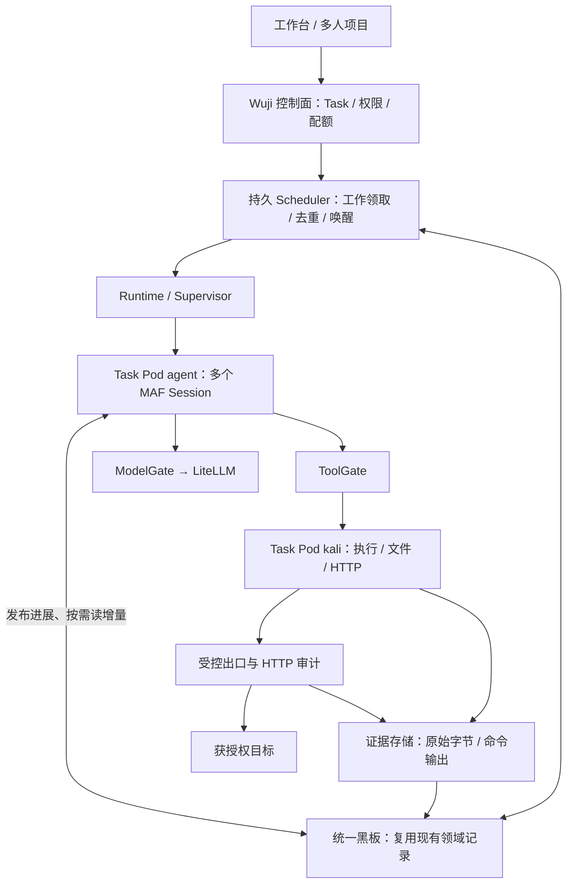

# Wuji Agent 协作与 CTF 能力：源码审阅及精简候选方案

日期：2026-09-22。状态：review-draft；本文交付审阅与候选设计，不批准新工具、权限、数据迁移或部署变更。

用户重点：多人、多项目、租户隔离及大量并发任务；同一 Task 的 Agent 协作、工作效率、黑板共享、证据留存与实际 CTF 解题。

后续用户已将多租户扩展后置并选择Kali root与复制版本发布。下一阶段的唯一详细候选正文改为 [Core CTF Spec](../stages/core-ctf/spec.md)、[Plan](../stages/core-ctf/plan.md)和[实施指令](../stages/core-ctf/implementation-instructions.md)；本页保留审阅过程，不再作为可直接实施的最新合同。业务实现仍未启动。

用户后续四点澄清及 HTTPS 要求已纳入第 11 节。该节为最新候选方向，替代第 5、7、9 节中“优先扩展专用 HTTP 工具、把目标站点拦截作为前置”的建议：通用 Kali 执行为主，采集独立；暂不实现未授权站点拦截，HTTPS 明文必须留存。多人/租户隔离、Task 预算和停止控制仍保留。第 1—4 节继续作为原源码截面的审阅事实。

审阅工作树：`codex/vnext-maf`。开始基准 `05983781f001f17f96fd482324124b0dfb730e09`；期间已有会话修复提交为 `cfd347933b83759f46d85fcd1715dd4d30232653`，已补读其接入变化，本报告以此为源码截面。本轮未运行目标请求、模型、性能实验或业务回归；历史证据保留其原 SHA，不构成当前提交的实测。已有未跟踪运行材料未修改、未纳入本报告提交。

交付前工作树 HEAD 已推进到 `d8c99644092dedb50533f84caa93bf6152987cd1`；核对增量仅为构建脚本将 README 分类为非镜像输入，本报告涉及的业务源码未变化。本审阅稿与索引更新尚未提交，不移动其他正在构建或验证的工作树 HEAD。

## 1. 结论

当前已有一个较完整的平台控制与记录底座，MAF 原生循环也已接入；但已发布的执行能力仍主要服务有限读取，尚不足以支撑用户示例中通用 bash Agent 的行动范围。优化应复用现有 Blackboard、Scheduler、RLS、Gate、Runtime，集中补齐可执行工具、运行中协作、真实效果对照及必要性能测量，不再次换框架或重写整个核心。

测试数量多不等于运行慢。当前 Dockerfile 没有把仓库的 `tests/` 或证据文档当作运行任务执行；合成模型是显式机制配置。真正可能增加运行时间的是调用交接、连接建立、快照、持久化、队列等待及额外模型轮次。本报告只识别这些路径，不编造延迟或提速比例。

## 2. 当前工具与 HTTP 审计到底做了什么

首用目录发布两个环境工具：`read_workspace(path)` 和 `http_target_get(url, method)`。后者的已发布方法是 GET/HEAD；底层通用只读校验集合还包含 OPTIONS，并不意味着每个 Profile 均放行。Kali 装配的适配器只有 `workspace_read`、`http_target`。

依据：[首用目录](../../ops/vnext/first_use_catalog.py)、[Kali 装配](../../services/wuji-kali-executor/main.py)、[工具实现](../../packages/wuji-core/src/wuji_core/admission/tools.py)、[方法边界](../../packages/wuji-core/src/wuji_core/admission/target_scope.py)。

HTTP 实际路径：MAF FunctionTool → GateFunctions → ToolGate → 受认证 Kali Executor → Python httpx → 目标。没有调用 curl，也没有任意 shell。知识读取、Todo 与 Work Memory 是另外的能力，不能把“两个环境工具”说成 Agent 总共只有两个函数。

HTTP 当前保存的交换文档包含：方法、URL、适配器设置的请求头、状态码、五类响应头（content-type/content-length/location/server/date）、base64 响应正文、保存字节数和截断标记。输出同时受正文与整个交换文档上限约束；底层读取的是客户端解码字节。异常可能产生部分或空观察，不应当成完整网络取证。

ToolGate 将执行输出封存为 Artifact，再登记 Capture/Observation 与受绑定的 ToolCall 回执，绑定 Task/AgentRun/ToolAttempt；模型得到回执及受限正文表示。原始捕获大小和交给模型的表示大小分别处理，这一分离应保留。

当前没有：请求体/POST、任意自定义请求头、登录 Cookie 会话、完整响应头、通用 shell 流量、浏览器流量或透明代理覆盖。重定向不自动跟随。它是有限 HTTP 工具的采集与审计，不是 Kali 全量 HTTP 流量审计。

## 3. 当前协作与进度

| 关注点 | 已有实现或记录 | 不能据此宣称 |
| --- | --- | --- |
| 共享知识 | ClaimRevision、Intent、Observation、证据引用；Fact 为评估后的读视图 | 模型文字自动成为已核实事实 |
| 调度 | 持久 WorkItem/Run/Outbox、去重、等待唤醒、无进展约束、租户/Task 轮转和容量检查 | 大规模并发吞吐已通过 |
| Agent 内部 | MAF 原生循环；问题 Profile 的 Todo、Work Memory、压缩、知识按需读取 | 通用 CTF 行动工具已齐备 |
| 上下文共享 | 初始快照、knowledge_list/read/refresh；证据与原始私有会话分开 | 所有 Agent 自动实时看到每条新信息 |
| 发布信息 | 工具采集可及时落库；模型提案与解释主要随 Run 最终结果接纳 | 长 Run 内已有通用进度/发现发布工具 |
| 会话恢复 | native.v2 在 run_return/approval_wait 保存 MAF 原生状态，当前修复到 cfd3479 | 任意中断点无缝恢复或最新实机已通过 |
| 界面与控制 | 创建/启动、知识画布、证据、完成/报告等有局部实现和历史证据 | 首用完整链与生产身份已验收 |

历史 M2 机制案例用 7 个 Work/Run（5 Reason、2 Explore）完成两次文件观察，证明共享发现能够驱动后续工作；这是特定合成案例，不是所有任务的固定比例或性能基准。另一个信息不足案例保留 inconclusive、没有擅自把 Goal 标为满足。复用来源：

- [M2 原记录、原 SHA 与完整请求包](evidence/E08/m2-mechanism-loop-20260917/README.md)、[真实画布截图](evidence/E08/m2-mechanism-loop-20260917/screenshots/m2-topology.jpg)。
- [信息不足案例原记录](evidence/E08/e08-case-b-variants-20260918-r7/README.md)、[创建 HTTP](evidence/E08/e08-case-b-variants-20260918-r7/raw/create.http)、[取消 HTTP](evidence/E08/e08-case-b-variants-20260918-r7/raw/cancel.http)、[原验证截图](evidence/E08/e08-case-b-variants-20260918-r7/screenshots/insufficient-final-terminal.png)。

最新整体状态仍按[vNext 验收](../stages/vnext-maf/acceptance.md)与[首用验收](../stages/first-use/acceptance.md)解释。首用表头存在较早截面，不能将其“尚未创建”当作此刻运行事实；也不能用后来出现的 Task 或 Ready Pod 补写完整通过。应在下一次实际验收中更新同一处当前状态，旧过程下沉为有日期的历史。

## 4. 优先级审阅发现

### P1：工具能力与 CTF 目标不匹配

`validate_input_schema` 只接受 path 或 url/method 两种形态，Kali 也只装配两个适配器。首用 Profile 明确关闭 shell、skills、MCP、后台 Agent 等；其中部分是合理首批限制，不能据此宣布完整解题能力。创建更多 Agent 无法弥补缺失的 HTTP 状态会话、代码运行及文件处理。

建议先交付明确版本的 CTF 能力集，保留首用读取 Profile 的历史语义。不要通过放宽原 Profile 或把一个布尔值改为 true 来绕过权限合同。目标是受控通用执行与可复现 HTTP，而不是为每条 curl 命令新增一个专用工具。

### P1：运行中的模型发现共享不足

[GateFunctions](../../packages/maf-worker/src/wuji_maf_worker/tools.py) 当前的知识函数均为读；[MafRuntime](../../packages/maf-worker/src/wuji_maf_worker/runtime.py) 在最终响应后提交结构化结果。工具 Observation 可以先到，但模型得出的假设、排除路线与下一问题通常等 Run 结束才接纳。

建议复用现有 Claim/Intent/Work 状态，增加一个受控的增量发布入口，支持发现、假设、尝试摘要和阻塞说明。发布返回固定引用及版本，按 Run+调用键幂等；不允许模型写 Observation、FactAssessment、租户身份或执行许可。不能为“实时黑板”另建一套正文表或共享聊天日志。

### P1：首用配置不能代表多人并发能力

[first_use_catalog.publish](../../ops/vnext/first_use_catalog.py) 把首用全局和模型容量池固定为 1；Profile 还限制同一时刻一个模型请求、一个工具操作。这是有界首用配置，不是平台能力上限，但它会阻止在该配置下证明并行协作。报告未读取现场数据库来判定所有当前 Task 的有效容量。

保留全局→租户→Task→模型容量与现有公平策略，以发布配置管理实际额度；用同构建的双 Task、双 Agent 合法并行切片验收。不要删容量台账来“提升并发”，也不要直接启动多个现有单主 Scheduler。

### P2：有真实的运行开销候选，但尚无性能测量

- [RemoteWorkerHost](../../packages/maf-worker/src/wuji_maf_worker/remote_host.py) 每次交换建立 AsyncClient；[RemoteWorkspace transport](../../packages/wuji-core/src/wuji_core/admission/remote_workspace.py) 每次 post/apost 新建 transport/client。候选：按进程复用连接池，保留每请求凭据、TLS、超时及关闭语义。ModelGate 上游已经复用注入客户端，不重复改造。
- [KnowledgeReadService.refresh](../../packages/wuji-core/src/wuji_core/blackboard/knowledge_reads.py) 创建新的 Task 快照并计算引用差集。候选：复用领域事件水位和 Work 相关范围，只读取需要的增量；保持权限检查及不可变证据引用，避免另建知识缓存权威。
- [Scheduler.tick](../../packages/wuji-core/src/wuji_core/scheduling/claims.py) 顺序扫描可访问 Task 并构造候选，批量选择上限不等于扫描范围有界。候选：先测 Task 数增长的调度延迟，再在现有 Outbox 上增加有界脏任务选择或唤醒提示，保留持久扫描兜底；不先加消息中间件。
- 新 AgentRun 意味着进程启动、上下文交付和模型上下文重建。应让一次 Work 解决一个完整子问题，局部工具步骤留在同一 MAF Session。当前问题 Profile 已要求“不把局部步骤变成全局工作”，还有事件合并、去重和无进展限制，应先验证/调优现有机制，不能把这些说成尚未实现。

这些是结构性候选，不是已证明的主要瓶颈。模型推理、目标响应和平台等待需分别计时。

### P2：恢复适配与产品验收需要收口，而非持续扩边

native.v2 已减少逐模型调用 checkpoint，并保留先存原始输出、恢复点失败不重跑模型的处理；这项方向应继续完成直接验收。新 Profile 不再引入第三套会话格式。旧 reader/writer 与历史数据隔离维护，不能直接删掉已存在会话的恢复入口。

原生 MAF 会话内容由 MAF 负责；Wuji 保留必要的当前执行身份、恢复许可、审批绑定与持久引用。不要把费用后续核对重新混进会话消息状态，也不要让报告生成、画布或审计页面阻塞 Agent 的工具循环。

### P1：多人产品要求不能被本地演示身份替代

[当前浏览器 BFF](../../services/wuji-web-gateway/main.py) 使用 local_single_operator。RLS、内部签名身份和 Task 权限已有实现，但多人登录、项目成员关系与生产访问验收仍须独立闭环。应复用可用身份组件并接到现有权限模型，不重造身份系统，也不因 CTF 效率优化放弃租户隔离。

## 5. 候选目标：薄 MAF 接入、共享任务板、受控执行



图中“增量发布”“通用执行”“受控出口审计”为候选补充，不冒称已部署。保留现有 API/Runtime/Scheduler/Gate 的职责边界与代码复用，减少热路径交接，不为每个逻辑模块新建服务。多个 Task 使用各自 Pod、工作区与凭据；同 Task 内 Agent 共享成果，不把同 Task Agent 宣称为彼此恶意隔离。

不新增图数据库、向量数据库、第二套 Fact 正文、第二套调度队列、通用工作流 DSL 或新的 Agent 循环。是否拆服务、分片 Scheduler、迁移生产对象存储，以实测容量和发布要求决定。

## 6. 黑板共享什么

| 信息 | 复用位置 / 推荐发布时机 | 其他 Agent 如何使用 |
| --- | --- | --- |
| 目标、范围、预算、约束 | Task/Goal 固定配置；由平台写 | 每次执行读取，不允许 Agent 扩权 |
| 待解决问题、负责人、进行状态 | Intent/WorkItem/AgentRun；领取、阶段进展、阻塞时 | 避免重复工作；独立问题可并行 |
| 已观察内容与证据索引 | Observation/Artifact；工具采集后 | 按需取正文，保留采集身份和完整性 |
| 发现、假设、负结果及限制 | ClaimRevision；出现可复用进展时增量发布 | 未验证假设也能指导下一问题，不能冒充已核实事实 |
| 下一步建议与依赖 | Intent + WorkDependency；有具体信息缺口时 | 由 Scheduler 按权限、能力、预算接纳 |
| 凭据或会话关联 | 受限引用；平台控制可见性 | 不在黑板广播明文 Cookie、密码或模型 Key |

不共享完整聊天历史、隐藏推理或每个 token。每个 Agent 保留私有 Session/Memory；共享的是可复用发现、尝试结果、工作状态与来源。原始模型输出可受限存档，但不自动进入其他 Agent 的知识输入。

负结果要表达实际尝试的输入、环境、结果和限制；“没看到 flag”不能变成“该路径没有问题”。候选 Flag 附提取来源；获得靶场明确通过回执或事先规定的验证后才升级为完成，不能仅靠正则匹配任意页面字符串。

## 7. 工具与流量审计的最小可用方向

保留受控 HTTP 工具并补齐已授权场景所需的方法、body、header、Cookie 会话和逐跳授权；原始请求/响应进入受限证据存储，普通界面用脱敏表示。工具返回摘要、相关正文和可继续读取的证据引用，避免把全部流量反复塞回模型。

为 CTF 增加受控的 Kali exec 能力，复用现有 ToolCall/Attempt、取消、退出回执与 Artifact。它覆盖 curl、Python、本地解码、脚本和文件操作，不为每个系统命令设计新协议。需要工作目录、执行身份、时间/输出界限、子进程收敛和可审计的实际退出；授权以发布能力和 Task Scope 为准。

审计所有 curl/脚本 HTTP 流量需要流量实际经过受控出口。显式代理可复用 mitmproxy 等成熟实现，但环境变量只是客户端配置，不能证明不可绕过。需要平台网络策略禁止未经批准的直连；原始 TCP/非 HTTP 工具另有获准能力及连接/输出证据，不能假称 HTTP 审计覆盖所有 CTF。HTTPS 解密需在隔离 Task 客户端配置受信证书并保留上游校验，不能把 CONNECT 元数据称为完整 HTTP 证据。

保持一个 Task 的 agent/kali 双容器时，它们共享 Pod 网络；NetworkPolicy 按 Pod 工作，不能靠容器名称分配两套出网边界。可信出口应位于受保护的平台边界，模型凭据继续只由平台 Gate 处理。并发代理请求的归属要绑定受信执行身份；不能只凭模型自填 HTTP header 或时间窗口猜测属于哪个 Agent。

外部参考：[mitmproxy 模式与限制](https://docs.mitmproxy.org/stable/concepts/modes/)、[Kubernetes NetworkPolicy](https://kubernetes.io/docs/concepts/services-networking/network-policies/)。此处为候选设计，未安装代理、开放 shell、修改网络或测试外部目标。

## 8. 证据与成本

保留三个不同层次：

1. 执行账本：谁在什么许可下发起什么操作、状态、时间、退出与费用引用。
2. 原始证据：实际 HTTP 交换、工具输出、下载/生成文件的字节、摘要、完整性和权限。
3. 知识层：少量结论、假设、失败路线、后续问题与证据引用。

普通进度更新不必复制完整证据；原始响应也不自动升级为 Fact。既有 Artifact 可按摘要复用存储内容，但引用仍须独立鉴权，不能用跨租户去重泄露内容是否存在。重复请求可能本身具有验证意义，不能把内容去重误当成禁止请求。

保留生命周期和必要隔离检查；减少重复编码、重复查询及重复模型总结。现有独立原始结果与恢复点的方向继续沿用，不为修复一个 checkpoint 失败再跑模型或目标。

## 9. 按用户价值推进的实施顺序

| 顺序 | 有终点的交付 | 最小验证与停止条件 |
| --- | --- | --- |
| 1 单 Agent CTF 基线 | 同一受控环境下跑通 MAF → 工具 → 正文 → 结果；补所需 HTTP 会话/方法、执行工具及必要出口约束 | 固定一道授权可重置题，真实工具和真实模型，按来源核验结果；同时核对越权拒绝、预算/取消。若能力条件不具备，停在明确缺口，不用合成成功替代 |
| 2 双 Agent 黑板交接 | A 发布进展和证据，B 在自己的 Session 消费并完成另一子问题；同问题认领/去重有效 | 一次真实中途交接、一条直接受影响的重复/冲突路径、一次跨 Task/租户拒绝；不扩全主题/浏览器矩阵 |
| 3 多人并发与效率 | 正式用户/项目权限、发布容量、公平调度；仅优化测得瓶颈 | 两个租户/Task 的功能并行与负边界，加一个固定容量档负载；记录队列与控制面开销，禁止因吞吐解除鉴权 |
| 4 CTF 效果对照 | 同一模型、题目版本、工具、环境和金额上限，对照单 Agent 与协作模式 | 完成预先固定的小题集即停止；保留失败/未完成，不因没有成功而反复更换题目或扩大预算 |

这些是候选实施增量，不是新增业务已获阶段批准。先在应用 Plan 模式冻结涉及的接口、权限、迁移和验收条件，再按批准范围实施；日常可逆修复与文档整理不另设审批。

## 10. 如何判断“真的更快、更会做题”

先做少量必要度量，不先建可观测性平台：

- 模型：请求数、推理等待、输入/输出 token、费用。
- 平台：Task 排队、Pod/Run 就绪、Gate 校验、工具交接、证据封存、知识发布到另一 Run 可读的时间。
- 工具：真实目标耗时、执行耗时、输出完整性、正文实际交付量。
- 协作：重复问题/重复无效动作、有效共享发现、等待原因、单问题连续执行长度。
- 效果：受独立判据确认的成功、未完成原因、总时间与总费用。

先对齐用户示例的最小 Agent 基线与 Wuji 使用的模型、权限、工具和环境；不能用宿主机任意 bash 对比一个只允许 GET 的平台，再把差异全部归因于 MAF 包装。合成模型只验证协议和控制；小型本地夹具用于直接失败分支；真实效果依靠授权靶场及固定对照，不再把夹具数量当产品进度。

本报告没有新的性能数字、漏洞复现或通过结论。下一次实际 HTTP/UI/效果成果继续附真实截图和完整脱敏请求/响应；本报告引用的历史证据保持原采集日期与代码绑定。

## 11. 最新候选：通用 Kali 执行、独立采集与 Cairn 式探索

### 11.1 新输入与本次来源

用户明确：希望 Agent 直接操作 Kali，以支持 Python 脚本、扫描及其他 CLI；不逐个封装每个程序；未授权站点拦截暂不作为前置；保留 HTTPS URL、请求体和响应正文的可查看、可复现明文。多人、多项目与并发任务要求继续有效。

本次读取 Cairn 固定提交 `8e7e0ea67552383851dfcabfba0c4e9c8d007878` 的 5 份提示词、scheduler/loop.py、worker_select.py 和任务执行适配。下载的调度与任务文件 SHA-256 与仓库旧适配清单一致。固定源码在忽略目录 `work/research/cairn-8e7e0ea/`，不安装或执行 Cairn。Wuji 本轮源码截面为 `3682edae86ddd438892e0961803aae3eb6fa6bb2`；MAF 已安装版本仍为 core 1.18.0 / openai 1.14.3。这里描述候选接入，不声称 MCP、抓包或 HTTPS 代理已部署。

### 11.2 执行入口：少量通用原语

推荐由每个 Task 的 Kali 常驻执行服务提供通用命令执行。MAF 的工具是普通函数或原生 MCP 客户端；模型按需要使用 curl、Python、nmap 等已安装程序。程序是否可运行仍取决于镜像实际安装内容、架构与必要进程权限，“Kali 镜像”不等于默认具备全部工具。

首版接口应围绕以下职责，而非程序名称：

- `exec`：执行命令、绑定 cwd 与运行身份，短命令返回结果，长命令返回 execution_id。
- 进程读/输入/停止：按 execution_id 获取增量输出、发送 stdin、终止整个执行进程组并返回实际状态；避免模型反复空轮询。
- 文件读写：按需提供小型 read/write/edit，或先通过 exec 处理；大结果落到 Task 工作区并返回引用。
- 黑板读/发布：位于平台侧，复用现有领域记录，独立于 Kali 命令。

每条命令仍保留真实 Task/Run/执行句柄、开始结束时间、cwd、退出状态和输出引用。不需要解析 nmap 的每个参数来构建另一套工具协议，也不需要要求 Agent 通过专用 HTTP 工具才能访问目标。工具可复用现有执行回执、取消和证据存储；当前两种 input schema 的限制须由明确的新能力版本替代，不能只把 `mcp` 配置改为 true。

**MCP 选择：**MAF core 1.18.0 的 `MCPStreamableHTTPTool` 已提供工具发现、工具白名单、可复用 HTTP 客户端及 header_provider。当前 Worker 虚拟环境未安装它按需导入的 `mcp` 包，需要在正式接入时锁定这一依赖。Kali 官方目录的 `mcp-kali-server` 提供 MCP 桥接与 Linux 命令 API，可作为复用候选；其页面说明并不证明已经满足 Wuji 的长进程、取消、身份和并发合同。

若复用 Wuji 现有 Kali 服务，优先直接增加标准 MCP 入口，避免再引入一套逐程序 Flask/REST 包装。MCP 是接线协议，仍由 MAF 运行 Agent 循环。让 Agent 控制的是其 Task 的执行进程，不给予 Docker socket 或 Kubernetes 管理权限。

示意代码（端点和工具名为拟定接口；不是当前可运行配置）：

```python
async with MCPStreamableHTTPTool(
    name="kali",
    url=kali_mcp_url,
    load_prompts=False,
    allowed_tools=["exec", "read_process", "write_process", "stop_process"],
    header_provider=lambda _: {"Authorization": f"Bearer {run_token}"},
) as kali:
    agent = create_harness_agent(
        client,
        agent_instructions=explore_instructions,
        tools=[kali, board_read, board_publish],
        max_context_window_tokens=model_context_window,
    )
    session = restored_session or agent.create_session()
    result = await agent.run(problem, session=session)
```

配置需显式选择 MAF 的 Todo、Memory、Skills 和审批策略，不能依赖该简化片段的全部默认值。Reason 使用读板工具，Explore 使用 Kali 和进展发布；不为每个普通命令增加人工审批。Run 凭据由受信运行装配，不接受模型自行填写租户或 Task 身份。

参考：[MAF MCP 文档](https://learn.microsoft.com/en-us/agent-framework/agents/tools/local-mcp-tools)、[Kali MCP 包](https://www.kali.org/tools/mcp-kali-server/)。

### 11.3 采集：原包与 HTTPS 明文两层

推荐 `dumpcap → 分段 pcapng` 做持续抓包，tshark 按需或后台解析。这样 Python、扫描程序等不必接入专用 HTTP 工具即可留下网络原包。采集从获准执行前开始，到工具子进程实际结束后收尾；记录 Task/runtime attempt、采集时间、接口、文件摘要与丢包/缺口。

抓包不等于 HTTPS 解密。用户要求 HTTPS 明文，需额外使用 mitmproxy 一类代理，或对支持的 TLS 客户端取得可用密钥日志。推荐首版复用 mitmproxy，为 Kali 中支持的 HTTP(S) 客户端配置代理和 Task 内的信任证书；不修改宿主机全局信任，也不关闭上游证书校验。普通 HTTP(S) 流记录保存完整头字段、请求体、响应体、错误、时序、协议和内容引用，普通 UI 再按权限脱敏。

目标站点 allowlist 的拦截可以后置；为实现明文采集而要求流量经过采集路径，是另一个问题。仅配置 HTTP_PROXY/HTTPS_PROXY 不能证明所有程序都会遵守。应按实际运行环境建立可验证的路径，未经过采集、证书固定、不受支持协议或丢包均记录缺口；如果明文是该能力的必需条件，则该执行不能标为完整留存。任意第三方客户端、任意协议都可无限制运行且全部 TLS 自动可解密，不能作为可兑现承诺。

因此分开两层采集质量：Task 网络包覆盖；支持的 HTTP(S) 语义交换完整性。非 HTTP 的扫描/其他协议保留原包与命令结果，不能伪装为 HTTP 交换。TLS key log 只能作为支持客户端的补充，不能把一个环境变量当作所有程序的通用解密能力。

“全量保留”使用分段后封存，不使用会覆盖旧文件的固定文件数环形缓存。采集与归档不可用、磁盘不足或丢包时明确报出不完整；若要求零缺口，需要在无法继续留存时停止产生新流量，而不是静默继续。抓包和代理开销需测量，不假设比当前适配器必然更快。

采集文件由平台拥有，Agent 不能清理或改写。最清晰的部署候选是在 Task Pod 中增加专用 capture 容器；这会将原先固定双容器改为三容器，属于需要显式冻结的部署变更。若坚持双容器，可评估 Kali 内受保护采集进程，需证明其权限与写入目录不被命令进程继承或修改。此处不擅自修改现有 Pod 模板。

同 Task 多个 Agent 共用网络时，pcap 可靠归属到 Task，不会天然带 AgentRun。代理与 MCP 执行日志可按受信 Run/execution_id 关联；客户端未携带可验证代理身份时保留 Task 级或未知归属，不能仅按时间猜成某个 Agent。精确到任意子进程套接字的归属另需进程/连接观测，不作为未经实现的抓包特性。

参考：[dumpcap](https://www.wireshark.org/docs/man-pages/dumpcap.html)、[Wireshark TLS](https://wiki.wireshark.org/TLS)、[mitmproxy 证书与固定证书限制](https://docs.mitmproxy.org/stable/concepts/certificates/)、[协议支持范围](https://docs.mitmproxy.org/stable/concepts/protocols/)。

### 11.4 Cairn 提示词的可复用部分

固定版本的职责：Bootstrap 基于 Origin/Goal/Hints 持续推进，正常完成时返回事实及完成说明；Explore 围绕给定 Intent 连续探索，返回最新增量事实；Reason 判断已有事实是否足够，选择完成、提出有限独立方向或暂不新增方向；Conclude 是同会话收尾指令，不应继续执行工具。

适合 Wuji 的是提示词定义角色和产出、平台保存和分派的分工。探索共享不必等所有发现经过正式 FactAssessment：模型可以直接发布有来源的候选 Claim，明确假设与未验证状态；正式验证只在关键结论、Flag 或交付判据上按需进行。现有 Claim/Observation/评估分离可复用，不重建 Cairn 数据库。

建议给模型的输出保持简短：新增发现、证据引用、尝试及结果、当前问题状态、必要的后续问题。Task/Run/版本/操作身份由平台补充。工具执行账本自动产生，模型不用每次操作抄写一大份合同。中途有可复用发现时调用 board_publish，结束时提交最终增量；原生输出解析和引用鉴权仍必须存在。

不照搬两个可能增加空转的策略：Bootstrap 直到解决才允许正常结束；没有 Open Intents 就必须提出新方向。Wuji 应允许有依据地 blocked/no_progress/needs_input，连续局部尝试留在同一 Session。Cairn 的模型 Fact 也不能直接充当漏洞真实性证明。

参考：[Bootstrap](https://github.com/oritera/Cairn/blob/8e7e0ea67552383851dfcabfba0c4e9c8d007878/cairn/src/cairn/dispatcher/prompts/default/bootstrap.md)、[Explore](https://github.com/oritera/Cairn/blob/8e7e0ea67552383851dfcabfba0c4e9c8d007878/cairn/src/cairn/dispatcher/prompts/default/explore.md)、[Reason](https://github.com/oritera/Cairn/blob/8e7e0ea67552383851dfcabfba0c4e9c8d007878/cairn/src/cairn/dispatcher/prompts/default/reason.md)。

### 11.5 Cairn 实际调度与 Wuji 可收简的位置

固定版本调度逻辑可概括为：轮询 active Project，检查全局/项目/Worker 容量；新图按设置 Bootstrap 或初次 Reason；出现新 Fact、新 Hint，或 Open Intent 从有变为零时触发 Reason；其余选择未认领 Intent 给 Explore。未认领 Intent 选择最新创建者；Worker 按数值优先级、当前运行数再随机打破平局。Reason 认领、探索心跳、超时/解析失败后的收尾、失败冷却和资源清理在代码中真实存在。

因此 Cairn 的探索决策规则简单，但整个调度实现不是只有几条提示词。不能把它的进程内 Future 和 ReasonCheckpoint 原样当成多人平台的持久任务账本。

Wuji 建议把业务决策收敛为以下规则，同时保留现有执行控制：

1. Task 启动创建初始工作，不额外制造一层永久 Bootstrap Agent。
2. 一个问题最多一个活动执行；局部工具步骤不拆成 WorkItem。
3. 独立问题在租户、Task、模型额度内并行领取，沿用已有公平轮转。
4. 有新增有用发现、人工输入、关键失败或待办收敛时，合并触发一次 Reason；每 Task 最多一个活动 Reason。
5. 没有新信息且有工作进行时等待，不为了队列空或时间流逝反复付费推理。
6. 达到有依据的完成、预算、期限或无进展条件后停止并核对。

当前 Wuji 已有去重、事件合并、容量池与等待唤醒，应围绕这些规则收口，不另写一个 Scheduler。策略选择负责“做哪项工作”；准入负责“现在可否运行”；Runtime 负责“进程实际怎样了”。避免把会话序列化、黑板完整快照、UI 状态和停止核对揉进同一个策略函数。固定 Profile 的装配可复用，执行时仍检查当前身份与取消状态。

参考：[固定调度循环](https://github.com/oritera/Cairn/blob/8e7e0ea67552383851dfcabfba0c4e9c8d007878/cairn/src/cairn/dispatcher/scheduler/loop.py)、[Worker 选择](https://github.com/oritera/Cairn/blob/8e7e0ea67552383851dfcabfba0c4e9c8d007878/cairn/src/cairn/dispatcher/scheduler/worker_select.py)。

### 11.6 把单个 MAF Agent 做到适合 Wuji

Pi v0.73.0 默认以 read/write/edit/bash 四个通用工具工作，并具备会话、压缩、扩展和 Skills。MAF 是组装式 SDK，create_harness_agent 返回普通 Agent，已经提供相应的循环、Session、压缩及可选 Todo/Memory/Skills。没有本轮对照证据可以认定 MAF 推理能力弱于 Pi。

优先调整工具与上下文而非换框架：

- 通用 Kali 执行，工具返回真实输出、退出状态与结果位置；长输出落文件，模型按需读。
- 一项问题在同一 Session 中连续解决；原生压缩保留最近操作和问题摘要，大原文按证据引用读取。
- Explore 使用 Todo/Memory 和必要 Skills；技能提供方法及环境用法，不给每个 CLI 再包一个工具。
- 初始上下文只含目标、当前问题、已有摘要、相关证据索引、环境与能力说明；随后按需读取，不灌入全量 pcap 或所有历史聊天。
- 进度发布和最终产出使用小合同，错误信息给出可操作原因；业务失败作为观察可继续分析，取消/鉴权失败退出。
- 保留一个平台协作调度器；不同时打开 MAF 自行派生后台 Agent 与 Wuji 的第二套工作树。
- 继续采用 native.v2 原生会话边界，不为每个模型调用增加完整会话发布；旧会话兼容保留明确隔离。

MAF 模型、采样/推理配置、工具、上下文和时间/金额额度与 Pi 或用户示例对齐后，再比较解题成功、时间、费用与重复动作。不能把工具能力缺失归因于框架，也不能宣称以上结构变化已经带来某个提速比例。

参考：[Pi v0.73.0](https://github.com/earendil-works/pi/blob/v0.73.0/packages/coding-agent/README.md)、[MAF Harness](https://learn.microsoft.com/en-us/agent-framework/concepts/harness)。

### 11.7 调整后的交付终点

先完成“一个 MAF Agent → 通用 Kali 执行 → 命令结果与 PCAP/HTTPS 明文 → 正式证据”的真实小闭环，再完成“两个 Agent → 中途共享发现 → 独立问题并行 → 正确收尾”，最后验证多人多 Task 的隔离、公平性与性能。目标站点自动拦截不作为本轮前置，新的 Capture 容器或采集进程部署方式须在具体方案中明确。

本次只读研究外部固定源码、已安装 SDK 和当前 Wuji；没有运行示例、安装 MCP/代理、抓取用户网络或开启 Kali 通用执行。
