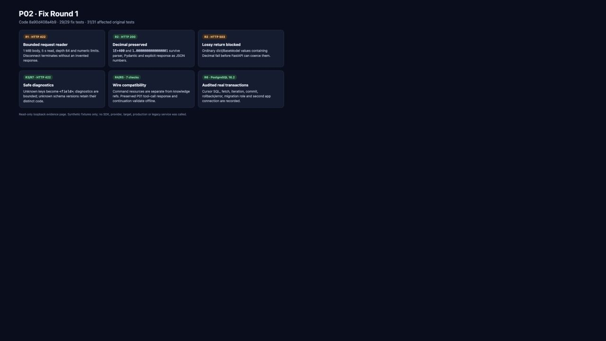

# P02 fix round 1 交付报告

日期：2026-09-13

基线：`c4dc9ff1a1491a2392405a9bee615b9dfff09fe2`

被测代码提交：`8a90d408a4b99f80e951448c25455a4b3e99639f`

实现提交：`8a90d40 fix(vnext): harden P02 contract boundaries`

本报告与新增证据位于后续文档提交，不预写自己的未来 SHA。原 `20f9199` 测试结果、runtime 交换和截图字节仍只证明原代码与原范围；本轮在 `fix-round1/` 下追加独立证据。

## Review findings 处理结果

| Finding | 处理与实际边界 | 状态 |
| --- | --- | --- |
| R1 P1 | JSON reader 默认 1 MiB、总读取 5 秒、深度 64、数字 token 256 字符、绝对 adjusted exponent 10,000；按 chunk 累计，timeout/超限/解析失败返回安全 422，`http.disconnect` 直接终止且不伪造响应；原 body 可完整 replay | addressed |
| R2 P2 | 固定 `simplejson==4.1.2`，fraction/exponent 解为受限 Decimal、integer 保持 int；canonical/Response 无损写 JSON number。`VNextAPIRouter`/`StrictJsonRoute` 把同一解析对象交给 Pydantic。普通 dict/BaseModel 含 Decimal 时在 FastAPI 编码前固定 503；显式 `DecimalJSONResponse` 无损 200 | addressed |
| R3 P2 | 从当前 endpoint 的实际 Pydantic 注解递归取得合法字段名；unknown/dynamic key 与 `extra_forbidden` 末段统一 `<field>`。最多 16 个 error、loc 最深 8；不发布 input/ctx/exception/原始值 | addressed |
| R4 P2 | 新增独立 `CommandResourceRef`/`CommandResourceType(task/work_item/approval)`；CommandReceipt 不再借用 KnowledgeRef，canonical knowledge/node enum 未扩大 | addressed |
| R5 P2 | ChatMessage 支持 native `tool_calls` 与 content-optional assistant 历史；response `created`/usage 恢复 vendor integer。仅离线读取 P01 已保存两次请求/响应，未运行 SDK | addressed |
| R6 P2 | RecordedCursor 覆盖 execute/executemany/fetch/iteration/context/error；RecordedTransaction 在真实退出后记录 commit/rollback/error。新增 NOLOGIN migration owner 的 `SET ROLE` 连接和第二 nonowner app 连接 hook | addressed |
| R7 P2 | 已解析 body 明确提供未知 schema_version，且该字段产生 literal/enum 错误时，422 使用 `INVALID_SCHEMA_VERSION`；缺字段/普通 shape 仍为 `INVALID_SCHEMA` | addressed |
| R8 P3 | 原报告/provenance/scratch 改为 P02 implementer task 的实际 CUA capture；parent/controller 只作后续复核。旧截图、HTML、时间与 SHA 不重拍、不改写 | addressed |

## Router / Response 消费方式

P03 以后必须使用 [`handoff.md`](handoff.md) 中的安全入口：所有 route 用 `VNextAPIRouter`；可能返回 unstructured/high-precision number 时，先用生成模型或 policy wrapper 显式验证，`model_dump(mode="python")` 后返回 `DecimalJSONResponse`。普通 dict/BaseModel 若含 Decimal 会固定 503，不能静默变成 float、字符串或 null。`create_app` 会拒绝包含普通 FastAPI body route 的 router。

这条限制刻意保留 FastAPI 普通 response-model 行为给不含 Decimal 的 JSON。显式 Response 会跳过 FastAPI response-model serialization，因此调用者必须先完成报告中的显式模型验证。

## RED/GREEN

完整命令、退出码和观察见 [`test-results.json`](test-results.json)，29 个 test_name 见 [`test-names.txt`](test-names.txt)。关键负控均先实际失败：

- R1：oversize 被 dispatch、disconnect 未终止、4,301 位整数异常穿透、深度 65 返回 200，共 4 failed；修复后 body/deadline/disconnect/depth/integer/replay 6 项通过。
- R2：loader 为 inf、canonical 折叠、ASGI 返回 null/1.0，共 4 failed；修复后 `1E+400`、`1.0000000000000001` 保持 JSON number。普通 dict 路径先返回 lossy 200，guard 后 dict/BaseModel 均固定 503。
- R3：unknown key 回显且返回 20 项诊断，2 failed；修复后 key redacted、16 项上限与 `truncated=true` 通过。
- R4：Task/approval receipt 被 KnowledgeRef 拒绝，2 failed；专用 ref 后 5 项通过。
- R5：保存的首响应 5 个错误、continuation 2 个错误，2 failed；更新 vendor schema 后 2 项通过。
- R6：真实 SQL/rollback 已发生但 wrapper 事件缺失，2 failed；补齐后事务/错误/双连接 3 项通过。
- R7：真实 ASGI 先返回 `INVALID_SCHEMA`，修复后返回 distinct `INVALID_SCHEMA_VERSION`。

模块/fixture 尚不存在造成的收集错误只登记为 scaffold，不作为行为 RED。

## 最终验证（代码 SHA `8a90d40`）

| 命令 | 退出码 | 结果 |
| --- | ---: | --- |
| `WUJI_TEST_EVIDENCE_DIR=docs/vnext/evidence/P02/fix-round1/runtime ./scripts/vnext/uv.sh run --frozen pytest tests/vnext/test_contract_fix_round1.py -q` | 0 | 29 passed in 1.27s |
| `WUJI_TEST_EVIDENCE_DIR=docs/vnext/evidence/P02/fix-round1/runtime ./scripts/vnext/uv.sh run --frozen pytest tests/vnext/test_contract_shapes.py -q -k 'approved_examples or openapi or numeric_limits or finite_integer or duplicate_json or nonfinite_json or canonical_json or protected_asgi or issuer_signed or asgi_boundary or asgi_model or db_conn'` | 0 | 31 passed, 28 deselected in 1.56s |
| `./scripts/vnext/uv.sh run --frozen pytest tests/vnext/test_contract_fix_round1.py --collect-only -q` | 0 | 29 tests collected in 0.01s |
| `work/toolchain/bin/pnpm contracts:check:v2` | 0 | generated Python/TS match OpenAPI；Redocly valid |
| `work/toolchain/bin/pnpm exec tsc --noEmit --skipLibCheck --target ES2024 --module NodeNext --moduleResolution NodeNext packages/contracts/src/v2/generated.ts` | 0 | 无输出 |
| PostgreSQL cleanup 只读查询 | 0 | `remaining_databases=[]`, `remaining_roles=[]` |

没有运行 P01 SDK、旧服务、收费/真实模型、外部网络目标、广泛 stress matrix、生产切换或数据删除。MAF `1.18.0` 与 OpenAI `1.14.3` pins 未改变。

## HTTP、SQL 与离线证据

- 完整未截断 HTTP 请求/响应索引：[`http-reproduction.md`](http-reproduction.md)。Raw JSONL 保存全部 headers 与 base64 原始 body。
- R2 精度 200：[`runtime/45d4f56edff5/http-exchanges.jsonl`](runtime/45d4f56edff5/http-exchanges.jsonl)、[`runtime/8129ab313bb9/http-exchanges.jsonl`](runtime/8129ab313bb9/http-exchanges.jsonl)。
- R2 防 lossy 503：[`runtime/0332ad73fd83/http-exchanges.jsonl`](runtime/0332ad73fd83/http-exchanges.jsonl)、[`runtime/d43d356330e7/http-exchanges.jsonl`](runtime/d43d356330e7/http-exchanges.jsonl)。
- R3/R7 422：[`runtime/2f62af63c580/http-exchanges.jsonl`](runtime/2f62af63c580/http-exchanges.jsonl)、[`runtime/ba2ba7a1a1ab/http-exchanges.jsonl`](runtime/ba2ba7a1a1ab/http-exchanges.jsonl)、[`runtime/0bb5dfb2bafc/http-exchanges.jsonl`](runtime/0bb5dfb2bafc/http-exchanges.jsonl)。
- R6 commit/fetch/iteration：[`runtime/5f31d952f034/postgres-events.jsonl`](runtime/5f31d952f034/postgres-events.jsonl)；rollback/error：[`runtime/d9a5145f2bac/postgres-events.jsonl`](runtime/d9a5145f2bac/postgres-events.jsonl)；migration/second app：[`runtime/d965b5c21084/postgres-events.jsonl`](runtime/d965b5c21084/postgres-events.jsonl)。这些是原生 SQL 媒介，不伪造 HTTP。
- R5 读取源：`docs/vnext/capability-record.json` → `raw_sdk_and_http.cases.roundtrip.http[0:2]`；测试只解析保存的 request_body/response_body。

新增截图由 P02 implementer task 通过实际 CUA 从 `http://127.0.0.1:8765/result.html` 捕获；来源见 [`screenshots/provenance.json`](screenshots/provenance.json)。

## 原证据保留与后续边界

旧截图仍为 SHA-256 `be5e51f74b526c40b325edaaeb9ebd5409584e05c03eb36f2db7c6d7745ff0a8`，旧 HTML 仍为 `0ada826e53ad5aa4d4d74d38c3b229283a336a3340abe17ac1be2f53a9858227`；本轮只改 attribution 文本。旧 runtime/test-results 未修改。

AC-019 与 AC-075 仍按原报告保持整体 partial：P05 负责持久状态守卫，P17/P20 负责完整发布收集与 Node/web/browser 聚合。本轮没有把局部修复升级为这些后续 AC 的 pass。
