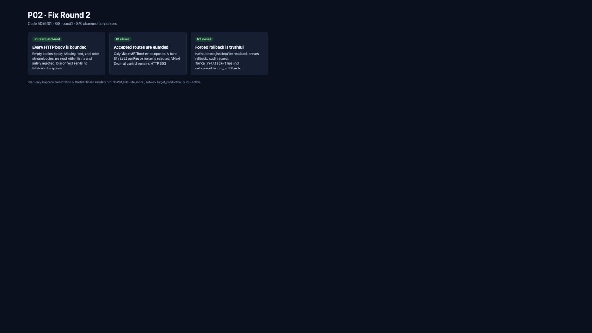

# P02 fix round 2 报告

日期：2026-09-13

基线：`195032dfec84962520139039b4f08814783190f3`

被测代码提交：`5055f81cbef0caa41512cc8f806e662b28174331`

实现提交：`5055f81 fix(vnext): close P02 boundary residuals`

本报告位于后续证据提交，不预写自己的未来 SHA。主代理准备中的未跟踪 `docs/vnext/P03-implementation-contract.md` 未读取、修改、暂存或提交；P03 仍等待 START。

## 仅处理的三项

- R1 residual：`StrictJsonMiddleware` 现在对所有 HTTP body 先执行同一 bounded read，不再按 Content-Type 提前绕过。空 body 原始 replay；非空且 media 缺失/非 JSON 固定安全 422；超过 byte/time limit 或 JSON 失败同样安全 422；真实 `http.disconnect` 直接结束且不调用 downstream、不发送伪响应。当前 v2 没有 binary upload request，octet-stream 明确拒绝。
- N1/R2：`create_app` 只接受 `VNextAPIRouter` 实例，并继续确认内部 routes 都是 `StrictJsonRoute`。真实 `APIRouter(route_class=StrictJsonRoute)` 不再是 accepted alternative；普通 VNext control 仍在 FastAPI 转换前固定 503，Decimal response 保护成为每个 accepted route 的 intrinsic guard。
- N2/R6：`RecordedDbConnection.transaction()` 保存实际 `force_rollback` option（keyword 或第二 positional），enter/exit audit 明确带该字段。normal-exit forced rollback 记录 `transaction_rollback/outcome=forced_rollback`；exception rollback 与普通 commit 保持各自真实结果。

其余 round1 review 已确认 addressed 的 R3/R4/R5/R7/R8 未修改、未重测。

## RED/GREEN 与最终证据

完整命令和退出码见 [`test-results.json`](test-results.json)，8 个 test_name 见 [`test-names.txt`](test-names.txt)。

- R1 RED：5 failed/1 passed，证明 missing/unsupported media、byte limit 和 disconnect 仍绕过 reader；GREEN：6 passed。
- N1 RED：VNext control 503 正常，但 `APIRouter(route_class=StrictJsonRoute)` composition 未拒绝；GREEN：1 passed。
- N2 RED：native readback 已证明 rollback，但 audit 缺 option/误称 commit；GREEN：1 passed。
- `5055f81` 首次最终候选运行：round2 8 passed in 0.32s；直接受影响 round1 consumers 8 passed、21 deselected in 0.70s。文档/SHA 变化后未重复。

完整 N1 HTTP、R1 ASGI 与 N2 SQL 见 [`http-reproduction.md`](http-reproduction.md)。新增 runtime 仅包含这次 final-candidate 运行；历史 fix-round1 与原 `20f9199` 输出未修改。

新增截图由 P02 implementer task 通过实际 CUA 从安全 loopback `http://127.0.0.1:8765/result.html` 捕获，来源见 [`screenshots/provenance.json`](screenshots/provenance.json)。

AC-019/AC-075 仍保持整体 partial，等待 P05/P17/P20；本轮不升级后续任务状态。
