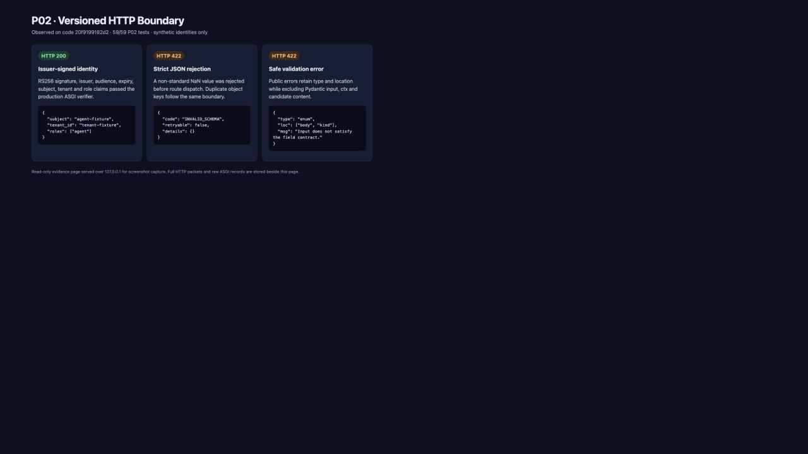

# P02 版本化合同与可审计测试底座交付报告

日期：2026-09-13

起点：`575a4f3d64ea135a1d8d93cd046187b250c5fec7`（协调方仅新增 P01 验收文档）

被测代码提交：`20f9199182d2b016428524997d5c688dbf4ab941`

实现提交：`20f9199 feat(vnext): add P02 contracts and test boundaries`

本文件与永久证据位于后续文档提交中；它不预写自己的未来提交 SHA。最终交付消息和 Git 历史记录该证据提交。

## 实现结果

- `packages/contracts/openapi-v2.yaml` 成为 v2 外部 wire 唯一来源，覆盖 S13 的 20 个公开/内部端点、`contracts.json` 全部枚举和 required shape，以及 Task/Work/approval/assessment/layout/query/record/dispatch/control 类型。接口状态逐项登记于 [`interface-inventory.md`](interface-inventory.md)。
- Python Pydantic 模型由 `datamodel-code-generator==0.79.0` 生成，TypeScript 由已冻结的 `openapi-typescript==7.13.0` 生成；`--check` 在临时目录重生成并逐字节比较，不在检查模式改文件。
- `wuji_core.contracts` 按 knowledge/execution/envelopes/views 重导出生成类型，只附加内部规则：model-only assessment 不得写 supported、Work direct-edge guard 与 `WorkItem.superseded` 禁止。没有第二套手写 wire 字段类。
- AgentPayload 与可信 RunIdentity/CaptureEnvelope/ResultEnvelope 分离；新增独立 `ProposalLocalRef`，只表达同批 client_ref，不伪装规范 `{entity_type,id,revision}`。
- 运行 revision/epoch/counter 和金额使用受约束字符串；fixture 限额保持 JSON integer；字符串空白和数组顺序在 canonicalization 中保留。
- 新的隔离 ASGI composition 不导入旧 `wuji_api.main`、Cairn 或 Pi。生产边界拒绝 duplicate keys、NaN/Infinity，使用 RS256 公钥验证 issuer/audience/时效/subject/tenant/roles，并将 immutable Principal 放入 request state。
- FastAPI/Pydantic 合同错误采用 S13 envelope；对外 details 仅保留规范化 `type`/`loc`/固定消息，不回显 `input`、`ctx`、异常对象或候选正文。
- `api_client` 驱动真实 ASGI app 并记录完整合成 HTTP；`test_tokens` 的临时私钥不落盘；`db_conn` 每例创建真实 PostgreSQL 数据库、独立 NOLOGIN migration owner 和 LOGIN app role，app 非 owner/非 superuser/无 BYPASSRLS/无 CREATE。

## 最终验证

完整命令、退出码、RED/GREEN 和范围见 [`test-results.json`](test-results.json)，59 个实际 test_name 见 [`test-names.txt`](test-names.txt)。最终被测 SHA 上的结果：

| 命令 | 退出码 | 观察结果 |
| --- | ---: | --- |
| `work/toolchain/bin/pnpm contracts:check:v2` | 0 | Python/TS 生成产物逐字节新鲜；Redocly valid |
| `work/toolchain/bin/pnpm exec tsc --noEmit --skipLibCheck --target ES2024 --module NodeNext --moduleResolution NodeNext packages/contracts/src/v2/generated.ts` | 0 | 无输出，生成 TS 编译通过 |
| `./scripts/vnext/uv.sh run --frozen pytest tests/vnext/test_contract_shapes.py --collect-only -q` | 0 | 实际收集 59 项 |
| `WUJI_TEST_EVIDENCE_DIR=docs/vnext/evidence/P02/runtime ./scripts/vnext/uv.sh run --frozen pytest tests/vnext/test_contract_shapes.py -q` | 0 | 59 passed in 1.99s |
| PG fixture 清理后只读查询 | 0 | `remaining_databases=[]`, `remaining_roles=[]` |

起步时曾在 `ebe1e86` 上运行 `pytest tests/vnext -q`，20 项通过且实际包含 P01；这不是 P02-only 结果。收到协调要求后没有再扫描或运行 P01，后续所有测试命令只指向 P02 文件。

## 行为 RED/GREEN 证据

- Auth：fail-closed stub 下 valid issuer token 得到 401，组内 3 failed/2 passed；接入真实 RS256/claims 验证后 5 passed，最终扩展 wrong issuer/audience/expired 后相关 9 项通过。
- Strict JSON：临时退化为标准 `json.loads` 后 duplicate key 与 NaN/±Infinity 四项均 `DID NOT RAISE`；恢复 object-pairs/parse-constant hooks 后纯解析及 ASGI 6 项通过。
- 错误回显：真实 ASGI 反例先观察到公共 error item 含 `input`/`ctx`；白名单修复后响应只含 `type`、`loc`、固定消息，两个敏感 sentinel 均不在响应。
- Assessment：命令嵌套原先可绕过 model-only supported 规则，测试以 `DID NOT RAISE` 失败；增加组合校验后通过。
- 生成新鲜度：OpenAPI 改动后 `--check` 退出 1 并准确列出 Python/TS 两个 stale 文件；生成后退出 0。
- PostgreSQL：首次真实 setup 到 app connect 时发现 fixture 重复传 `user`；按 trace 修正参数来源后查询通过，setup/query/cleanup 回执完整保存。

模块缺失造成的两次 exit 2 只登记为收集/脚手架阶段，不作为行为 RED 证明。

## HTTP、SQL 与截图证据

- 三份未截断请求/响应包：[`http-reproduction.md`](http-reproduction.md)。每份包含 method、URL、全部合成 headers、请求体、状态、响应 headers 与响应体。
- 全部逐交换原始记录：[`runtime/`](runtime/)。其中 signed 200 为 [`247a8daa9b47/http-exchanges.jsonl`](runtime/247a8daa9b47/http-exchanges.jsonl)，安全错误 422 为 [`bc8dbb66fe40/http-exchanges.jsonl`](runtime/bc8dbb66fe40/http-exchanges.jsonl)。
- PostgreSQL 完整 setup/query/cleanup：[`runtime/5ea0fd73bb34/postgres-events.jsonl`](runtime/5ea0fd73bb34/postgres-events.jsonl)。实际 readback 为 PostgreSQL `160002`、独立 DB/app/migration 名、`rolsuper=false`、`rolbypassrls=false`、CREATE=false；清理状态为 database/roles 空集合。
- 截图由主代理从安全 loopback `http://127.0.0.1:8765/result.html` 捕获，来源与摘要见 [`screenshots/provenance.json`](screenshots/provenance.json)。

## AC 状态与覆盖边界

| AC | 本任务状态 | 已验证 | 后续仍需验证 |
| --- | --- | --- | --- |
| AC-019 | partial | 精确 WorkState、全部合法 direct edge、无 superseded、终态不能回 ready | P05 的持久命令/状态守卫与 `intent_superseded` 取消原因 |
| AC-075 | partial | P02 59 项实际收集、v2 生成/lint、生成 TS 编译均有退出码 | P17/P20 的 Node Supervisor、正式 web、v2 browser config 与 fail/not_run/blocked 汇总 |

P02 未实现 P03 领域服务或生产业务路由，未运行浏览器产品 E2E、Node Supervisor、真实 RLS 业务表、真实模型、旧服务、生产切换、数据删除或推送。测试中的 `/api/v2/test/identity` 与 `/api/v2/test/claim` 仅用于把 production composition/auth/json/error boundary 组合进真实 ASGI 调用，不返回 Task/Claim 业务回执。

## 变更清单

- 合同与生成：`packages/contracts/openapi-v2.yaml`、`packages/contracts/src/v2/generated.ts`、`packages/wuji-core/src/wuji_core/contracts/*`、`scripts/vnext/generate_contracts.py`。
- HTTP 边界：`packages/wuji-core/src/wuji_core/http/*`。
- 测试底座：`tests/vnext/conftest.py`、`tests/vnext/support/*`、`tests/vnext/test_contract_shapes.py`。
- 依赖/入口：`packages/wuji-core/pyproject.toml`、`packages/maf-worker/pyproject.toml`、`packages/maf-worker/uv.lock`、`package.json`。P01 的 `agent-framework-core==1.18.0` 与 `agent-framework-openai==1.14.3` 未改变；旧 root uv/lock 未改。
- 永久证据：本目录。scratch 报告位于忽略的 `.superpowers/sdd/vnext-v2/P02-report.md`，未 force-add。
