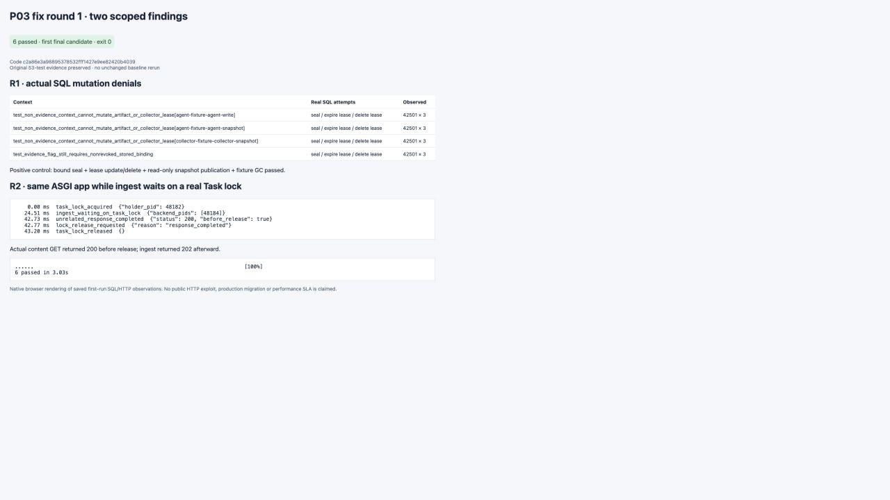

# P03 fix round 1

Code `c2a86e3a98895378532fff1427e9ee82420b4039`; base `59960377eb1bad6c5479c3c043db753ffb1dde14`. The first final candidate ran **6 focused tests, all passed in 3.03s** (exit 0). Its tree equals the code commit; this report belongs to the subsequent evidence commit. Main review remains pending.

1. **R1 — actual evidence mutation authority.** UoW now grants the capture flag only to evidence/capture/settle execution contexts. Artifact staged→sealed and lease writes use database mutation guards that require that authority and a matching nonrevoked stored collector binding. UPDATE visibility is retained for snapshot publication's SELECT FOR UPDATE. The new `vnext_0002_p03_evidence_authority` migration installs these guards after the known P03 base without rewriting business data. Tests cover Agent write/snapshot, collector snapshot, revoked binding, and positive bound seal/lease-update/lease-delete, read-only snapshot publication and ordinary fixture GC. **12 forbidden real DML attempts returned SQLSTATE 42501.**
2. **R2 — ASGI responsiveness.** The route reads the original body asynchronously, then awaits Starlette `run_in_threadpool(service.ingest, ...)`; the complete synchronous connection creation/transaction/file I/O stays in that worker. The regression observed a real blocked ingest backend, completed an actual GET through the same ASGI app before requesting Task-lock release, then received the ingest 202. A finite external fallback makes the unfixed red case terminate; this is one deterministic concurrency case, not SDK/stress testing.

Command: `WUJI_TEST_EVIDENCE_DIR=docs/vnext/evidence/P03/fix-round1/runtime ./scripts/vnext/uv.sh run --frozen pytest tests/vnext/test_p03_fix_round1.py -q --junitxml=docs/vnext/evidence/P03/fix-round1/final-junit.xml`.

Exact [run/tree binding](final.json), [stdout](final.txt), [JUnit](final-junit.xml), [test/SQL index](test-index.json), [red/green outcomes](red-green.json), and [lock/response observations](observations.json). The [complete HTTP reproduction package](http-reproduction.md) includes all three final exchanges and the preserved red exchanges with full request/response headers and bodies; SQL-only evidence is linked rather than fabricated as HTTP.

[Screenshot provenance](screenshots/provenance.json). This is a viewer of saved actual observations, not a product UI or a new test run.

The original code `dcf5cc2`, evidence `5996037`, 53-test result and all **215 original evidence file hashes remain unchanged** ([check](preserved-original.json)). Original future-owner AC limitations remain; this patch does not upgrade aggregate AC/gate status. Fresh isolated PostgreSQL fixtures install the base and guard upgrade; no production/old-service migration, broad role/GC matrix, SDK suite, P01/P02 baseline, paid model, push or user-data deletion was run. This is task-scoped self-verification, with review by main.
