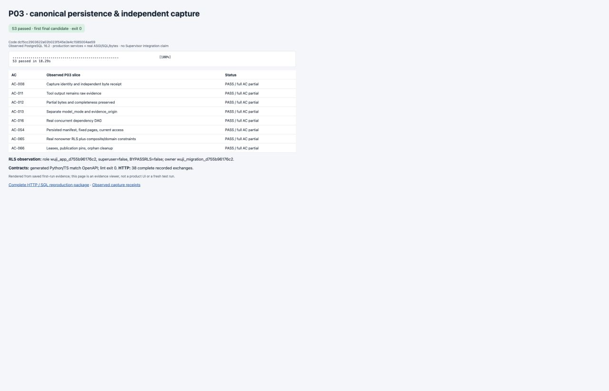
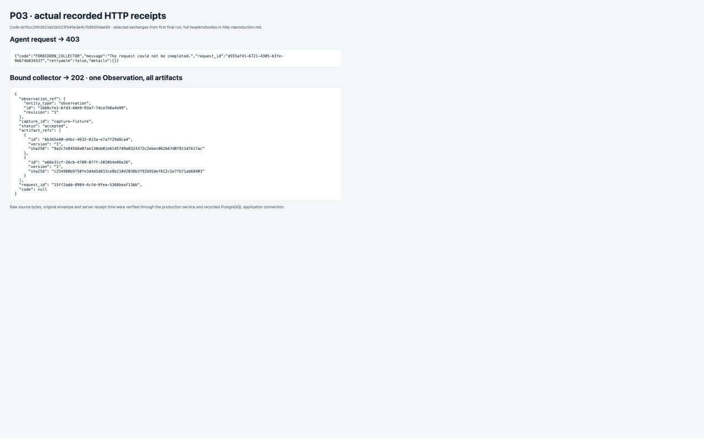

# P03 implementation report

Code: `dcf5cc2903622a02b023f545e3e4c1585004ae59`. Base: `8a3ee0ec4975227268faa302cf6e9a9bb6118b33`.
The first final run tested source tree `7e9aa747ee07a8af412124707dcaeabc98942af3`, identical to the code commit. This report/evidence is a later commit; its own SHA is supplied in the handoff, not predicted here.

P03's implemented slice passed **53 tests in 18.29s** on actual PostgreSQL **16.2**. Generation consistency and OpenAPI lint also passed. This is task-scoped implementation/self-review evidence; main owns review and aggregate gate acceptance. No P01/P02 baseline suite was rerun.

## Delivered behavior

- Independent `vnext_0001_p03` head, canonical parents, atomic typed revision registry, ClaimRevision/assessment/reference storage, Task counters/Outbox and locked WorkDependency DAG. Domain-backed registry checks and composite tenant/project/task FKs reject phantom/wrong-owner revisions; Fact has no second writable body.
- Actual bounded staging/sealing and production capture/content routes. Collector role alone is insufficient: stored Task access, attempt/start/receiver/epoch bindings are checked. One capture creates one Observation with all ordered artifacts. Original envelope is preserved; Observation uses server receipt time. Idempotency-Key equals capture_id; replay rechecks access; same input is stable and different input is 409. Authorized started late attempts are historical_only without reviving execution.
- No extractor dependency or automatic assessment of success text. Partial bodies can accompany complete metadata while the logical observation remains partial. Model mode and evidence origin stay separate; model/import artifacts cannot be relabeled into capture.
- Short RR transaction publishes a persistent manifest; later internal pages/read_ref preserve revision/state/relations and reauthorize. Snapshot pins, commit leases and typed references prevent GC from removing referenced bytes, including private pins hidden from the maintainer. Cleanup marks a tombstone before physical deletion and records completion for retry. This is fixture-object GC, not user-data purge.

## Commands and exact evidence

| Command | Outcome | Native evidence |
| --- | --- | --- |
| `WUJI_TEST_EVIDENCE_DIR=docs/vnext/evidence/P03/runtime ./scripts/vnext/uv.sh run --frozen pytest tests/vnext/test_p03_contracts.py tests/vnext/test_rls.py tests/vnext/test_capture_transactions.py -q --junitxml=docs/vnext/evidence/P03/final-junit.xml` | exit 0; 53 passed | [run/commit binding](final-pytest.json), [stdout](final-pytest.txt), [JUnit](final-junit.xml) |
| `work/toolchain/bin/pnpm contracts:check:v2` | exit 0; generated Python/TS match; OpenAPI valid | [command](final-contracts-check.json), [stdout](final-contracts-check.txt) |

[All test names and evidence directories](test-index.json). [Changed code paths](changed-files.txt). [Observed server/role receipts](observed-environment.json): actual application role is not owner, superuser or BYPASSRLS.

The **38 complete HTTP exchanges**, with method/URL/headers/request body/response body and associated SQL paths, are in [http-reproduction.md](http-reproduction.md). The package reconstructs recorded ASGI exchanges; it does not claim external target traffic. [Native input bytes and SHA-256 inventory](input-manifest.json) contains 70 files. SQL-only tests retain complete native SQL/row/transaction logs. Synthetic tokens are scoped to destroyed fixture issuers; reproduction generates fresh tokens.

Screenshots were taken from actual browser rendering of these saved first-run observations, not from a mocked product UI. [Screenshot provenance](screenshots/provenance.json).

## TDD record and limits

[red-green.json](red-green.json) links every recorded iteration. Initial contract, persistence, capture and snapshot tests failed on the missing behavior; targeted green followed. The generator omitted status/reference conditionals, so the public `EvidenceReceipt` wrapper enforces the OpenAPI condition. Its initial forward-reference rebuild failure is retained, not hidden. Later concrete red cases covered direct Agent SQL capture, mixed completeness, private Outbox visibility, revoked lease release, typed-reference retention and repeat cleanup. The final candidate ran once with durable evidence; subsequent work only assembled reports/screenshots.

All eight linked ACs remain **partial overall**. [ac-slices.json](ac-slices.json) maps exact passing P03 test names and remaining owners:

- **AC-008:** P03 Capture identity and independent byte receipt; P05 runtime provisioning/admission integration not_run.
- **AC-011:** P03 Tool output remains raw evidence; P04 system_is_healthy evaluation not_run; tool-start/exit receipt is an explicit prerequisite fixture.
- **AC-012:** P03 Partial bytes and completeness preserved; P04 local-field check / whole-file negative=inconclusive not_run.
- **AC-013:** P03 Separate model_mode and evidence_origin; P18 real SDK scenario / P19 import workflow not_run.
- **AC-016:** P03 Real concurrent dependency DAG; P04/P05/P09 business acceptance and satisfaction semantics not_run.
- **AC-054:** P03 Persisted manifest, fixed pages, current access; P13 topology HTTP pagination and 410 mapping not_run.
- **AC-065:** P03 Real nonowner RLS plus composite/domain constraints; P16 broader production authorization integration not_run.
- **AC-066:** P03 Leases, publication pins, orphan cleanup; P08 Session recovery / P16 Report retention and authorized purge not_run.

Run/start/exit rows in tests are explicitly seeded prerequisite receipts; they are not proof of Supervisor/tool-admission execution. AC-011/012 evaluation semantics remain P04. Actual SDK/import workflow, public topology HTTP pagination/410, Session recovery and Report retention remain with P18/P19, P13 and P08/P16 respectively. Local PostgreSQL 16.2 is not production image compatibility evidence.

## Consumer handoff

Read [the migration/interface notes](../../../../ops/vnext/migrations/README.md) and the main-owned [P03 implementation contract](../../P03-implementation-contract.md). P05/P06 must extend the canonical parents; never invent a parallel run/operation registry. Use `contracts.envelopes.EvidenceReceipt` and validated DecimalJSONResponse, not the raw generated base for policy-sensitive output. Snapshot `read_ref` is internal and must be mapped to a validated public DTO by P13. Only artifact/observation/claim registry kinds have implemented domain backing in this head; later kinds need actual schema support.

No unresolved task-local test failure remains. No subagents, paid models, old services, production switch, push or user-data deletion were used. The temporary screenshot viewer was stopped after capture; the existing PostgreSQL fixture was left running.
