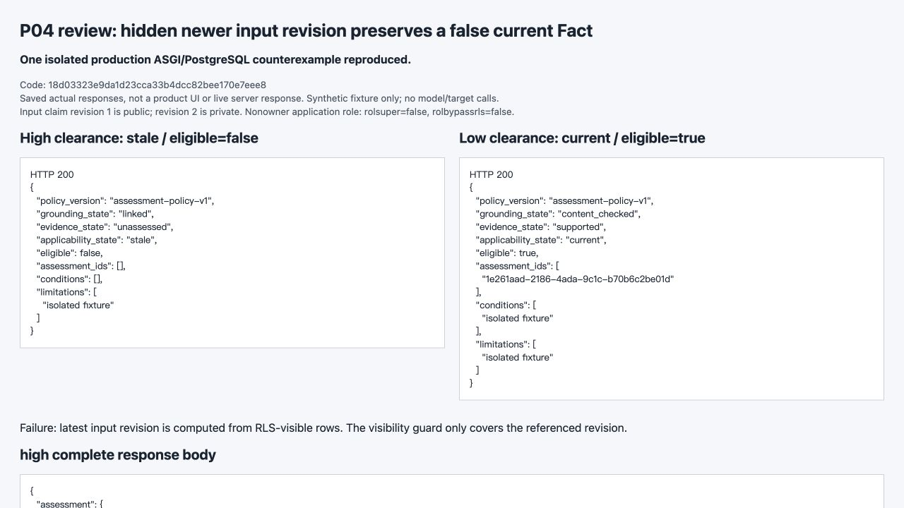
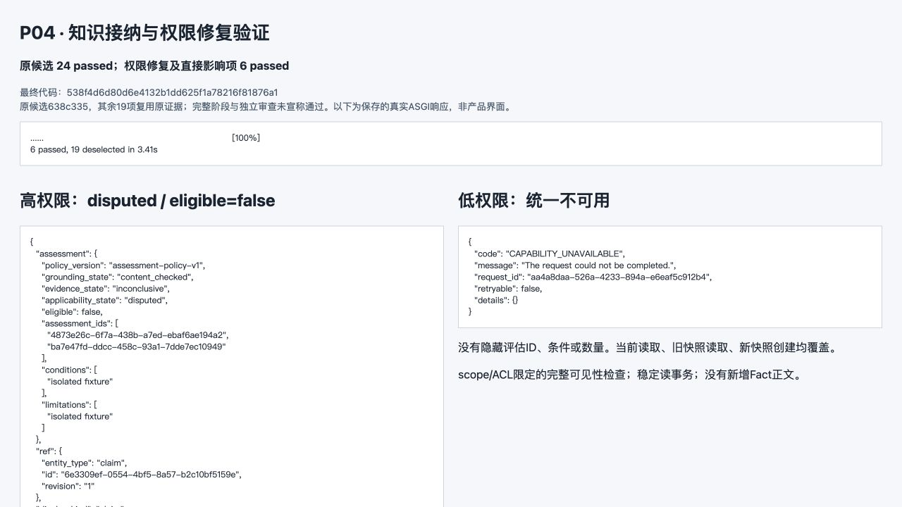

# P04 review fix round 1 · F1/F2

日期：2026-09-13。审查基线 `18d03323e9da1d23cca33b4dcc82bee170e7eee8`；修复代码 `2ce5250322c43fdbf38d23e9eefcbb8ab04b785b`。F1/P1、F2/P3 已处理，等待主代理复核；历史通过记录和失败证据保留。本报告属于后续证据提交。

F1：共享 `inputs_current()` 不再用读者 RLS 下的 `max(revision)`。新迁移 `vnext_0005_p04_input_freshness` 增加 scope/当前 ACL 检查的 SECURITY DEFINER `claim_input_current`：要求被引用的固定版本可读，再用完整领域版本状态返回布尔新鲜度；越出当前 scope/不可访问时返回不可用。隐藏后继版本只令结果 stale，不返回其版本号、ID、数量或条件。原引用和历史正文均不改写。

Fact 聚合在原有 Repeatable Read 事务内调用该边界；ResultCommitter 的 read_set 通过同一函数，在原有持有 Task 锁的发布事务内检查。ResultCommitter 无需复制另一套判断或修改源文件，真实 API 用例已经证明它保存 `STALE_INPUT` 限制。当前权限撤销后的读取仍拒绝。

| 本轮命令 | 实际结果 | 证据 |
| --- | --- | --- |
| `pytest tests/vnext/test_knowledge_admission.py -q -k 'private_new_premise or authoritative_freshness_for_private'`（新核心 frozen 包装） | RED：2 failed / 25 deselected，exit 1 | [命令](red-run.json)、[输出](red.txt) |
| 同文件 `-k 'private_new_premise or authoritative_freshness_for_private or migration_preserves_heads'` | **首次最终定向运行：3 passed / 24 deselected，1.64s，exit 0** | [完整命令与文件指纹](first-final-targeted.json)、[输出](first-final-targeted.txt)、[JUnit](junit.xml)、[提交匹配](commit-binding.json) |

两个新增用例分别覆盖 public premise v1→private v2 后的高/低 Fact 读取，以及低权限 Worker 的实际 ResultCommitter read_set；第三项复测新增 head/reapply/unknown-head 拒绝。测试工作树指纹与 `2ce5250` 的实际 Git 文件逐个匹配。未重跑旧24项或旧6项，未重新生成未改动的 OpenAPI/DTO；本轮不将旧结果冒称新提交实测。

完整输入、输出与原生数据库记录见 [本轮完整 HTTP](http-reproduction.md)、[原生证据索引](evidence-index.json)。阶段 setup 仍由隔离 SQL 夹具建立真实父身份和授权，生产服务产生业务记录；没有模型/工具重跑。HTTP 仅替换需重新签发的 fixture Authorization，其余报文和正文完整，SQL 无损压缩。

审查员的唯一实际反例已逐字节复制到 durable [review-counterexample/](review-counterexample/)，不是 force-add SDD。见 [原始观察](review-counterexample/observed.json)、[原始8次完整HTTP](review-counterexample/http-reproduction.md)、[原命令](review-counterexample/run.json)、[归档摘要比对](review-archive.json)。它证明的是 **18d0332 上的问题**；原脚本 exit 0 表示复现成功，不是修复通过。

F2：原 `knowledge-and-visibility.png` 实际为 JPEG，现仅改名 `.jpg` 并更新 provenance/report 引用，**没有重拍或改变任何图像字节**。80357 bytes，SHA-256 仍为 `ecf301926e81fbb03d053e9a9c0f6a57d160f8b1a00d9c97d7d1008d84b354aa`；[改名核对](image-rename.json)、[provenance](../screenshots/provenance.json)。此图对应上一轮直接隐藏反证修复，完整报文仍见 [原修复 HTTP](../fix-round1/http-reproduction.md)。

本轮代码仅修改 fact_view 共享检查、新迁移/迁移接入及定向测试，迁移 README 同步；F2 和本报告为证据元数据。未读取或修改未跟踪的 `docs/vnext/P05-implementation-contract.md`，未建立子代理、付费调用、启动旧服务、推送或删除用户数据。后续 P04 gate 由主代理复核，不在本轮提前改为通过。
