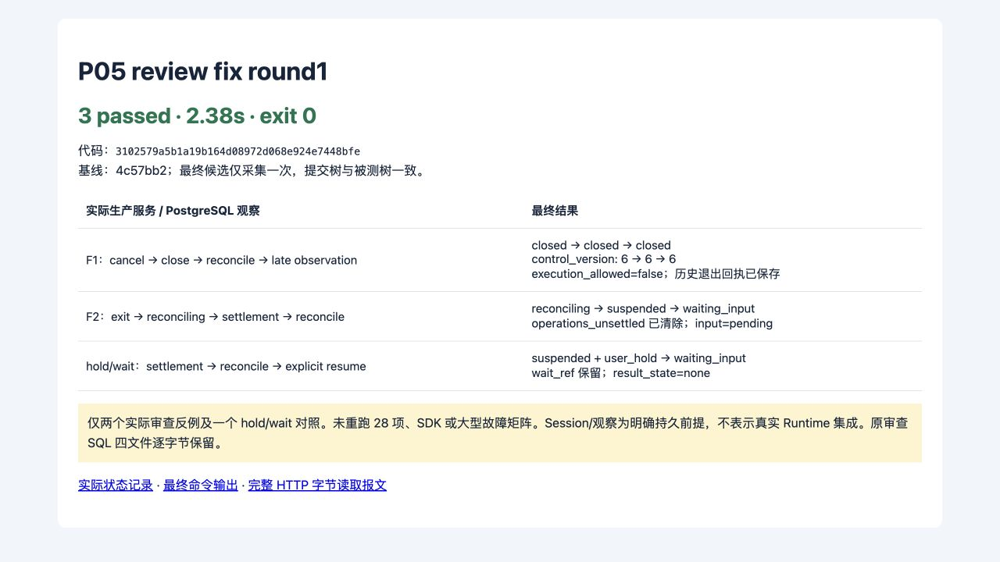

# P05 fix round1 · F1/F2

2026-09-13。限定两项 P2 修复完成，主控制器定向复核 PASS。基线 `4c57bb2d6768e0195973fcf7a48198ef0e018f01`；修复代码 `3102579a5b1a19b164d08972d068e924e7448bfe`。只改 `execution/control.py`，新增 `tests/vnext/test_p05_fix_round1.py`，没有迁移、权限、公开合同或转移图变更。复核结论与范围见 [controller-review.md](controller-review.md)。

- **F1：保留 Task.closed。** `_observe_task` 遇到已关闭 Task 直接保留终态；`reconcile` 和迟到观察仍沿原权限/回执入口执行。实际 cancel→close→reconcile→late observation 后始终 closed，control_version 为 **6→6→6**，execution_allowed 始终 false；迟到的 `late-exit-review` 已持久登记。
- **F2：输入结算后恢复。** 确认退出、操作结算、published pending input 和既有恢复校验通过后，在原 Task/Work 事务内通过 `require_transition` 执行 **reconciling→suspended→waiting_input**。复用 `_restore` 的原因/等待检查，没有增加直接边或强写状态。有暂停原因时沿原停止路径保持 suspended，清除已解除的 `operations_unsettled`；实际 hold 对照保留 user_hold 与 wait_ref，显式 resume 后才回 waiting_input。result_state 保持 none。

## 定向证据

已读审查原始 SQL 和 observed-result，两项历史错误分别为 closed→quiescing（version 6→7）及可恢复输入仍卡在 reconciling。其四份原始文件逐字节保存于 [review-counterexamples.tar.gz](review-counterexamples.tar.gz)，SHA256 与审查报告一致；原临时文件未修改或删除。

本轮只运行以下三个用例：

| 测试 | 结果 |
| --- | --- |
| test_f1_closed_cancel_survives_reconcile_and_late_observation | pass |
| test_f2_settlement_after_exit_restores_published_pending_input | pass |
| test_f2_hold_keeps_published_wait_suspended_until_explicit_resume | pass |

RED：基线业务代码上 **3 failed / 2.56s / exit 1**，[脱敏原输出](red.txt)。最终候选 **仅采集一次**：**3 passed / 2.38s / exit 0**，[原输出](final-green.txt)、[脱敏 JUnit](final-junit.xml)、[实际前后状态](test-results.json)。脱敏只替换本机 pytest 临时路径与 JUnit hostname，不改测试名、结果、耗时或失败内容。

```sh
WUJI_TEST_EVIDENCE_DIR=.superpowers/sdd/vnext-v2/P05-fix-round1/final-runtime \
  ./scripts/vnext/uv.sh run --frozen pytest tests/vnext/test_p05_fix_round1.py -q \
  --junitxml=.superpowers/sdd/vnext-v2/P05-fix-round1/final-junit.xml
```

此次最终 GREEN 在代码提交前执行；预先固定的候选 Git tree `86915aa1e2f77c9ad941fc717e18a9fd2d79f3ef` 与 `3102579^{tree}` 完全相同，提交前无未暂存代码差异。[code-binding.json](code-binding.json) 明确记录该顺序；没有为补提交 SHA 再运行测试。

原生 SQL 中 F2 的 `UPDATE ... state=suspended` 和 `UPDATE ... state=waiting_input` 均返回 UPDATE 1，位于同一提交之前。新 RED / GREEN 的完整 SQL、身份事件、实际状态和 HTTP 分别在 [red-runtime-redacted.tar.gz](red-runtime-redacted.tar.gz)、[final-runtime-redacted.tar.gz](final-runtime-redacted.tar.gz)，各 10 个文件。[成员索引](archive-members.json) 对新记录计算脱敏后归档字节 hash，对旧审查记录保留原始 hash，二者不混用。



截图来自本会话实际加载的 [结果页面](result.html)，呈现最终记录，不替代 SQL 或真实 Runtime 证明。临时 localhost 预览已关闭。[完整 HTTP 报文](http-reproduction.md) 是 F2 同一用例对已发布 Session history artifact 的现有字节路由读取，含方法/URL/Headers/完整请求及响应；短期测试 JWT 需通过原夹具重新签发。P05 尚无控制 HTTP 路由，未伪造对应报文。

## 保留范围

没有重跑原 28 项、SDK、旧阶段基线或大型故障矩阵。旧 `71741c4` 代码和 `4c57bb2` 证据完整保留；未变部分沿用其原 SHA 证据及 P05 审查结论，不称为本次实测。Session/Process 等仍是明确持久前提，实际 P08/P09/P10/P11/P12 运行集成保持后续范围。

无子代理、旧服务、付费模型、推送或用户数据删除；只使用原隔离 PG 夹具及其临时 DB/角色清理。父代理未跟踪的 P06 文档未读取、修改或暂存。本轮不增加目标资产或接口。

主控制器未重跑三项测试、原 28 项或 SDK；其独立工作是代码小 diff 审查和既有证据的离线核对。交付总清单见 [manifest.json](manifest.json)：归档成员数量、长度与 SHA256 全部匹配，截图已实际查看，完整 HTTP 报文与最终归档中的同一 exchange 一致，脱敏扫描未发现密钥、JWT、未替换 Bearer 或凭据 URL。
