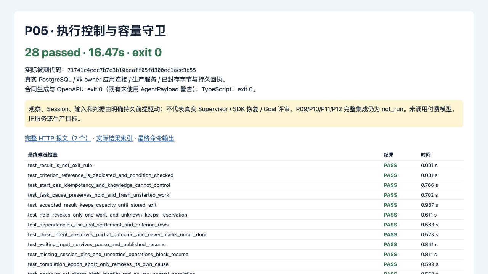

# P05 执行控制与容量交付

2026-09-13。P05 限定实现及定向自验完成，等待主控制器审查；不代表后续运行集成已验收。

被测代码：`71741c4eec7b7e3b10beaff05fd300ec1ace3b55`。基于父代理文档提交 `3e6bed4`，继承 P04 code `2ce5250` / evidence `01a7fe0`。本记录属于后续证据提交，不预写自身提交 SHA。

## 行为与所有权

- Task.control_version、Work.revision、Run.process_state 和结果投影分别维护。显式 start 校验保存的任务定义/起点/授权有效期/发布配置前提，原子记录激活和 task.started 触发；不创建 Bootstrap Run。Task pause 与 Work hold 按来源叠加；解除暂停保留独立 hold、未答输入和具体 CompletionEpoch。
- 控制与观察使用独立 ACL/角色；知识 can_write 或 Agent 角色不能修改控制字段或自行接纳结果。命令使用 Task/Work 独立命名空间、当前读权限重验、完整摘要和 CAS；状态/回执/Outbox 同事务。没有新增平台级 pause。
- 全局/共享模型池→租户池→Task→Work→Session→资源的锁序适用于容量预留、控制和释放。真实同库双租户争用同一池仅一方成功；失败事务回滚已取额度。accepted 结果不释放容量；完整停止回执释放本地进程容量，未知外部操作继续阻断相关工作及 Task 停止核对。
- 唯一 WorkDependency DAG 复用 P03 查环 trigger；settled、有效 accepted_result、固定 criterion 的当前 judgment 独立检查。失败/取消只满足 settled；已 superseded Intent 对应工作变为 cancelled + intent_superseded。已知未启动可 fresh start；已执行恢复检查实际封存对象、发布 pins、固定身份/锁版本和待定操作，缺少前提保持 blocked。
- P05 拥有 `persistence/control_schema.py` 的 `vnext_0006_p05_control`，扩展现有 canonical 父表、UoW 容量前置锁及控制 ACL；仅调整专用 GoalCriterionRef wire/生成物。P03 capture / P04 model_output 权限、registry 和既有结果记录保留。
- 经主控制器明确授权，P05 新增 `blackboard/result_state.py`；P04 committer 仅新增 import 和 receive/reconcile 各一处同事务调用。result_submission/result_receipt 是权威，agent_run.result_state 是受控投影。已有 accepted 重放不回退为 received；incomplete 仅在无提交、应有最终输出且已有可信最终停止/操作结算时 CAS。输入边界不自动 incomplete，迟到结果仍走 P04 当前资格。升级检查由实际旧 P04 migrator/committer 建立接纳前提，验证历史原回执保留且 Task 不自动激活。

完整端口与后续生产者所有权见 [迁移 README](../../../../ops/vnext/migrations/README.md)。Session/Input/Criterion/Completion/操作结算表是未来 P08/P12/P06 扩展的同一组 canonical headers；目前不向客户端开放发布或判定入口。

## 实际验证

最终候选仅集中采集一次，代码在采集后未改变：

```sh
WUJI_TEST_EVIDENCE_DIR=.superpowers/sdd/vnext-v2/P05-evidence/final-runtime \
  ./scripts/vnext/uv.sh run --frozen pytest tests/vnext/test_work_state_guards.py -q \
  --junitxml=.superpowers/sdd/vnext-v2/P05-evidence/final-junit.xml
```

结果：**exit 0，28 passed in 16.47s**。采用真实隔离 PostgreSQL、非 owner 应用连接、生产服务和 P03/P04 实际 ASGI 路由；没有 mock 业务返回或测试专用控制路由。完整测试名、时间与对应 SQL 目录见 [test-results.json](test-results.json)，原命令输出见 [final-green.txt](checks/final-green.txt)。

直接受影响的合同检查：`work/toolchain/bin/pnpm contracts:check:v2` → exit 0，Python/TS 生成物一致，OpenAPI 有效；仅有既有 unused AgentPayload 警告。`work/toolchain/bin/pnpm exec tsc --noEmit --strict --skipLibCheck --target ES2022 --module NodeNext --moduleResolution NodeNext packages/contracts/src/v2/generated.ts` → exit 0、无输出。这两项在同一候选内容上、代码提交前执行；没有因 SHA 或文档提交而重跑。

RED/GREEN 原输出保存在 [checks/](checks/)。初始 8 个检查因缺少 P05 入口/专用 criterion 形状失败；后续实际反例覆盖退出通知乱序、迁移未重建旧结果投影、hold 准入遗漏、外部未知状态、superseded Intent 和失败退出保留 accepted 结果。按 trace 修复的测试前提问题分别为未限定 Task 的 SQL FK 冲突，以及旧升级夹具用不同主体创建 Snapshot；这些诊断记录保留，不冒称业务 RED。最终 28 项均通过，随后停止测试。



截图由本 P05 实施会话通过 CUA 读取 localhost 的 [结果页](result.html) 并捕获；内容来自最终 JUnit/命令记录，不是平台 UI/真实 Supervisor 的运行证明。临时预览服务已关闭。

## 可复现数据与覆盖边界

- [完整 HTTP 请求/响应](http-reproduction.md)：7 组真实 P03/P04 路由报文，包含方法、URL、全部 Headers 与未截断业务正文。控制服务的输入、观察和响应由相同用例的实际 SQL/回执体现；正式控制 HTTP 接线属于 P11。
- [脱敏运行数据包](runtime-redacted.tar.gz)：65 个实际 SQL、身份事件、HTTP 和字节文件。[archive-members.json](archive-members.json) 的 hash 仅对应**脱敏后实际归档字节**，不与原始文件 hash 混用。短期测试 JWT 统一替换为可重签发标识，本机路径作占位；未保留私钥/真实凭据，业务请求/响应体未截断。
- 重放使用仓库现有隔离 PG fixture 配置与上述命令；测试签发器每次生成新的临时密钥/JWT，动态对象 ID 应取本次真实响应。原始未脱敏采集仅在被忽略的 `.superpowers/sdd/vnext-v2/P05-evidence/`，未加入 Git。

| AC | 本次证据 | 仍未覆盖 |
| --- | --- | --- |
| 015/019 | 三类持久条件、专用 criterion ref、双连接 DAG、终态拒绝、Intent 替代原因；固定未改边集继承 P02 证据 | P09 实际选择/派发 |
| 018/020 | 未 start 不可执行；结果/进程/操作独立、存储回执驱动释放、乱序退出与显式失败 | P09/P10 的真实进程与投递协议 |
| 021/022/023 | hold/pause/CompletionEpoch 叠加，wait 保留，封存对象/pins 恢复守卫 | P08 SDK/审批发布与恢复、P11 控制联调 |
| 033/034 | 无 Fact 的实际 capture 先独立入账，取消/失败仍可追溯字节 | Tool Router/Worker 最终回传的完整链 |
| 035 | 控制命令同键重放/异载荷冲突；结果原端口幂等和迟到结果 | P06/P08 ToolOperation 幂等与审批原子消费；不以命令测试冒充工具验收 |
| 052 | P12 持久决定前提下，关闭原因/partial 独立，未执行项 cancelled，已 done 保留 | P12 真实 precheck/Goal 评估/ReportCommit |
| 008 | 复用 P03 code `c2a86e3`、evidence `d5cdc30` 的采集身份权威证据；本次增加控制/观察/结果 SQL 权限反例 | 没有把旧采集全套重新记为本 SHA 实测 |

这些跨任务 AC 保持部分覆盖，后续部分为 **not_run**。预置 Process/Session/Input/Judgment/Completion headers 是明确前提，不是已启动进程、SDK 恢复或已满足 Goal 的证明。未运行 P01 SDK、未改代码的早期基线、付费模型、旧服务、生产目标、推送或用户数据删除；隔离夹具按既有流程清理其临时 DB/角色。无新目标资产发现。

本次代码提交包含 15 个明确所属文件：四个 execution 模块、control_schema/schema/UoW、结果投影端口与 committer 两处接入、execution 公共包装/OpenAPI/Python/TS 生成物、测试文件及迁移 README。主代理的 P06 文档未接管、未暂存。审查为实施者自查，不称独立测试。
