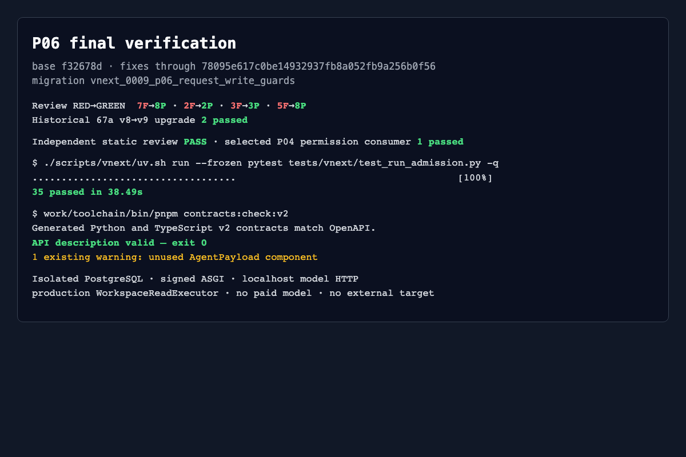

# P06 evidence index

Final validated code: `78095e617c0be14932937fb8a052fb9a256b0f56`;
migration head: `vnext_0009_p06_request_write_guards`.

- [Final report](full-candidate-6/report.md)
- [Complete synthetic HTTP reproduction packets](full-candidate-6/http-reproduction.md)
- [Interface inventory](full-candidate-6/interface-inventory.md)
- [Independent static review](full-candidate-6/independent-review.md)
- [Machine result](full-candidate-6/result.json)
- [Evidence SHA256 index](full-candidate-6/sha256.json)

The final behavioral command passed 35 tests; the selected P04 assessment-writer
consumer passed 1 test; contract generation/check exited 0. Review RED/GREEN
summaries are preserved in the sibling `review*` directories.

Original per-test PostgreSQL, identity and HTTP JSONL files remain under
`full-candidate-6/raw/` in this restricted local workspace. They are indexed by
SHA256 but are not staged into Git. The committed HTTP reproduction uses only
synthetic isolated credentials and contains complete, untruncated packets.
Earlier full-candidate directories are intermediate local evidence and are not
the acceptance source.
