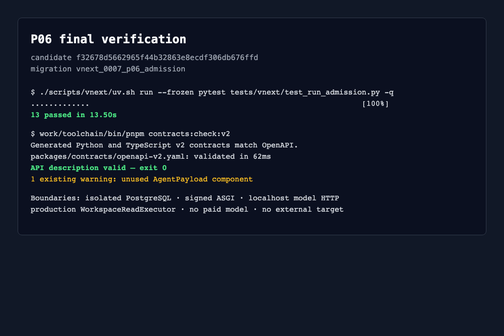

# P06 interface inventory

Validated candidate: `f32678d5662965f44b32863e8ecdf306db676ffd`;
migration head: `vnext_0007_p06_admission`.

| Interface | Purpose | Validation status |
| --- | --- | --- |
| `POST /internal/v2/model/chat/completions` | Signed native Chat Completions Gate | validated with localhost synthetic upstream |
| `GET /internal/v2/model-attempts/{id}` | Authorized durable model receipt lookup | validated; no new inference |
| `POST /internal/v2/tool-calls` | Canonical ToolCall admission and execution | validated with production `workspace_read` |
| `GET /internal/v2/tool-calls/{id}` | Authorized durable tool receipt lookup | validated; no re-execution |
| `POST /internal/v2/tool-calls/{id}/cancel` | Idempotent cancel intent | not run; cancellation race matrix remains P17 |
| `ToolGate.invoke_function(...)` | Function-call normalization into shared ToolAdmission | validated against server-side tool revocation |
| `ToolGate.invoke_mcp(...)` | Official MCP type normalization into shared ToolAdmission | fail-closed validated; official `mcp.types` absent, full path not run |
| `ToolGate.reconcile(...)` | Query/capture an existing tool operation | not run; unknown recovery matrix remains P17 |
| `ToolAdmission.retry(...)` | Explicit bounded retry after confirmed stopped attempt | not run; full retry fault matrix remains P17 |
| deployment registry functions | Freeze Task config, tool/executor definitions and Run bindings; revoke Run/tool | validated through isolated owner connection |
| `AdmissionLedger.snapshot/model_attempt/tool_call` | Durable cumulative counters and typed receipts | validated with new service instances and real PostgreSQL |

`http_target` is not published: registration rejects it until a real
redirect-aware Scope adapter exists. Worker/Run credentials do not receive Task
gateway keys or controller/admit/capture permissions.

Complete non-truncated request and response packets are in
[http-reproduction.md](http-reproduction.md). The final command outcome is in
[report.md](report.md).
