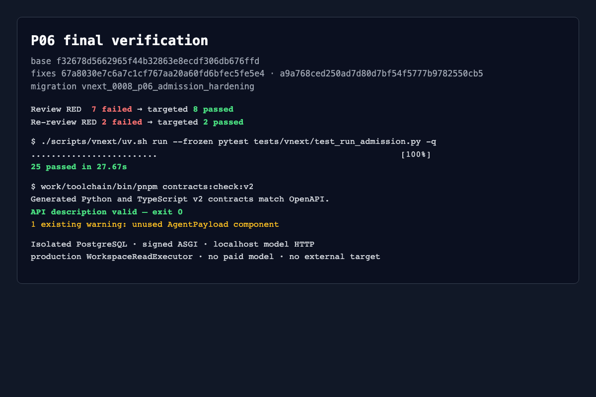

# P06 final validation report

P06 base `f32678d5662965f44b32863e8ecdf306db676ffd` was hardened by
`67a8030e7c6a7c1cf767aa20a60fd6bfec5fe5e4` and
`a9a768ced250ad7d80d7bf54f5777b9782550cb5`. The current migration head is
`vnext_0008_p06_admission_hardening`, which upgrades existing 0007 databases.



## Results

```sh
WUJI_TEST_EVIDENCE_DIR=$PWD/docs/vnext/evidence/P06/full-candidate-3/raw \
  ./scripts/vnext/uv.sh run --frozen pytest tests/vnext/test_run_admission.py -q
# 25 passed in 27.67s; exit 0

work/toolchain/bin/pnpm contracts:check:v2
# generated Python/TypeScript match OpenAPI; API valid; exit 0
```

The contract check was run after the OpenAPI response-header change. It is
reused for `a9a768c` because the follow-up changed only
`admission_hardening_schema.py`; OpenAPI and generated TypeScript hashes remain
identical. One existing warning remains for unused `AgentPayload`.

The review cycle produced seven meaningful RED failures, then a second RED with
two same-domain purpose violations. Targeted fixes passed 3 P1, 4 P2, one raw
receipt replay, and two request/settlement write-isolation checks before the
final 25-item run.

## Verified P06 boundaries

- Signed Run binding rechecks current Task/Work/Run epochs, process identity,
  reservations and revocation without granting control/admit/capture authority.
- Model admission preserves native JSON/SSE, keeps the Task key inside the Gate,
  handles `tools:null`, requires actual ToolGate capability assembly, separates
  response/billing/local state, and reconciles a proven not-sent slot without
  refund or resend.
- Model request/output limits persist across Runs and service instances; real
  multi-connection contention admits only one final request.
- ToolCall identity, digest replay/conflict/new call behavior, approval pending,
  cancellation replay, receiver permit CAS, late settlement and current
  revocation are persisted in PostgreSQL.
- Production `WorkspaceReadExecutor` writes a durable receiver receipt; the Gate
  then stages/seals bytes and persists EvidenceReceipt before return. At the
  output limit it preserves an actual prefix as partial evidence with
  `LIMIT_BLOCKED`; replay compares the receiver's original digest/length and
  does not recount.
- The 0008 RLS policies and triggers reject cross-domain and same-domain
  request/settlement forgeries while retaining legitimate send, dispatch,
  settlement and resource-release transitions.

Each HTTP-backed check has complete, untruncated request and response packets in
[http-reproduction.md](http-reproduction.md); raw inbound/outbound HTTP,
identity, and PostgreSQL event logs are under `raw/<test-node-hash>/`. Direct
service, RLS and OpenAPI checks are explicitly marked non-HTTP rather than given
fabricated packets. [interface-inventory.md](interface-inventory.md) records the
new routes and production ports.

## Acceptance limits

P06's portions of AC-032, AC-044 and AC-045 pass. AC-025 still depends on P09's
pure scheduling policy; AC-036 still depends on P07's official MCP package and
transport; AC-068 still depends on P16's complete trace/metric policy. P08
durable approval consumption, P10 Supervisor/Kali execution, real LiteLLM
pricing/billing reconciliation, P17 remote cancel/retry/restart fault matrix,
external targets and production cutover remain not run.

Independent static review status: pending final directed re-review of the 0008
same-domain purpose triggers.
