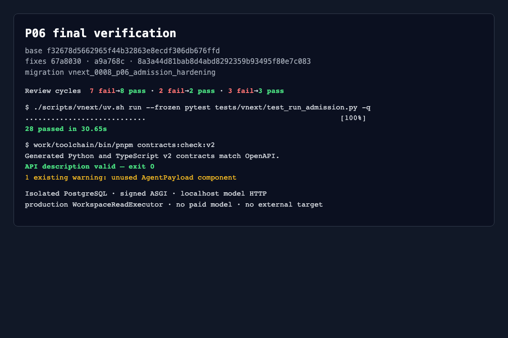

# P06 interface inventory

Validated fixes: `67a8030e7c6a7c1cf767aa20a60fd6bfec5fe5e4`,
`a9a768ced250ad7d80d7bf54f5777b9782550cb5`, and
`8a3a44d81bab8d4abd8292359b93495f80e7c083`; migration head:
`vnext_0008_p06_admission_hardening`.

| Interface | Purpose | Validation status |
| --- | --- | --- |
| `POST /internal/v2/model/chat/completions` | Signed native Chat Completions Gate | validated with localhost upstream, replay, limits, null tools and capability assembly |
| `GET /internal/v2/model-attempts/{id}` | Authorized durable model receipt | validated; no new inference |
| `ModelGate.reconcile` / `AdmissionLedger.reconcile_not_sent` | Settle proven not-sent slot without refund/resend | validated with rebuilt services and begin-send fence |
| `POST /internal/v2/tool-calls` | Canonical ToolCall admission/execution | validated with production `workspace_read`, approval pending, replay and partial evidence |
| `GET /internal/v2/tool-calls/{id}` | Authorized durable tool receipt | validated; no re-execution |
| `POST /internal/v2/tool-calls/{id}/cancel` | Idempotent cancel intent | service delivery replay validated; remote cancellation matrix remains P17 |
| `ToolGate.invoke_function` | Function normalization into shared ToolAdmission | validated against server-side revocation |
| `ToolGate.invoke_mcp` | Official MCP normalization | fail-closed validated; `mcp.types` absent, full path not run |
| `ToolCapabilityResolver(tool_gate)` | Require actual executor/collector assembly before model tool advertisement | missing and assembled paths validated |
| `ToolGate.reconcile` | Query/capture existing tool operation | complete receipt recovery validated; remote unknown recovery remains P17 |
| `ToolAdmission.retry` | Bounded retry after confirmed stopped attempt | registered retry/replay validated; wider remote retry matrix remains P17 |
| deployment registry functions | Freeze/revoke Task config, definitions, executors and Run bindings | validated through isolated owner connection |
| `AdmissionLedger.snapshot/model_attempt/tool_call` | Durable cumulative counters and typed receipts | validated with rebuilt services and PostgreSQL |
| 0008 purpose policies/triggers | Separate model/tool request/settlement INSERT and UPDATE | validated with cross-domain, same-domain, forged initial-state and legitimate-transition probes |

`http_target` remains unavailable until a real redirect-aware Scope adapter is
installed. Run credentials do not receive Task keys or
controller/admit/capture/observe permissions. Complete HTTP packets are in
[http-reproduction.md](http-reproduction.md).
