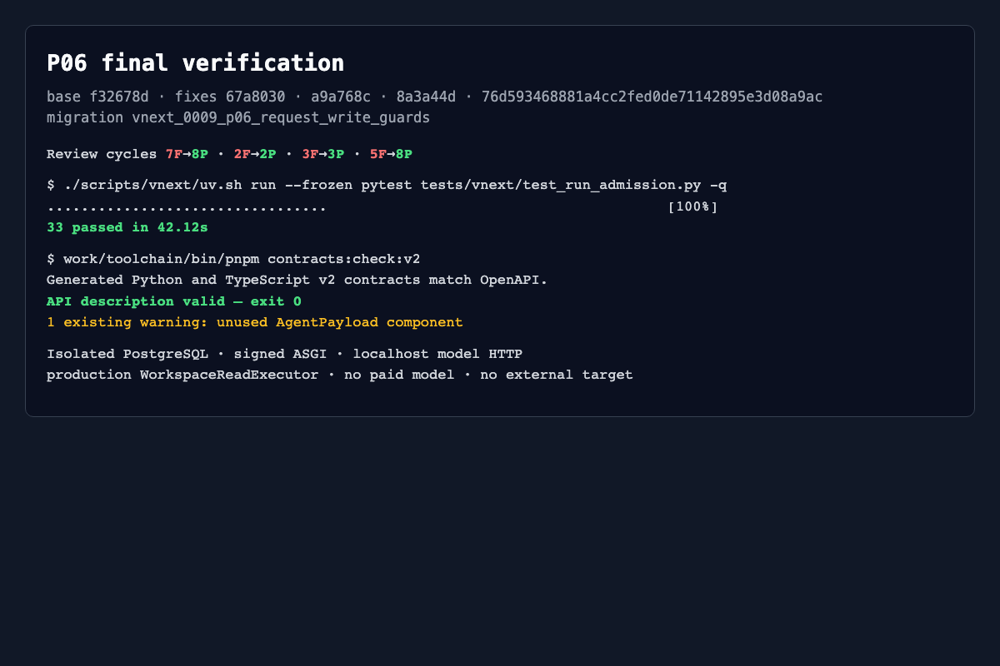

# P06 interface inventory

Validated code ends at `76d593468881a4cc2fed0de71142895e3d08a9ac`;
migration head is `vnext_0009_p06_request_write_guards`.

| Interface | Purpose | Validation status |
| --- | --- | --- |
| `POST /internal/v2/model/chat/completions` | Signed native Chat Completions Gate | validated with localhost upstream, replay, limits, null tools and capability assembly |
| `GET /internal/v2/model-attempts/{id}` | Durable model receipt | validated; no new inference |
| `ModelGate.reconcile` / `AdmissionLedger.reconcile_not_sent` | End proven not-sent slot without refund/resend | validated with rebuilt services and send fence |
| `POST /internal/v2/tool-calls` | Canonical ToolCall admission/execution | validated with production `workspace_read`, approval, replay and partial evidence |
| `GET /internal/v2/tool-calls/{id}` | Durable tool receipt | validated; no re-execution |
| `POST /internal/v2/tool-calls/{id}/cancel` | Idempotent cancel intent | delivery replay validated; remote matrix remains P17 |
| `ToolGate.invoke_function` | Function normalization | validated against server revocation |
| `ToolGate.invoke_mcp` | Official MCP normalization | fail-closed validated; official package/full path not run |
| `ToolCapabilityResolver(tool_gate)` | Require actual executor/collector assembly before tool advertisement | missing and assembled paths validated |
| `ToolAdmission.retry` | Retry confirmed stopped attempt | registered retry/replay validated; unknown/complete/nonterminal reopen denied |
| deployment registry functions | Freeze/revoke config, definitions, executors and Run bindings | validated through owner connection |
| `AdmissionLedger.snapshot/model_attempt/tool_call` | Durable cumulative counters/receipts | validated with rebuilt services and PostgreSQL |
| 0009 request-write matrix | Separate four purposes across nine authority tables | validated for initial states, INSERT/UPDATE, cancel intent, dispatch, settlement and safe retry |

`http_target` remains unavailable until a redirect-aware Scope adapter exists.
Run credentials do not receive Task keys or controller/admit/capture/observe
permissions. Complete HTTP packets are in
[http-reproduction.md](http-reproduction.md).
