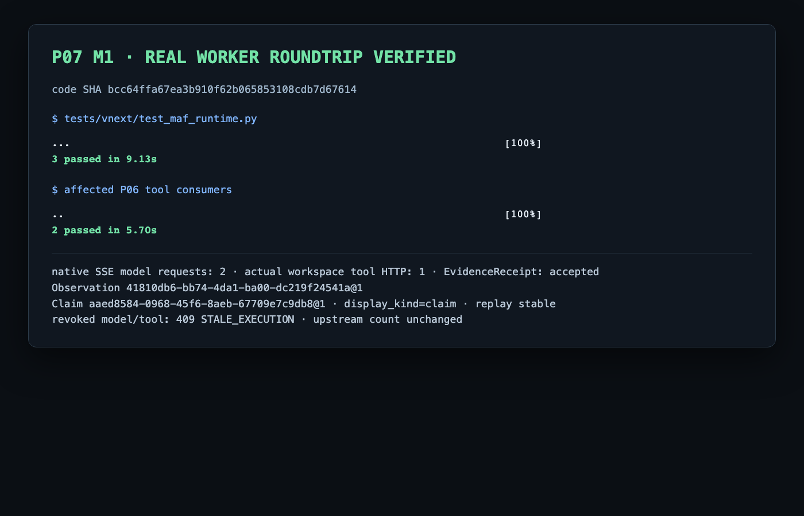

# P07 M1 真实 Worker 闭环证据

## 独立审查修复

独立审查提出的 2 个 P1 与 1 个 P2 已在代码
`5cfd581129c7991deaddaad9bfdaf8b4ee34b140` 修复并定向验证。当前证据见
[review-fixes/README.md](review-fixes/README.md)。下文 `bcc64ff` 结果保留为修复前的真实历史证据，不作为当前代码结论。

状态：**M1/P07 hosted integration slice passed**。被测代码 SHA 为
`bcc64ffa67ea3b910f62b065853108cdb7d67614`；核心起点为
`a014904085108b27cce78f3ffdc30d6d60ad03ef`，P06 既有基线为
`78095e617c0be14932937fb8a052fb9a256b0f56`。这不是完整 P07、恢复、真实模型效果、Scheduler、Supervisor、Pod 或 Task completion 验收。

最终 M1 命令为：

```text
WUJI_TEST_EVIDENCE_DIR="$PWD/docs/vnext/evidence/P07/M1/final-verified/raw" ./scripts/vnext/uv.sh run --frozen pytest tests/vnext/test_maf_runtime.py -q
```

结果为 **3 passed in 9.13s**。直接受影响的 P06 工具消费者为 **2 passed in 5.70s**；完整输出见 [final-verification.txt](final-verification.txt)。首个缺模块 RED 见 [initial-red.txt](initial-red.txt)。

主闭环实际经过 MAF SDK → ModelGate → localhost native SSE → MAF function middleware → ToolGate/ToolAdmission → WorkspaceReadExecutor → P03 Artifact/Observation/EvidenceReceipt → 第二次模型请求 → P04 raw-first ResultCommitter。最终摘要记录了 2 次模型请求、1 次工具 HTTP 请求、accepted_shared Claim 及 replay 前后稳定计数：[m1-result-summary.json](final-verified/raw/0b3a90d78c4d/m1-result-summary.json)。撤销后模型与工具请求均为 409 `STALE_EXECUTION`，且没有新增上游或尝试计数：[m1-revocation-summary.json](final-verified/raw/f0b4d1a67bd8/m1-revocation-summary.json)。

完整可复现请求包采用逐行 JSON：每行含 method、URL、全部非秘密 Headers、完整 request body 与 response body（body 以 base64 无截断保存）。测试 JWT 与 Task Key 按仓库保密约束仅将 Authorization 值记为 `Bearer [REDACTED TEST CREDENTIAL]`，复现时由 `tests/vnext/support/m1.py` 的隔离身份夹具重新签发。

- 主闭环正式 Gate HTTP：[platform-gate-http.jsonl](final-verified/raw/0b3a90d78c4d/platform-gate-http.jsonl)
- 主闭环 native SSE 上游：[model-upstream-http.jsonl](final-verified/raw/0b3a90d78c4d/model-upstream-http.jsonl)
- 主闭环完整 SQL：[postgres-events.jsonl](final-verified/raw/0b3a90d78c4d/postgres-events.jsonl)
- 撤销路径正式 Gate HTTP：[platform-gate-http.jsonl](final-verified/raw/f0b4d1a67bd8/platform-gate-http.jsonl)
- 撤销路径 native SSE 上游：[model-upstream-http.jsonl](final-verified/raw/f0b4d1a67bd8/model-upstream-http.jsonl)
- 撤销路径完整 SQL：[postgres-events.jsonl](final-verified/raw/f0b4d1a67bd8/postgres-events.jsonl)

本轮 RED 暴露并修复三个边界：严格 JSON 解码的 timeout 为 Decimal、SDK 固定发出的三个本地传输字段不属于 P06 DTO、非空 SDK occurrence ID 在 P06 digest 前未转为 wire 值。未放宽 RootContract、共享 schema 或权限。

验证截图：



接口与新增资产状态见 [interface-inventory.md](interface-inventory.md)。
