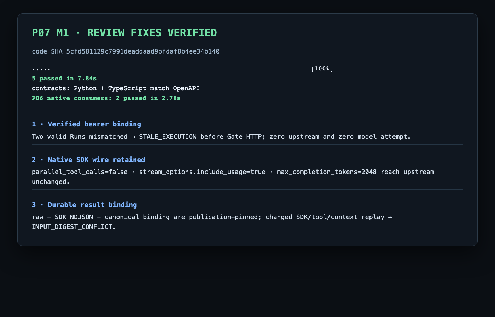

# P07 M1 独立审查修复证据

状态：**三个分配 finding 已修复并通过定向验证**。被测代码 SHA 为
`5cfd581129c7991deaddaad9bfdaf8b4ee34b140`。这是 hosted M1 修复状态，不是完整 P07、P08 恢复、Supervisor、Scheduler、Pod 或真实收费模型效果验收。

身份边界现在在任何 SDK HTTP 前用真实 `TokenVerifier` 验签 bearer，并由 Host 将其 Principal 与 `Host.access`、registry binding full RunIdentity、Assignment 一次核对。负控使用两个真实签发且各自绑定当前 Run 的有效凭据；错配路径没有产生 HTTP 文件，因为它在 Gate 前被拒绝，SQL/身份记录见 [错配身份 SQL](final-code-sha/raw/4a33faf6a572/postgres-events.jsonl) 与 [签发身份记录](final-code-sha/raw/4a33faf6a572/p06-identity-events.jsonl)。

OpenAPI v2 与生成 DTO 现在保留原生 `parallel_tool_calls=false`、`stream_options={"include_usage":true}`、`max_completion_tokens`，并明确禁止与 `max_tokens` 同时出现。Worker 不再 pop/rename；P06 只把 client model 替换为已发布 upstream model。完整 Gate 请求与响应见 [platform-gate-http.jsonl](final-code-sha/raw/0b3a90d78c4d/platform-gate-http.jsonl)，完整 upstream native SSE 报文见 [model-upstream-http.jsonl](final-code-sha/raw/0b3a90d78c4d/model-upstream-http.jsonl)。每行记录 method、URL、全部非秘密 Headers、无截断 request/response body（base64）；Authorization 值按仓库保密要求遮蔽，复现时由身份夹具重新签发。

SDK NDJSON 现在有稳定 publication；结果 publication 同时固定 raw、SDK 与 canonical binding 三个 sealed artifacts。binding 包含原始输出、SDK digest/ref、完整身份、context snapshot/input/text/read_set/record_refs/relations digest，以及实际 ToolCall/Evidence receipt IDs 和 digest。相同输入 replay 返回原 P04 receipt；SDK bytes、tool receipts 或 context 任一变化都在 P04 lookup 前返回 `INPUT_DIGEST_CONFLICT`。完整 SQL 见 [postgres-events.jsonl](final-code-sha/raw/0b3a90d78c4d/postgres-events.jsonl)，结果摘要见 [m1-result-summary.json](final-code-sha/raw/0b3a90d78c4d/m1-result-summary.json)。

最终命令输出见 [final-verification.txt](final-verification.txt)：M1 **5 passed in 7.84s**，合同生成一致，必要 P06 native consumers **2 passed in 2.78s**。三个先失败的检查见 [red.txt](red.txt)。

撤销路径继续返回模型/工具 409 `STALE_EXECUTION`，完整请求包见 [撤销 Gate HTTP](final-code-sha/raw/f0b4d1a67bd8/platform-gate-http.jsonl) 与 [撤销摘要](final-code-sha/raw/f0b4d1a67bd8/m1-revocation-summary.json)。

验证截图：

接口资产状态见 [interface-inventory.md](interface-inventory.md)。
