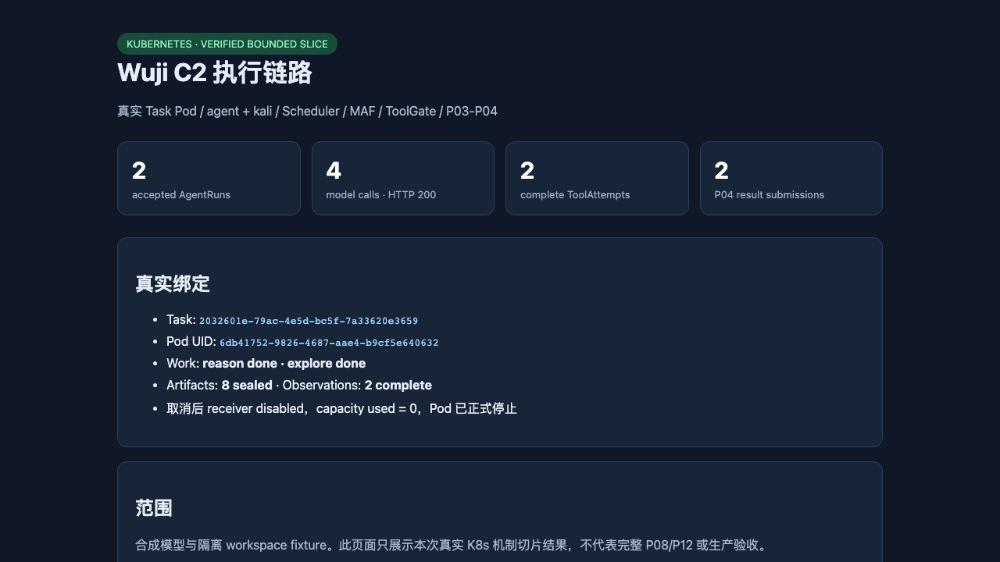

# P10/C2 Kubernetes hosted Explore result

Date: **September 14, 2026**. Scope: one isolated synthetic mechanism run on local `docker-desktop` Kubernetes. This is a bounded integration result, not full P10/P08/P12 acceptance.

## Result

The following chain completed through the real Kubernetes deployment:

```text
P05 Task permit
→ VNextPodRuntime / TaskRuntimeController
→ real Task Pod UID registration
→ Scheduler / Outbox
→ Node Supervisor
→ Python MAF child
→ ModelGate
→ ToolGate
→ HTTPS Kali executor
→ workspace_read(version.txt)
→ sealed P03 Artifact / Observation
→ P04 accepted Agent Claim
→ real child exit
```

Task `2032601e-79ac-4e5d-bc5f-7a33620e3659` used Pod `wuji-task-v-6c55a7ade961603dfaf6fa45d99c531d-a1`, UID `6db41752-9826-4687-aae4-b9cf5e640632`. Both `agent` and `kali` were Ready. The run produced two completed WorkItems (`reason`, `explore`), two accepted AgentRuns, four `200` model calls, two complete ToolAttempts, two sealed fixture Artifacts, two complete Observations, two received result submissions and two candidate Agent Claims. The Task was then cancelled through the control API; the receiver was disabled, capacity usage returned to zero, and the Pod was removed through the formal stop path.

The run used source `df5c926` and the immutable arm64 images listed in [source binding](source-binding.md). The later runtime-only stop fix is recorded separately. Historical failures remain unchanged.

## Evidence

- [Machine summary](result-summary.json)
- [Source and image binding](source-binding.md)
- [Complete HTTP packets](http-reproduction.md)
- [Raw database state](raw/final-db-state.stdout)
- [Raw result proof](raw/result-proof.stdout)
- [Pod spec and events](raw/task-pod.json), [raw/task-events.stdout](raw/task-events.stdout)
- [Start request/response](raw/start.request.json), [start response](raw/start.response.body)
- [Cancel request/response](raw/cancel.request.json), [cancel response](raw/cancel.response.body)
- [Model and tool bodies](raw/model-1-request.json), [raw/model-response-1.sse](raw/model-response-1.sse), [raw/tool-1-request.json](raw/tool-1-request.json), [raw/tool-1-receipt.json](raw/tool-1-receipt.json)



## Limits

- The model and workspace are synthetic/isolated; no external target traffic occurred.
- The result does not prove trusted P12 completion, browser workbench integration, compaction/GC/CAS edge cases, full Kubernetes egress policy, or production readiness.
- The Web workbench is deployed separately and remains a static shell until browser identity and live API integration are completed.
