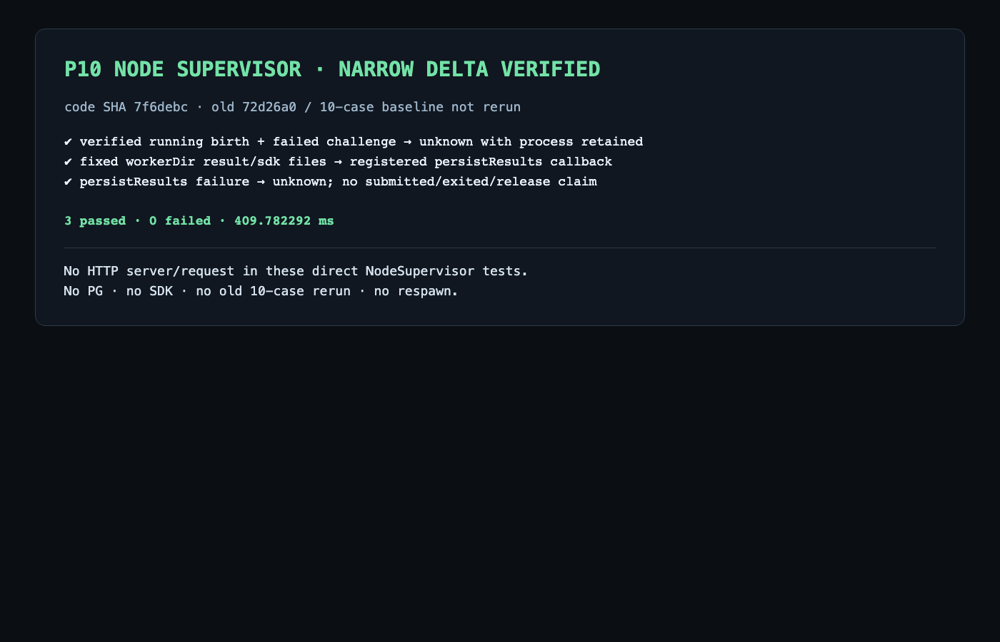

# P10 Node Supervisor 窄 delta 证据

Epicurus 对本提交提出的缺失/空 settlement P1 已在后续代码
`01f977d440d36fac765a3277cdde227761151cef` 修复；当前验证见
[review-fix/report.md](review-fix/report.md)。下文保留 `7f6debc` 的初始 delta 历史。

状态：**3 个新增定向场景通过**。被测代码提交为
`7f6debc06575a63ac168d1022d88f06ea1619a25`；既有 Node core 基线为 `72d26a02308ab54db2c7c56b52f9861b8acdda82`，既有 10-case 证据提交为 `57e4a3499f11c42e409dc0b8b889a25c07048348`。本轮没有重跑旧 10 项，也不改变其历史结论。

新增 `persistResults` hook 只从 Supervisor 已持久 operation 的 `record.directory/worker` 派生目录。仅当该目录存在 `result-request.json` 或 `sdk-request.json` 时才调用注册 adapter；传入的 Assignment 是 operation 的 canonical copy，调用者提供的路径不参与。实际无害 child 在该固定目录写入两个 0600 请求文件，测试确认 callback 读取到原文件。callback 抛错时，Supervisor 只能返回 `unknown` observation，不能报告结果已提交、进程已退出或资源已释放。

Epicurus P2 的独立场景先持久一份 HMAC 正确、identity/receiver/digest/birth 完整的 running proof，再令 guardian challenge 使用不存在的 socket。结果仍为 `unknown`，但 observation 与 source receipt 保留该 verified process/birth。`lastKnownProof` 只在 `validateProof()` 成功后赋值；缺失或 invalid proof 不能提供未来字段。`query/observe` 不进入 spawn 分支，因此原 operation 不会重启；unknown 也不构成 exit 或 release 证明。

验证命令与完整输出见 [test-output.txt](test-output.txt)。三项测试直接调用本地 `NodeSupervisor.start/query`，没有启动 HTTP server，也没有发送 HTTP 请求，因此本成果没有 HTTP 报文；没有用伪造 HTTP 包替代。测试启动的无害 child/guardian 均由测试 teardown 等待退出并删除临时目录。

验证截图：

本结果只覆盖 `persistResults` 与 last-known process 两个窄 delta，不证明 M2 Python bridge、PG、平台 HTTP、MAF SDK、Pod 隔离或完整 P10/P07。
