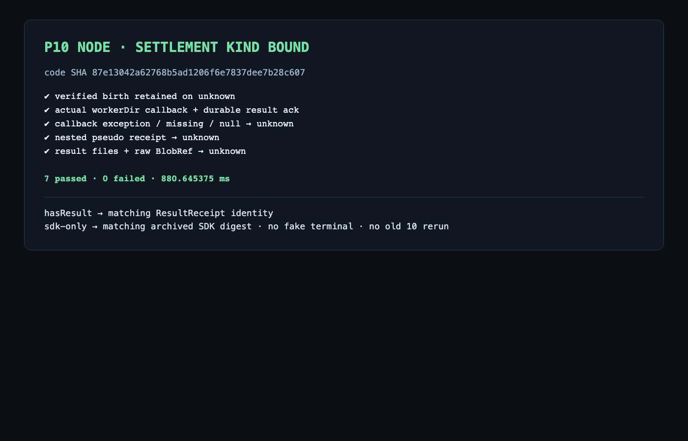

# P10 Node settlement 类型绑定复审修复

状态：`87e13042a62768b5ad1206f6e7837dee7b28c607` 的 **7 个定向场景通过**。Epicurus 已完成该源码的第三次窄复核并未发现原 P1 残留；正式复核报告仍待本证据提交绑定。本记录不把待写报告称为已归档结论。

本次修复把 controller 的外部 P04 `ResultReceipt` / SDK `BlobRef` 转成内部 `wuji.worker-settlement.v1` 判别式回执。回执固定绑定输出类型、Assignment digest，以及 result 的稳定 submission identity 或 SDK digest。Supervisor 根据固定 worker 目录中的真实文件判定 `hasResult` / `hasSdk`：存在 `result-request.json` 时只能接受匹配原 submission 的 result settlement；仅存在 `sdk-request.json` 时只能接受匹配原 SDK digest 的 archive settlement。

两个新增反例确认以下值不能让有结果文件的 child 进入 terminal：

- 顶层字段看似 ResultReceipt、但 `components=[null]` 且带任意错误码的对象；
- 同时存在 result/sdk 文件、callback 却只返回原始 `BlobRef` 的对象。

这两个反例与既有 5 个 delta 场景合并执行，结果为 **7 passed / 0 failed / 880.645375 ms**。保留的聚合输出见 [test-output.txt](test-output.txt)。该命令直接调用 `NodeSupervisor.start/query`，没有启动 HTTP server，也没有发出 HTTP 请求，因此此成果没有 HTTP 请求包；没有用构造的 HTTP 报文替代实际执行。

验证截图：

旧 Node 10-case、P06、M1、PG 和平台 HTTP 均未重跑。最新真实 M2 child consumer 的兼容验证单独归档在 `docs/vnext/evidence/P10/M2/`，不并入本 Node delta 证据。本结果只关闭同一 Node settlement P1，不提升完整 M2/P10/P07。
