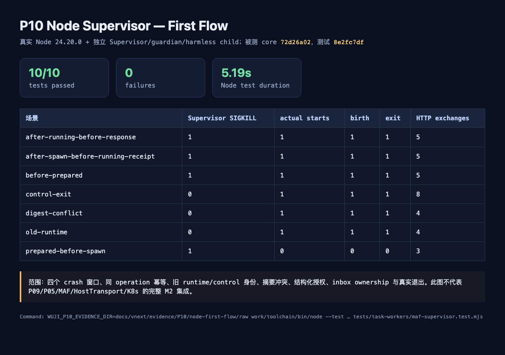

# P10 Node Supervisor first-flow 验证

状态：**Node-only PASS；完整 M2 未验收**。日期：2026-09-13。

## 被测对象与结果

- Node Supervisor core：`72d26a02308ab54db2c7c56b52f9861b8acdda82`。
- 测试与专用 support：`8e2fc7df599dc83756ebf2676ace44b761b41270`。
- 运行时：项目受管 Node `v24.20.0`。
- 结果：10 passed、0 failed、总时长 5191.985083 ms、退出码 0。

原命令：

```bash
WUJI_P10_EVIDENCE_DIR=docs/vnext/evidence/P10/node-first-flow/raw work/toolchain/bin/node --test --test-reporter=spec --test-reporter-destination=stdout --test-reporter=junit --test-reporter-destination=docs/vnext/evidence/P10/node-first-flow/node-junit.xml tests/task-workers/maf-supervisor.test.mjs
```

覆盖并通过：

- `before_prepared`：Supervisor 被真实 `SIGKILL` 后没有持久 operation；重投原 operation 实际出生一次。
- `after_prepared_before_spawn`：重启后为 `unknown`；原 operation 重投仍不 spawn，外部计数为 0。
- `after_spawn_before_running_receipt`：guardian 恢复同一实际出生身份；查询和重投均不产生第二个 child。
- `after_running_before_response`：响应丢失后查询/重投返回原运行事实；外部计数为 1。
- 同 operation 不同 Assignment 摘要返回 `INPUT_DIGEST_CONFLICT`，不双 spawn。
- 旧 `runtime_attempt` 与旧 control identity 在 spawn/control 前返回 `STALE_EXECUTION`。
- bare boolean 授权不能替代完整 grant；同一 inbox 同时仅一个 owner，重开时 receiver identity 保持稳定。
- stop 回执先为 `accepted` 且执行仍为 `running`；随后 guardian 记录实际 `exited`、出生身份、退出时间和退出码。

## RED / GREEN 过程

1. 首 RED：在 core 实现前执行 `work/toolchain/bin/node --test tests/task-workers/maf-supervisor.test.mjs`，退出码 1，`ERR_MODULE_NOT_FOUND` 指向缺少的 `services/maf-supervisor/main.mjs`。该结果已即时通知 core/main，并触发 core START。
2. 首个真实流程：core `72d26a0` 交接后，响应丢失重投用例直接通过；实际 child count 为 1，后续观察到真实退出。
3. crash harness 首 RED：请求断开后只检查 `ChildProcess.exitCode`，5 秒超时。进程表与 crash marker 证明宿主已退出；根因是信号退出记录在 `signalCode=SIGKILL`。只修复测试 harness，复测通过。
4. control harness 首 RED：期望退出码 0，实际为 143。根因是测试在 child 安装 SIGTERM handler 前发送 control；调整夹具先安装 handler、再写 ready/count，并等待 ready 后发 control。只修复测试夹具，复测通过。

Node core 六个源文件没有因本轮 Node 检查产生普通修复。

## 证据

- 截图：[Node first-flow 结果](screenshots/node-first-flow.png)
- 完整 HTTP 请求/响应与进程证据：[HTTP 复现包](http-reproduction.md)
- 机器结果：[JUnit](node-junit.xml)
- 可重渲染页面：[result.html](result.html)
- 每场景完整原始数据：[raw/](raw/)



## 限制与未测项

本结果只证明独立 Node Supervisor、guardian 和无害 child 的本地进程边界。测试 authorizer 使用结构完整的受控 HTTP 适配器，用于验证 Supervisor 会重验字段并拒绝旧身份/bare boolean；它不替代 P09 的 PostgreSQL 权限事实。相同本机 UID 的夹具也不证明生产 Pod 的文件系统隔离。

Python core `fd9c474ab2be9d32aeabda2690a120cb2c003343`、P09 receiver/pod 绑定、真实 `await_start`、P05 running/容量、同一 MAF `run_assignment`、HostTransport、结果先于退出以及 Kubernetes 均未在本窗口执行。它们继续保持 `not_run`/blocked；本报告不把 harmless child slice 表述为完整 M2。
