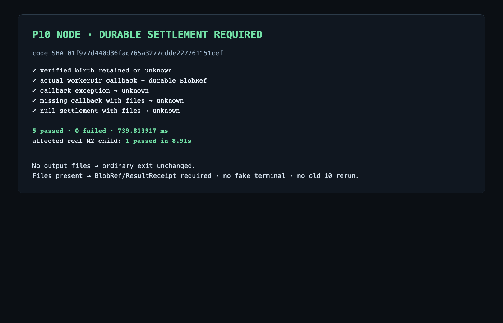

# P10 Node settlement P1 第二次窄复审

> 永久归档派生说明：本文件派生自 `.superpowers/sdd/vnext-v2/P10-node-rereview-2.md`；源字节 SHA-256 `be3658c925171a7ec41a96b226465cfb305062795c2d8fd0fde0d7f61d64b8e0`。除本说明与相对链接目标外，正文、执行者、提交 SHA 和各轮历史结论保持原样；精确行号引用使用本目录 `references/` 中的原字节副本。

- 日期：2026-09-13
- 结论：**P1 残留；非 PASS**
- 固定代码：`01f977d440d36fac765a3277cdde227761151cef`
- 固定证据：`4208d2a50fadb88564edfa5a891d48ecb0cdfd5e`
- 比较基线：`7f6debc06575a63ac168d1022d88f06ea1619a25`
- 范围：`services/maf-supervisor/main.mjs` 与 `tests/task-workers/maf-supervisor-persist-results.test.mjs` 的该提交增量。
- 角色：本审查由 main 直接派出的独立 SOL/xhigh 审查代理执行；main 没有执行本审查。5-case 和受影响 M2 child 结果均为 Dirac 证据复用。
- 方法：只读代码与证据复审；未运行 Node、测试、进程、数据库、HTTP 或浏览器。旧 10-case、Python、Bridge/OpenAPI 实现、P09/P13 与完整 P10/M2 均未重审。

## 已关闭：缺 callback / null settlement 被当作成功

`01f977d` 已关闭上一轮报告中的直接反例：

- [`main.mjs`](../../../../../services/maf-supervisor/main.mjs) 52–60 行用 `null` 明确表示未注册 callback，不再安装默认成功 no-op。
- 151–162 行在没有 result/sdk 文件时直接返回，保留普通无输出 child 的合法退出；存在文件时，缺 callback、返回 `null/undefined` 或抛错都不能通过 `durableSettlement()`。
- 165–190 行在 settlement 未确认时保持 `unknown`，并继续保留已经验证的 last-known process/birth；不写 `running/exited`，不进入 spawn，也不构成 release 证明。
- [专用测试](../../../../../tests/task-workers/maf-supervisor-persist-results.test.mjs) 125–170 行增加了缺 callback 与 null 返回两个场景。封存结果记录这两项及原三项通过；本审查没有重跑。

## P1 · 顶层 lookalike 或错误类型可冒充严格 durable settlement

**文件与行：**[`services/maf-supervisor/main.mjs`](../../../../../services/maf-supervisor/main.mjs) 27–39、151–162 行；相邻证明见 [`tests/task-workers/maf-supervisor-persist-results.test.mjs`](../../../../../tests/task-workers/maf-supervisor-persist-results.test.mjs) 52–86 行。

**触发 A：非严格 ResultReceipt。**注册 callback 返回拥有五个预期顶层键的对象，但 `components` 含无效元素，或 `code` 是不在 ErrorCode 枚举中的任意字符串。

```json
{
  "submission_id": "submission-1",
  "status": "accepted",
  "components": [null],
  "request_id": "request-1",
  "code": "not-a-contract-error-code"
}
```

该对象不是 OpenAPI `ResultReceipt`：每个 ComponentReceipt 必须是额外字段禁止、且至少包含 `status/local_ref/request_id` 的对象，`status` 还受固定枚举约束；`code` 也必须是 ErrorCode 或 null。但 33–37 行只检查 `components` 是数组、`code` 是任意非空短字符串，因此返回 true。

**触发 B：settlement 类型未与待补交文件绑定。**固定 workerDir 中已有 `result-request.json`，callback 只返回一个合法 BlobRef，而没有返回该 result request 的 P04 ResultReceipt。当前 151–162 行接受 BlobRef 或 ResultReceipt，不记录触发文件种类，也不要求 result 文件对应 ResultReceipt。[当前成功测试](../../../../../tests/task-workers/maf-supervisor-persist-results.test.mjs)的无害 child 同时写出 sdk/result 两个文件，callback 在 61 行仅返回 BlobRef，测试仍允许 80 行观察 `exited`，因此该缺口在现有 5-case 中被当作正向路径。

**影响：**错误配置或有缺陷的 callback 可以返回一个顶层相似对象，或只封存 SDK artifact 而未提交 result request；Supervisor 随后仍可持久 `running/exited`。一旦写入 `exited`，165–166 行后续观察直接返回，自动补交入口不再运行。真实 result bytes 因而可能未进入 controller/P03/P04，却失去自动恢复机会；这与上一轮 P1 相同，属于 fail-open 的结果完整性问题。

**最小反例：**

```text
worker/result-request.json exists and child has signed exited proof
persistResults returns either:
  1) top-level ResultReceipt lookalike with components=[null], or
  2) valid BlobRef without settling result-request.json
durableSettlement() returns true
observe() writes exited
later query short-circuits; result callback is not retried
```

该反例只涉及本次 `main.mjs` helper/hook 和固定 workerDir，不依赖 Python、PG、HTTP、PID 检查或完整 M2。

**合同依据：**

- [`packages/contracts/openapi-v2.yaml`](../../../../../packages/contracts/openapi-v2.yaml) 843–848、968–975、1653–1668、2082–2096 行定义严格 BlobRef、ResultReceipt 和 ComponentReceipt。
- [P10 Worker bridge interface](references/P10-worker-bridge-interface.md) 45–48、72–80、100–105、122–126 行将 sdk archive 对应 BlobRef、result submit/replay 对应 ResultReceipt，并要求原始保存请求获得真实 controller receipt。
- [P10 core interface](references/P10-core-interface.md) 39 行要求先耐久核对既有结果，再把 process observation 交给 P05。

**最小修复方向：**

1. `durableSettlement` 对 ResultReceipt 做递归严格校验：ComponentReceipt 的 exact keys、status 枚举、local/request refs、canonical_ref 和 ErrorCode 均符合现有合同；或让注册 ControllerAdapter 返回一个由 controller 严格验证后生成的内部判别式 settlement ack，Node 只接受该固定形状。
2. `persistProducedResults` 明确记录 `hasResult/hasSdk`：存在 result request 时只接受 ResultReceipt；仅存在 sdk request 时才接受 BlobRef。两者同时存在时以 result request 的 ResultReceipt 为完成依据。
3. 对“无效嵌套 ResultReceipt”和“result 文件 + BlobRef”增加两个窄 RED→GREEN，复测现有 5 个 settlement cases；无需重跑旧 10 或扩大 M2。

## 证据复用与边界

- [修复报告](../../../../../docs/vnext/evidence/P10/node-delta/review-fix/report.md)与[完整输出](../../../../../docs/vnext/evidence/P10/node-delta/review-fix/test-output.txt)记录 `01f977d` 的 5 passed、0 failed、739.813917 ms。它们覆盖原三项、callback 缺失和 null 返回；没有覆盖上述错误 settlement 形状/类型。
- 截图：[Node settlement](../../../../../docs/vnext/evidence/P10/node-delta/review-fix/screenshots/node-settlement.png)。



- 受影响真实 M2 child 的 `1 passed in 8.91s` 由 Dirac 执行并记录；它不在本审查范围，也不用于把完整 M2 标为通过。
- 这些直接 Node tests 没有启动 HTTP server 或发送 HTTP 请求，因此没有新增 HTTP 报文；未伪造请求包。旧 10-case 与其完整 HTTP 证据保持原历史结论，本次未重跑、未重审。
- 原可信 birth P2、四崩溃窗口、单 receiver、digest conflict、accepted≠stopped 与旧身份结论沿用既有审查。未执行 cleanup 探活或任何进程操作。
