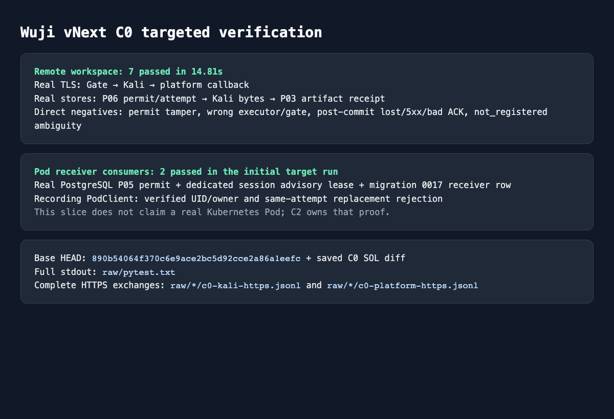

# P10 C0 runtime adapters 定向证据

本包归档已完成的 Remote Workspace 与 Task Pod receiver 消费者验证，不重跑测试，也不复制旧 M2/P08 证据。C0 代码提交为 `d2beac6980aab7959367299f91e4dd2558de9b59`；证据文档提交由本目录后续 Git 历史单独标识。

Remote 最终结果是 **7 passed / 14.81s**。覆盖真实 PostgreSQL P06 permit/attempt、Gate→Kali 与 Kali→平台 callback 的真实 HTTPS、Kali 原始文件字节、P03 Artifact/Observation、撤销后旧 receipt 查询、新执行拒绝、permit/部署身份篡改拒绝、callback 提交后 ACK 丢失/5xx/坏 ACK 的 prepared unknown，以及不明 dispatch 对同 attempt 只 query 一次且 `not_registered` 不允许 retry。

Pod 两项在首轮目标集合末尾通过。它们使用真实 PostgreSQL P05 当前许可、0017 SQL port、专用 session advisory lease 与记录型 PodClient，验证已核对 Pod UID 后登记 receiver、错误 owner 和同 attempt 不同 UID 拒绝。**记录型 PodClient 不证明真实 Kubernetes Pod；C2 使用独立 namespace/PG 另存部署证据。**

截图是原本地证据的直接复制，画面中的 `raw/*` 路径指生成截图时的 `work/vnext/c0-sol-remote-r2/`。归档后的入口如下：

- [源码、dirty 与测试绑定](source-binding.md)
- [完整脱敏 HTTP 请求/响应](http-reproduction.md)
- [完整脱敏 PostgreSQL 事件流](sql-reproduction.md)
- [机器索引、原始本地摘要与脱敏计数](index.json)
- [Remote 最终 stdout](raw/remote/pytest-7pass.txt)
- [首轮 3 PASS / 6 TLS FAIL stdout](raw/history/initial-target-3pass-6tls-fail.txt)
- [缺 task-runtime 的 collection](raw/history/collection-missing-task-runtime.txt)
- [缺 kubernetes 依赖的 collection](raw/history/collection-missing-kubernetes.txt)
- [Pod collection 顺序](raw/pod/collection.txt)
- [默认关闭 receipts 的旧模板兼容结果](raw/pod/default-template-compat.txt)
- [归档前 README 原文](raw/history/prearchive-readme.md)

## 脱敏与原件边界

原始 JSONL 只保留在忽略的本地 `work/`，没有进入 Git。归档器对 HTTP body、Headers、SQL params/result 内嵌 JSON 递归处理，替换 Authorization/JWT、`execution_token`、私钥、密码和其他凭据值；每个替换项保留该原值的 SHA-256 占位符。`index.json` 同时记录每个本地原件的路径、字节数、SHA-256、归档派生物 SHA-256 与脱敏计数。测试 CA 私钥未写入原始证据集合，也未复制到本包。

HTTP 包保留完整方法、URL、Headers、请求体、状态、响应 Headers 与响应体。脱敏后重放需由测试签发器重新生成凭据并重新计算 Content-Length；占位符不是有效授权。压缩 SQL 文件解压后是完整有序 JSONL，不以摘要行代替实际 SQL/参数/结果。

## 结果限制

- 运行时没有保存未提交树对象 ID；准确绑定只能记录为基线 `890b540` 加当时 dirty diff，随后提交为 `d2beac6`。Remote 最终通过后仅删除了 `support/c0.py` 中未被引用的辅助函数，没有重跑；详见[source-binding](source-binding.md)。
- 首轮总命令的 3 个 PASS 由 collection 顺序对应纯 wire 与两个 Pod 测试；其余 6 个 Remote 用例在 TLS 握手处因测试 CA 缺 Authority Key Identifier 失败。这些失败不是产品请求结果，原 stdout 保留且没有改写。
- 两轮 collection 是测试环境依赖入口修正，不是产品失败。模块在已有根 `task-runtime` dependency group 下可用后停止排查，没有修改 Bacon 管理的 lock。
- Remote 最终命令执行整个文件，因而纯 wire 被顺带复跑一次；没有再次运行 Pod、PG 或旧 M2/P08。
