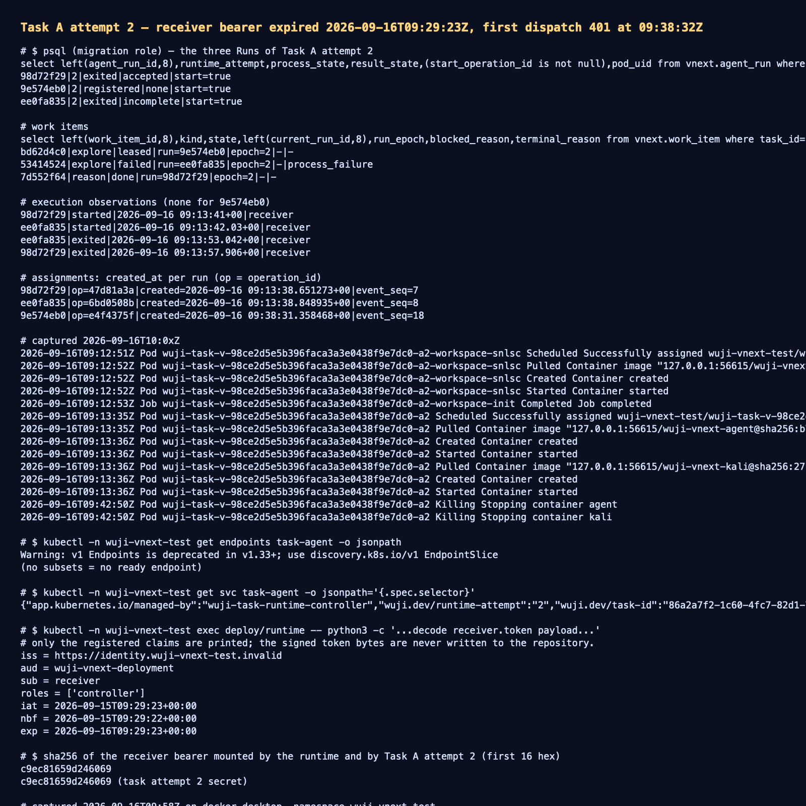

# Task A attempt 2 — the receiver bearer expired mid-attempt and stranded the new Run

- 日期：2026-09-16；工作树 `work/worktrees/vnext-maf`，分支 `codex/vnext-maf`，观测时 HEAD `34b7802`。
- 集群：`docker-desktop` / `wuji-vnext-test`；数据库迁移头 `vnext_0020_p06_run_settlement_close`。
- 被测对象：P11 "运行中的 Task 接纳后续 Intent" 路径（`de623e7` 的 owner `--phase intent`），即 Task A
  `86a2a7f2-1c60-4fc7-82d1-748a26fcd6e4` attempt 2 内的第三个 Run。
- 结果：**未通过**。该 Run 从未被投递成功，停在 `registered`，把 Task A 锁死；根因是部署级 receiver bearer
  生命周期与 attempt 寿命不匹配，外加三处平台侧联锁缺陷。

本报告是失败诊断，不是通过证据。它不提升 P11、P10、P09 或任何阶段的验收状态。

## 1. 现象

Task A attempt 2 的 Pod 在 `2026-09-16T09:13:35Z` 就绪，两个 Run 在 09:13:38 被派发并真实运行：

```text
98d72f29 | reason  | started 09:13:41 → exited 09:13:57 | result accepted
ee0fa835 | explore | started 09:13:42 → exited 09:13:53 | result incomplete
9e574eb0 | explore | registered 至今，无任何 execution_observation
```

`9e574eb0` 的 assignment 在 `09:38:31Z` 生成（owner 接纳后续 Intent 后调度器派生新 explore work），随后
runtime 每 30 秒重投一次，三次都是 401：

```text
09:13:41 PUT 200      # attempt 2 的前两个 Run，当时 bearer 仍有效
09:13:42 PUT 200
09:38:32 PUT 401      # 第三个 Run 的第一次投递
09:39:02 PUT 401
09:39:32 PUT 401      # MAX_DELIVERY_SENDS=3 用尽，此后不再重投
```

09:42:50 attempt 窗口到期（`pod_deadline_seconds=1800`），Pod 被删除，`task-agent` Service 失去 endpoint，
runtime 之后每个 cycle 都报 `runtime_dispatch_transport {"method":"GET","error":"URLError"}`。

## 2. 根因链

1. **部署级 receiver bearer 的 24 小时 TTL 与 attempt 寿命无关。**
   runtime 挂载的 `receiver.token` 与 Task A attempt 2 的 `agent-auth` 密钥字节完全一致
   （sha256 前 16 位均为 `c9ec81659d246069`），其注册声明是
   `iat=2026-09-15T09:29:23Z`、`exp=2026-09-16T09:29:23Z`。这份 bearer 由上一轮的运维脚本
   `work/vnext/p11c/refresh-tokens.py`（24h TTL，未入库）重签，attempt 2 在 09:11 启动时只是把它
   原样复制进任务密钥，因此 attempt 一开始就只剩下 18 分钟有效期。
2. **supervisor 只做字节比较，真正的过期校验在平台侧。** `services/maf-supervisor` 的
   `authenticate` 通过后，`authorize` 会把请求转发给平台的 `/internal/v2/worker-host/receiver-authorize`；
   平台用 `TokenVerifier` 校验 JWT 的 `exp`，于是 09:29:23 之后每次投递都以 401 结束。
3. **401 被折叠成 `STALE_EXECUTION`。** supervisor 的错误响应体没有 `code` 字段，
   `SupervisorHttpTransport` 的白名单查不到码值，只能回落到 `STALE_EXECUTION`；运行日志因此指向
   "执行过期"而不是"凭据过期"。
4. **权威拒绝会消耗投递预算。** `DispatchJournal.reserve_send(allow_retry=True)` 只在收到
   `OPERATION_NOT_FOUND` 后放行，并且每次投递都递增 `sends`；`MAX_DELIVERY_SENDS=3` 用尽后
   `deliver` 直接返回 `previous_delivery_unresolved_no_replay`。即使之后凭据被修好，这个 Run 也
   永远不会再被投递。
5. **attempt 结束后没有针对"从未被观测的 Run"的结算路径。** 既有的 `_settle` 只处理已有
   `execution_observation` 的 Run；`roll_runtime_attempt` 又要求
   `process_state='exited'`（`attempt_has_unsettled_run`，`ops/vnext/task_launch.py:1307`）。
   于是 Task A 既不能派发、也不能滚动到新 attempt，形成硬死锁。

## 3. 证据

- 投递失败原始日志：[`raw/runtime-delivery-failures.txt`](raw/runtime-delivery-failures.txt)
- Pod 删除后的持续 URLError：[`raw/runtime-unreachable-supervisor.txt`](raw/runtime-unreachable-supervisor.txt)
- bearer 注册声明与两端 sha256：[`raw/receiver-bearer-claims.txt`](raw/receiver-bearer-claims.txt)
- Run/WorkItem/Observation/Assignment 数据库事实：[`raw/database-state.txt`](raw/database-state.txt)
- 事件与空 endpoint：[`raw/k8s-attempt-state.txt`](raw/k8s-attempt-state.txt)
- 终端汇总截图：[`screenshots/attempt-credential-expiry.png`](screenshots/attempt-credential-expiry.png)



截图是上述原始文本的渲染副本，内容与 `raw/` 下的文件逐字一致；本报告的证据不依赖图片可读性。
本轮没有产生新的 HTTP 报文，因为失败的通道是平台 → supervisor，401 响应体未被采集，且本报告不声明
任何通过结论。修复后的完整 HTTP 报文与截图随修复验证另行提交。

## 4. 影响与未覆盖

- 影响：任何 attempt 只要跨越 bearer 到期时刻，后续派发全部 401；一旦三次预算用尽，work item 永久
  停在 `leased`，Task 无法滚动或完成。这是部署级凭据生命周期问题，不是某个 Task 的偶然状态。
- 未覆盖：本报告没有验证刷新凭据后的重投递、没有执行 roll、没有改动任何代码或数据库行；`task-agent`
  Service 的静态选择器仍指向 attempt 2（多 Task 并发时的寻址问题由
  [two-task-regression-20260916](../two-task-regression-20260916/README.md) 记录）。

## 5. 后续动作（进入实现的顺序）

1. 启动时拒绝注定过期的 attempt：owner 工具在 `prepare/activate` 前解析 receiver bearer 的 `exp`，
   要求覆盖 `activated_at + max_elapsed_seconds` 加余量，否则以有界码失败，而不是等到投递才 401。
2. 把凭据刷新变成仓库内可复现命令（当前只存在于被忽略的 `work/`），并在刷新时拒绝存在活跃 attempt。
3. supervisor 错误响应带上有界 `code`（`UNAUTHENTICATED` / `CONTROLLER_REQUEST_REJECTED`），使平台不再
   把 401 报成 `STALE_EXECUTION`。
4. 权威拒绝不消耗投递预算；只对"结果未知"的发送计数，使凭据修复后重投递成为可能。
5. 为 attempt 已终结、但从未被观测的 Run 增加结算路径（记录 `environment_stopped` 观测），并让
   `roll_runtime_attempt` 在这种结算后放行。
