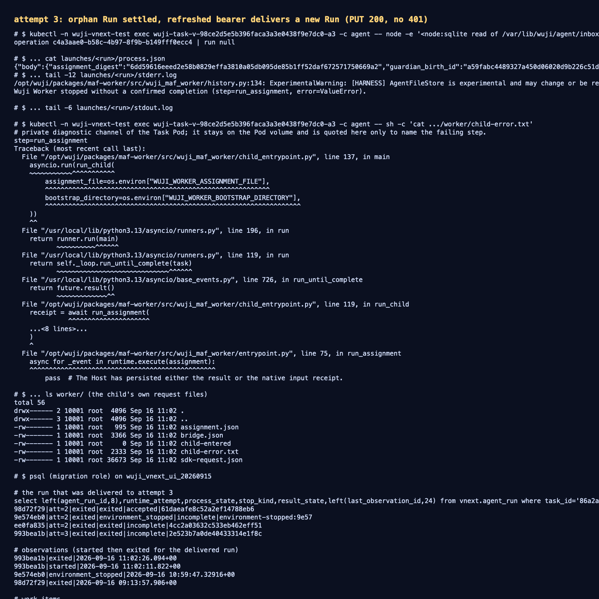

# attempt 3：孤儿 Run 结算 + 刷新凭据后真实派发并执行

- 日期：2026-09-16；工作树 `work/worktrees/vnext-maf`，分支 `codex/vnext-maf`，被测代码 `3307a14`。
- 集群：`docker-desktop` / `wuji-vnext-test`；数据库迁移头 `vnext_0021_p05_environment_settlement`。
- 镜像（`source_revision=3307a1479c87417fdfd2bad4d93074c9fc50c47e`）：
  platform `127.0.0.1:56615/wuji-vnext-platform@sha256:7644d50efceea09f7afd3a24fc973fb1a684aa9f9810c6f65582a3e447368dcf`、
  agent `…wuji-vnext-agent@sha256:5af95529fc811e65a2423bf2a4647acc92d06365657aa7289d0dd731ac8ec131`、
  kali `…wuji-vnext-kali@sha256:7b1ad06566177213f81501ad36f2148ab4abd473df9a5a45f7d0e1d9345e3fc6`。
- 范围：Task A `86a2a7f2-1c60-4fc7-82d1-748a26fcd6e4` 的 attempt 2 → attempt 3 恢复，以及此后一条新探索工作的真实往返。

## 1. 结论

1. **孤儿 Run 结算上线并实测**：attempt 2 的 `9e574eb0` 从未被观测，平台按自身环境证据记录
   `environment_stopped`，Run 收口为 `exited/environment_stopped/incomplete`，work item 以
   `failed/environment_stopped_before_observation` 终结，`roll_runtime_attempt` 的
   `attempt_has_unsettled_run` 死锁随之解除。
2. **凭据刷新后新 attempt 真实可用**：滚动到 attempt 3 后，Task Pod `…-a3` 启动（UID
   `f4805116-f5ba-4e52-ad86-ea12d0c445a8`），`prepare/activate/wire/capability` 全部成功，
   `controller_ready=true`。
3. **新 Run 真实派发并执行**：Owner 接纳第二条 Intent 后，调度器派生新 explore work，runtime 向
   attempt 3 的 supervisor 投递成功（`PUT 200`），随后 `GET 200` 轮询到进程退出；本窗口内
   **0 次 401、0 次 URLError**（对比 attempt 2 的三次 401 与 deadlock）。
4. **未通过的下游环节如实保留**：该 Run 的 MAF child 以 `exit_code=1` 结束，
   `result_state=incomplete`，work item 收口 `failed/process_failure`。私有诊断通道给出的真实原因是
   会话边界导出超限：`ValueError: native root exceeds the fixed object bound`
   （`packages/maf-worker/src/wuji_maf_worker/sessions.py:101`，由 `export_boundary` 调用）。
   这是本次修复之外的下一个缺陷，本报告不把它算作通过。

## 2. 时间线（UTC）

```text
10:59:47  runtime 记录 environment_stopped（attempt 2 的 Pod 已确认不存在）
          → 9e574eb0 exited/environment_stopped/incomplete
          → work bd62d4c0 failed/environment_stopped_before_observation
11:00:29  attempt 3 激活（execution_epoch 4，control_version 6）
11:01     Pod …-a3 就绪，controller_ready=true；task-agent/task-kali Service 选择器指向 a3
11:02:10  新 assignment c4a3aae0（run 993bea1b）生成
11:02:11  GET 404 → PUT 200 → GET 200…（supervisor 接受并开始执行）
11:02:11.822  execution_observation: started
11:02:25.435  子进程退出，exit_code=1
11:02:26.094  execution_observation: exited → work c9a747a7 failed/process_failure
```

## 3. 证据

- 投递与轮询（PUT 200、22×GET 200、1×GET 404、0×401/URLError）：
  [`raw/runtime-delivery.txt`](raw/runtime-delivery.txt)
- Run / WorkItem / Observation / Task 数据库事实：
  [`raw/database-state.txt`](raw/database-state.txt)
- 子进程启动记录（operation → run 绑定、pid、started_at、exited_at、exit_code）：
  [`raw/child-launch-record.txt`](raw/child-launch-record.txt)
- 私有诊断通道（会话边界导出超限的真实栈）：
  [`raw/child-private-error.txt`](raw/child-private-error.txt)
- Intent 命令回执（`accepted_shared`，canonical ref `7bf2cdf8-…`）：
  [`raw/intent-command-receipt.json`](raw/intent-command-receipt.json)
- 完整 HTTP 报文（`POST /api/v2/tasks/{task_id}/commands`，幂等重放返回**同一** `request_id`
  `1924ca03-…`、`resource_version=6`、`202`）：
  [`start-command.request.json`](start-command.request.json)、
  [`start-command.headers`](start-command.headers)、
  [`start-command.response.json`](start-command.response.json)
- 终端汇总截图：[`screenshots/attempt3-recovery.png`](screenshots/attempt3-recovery.png)



请求报文的 `Authorization` 只保留占位符（900 秒 operator bearer 不入库）；响应体与请求体均为原文，
未截断。数据库与终端记录为同一时刻采集。

## 4. 未覆盖与后续

- 本次 Run 没有产生 accepted 结果，因此**不**证明 P12 完成面，也不证明 P10 结果归属修复在本场景生效。
- 凭据刷新仍由工作树外部脚本完成（`work/vnext/p11c/refresh-tokens.py`，24 小时 TTL、无前置守卫）；
  仓库内可复现命令与"存在活跃 attempt 时拒绝刷新"的守卫仍是待办（任务队列 T2）。
- 投递预算修复（T4）只有单测覆盖，未在真实集群制造"权威拒绝后凭据恢复"的窗口。
- 下一步：修复会话边界导出超限（`native root exceeds the fixed object bound`），让同一路径上的
  child 能产出 accepted 结果；随后再验证 T2 与多 Task 并发。
