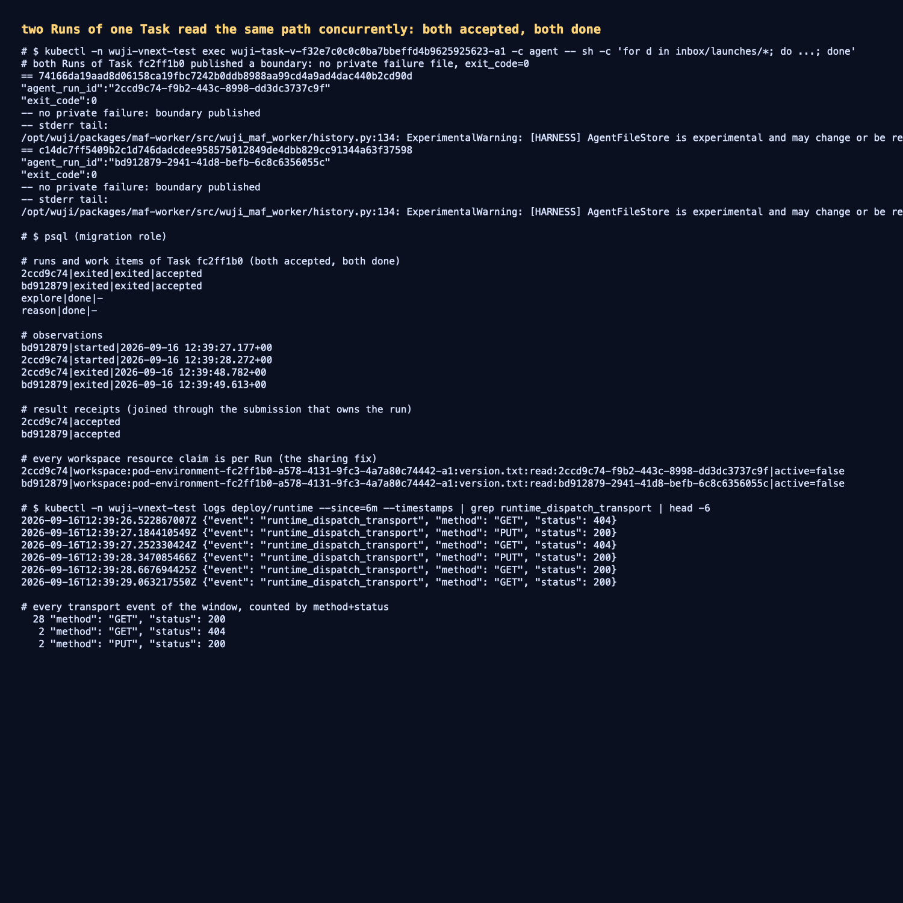

# 同一 Task 的两个 Run 可以同时读同一路径

- 日期：2026-09-16；工作树 `work/worktrees/vnext-maf`，分支 `codex/vnext-maf`，被测代码 `427882b`。
- 集群：`docker-desktop` / `wuji-vnext-test`；镜像 `source_revision=427882bd`：
  platform `127.0.0.1:56615/wuji-vnext-platform@sha256:6d8abb340ef0a56dd3d8c30e8c7ed5f4c0caf34bf9239fcd3eaef68152af77ad`、
  agent `…wuji-vnext-agent@sha256:7e65941b1daa476c25fcabcb93f0ea102224540873674bce146308be838f8ad9`、
  kali `…wuji-vnext-kali@sha256:ce6aab327493680892c37a60f698775dd543082d0901f05fcfd1f5a88bca8090`。
- 范围：**公开创建入口**新建的 Task `fc2ff1b0-a578-4131-9fc3-4a7a80c74442` 的首次 attempt（reason + explore 同时起跑）。

## 1. 缺陷与修复

上一个 Task 的 `explore` run 起跑后 1 秒被杀掉，私有记录是
`code=LIMIT_BLOCKED, status=429, error=MiddlewareFailure`（`Wuji ToolGate refused the invocation`）：
P06 的工具在途限额**按整个 Task 计数**（`max_inflight_tools=1`），且每个工作区路径都是一次**独占**预留
（`one_active_tool_resource` 唯一索引），所以两个 Run 同时读 `version.txt` 时后到者被拒。

- **在途工具限额改为每 Run 计数**，与 P06 合同里"每 Run 同时最多一个在途模型请求"一致；跨 Run 的协调交给资源锁。
- **声明为只读的工作区工具共享路径**：读取申请按 Run 分别记账
  （`workspace:<env>:<path>:read:<agent_run_id>`），只与持有裸路径键的独占者冲突；未来的写者仍拿裸路径键，
  并通过同一处检查排除所有读者（`left(resource_key,len(base||':read:'))` 前缀比对）。
  依据 SPEC："只读能否并行取决于工具实际行为，不只看函数名称。"

## 2. 实测结果

```text
12:39:27.177  explore? / reason run bd912879 started
12:39:28.272  第二个 run 2ccd9c74 started（同一 Task、同一路径同时读）
12:39:48.782  2ccd9c74 exited → result_state=accepted
12:39:49.613  bd912879 exited → result_state=accepted
两个 work item：explore done、reason done
```

两个 child 的启动记录都是 `exit_code=0` 且**没有私有失败文件**（会话边界照常发布）；传输窗口内
`PUT 200 × 2`、`GET 200 × N`、0 次 401/URLError。数据库里两条 claim 分别是

```text
2ccd9c74|workspace:pod-environment-…-a1:version.txt:read:2ccd9c74-…|active=false
bd912879|workspace:pod-environment-…-a1:version.txt:read:bd912879-…|active=false
```

即同一路径、两个 Run、各自独立记账——这正是本次修复的语义。

## 3. 证据

- 派发与轮询：[`raw/runtime-delivery.txt`](raw/runtime-delivery.txt)
- Run / WorkItem / Observation / 回执 / 两条 per-Run claim：
  [`raw/database-state.txt`](raw/database-state.txt)
- 两个 child 的启动记录：[`raw/child-launch-records.txt`](raw/child-launch-records.txt)
- 终端汇总截图：[`screenshots/concurrent-read-fix.png`](screenshots/concurrent-read-fix.png)



## 4. 未覆盖与后续

- 只读共享是本轮唯一被准入的工具形态；**写者路径尚未实现**，其"排除读者"分支只有单元级语义（同一处检查）覆盖，
  没有真实写入夹具。
- 本轮仍是在单 Task、两 Run 的规模上验证；多 Task 并发、长会话压缩/memory、凭据刷新入库（T2）仍未做。
- 结果接纳没有覆盖 P12 完成面：两个 work item 直接以 `done` 收口，不涉及 Goal 判据与报告冻结。
