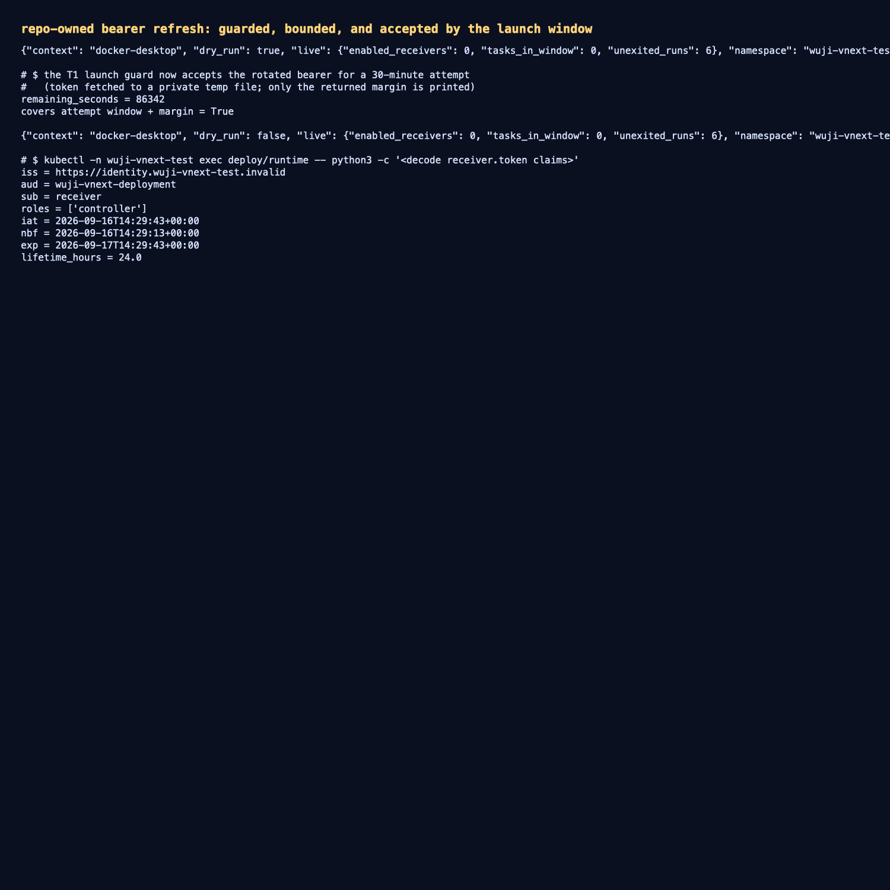

# 仓库内的凭据刷新：有守卫、有上界，并被启动窗口接受

- 日期：2026-09-16；工作树 `work/worktrees/vnext-maf`，分支 `codex/vnext-maf`，被测代码（本项提交）。
- 集群：`docker-desktop` / `wuji-vnext-test`。
- 背景：本轮之前，receiver bearer 的刷新只存在于被忽略的 `work/` 脚本里，没有前置守卫；今天已经出现过两次后果
  ——runtime 重启时因 bearer 过期**直接拒绝启动**，以及 attempt 2 的第三次派发连续 401 直到死锁。

## 1. 命令

`scripts/vnext/refresh_credentials.py`（仓库内、可复现）：

```bash
# 只读：先看守卫结论与计划
./scripts/vnext/uv.sh run --frozen python scripts/vnext/refresh_credentials.py --dry-run
# 实际刷新并滚动读取 startup 凭据的 Deployment
./scripts/vnext/uv.sh run --frozen python scripts/vnext/refresh_credentials.py --restart
```

- **计划固定**：只刷新 `runtime-credentials`(receiver/pod-controller)、`scheduler-credentials`(scheduler)、
  `gates-credentials`(collector/gate)、`api-credentials`(operator) 六个字段；不铸造人类操作者 bearer
  （owner 工具按动作自行铸造 900 秒 bearer）。
- **TTL 有界**：`--ttl-hours` 只接受 1..72，默认 24。
- **守卫**：`tasks_in_window>0` 或 `enabled_receivers>0` 时拒绝刷新（`--allow-active-attempts` 才可越过）。
  "窗口内"按 Task 自身的 `runtime_profile.limits.max_elapsed_seconds` 计算；**陈旧的未退出 Run 不阻断**
  （实测 `unexited_runs=6` 仍然放行）。
- **输出有界**：只打印 context/namespace/TTL、守卫计数、每个目标的 subject/roles，以及被 patch 的 Secret 与
  被滚动的 Deployment；**任何 token 字节都不进入输出或仓库**。
- 签名密钥从集群 `runtime-credentials/signing.key` 读取，已核对它导出的公钥与
  `runtime-config/identity.pub` 一致。

## 2. 实测

```text
dry-run : live={tasks_in_window:0, enabled_receivers:0, unexited_runs:6}，计划 6 个字段，TTL 86400s
refresh : patched=[api-credentials, gates-credentials, runtime-credentials, scheduler-credentials]
          restarted=[api, runtime, scheduler, gates]；四个 Deployment 全部 rollout 成功
rotated : receiver.token iat=2026-09-16T14:29:43Z exp=2026-09-17T14:29:43Z lifetime=24.0h
guard   : require_receiver_bearer_window(window=1800) → remaining=86342s，覆盖窗口+余量=True
```

即：刷新后的 bearer 让 runtime 正常启动，并且 T1 的启动守卫判定它足以覆盖一整个 30 分钟 attempt。

## 3. 证据

- 只读 dry-run 输出（含守卫计数与计划）：[`raw/dry-run.json`](raw/dry-run.json)
- 实际刷新输出（patch + restart）：[`raw/refresh-with-restart.json`](raw/refresh-with-restart.json)
- 刷新后挂载 bearer 的注册声明：[`raw/rotated-bearer-claims.txt`](raw/rotated-bearer-claims.txt)
- T1 守卫对刷新 bearer 的判定：[`raw/launch-guard-check.txt`](raw/launch-guard-check.txt)
- 终端汇总截图：[`screenshots/credential-refresh.png`](screenshots/credential-refresh.png)



测试：新增 `tests/vnext/test_credential_refresh.py` 15 项（计划覆盖、TTL 边界、注册声明与 TTL、摘要不含 token、
守卫拒绝/放行、live 查询谓词），全部通过。

## 4. 未覆盖

- 拒绝分支（`tasks_in_window>0`）只有单元覆盖：本轮 dry-run 时窗口恰好为空，没有为了造证据去开一个注定
  失效的 attempt。
- 刷新仍要求操作者先确认没有真实运行中的 attempt；命令不自动重启 Task Pod，也不会为已有 attempt 重新签发
  任务侧密钥（那需要新的 attempt，符合"同一 attempt 一个固定 bearer"的约束）。
- bearer 仍是**部署级共享**：多 Task 同时运行时刷新会打断所有活跃 attempt，这正是守卫拒绝的原因；
  按 attempt 独立签发仍是后续设计项。
