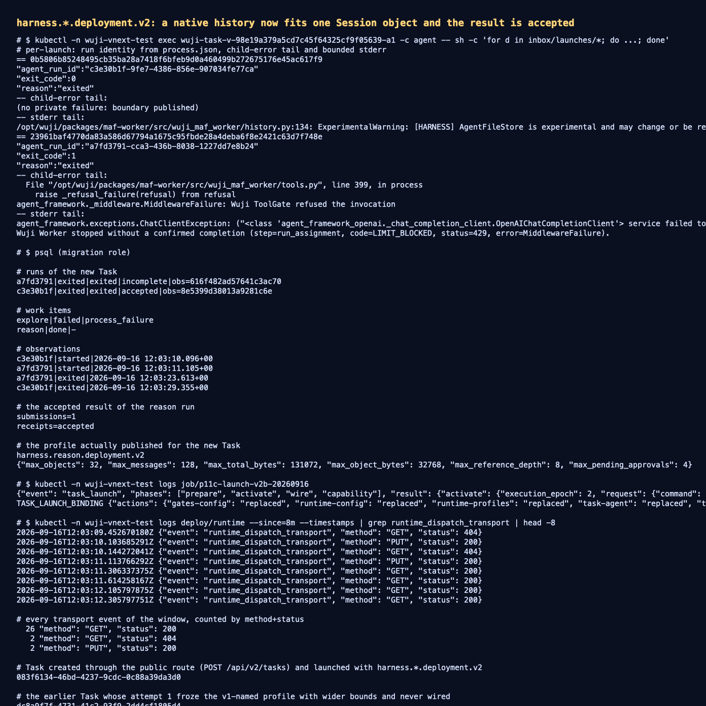

# 会话边界超限修复：原生历史现在能装进一个有界 Session 对象

- 日期：2026-09-16；工作树 `work/worktrees/vnext-maf`，分支 `codex/vnext-maf`。
- 被测代码：`7ff1281`（含 `1ffb8a3` 的界限修复）。镜像 `source_revision=7ff1281`：
  platform `127.0.0.1:56615/wuji-vnext-platform@sha256:9596926e0c23d1cd4a5126a413748fb40986c30b521891b2d5a2ca7e642fda05`、
  agent `…wuji-vnext-agent@sha256:8d8a3fa7408e65126e1eae43429421d304d37f4bd0270f6d72fe9e90df1de8cd`、
  kali `…wuji-vnext-kali@sha256:345b6072fe8f5c8fc132546e45f0eea70e596d193cd3cdeb93b70e94b365977b`。
- 范围：**通过公开创建入口**新建的 Task `083f6134-46bd-4237-9cdc-0c88a39da3d0` 的首次 attempt。

## 1. 缺陷与修复

attempt 3 的 child 在会话边界导出处失败：`ValueError: native root exceeds the fixed object bound`。
根因是该 Task 的**发布 Session profile 把单个对象上限固定在 16 KiB**，而同一份 runtime profile 允许单次输出
32 KiB、累计输出 128 KiB——真实 MAF 历史（两次模型调用：请求 11 977 / 13 012 字节，加 frontier）刚好越过 16 KiB。

- `published_session_profiles` 现在从准入限额派生 Session 界限（`max_object_bytes=min(65536, max_single_output_bytes)`、
  `max_total_bytes=min(262144, max_total_output_bytes)`），本 Task 冻结为
  `{"max_object_bytes": 32768, "max_total_bytes": 131072, ...}`。
- 界限属于已发布 profile 的**不可变身份**（runtime host 与共享 ConfigMap 都拒绝同 ref 不同字节），因此这次改动发布为
  **`harness.<kind>.deployment.v2`**；已激活的旧 Task 继续钉住其 v1 profile。
- `NativeSessionAdapter._bounded` 在私有诊断通道里点名是哪个 root 超限以及两个字节数（仅标签与数字，不含正文），
  下一次再越界时操作者不需要靠猜。

## 2. 实测结果（新 Task，全链路）

```text
12:01:5x  POST /api/v2/tasks → 201（新 Task 083f6134…，desired_state=pause）
12:02:5x  prepare → activate → wire → capability 全绿；
          runtime-profiles=replaced（v2 并入）、Pod …-a1 就绪、controller_ready=true
12:03:09  runtime 派发：GET 404 → PUT 200（reason run c3e30b1f）
12:03:10  execution_observation started
12:03:29  execution_observation exited，exit_code=0，**无任何私有失败文件**
          result_receipt=accepted → work item reason: done
```

同一时刻的 `explore` run `a7fd3791` 仍以 `exit_code=1` 结束，有界信号为
`code=LIMIT_BLOCKED, status=429, error=MiddlewareFailure`（工作区资源互斥，另加一次模型门连接错误）——这是
[既有记录](../task-roundtrip-20260916/README.md)里的已知缺陷，本次修复不声称覆盖它。

本窗口 runtime 传输统计：`PUT 200 × 2`、`GET 200 × 26`、`GET 404 × 2`、**0 次 401 / 0 次 URLError**。

## 3. 证据

- 创建入口完整 HTTP 报文：[`create.request.json`](create.request.json)、
  [`create.headers`](create.headers)、[`create.response.json`](create.response.json)、幂等键
  [`idempotency-key.txt`](idempotency-key.txt)
- 发布与装配：[`raw/launch-binding.json`](raw/launch-binding.json)（`runtime-profiles: replaced`、Pod UID、
  `controller_ready=true`）
- 派发与轮询：[`raw/runtime-delivery.txt`](raw/runtime-delivery.txt)
- Run / WorkItem / Observation / 结果回执 / 冻结的 session_limits：
  [`raw/database-state.txt`](raw/database-state.txt)
- 两个 child 的私有记录（reason 无失败文件、explore 有界拒绝）：
  [`raw/child-launch-records.txt`](raw/child-launch-records.txt)
- Task 标识（含未装配的 `dc8a9f7f…`）：[`raw/task-ids.txt`](raw/task-ids.txt)
- 终端汇总截图：[`screenshots/history-bound-fix.png`](screenshots/history-bound-fix.png)



## 4. 未覆盖与后续

- `explore` 路径仍失败（工作区互斥 / 模型门连接），未产生 accepted 结果。
- 本轮只在**新创建**的 Task 上验证；`dc8a9f7f…`（第一个新 Task）在 attempt 1 冻结了 v1 命名但更宽界限的
  profile 且未装配，要改它必须等窗口结束再 roll——保留为边界用例记录。
- 真实长会话（多轮压缩/memory）未验证；本次只证明"单次真实历史的 root 能装入一个有界对象"。
- 凭据刷新仍由仓库外脚本完成（队列 T2）。
