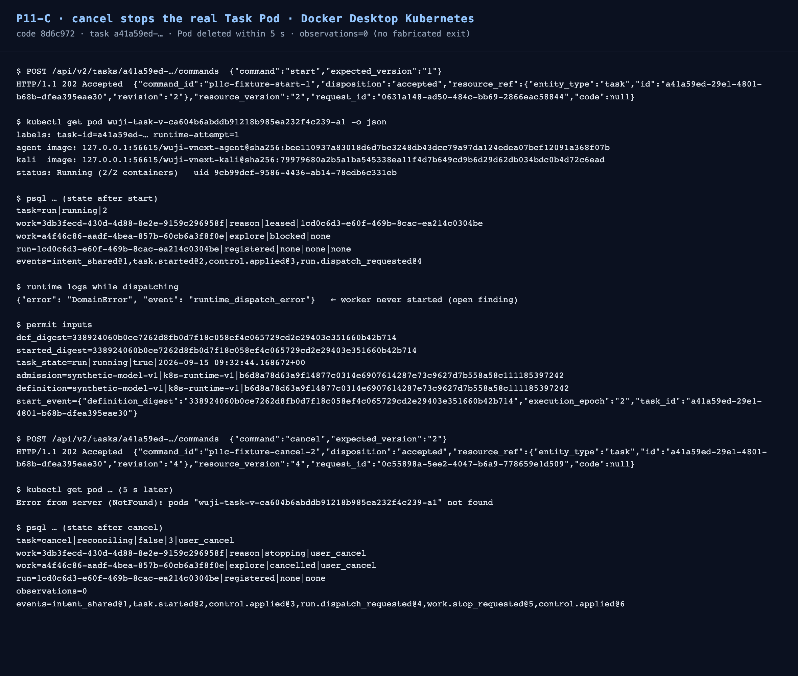

# P11-C cancel stops the real Task Pod — 2026-09-15

Status: **verified for the stop path**; the worker-assignment dispatch in front of it is **open**.

`POST /api/v2/tasks/a41a59ed-…/commands {"command":"cancel","expected_version":"2"}` was accepted with
`202` and the running Task Pod was deleted within 5 seconds. The Task did **not** claim a clean stop:
it reports `cancel / reconciling / execution_allowed=false / execution_epoch=3 / close_trigger=user_cancel`
with `vnext.execution_observation` still empty, i.e. the process exit is not invented.



## Environment work that made the run possible

The image roll exposed two pieces of environment debt; both were fixed and recorded:

1. **Expired deployment tokens.** `runtime-credentials`, `scheduler-credentials`,
   `gates-credentials` and `api-credentials` held tokens that expired ≈4.3 h earlier, so the first
   runtime pod restart crash-looped with `AuthenticationError: token validation failed`. Fresh tokens
   for the same subjects/roles (`receiver`, `pod-controller`, `scheduler`, `collector`, `gate`,
   `operator`) were minted from the deployment signing key with a 24 h lifetime
   (`raw/refreshed-tokens.json`).
2. **Plane-wide image roll.** agent, platform, kali and web were rebuilt from `8d6c972`
   (`raw/images-published.json`) and `api`, `runtime`, `scheduler`, `gates`, `wuji-web` were rolled to
   those digests — this also brings the earlier worker approval-identity fix into the agent image.
   The runtime's `pod_runtime.task_config` was re-pointed at the new agent/kali digests with the live
   `config_digest`/`scope_digest`.
3. **Fixture authorization window.** The fixture Task's `authorization_expires_at` had passed, which
   `ControlService._definition` rejects. The deployment owner (migration role, required by
   `guard_task_control`) refreshed it to `2099-01-01T00:00:00Z`; the definition digest changed and was
   re-synced into the runtime config (`raw/fixture-window-refresh.txt`).
4. **Receiver admission grant.** `P05PermitSource.transaction()` requires the caller to hold
   `can_observe` **and** `can_admit`; the fixture's `receiver` row only had observe. The grant was
   applied by the migration role (`raw/receiver-admit-grant.txt`). The deployment template should
   carry this by default (or the permit source should use the `pod-controller` identity).

## Observed sequence

```text
start  (expected_version 1) -> 202 accepted, e51… task revision 2
pod    : wuji-task-v-ca604b6abddb91218b985ea232f4c239-a1, uid 9cb99dcf-9586-4436-ab14-78edb6c331eb
         labels task-id=a41a59ed-… runtime-attempt=1, 2/2 Running
         agent=wuji-vnext-agent@sha256:bee11093… kali=wuji-vnext-kali@sha256:79979680…
state  : task run/running epoch 2 · work reason=leased (run 1cd0c6d3-…) explore=blocked
         events intent_shared@1, task.started@2, control.applied@3, run.dispatch_requested@4
cancel (expected_version 2) -> 202 accepted, revision 4
pod    : NotFound within 5 s
state  : task cancel/reconciling/false/epoch 3/user_cancel
         work reason=stopping(user_cancel) explore=cancelled(user_cancel)
         events + work.stop_requested@5, control.applied@6
         agent_run 1cd0c6d3-… still `registered`, stop_kind none, observations=0
```

## Open finding (not fixed here)

The worker never executed: while the Pod ran, the runtime logged a continuous
`{"error": "DomainError", "event": "runtime_dispatch_error"}` cycle (≈1/s), the agent container had no
output and `agent_run` stayed `registered`. The assignment therefore never reached the supervisor.
The Pod permit itself was fine (the Pod was created); the failure is in the outbox → supervisor
dispatch path. This needs its own investigation with the error code surfaced (the current log only
records the exception class) and is the next P11-C/P10 item.

## What this package does and does not prove

- Proves: an accepted `cancel` removes the real Task Pod, the work items move to
  `stopping`/`cancelled`, and the Task stays `reconciling` rather than claiming a completed stop
  because no exit observation exists.
- Does not prove: a clean worker exit observation/`stop_kind`, the MAF child round trip on this
  revision, or the reason→explore hand-off — all blocked by the dispatch finding above.

## Dispatch-stall diagnosis (2026-09-15, follow-up turn)

Two diagnosability gaps hid the cause; both are fixed in the runtime image:

- `56ba97d`: the dispatch loop logged only the exception class. It now logs a bounded
  `DomainError.code`, a `RuntimeTransportError.operation` and its integer `status`.
- `b5cc4ca`: a non-ready Task environment waited silently. It now logs the observation
  `state`, its `reason` and the Pod name.

With those fixes the stall resolves into two intended guards plus one deployment gap:

1. **The receiver binding is disabled after the Pod stops.** When the Pod was deleted,
   `pod_runtime._disable(...)` set `scheduler_receiver.enabled=false` for
   `task-a41a59ed-…-a1` (keeping the old `pod_uid`). The dispatch consumer only delivers to an
   enabled, matching receiver, so a cancelled/stopped generation has nothing to deliver to.
   `raw/final-state.txt` records `receiver_enabled=false`.
2. **The runtime config pins the generation.** `pod_runtime.task_config.execution_epoch` is `2`
   (the epoch `start` produced). `cancel` advanced the Task to epoch 3 and the owner reset plus
   `resume` to epoch 4/5, so `validate_execution_permit` denies with
   "current permission does not match execution_epoch" and `ensure()` returns a stopped/missing
   observation every cycle. This is the intended generation guard: **a cancelled Task cannot be
   resumed by the same runtime generation** — a fresh run needs either a re-rendered runtime
   config carrying the new epoch or a new Task. `raw/resume.response.json` and
   `raw/fixture-cancel-reset.txt` record the sequence that produced the mismatch.
3. **No session capability is published.** `vnext.session_capability` has zero rows for the
   tenant, so even once an assignment is delivered the worker's session path has no published
   capability to validate against. This is a deployment prerequisite the current K8s bootstrap
   never writes (the P08 candidate fixture registers it in-process).

Next concrete steps for the worker path:

- create a Task through `POST /api/v2/tasks`, publish its admission (`publish_task_admission`),
  render the runtime `pod_runtime` for that Task (ids, definition digest, scope digest, and the
  epoch `start` will produce), restart the runtime, then `start` and confirm the assignment reaches
  the supervisor;
- publish a session capability for the tenant as part of the deployment template;
- decide and document the generation policy for re-enabling a receiver (re-render per epoch versus
  runtime re-registration).

The environment was returned to a coherent state: the fixture Task is
`cancel / reconciling / execution_allowed=false / epoch 4 / user_cancel` with no running Pod and a
disabled receiver (`raw/final-state.txt`).

## Second follow-up: in-place re-run is refused by the durable inbox (2026-09-15)

To test the dispatch path again I reset the stopped generation in place (owner-side
`execution_epoch=2`, `desired_state=run`, deleted the stale `scheduler_receiver` row) and let the
runtime create a new Pod. The Pod came up and the controller created it, but the **agent container
exited immediately** (`1/2`, exit code 1):

```text
SupervisorError: RECEIVER_IDENTITY_CONFLICT
    at new DurableInbox (file:///opt/wuji/services/maf-supervisor/inbox.mjs:25:73)
    at new NodeSupervisor (file:///opt/wuji/services/maf-supervisor/main.mjs:96:18)
code: 'RECEIVER_IDENTITY_CONFLICT', status: 409
```

`raw/agent-inbox-conflict.log` and `raw/pod-after-regeneration.json` keep the原 output.

This is a correct fail-closed guard, not a defect: the durable inbox on the Task's
`agent-state` volume refuses to serve a different receiver identity. A stopped generation
therefore **cannot be re-run in place** — the same `runtime_attempt` with a new Pod presents a new
receiver identity against persisted state.

Consequences for the next iteration:

- a fresh run must use a **new runtime attempt** (`vnext.task.runtime_attempt` + the runtime's
  `pod_runtime.task_config.runtime_attempt`, `receiver.environment_ref` / `receiver_id`) together
  with a per-attempt agent state volume or an explicit archival of the previous attempt's inbox;
- the deployment tooling must render that pair atomically (this is the same owner tooling the
  creation slice still needs), instead of an operator editing epochs by hand;
- until then the local fixture stays in its coherent cancelled state
  (`cancel / reconciling / execution_epoch=3 / runtime_attempt=1 / user_cancel`, no Task Pod,
  `raw/final-state-2.txt`), and the runtime correctly logs `PermitDenied` each cycle because the
  cancelled generation has no valid permit.

## Fix landed: resources are scoped to the runtime attempt (2026-09-15)

`TaskRuntimeConfig.resource_names` returned per-Task names (`…-agent-state`, `…-agent-config`), so a
new runtime attempt reused the previous attempt's agent state and the durable inbox refused the new
receiver identity. The names now carry the attempt (`wuji-task-…-a<N>-agent-state` …), matching the
Pod name that already used it (`905fd51`).

- one attempt keeps identical names across restarts, so a restart of the same generation still
  resumes its own volume;
- a new attempt gets its own ConfigMaps, Secrets and volumes, so the previous inbox is never
  presented with a different receiver identity;
- `tests/vnext/test_pod_runtime.py`, `tests/vnext/test_configure_refresh.py` and
  `packages/task-runtime/tests` passed (29), plus `test_remote_workspace.py`,
  `test_maf_child_transport.py`, `test_web_manifest.py` (22).

## Remaining work before the worker round trip can be proven

The code fix is necessary but not sufficient in the deployed environment: the runtime's
`_check_resources` requires the attempt's ConfigMaps, Secrets, PVCs and the `task-agent`/`task-kali`
Services to exist and to carry the new attempt's labels/selectors. The deployment renderer
`ops/vnext/kubernetes/configure.py` already builds exactly that bundle for a Task, so the next step
is an owner command that:

1. takes a Task plus the new attempt number (or a freshly created Task),
2. renders the bundle with `runtime_attempt = N`, the `execution_epoch` the next `start`/`resume`
   will produce, the attempt-scoped `receiver_id`/`environment_ref`, and the current
   `config_digest`/`scope_digest` from the Task definition,
3. applies the Task-owned resources and the runtime `pod_runtime` config, restarts the runtime,
4. then `start`/`resume` and confirm the assignment reaches the supervisor before claiming a clean
   exit observation.

The complete attempt-identity wiring for this fixture is recorded in
[`raw/attempt-identity-wirings.txt`](raw/attempt-identity-wirings.txt): the task-owned ConfigMaps,
Secrets and PVCs; the fixed-name `task-agent`/`task-kali` Services whose selectors carry the attempt
label; the runtime `pod_runtime` (`task_config.runtime_attempt`/`execution_epoch` and
`receiver.receiver_id`/`environment_ref`); and the gates `executors[].binding` for the Kali executor.
A single owner command has to move all of them together — an attempt is one generation, not a Pod
name.

`vnext.session_capability` is still empty for the tenant; the same owner step must publish it (the
P08 candidate fixture registers it in-process, the K8s bootstrap never does).

For this reason the local fixture is intentionally left cancelled with no Task Pod, and no
worker-round-trip claim is made in this package.

## Third follow-up: the attempt-2 provisioning works, the activation window does not (2026-09-15)

The owner provisioning for attempt 2 succeeded end to end — attempt-scoped ConfigMaps, Secrets and
PVCs created, `task-agent`/`task-kali` selectors switched to attempt 2, the runtime `pod_runtime` and
the gates `executors[].binding` moved to `task-…-a2` / `pod-environment-…-a2`, and `resume` was
accepted (`202`, revision 10). The runtime then kept denying the permit.

Root cause: the permit expires at
`min(authorization_expires_at, activated_at + runtime.limits.max_elapsed_seconds)`. The fixture was
activated at 09:32Z with a 1800 s limit, so its execution window closed at 10:02Z — long before this
attempt. `start` cannot reopen it either (`start` requires `activated_at IS NULL`). An already
activated Task therefore cannot be re-run by design, no matter how its attempt is re-provisioned;
attempt identity and activation window are independent guards.

Consequence: the worker round trip must be proven on a **fresh Task** (new activation), which needs
the same owner provisioning for attempt 1: task-owned ConfigMaps/Secrets/PVCs, `task-agent`/
`task-kali` selectors, runtime `pod_runtime`, gates `executors[].binding`, and the tenant
`session_capability`. The fixture stays cancelled/paused with no Task Pod and no worker claim.
