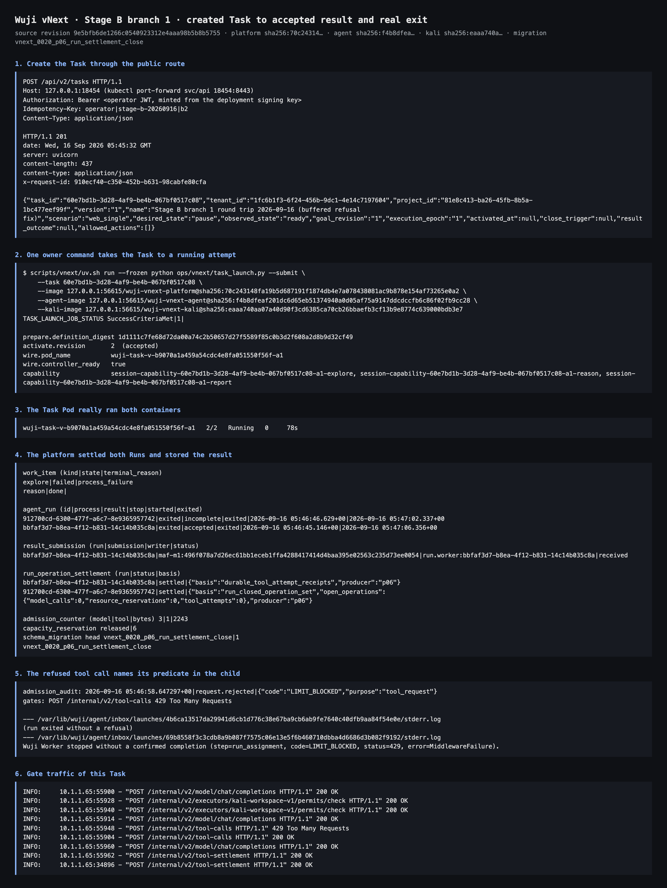

# Stage B branch 1 · created Task → accepted result → real exit (2026-09-16)

- Fixed revision: `9e5bfb6de1266c0540923312e4aaa98b5b8b5755`
- Images: platform `127.0.0.1:56615/wuji-vnext-platform@sha256:70c243148fa19b5d687191f1874db4e7a078438081ac9b878e154af73265e0a2`,
  agent `…wuji-vnext-agent@sha256:f4b8dfeaf201dc6d65eb51374940a0d05af75a9147ddcdccfb6c86f02fb9cc28`,
  kali `…wuji-vnext-kali@sha256:eaaa740aa07a40d90f3cd6385ca70cb26bbaefb3cf13b9e8774c639000bdb3e7`
- Migration head: `vnext_0020_p06_run_settlement_close`
- Task: `60e7bd1b-3d28-4af9-be4b-067bf0517c08`; Task Pod `wuji-task-v-b9070a1a459a54cdc4e8fa051550f56f-a1`
  (uid `b0d08c0a-1e1e-43a7-8a26-99529c7f361e`, both containers running)
- Fixture: fixed synthetic model and the harmless read-only `workspace-read-v1` tool; no paid model, no external target.



## 1. What this run proves

| Step | Observed |
| --- | --- |
| public creation | `POST /api/v2/tasks` → `201`, revision 1, `desired=pause`, `observed=ready` |
| owner command | one idempotent run, four phases green: `prepare → activate → wire → capability` (`TASK_LAUNCH_JOB_STATUS SuccessCriteriaMet\|1\|`) |
| runtime attempt | receiver `task-60e7bd1b-…-a1`, Pod `wuji-task-v-b9070a1a…-a1`, `controller_ready=true`, three Session capabilities published |
| real MAF child | two Runs; the Reason Run made 2 model calls and 1 tool call, submitted `maf-m1:496f078a…` as `run.worker:bbfaf3d7-…` and reached `done` |
| bounded refusal | the Explore Run's tool call answered `429` / `LIMIT_BLOCKED`; the child's bounded exit line names it |
| settlement | `durable_tool_attempt_receipts` for the accepted Run, `run_closed_operation_set` for the refused one; 6 capacity reservations released |

## 2. Complete reproduction packet

### 2.1 Create the Task

```http
POST /api/v2/tasks HTTP/1.1
Host: 127.0.0.1:18454 (kubectl -n wuji-vnext-test port-forward svc/api 18454:8443)
Authorization: Bearer <operator JWT: iss=https://identity.wuji-vnext-test.invalid,
  aud=wuji-vnext-deployment, sub=operator, roles=[operator], tenant=1fc6b1f3-…, ttl 900s>
Idempotency-Key: operator|stage-b-20260916|b2
Content-Type: application/json
```

```json
{"authorization_expires_at":"2099-01-01T00:00:00Z","authorization_scope":[{"host":"fixture.invalid","port":443,"protocol":"https"}],"budget":{"amount":"1","currency":"USD"},"goal":{"criteria":[{"allowed_methods":["deterministic"],"condition":"version captured","criterion_id":"version","evidence_requirements":["sealed bytes"],"object":"fixture bytes","required":true,"responsible_party":"fixture-checker"}],"text":"Read the isolated workspace version file"},"model_profile_ref":"k8s-model-v1","name":"Stage B branch 1 round trip 2026-09-16 (buffered refusal fix)","project_id":"81e8c413-ba26-45fb-8b5a-1bc477eef99f","runtime_profile_ref":"k8s-runtime-v1","scenario":"web_single","schema_version":"wuji.api.v2"}
```

```http
HTTP/1.1 201
date: Wed, 16 Sep 2026 05:45:32 GMT
server: uvicorn
content-length: 437
content-type: application/json
x-request-id: 910ecf40-c350-452b-b631-98cabfe80cfa

{"task_id":"60e7bd1b-3d28-4af9-be4b-067bf0517c08","tenant_id":"1fc6b1f3-6f24-456b-9dc1-4e14c7197604","project_id":"81e8c413-ba26-45fb-8b5a-1bc477eef99f","version":"1","name":"Stage B branch 1 round trip 2026-09-16 (buffered refusal fix)","scenario":"web_single","desired_state":"pause","observed_state":"ready","goal_revision":"1","execution_epoch":"1","activated_at":null,"close_trigger":null,"result_outcome":null,"allowed_actions":[]}
```

### 2.2 The owner command starts the attempt

```bash
scripts/vnext/uv.sh run --frozen python ops/vnext/task_launch.py --submit \
  --task 60e7bd1b-3d28-4af9-be4b-067bf0517c08 \
  --image 127.0.0.1:56615/wuji-vnext-platform@sha256:70c243148fa19b5d687191f1874db4e7a078438081ac9b878e154af73265e0a2 \
  --agent-image 127.0.0.1:56615/wuji-vnext-agent@sha256:f4b8dfeaf201dc6d65eb51374940a0d05af75a9147ddcdccfb6c86f02fb9cc28 \
  --kali-image 127.0.0.1:56615/wuji-vnext-kali@sha256:eaaa740aa07a40d90f3cd6385ca70cb26bbaefb3cf13b9e8774c639000bdb3e7 \
  --agent-auth-secret wuji-task-v-ca604b6abddb91218b985ea232f4c239-agent-auth \
  --kali-auth-secret wuji-task-v-ca604b6abddb91218b985ea232f4c239-kali-auth
# TASK_LAUNCH_JOB_STATUS SuccessCriteriaMet|1|
```

The four-phase JSON and the persisted binding are in [`raw2/launch.log`](raw2/launch.log).

### 2.3 The refused tool call now names its predicate

```text
2026-09-16 05:46:58.647297+00|request.rejected|{"code":"LIMIT_BLOCKED","purpose":"tool_request"}
INFO:     10.1.1.65:55948 - "POST /internal/v2/tool-calls HTTP/1.1" 429 Too Many Requests
```

The Explore Run's own child reported, on its bounded operator channel (raw2/child-terminal-lines.txt):

```text
Wuji Worker stopped without a confirmed completion (step=run_assignment, code=LIMIT_BLOCKED, status=429, error=MiddlewareFailure).
```

### 2.4 Platform state after the attempt

```text
explore|failed|process_failure
reason|done|

bbfaf3d7-b8ea-4f12-b831-14c14b035c8a|exited|accepted|exited|2026-09-16 05:46:45.146+00|2026-09-16 05:47:06.356+00
912700cd-6300-477f-a6c7-8e9365957742|exited|incomplete|exited|2026-09-16 05:46:46.629+00|2026-09-16 05:47:02.337+00

bbfaf3d7-b8ea-4f12-b831-14c14b035c8a|maf-m1:496f078a7d26ec61bb1eceb1ffa4288417414d4baa395e02563c235d73ee0054|run.worker:bbfaf3d7-b8ea-4f12-b831-14c14b035c8a|received

bbfaf3d7-b8ea-4f12-b831-14c14b035c8a|settled|{"basis":"durable_tool_attempt_receipts","producer":"p06"}
912700cd-6300-477f-a6c7-8e9365957742|settled|{"basis":"run_closed_operation_set","open_operations":{"model_calls":0,"resource_reservations":0,"tool_attempts":0},"producer":"p06"}

3|1|2243          # model_attempts|tool_attempts|output_bytes
released|6        # capacity_reservation
vnext_0020_p06_run_settlement_close
```

## 3. A defect this run found and closed (commit `9e5bfb6`)

The first run of this branch (`raw/`, Task `89802cff-…`, image `…agent@sha256:b5350b4a…`) exposed that the
previous commit's refusal classification did not work live: the ToolGate client returns an **already
buffered** response, so the streaming envelope reader raised `StreamConsumed`, and the generic middleware
handler swallowed it into an opaque `MiddlewareFailure`. The child's bounded line still read
`error=MiddlewareFailure` with no code.

`9e5bfb6` splits the reader: `error_code_from_bytes` parses the buffered body (ToolGate), and
`bounded_error_code` keeps streaming for the Host transport that really streams. The child transport test
now fakes the buffered shape, so a streaming implementation cannot pass. The second run above shows the
corrected line. Both runs are kept: `raw/` is the failing one, `raw2/` the fixed one.

## 4. Limits of this evidence

- Only branch 1 of Stage B is covered here (a created Task reaching an accepted result and a real exit).
  Branch 2 (a child that emits no business tool call) and branch 3 (cancel of a running Task) still need
  their own fixtures; branch 3 measured so far is in the 2026-09-16 round-trip §9.
- The Explore Run's refusal is the single-workspace-path mutex, which the platform is supposed to produce
  for two concurrent work items. Whether a bounded `LIMIT_BLOCKED` should end the Run or be handed to the
  model stays a recorded product decision: it ends the Run, but now with a named, bounded code.
- The runtime host still serves one Task per deployment configuration, so "another Task is not stopped
  with it" is not yet demonstrated live; that is the multi-Task host increment.
- 3 model calls and 1 tool call went through the fixed synthetic model; no paid model or external target
  was used.
