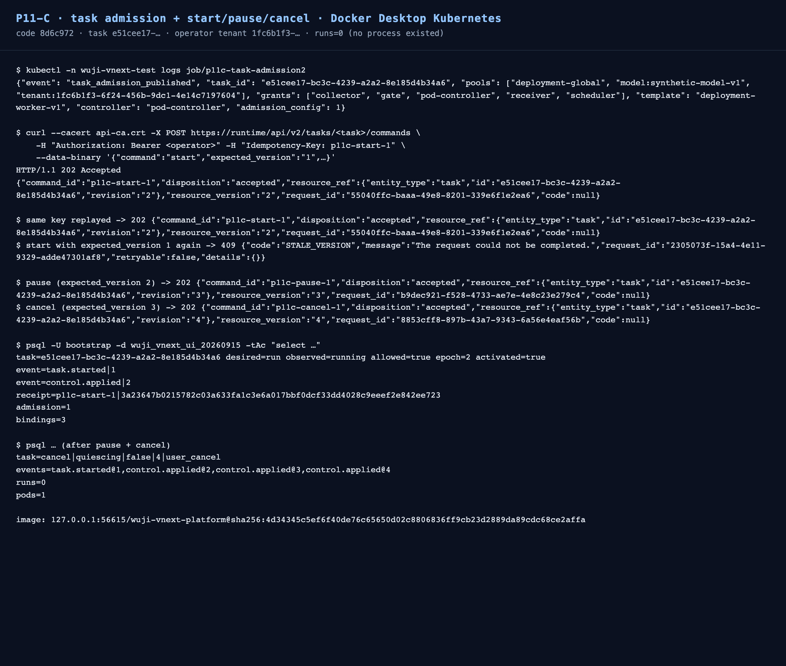

# P11-C Task admission and control commands — 2026-09-15

Status: **verified** for the isolated Docker Desktop Kubernetes slice.

The Task created by the previous increment (`e51cee17-bc3c-4239-a2a2-8e185d4b34a6`) is admitted by the
deployment owner and then accepts the guarded lifecycle commands through the runtime control API:
`start` → 202, replay → same receipt, stale version → 409, `pause` → 202, `cancel` → 202 with
`desired=cancel / observed=quiescing / close_trigger=user_cancel`.



## What changed (code `8d6c972`)

`publish_task_admission(connection, *, owner, admission, capacity_pool_keys, access_grants,
scheduler_identity, pod_controller)` is the owner-side deployment action that makes a created Task
schedulable:

- `register_task_config` validates and stores the admission config against the Task's own definition
  snapshot (profiles and lock digest must match);
- capacity pool keys are bound only when the pool exists, and a tenant pool must belong to the same
  tenant;
- access grants for the deployment subjects are fixed-upsert: identical content is a no-op, different
  content or a revoked identity fails closed;
- the scheduler identity template and the Task pod controller are written with `enabled=true`.

An empty argument leaves that part unpublished, so the deployment decides when a Task becomes
schedulable.

## Observed results

Admission job on the created Task (`Job/p11c-task-admission2`, platform image rebuilt from `8d6c972`):

```text
{"event": "task_admission_published", "task_id": "e51cee17-bc3c-4239-a2a2-8e185d4b34a6",
 "pools": ["deployment-global", "model:synthetic-model-v1", "tenant:1fc6b1f3-…"],
 "grants": ["collector", "gate", "pod-controller", "receiver", "scheduler"],
 "template": "deployment-worker-v1", "controller": "pod-controller", "admission_config": 1}
```

Control commands through the runtime API:

```text
POST /api/v2/tasks/{id}/commands  start  (expected_version 1) -> 202 {"disposition":"accepted","resource_version":"2"}
POST /api/v2/tasks/{id}/commands  start  (same Idempotency-Key)  -> 202, same receipt
POST /api/v2/tasks/{id}/commands  start  (expected_version 1)  -> 409 STALE_VERSION
POST /api/v2/tasks/{id}/commands  pause  (expected_version 2)  -> 202 {"resource_version":"3"}
POST /api/v2/tasks/{id}/commands  cancel (expected_version 3)  -> 202 {"resource_version":"4"}
```

PostgreSQL state:

```text
after start : task=e51cee17… desired=run observed=running allowed=true epoch=2 activated=true
              event=task.started|1 event=control.applied|2 receipt=p11c-start-1|3a23647b…
              admission=1 bindings=3
after pause+cancel : task=cancel|quiescing|false|4|user_cancel
              events=task.started@1,control.applied@2,control.applied@3,control.applied@4
              runs=0  pods(enabled controller rows)=1
```

**No process existed for this Task** (`agent_run` count 0), so these receipts prove command acceptance
and the Task state machine only. This package makes no process-stop claim; the real
command → Pod/child stop observation remains open in P11-C.

## Validation

```text
./scripts/vnext/uv.sh run --frozen pytest tests/vnext/test_task_admission.py -q      # 2 passed
./scripts/vnext/uv.sh run --frozen pytest tests/vnext/test_task_creation.py \
  tests/vnext/test_task_admission.py tests/vnext/test_run_admission.py \
  tests/vnext/test_scheduler_generations.py tests/vnext/test_control_integration.py \
  tests/vnext/test_contract_shapes.py tests/vnext/test_knowledge_admission.py -q     # 163 passed
```

## Scope and limits

- The admission job mirrors the deployment-owned rows of the existing fixture Task (pools, subject
  grants, identity template, pod controller); it does not invent new product permissions.
- Publishing is idempotent: re-running the job keeps identical content and fails closed on changes.
- Still open in P11-C: the owner tooling that derives these rows from deployment configuration
  without copying a fixture, and the end-to-end observation that a `cancel` actually stops a live
  Pod/child process (instead of only the Task state machine).
