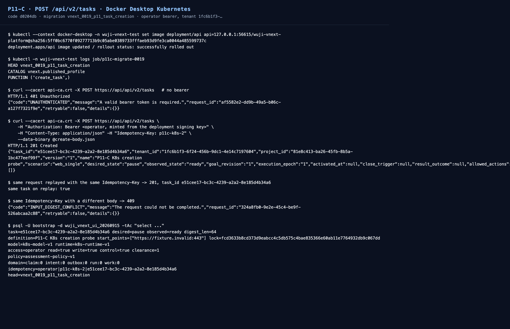

# P11-C Task creation entry — 2026-09-15

Status: **verified** for the isolated Docker Desktop Kubernetes slice.

`POST /api/v2/tasks` no longer returns “not implemented”: an authenticated operator can create a
non-running Task from a validated payload, the Task gets the frozen versioned definition snapshot
bound to deployment-published model/runtime profiles, and only the creator receives access to that
new Task.



## What changed (code `d0204db`)

| Layer | Change |
| --- | --- |
| Migration `vnext_0019_p11_task_creation` | `vnext.published_profile` catalog (owner-published, tenant-scoped read policy), `vnext.task_create_command` idempotency ledger, `vnext.create_task(project, payload, start_points, key, task_id)` SECURITY DEFINER |
| Authority | tenant/subject come from the transaction settings; creation requires `can_control` on an existing Task of the requested project; profiles must be published and non-revoked in the caller's tenant |
| Service | `TaskService.create()` validates the payload (future authorization window, positive USD budget, explicit start points derived from the authorization scope), restricts creation to operator/controller principals, maps database decisions to the frozen error envelope |
| HTTP | `create_task_router` serves the contract at `201`; mounted in the isolated public API next to topology and layouts |

Creation never starts execution (`desired_state=pause`, `observed_state=ready`), never grants
project-wide rights, and writes no Claim, Intent, Outbox, AgentRun or WorkItem row.

## Observed results

Kubernetes API (`Deployment/api`, platform image rebuilt from `d0204db`; migration job applied 0019):

```text
HEAD vnext_0019_p11_task_creation
CATALOG vnext.published_profile
FUNCTION ('create_task',)
POST /api/v2/tasks (no bearer)                        -> 401 UNAUTHENTICATED
POST /api/v2/tasks (operator bearer, fresh mint)      -> 201, task e51cee17-bc3c-4239-a2a2-8e185d4b34a6
POST /api/v2/tasks (same key, same body)              -> 201, same task (idempotent)
POST /api/v2/tasks (same key, different body)         -> 409 INPUT_DIGEST_CONFLICT
POST /api/v2/tasks through the browser entry (:44180) -> 405 from the gateway route table, never forwarded
```

Resulting PostgreSQL rows:

```text
task=e51cee17-bc3c-4239-a2a2-8e185d4b34a6 desired=pause observed=ready digest_len=64
definition=P11-C K8s creation probe start_points=["https://fixture.invalid:443"] lock=fcd3633b… model=k8s-model-v1 runtime=k8s-runtime-v1
access=operator read=true write=true control=true clearance=1
policy=assessment-policy-v1
domain=claim:0 intent:0 outbox:0 run:0 work:0
idempotency=operator|p11c-k8s-2|e51cee17-bc3c-4239-a2a2-8e185d4b34a6
head=vnext_0019_p11_task_creation
```

## Validation

```text
./scripts/vnext/uv.sh run --frozen pytest tests/vnext/test_task_creation.py -q     # 4 passed
work/toolchain/bin/pnpm contracts:check:v2                                          # passed (3 pre-existing warnings)
./scripts/vnext/uv.sh run --frozen pytest <29 related files> -q                     # 409 passed / 0 failed
```

`tests/vnext/test_task_creation.py` covers: persistence and the non-running state, creator-only
access, absence of domain rows, idempotent replay, conflicting body with the same key, missing
project control permission, foreign tenant, anonymous access, missing `Idempotency-Key`,
unpublished or revoked profiles and an expired authorization window. Raw output is in [`raw/`](raw/).

## Scope, decisions and limitations

- **Permission model (decision D18):** creation requires the caller's tenant to own the project and
  the caller to hold `can_control` on an existing Task of that project. The first Task of a project
  therefore stays a deployment/bootstrap action, and a creator only ever receives access to the Task
  it created — never org-wide rights.
- Profiles are published by the deployment owner through `register_published_profile`; the isolated
  cluster's catalog currently holds the `k8s-model-v1`/`k8s-runtime-v1` probe pair.
- A created Task has no `admission_config`, capacity binding or scheduler/receiver registration yet,
  so it is deliberately not dispatchable: publishing task admission remains an owner-side step and
  is the next P11-C increment together with the command → real Pod/child observation loop.
- The browser entry does not expose creation; production identity, CSRF and the product creation
  flow remain P11 product scope.
