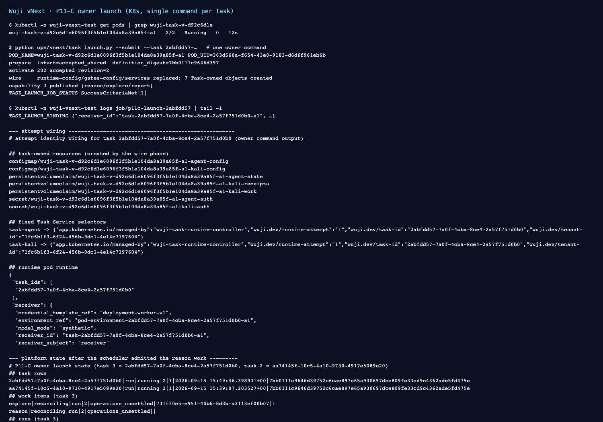

# P11-C owner launch: a created Task reaches a real runtime attempt — 2026-09-15

Status: **the owner command is delivered and the launch path is verified end to end up to the
worker start gate.** The MAF child itself is still refused at that gate; the refusal is open.

Scope: local Docker Desktop Kubernetes (`wuji-vnext-test`), real isolated PostgreSQL
(`wuji_vnext_ui_20260915`, head `vnext_0019_p11_task_creation`), synthetic loopback model. This
package does **not** accept P11, P12, Pod/K8s hardening or production identity.



## 1. What the owner command now does

`ops/vnext/task_launch.py` is the single owner action between a Task created through
`POST /api/v2/tasks` and a running runtime attempt. It runs four ordered phases and is idempotent:

| Phase | Action | Guard |
| --- | --- | --- |
| `prepare` | merge the deployment's published `worker_profiles` into the definition, publish the admission config, register the attempt executor, admit the initial Intent | refuses a late definition change once `activated_at` is set; capacity pools come from the deployment catalogue, never guessed |
| `activate` | `start` through the public command route (`POST /api/v2/tasks/{id}/commands`) | mints a bounded operator bearer from the mounted deployment signing key; an already activated Task is read back, not re-issued |
| `wire` | render and apply this attempt's ConfigMaps/Secrets/PVCs, re-point `task-agent`/`task-kali`, refresh the runtime `pod_runtime`/`task_ids` and the gates executor binding, roll `runtime`/`gates`, wait for the runtime to report a ready Pod | Task Service certificates and the bearer material come from the deployment, not from an older Task |
| `capability` | publish the tenant `session_capability` for reason/explore/report bound to the **observed** Pod UID | refused until that exact attempt registered its receiver row |

The Pod itself is still created by the runtime controller; the command never creates a Pod, never
writes Facts/Runs/results and never invents a Pod UID or a process exit.

## 2. Verified on the real cluster (task `2abfdd57-7a0f-4cba-8ce4-2a57f751d0b0`)

```text
POST /api/v2/tasks                      -> 201 Created (revision 1, pause/ready)
python ops/vnext/task_launch.py --submit --task 2abfdd57-…
  prepare    intent accepted_shared, definition_digest 7bb0111c9646d39752c6cae897e65a930697dce809fe33cd9c4362ade5fd475e
  activate   POST /api/v2/tasks/2abfdd57-…/commands {"command":"start"} -> 202, revision 2, execution_epoch 2
  wire       task-owned objects created, runtime-config/gates-config/services replaced,
             Pod wuji-task-v-d92c6d1e6096f3f5b1e104da8a39a85f-a1 uid 363d560a-f654-43e0-9183-d6d6f961eb6b 2/2 Running
  capability session-capability-2abfdd57-…-a1-{reason,explore,report} published (bound to that uid)
TASK_LAUNCH_JOB_STATUS SuccessCriteriaMet|1|
```

The scheduler then admitted the reason work and the runtime delivered the assignment to the Pod:

```text
run.dispatch_requested          15:49:59.153
execution_observation started   15:50:00.769   (real birth, recorded by the runtime)
execution_observation exited    15:50:03.670   (real exit, never invented)
model_call 0 · tool_call 0 · result_submission 0
work_item reason  -> reconciling / operations_unsettled
work_item explore -> reconciling / operations_unsettled
```

Artifacts: [raw/launch-task3d.log](raw/launch-task3d.log) (the whole four-phase run),
[raw/create3.headers](raw/create3.headers) + [raw/create3.response](raw/create3.response),
[raw/start-probe2.headers](raw/start-probe2.headers) + [raw/start-probe2.response](raw/start-probe2.response),
[raw/db-state.txt](raw/db-state.txt), [raw/attempt-wiring.txt](raw/attempt-wiring.txt),
[raw/canonical-assignment.json](raw/canonical-assignment.json), [raw/migration-head.txt](raw/migration-head.txt).

The Task Pod on the deploy is `127.0.0.1:56615/wuji-vnext-platform@sha256:d8670d93f17a0c21309b1d808cd3ac6c294ab8c8af77073373ddfa24ae9010b3`
(commit `d5a246a`), agent `…wuji-vnext-agent@sha256:bee11093…`, kali
`…wuji-vnext-kali@sha256:79979680…`; the plane deployments ran the same digest.

## 3. Defects found and fixed while making this work

1. **Attempt bearer drift.** The first wire phase copied `receiver.token`/`collector.token` from an
   older Task's secret. The supervisor authenticates the controller channel by byte equality with
   the bearer the runtime presents, so every dispatch answered `401 UNAUTHENTICATED`. Fixed by
   sourcing the bearers from the deployment secrets while keeping the Task Service certificates.
2. **Activation used the stale mounted bearer.** `prepare` minted a bounded bearer, but `activate`
   still read the deployment file whose token had expired; every in-cluster `start` answered 401
   while the same request from an operator workstation succeeded. One bearer path now serves both.
3. **Late definition rewrites.** Re-running the command after activation must read the final
   definition back (the permit binds the digest of the first `task.started`) and refuse a change;
   it no longer refuses an already-final definition.
4. **Capacity catalogue.** Pool keys are read from the deployment template Task; deriving
   `model:<profile>` produced `INVALID_REFERENCE` because the live pool is keyed by the synthetic
   model reference.
5. **Operator diagnostics.** The launch command now reports the bounded rejection code of the
   command route and the terminal Job status instead of failing opaquely.

## 4. Follow-up runs (tasks `756d55b2-…` and `d682f19a-…`)

Three more owner runs after the package above added both bounded operator signals and two fixes:

- `ff54d7d5` logs `{"event": "worker_start_refused", "code": …}` when a child start is collapsed into
  `revoked`, and `{"event": "runtime_dispatch_transport", "method": …, "status": …}` for every
  Task-Service delivery. They turned three opaque failures into two named ones.
- The first delivery of a fresh attempt answered `503` from the supervisor and was then fenced as
  `previous_delivery_unresolved_no_replay`; the identical PUT through the platform's own transport
  (`SupervisorHttpTransport`) succeeded minutes later, so the attempt was stranded by a transient
  callback failure, not by an authorization mismatch. `7784afbd` now waits for the rolled
  `runtime`/`gates` Deployments to serve before `wire` returns; the next run's queries answered
  `200`.
- The child gate still answers `revoked`, and the signal now names it: `STALE_EXECUTION`.
  `297a838` lets that single gate accept a work item that is still `leased` while its run is already
  `running` with a matching started observation (the dispatcher records the observation and moves the
  work item in two transactions). The refusal persists, so at least one further predicate inside
  `current_run` / the start authorizer is still failing; per-predicate codes are the next step.

## 5. Open defects (not closed here)

1. **The MAF child is refused at the start gate (`STALE_EXECUTION`).** The supervisor spawns the guardian and child,
   the platform records a real started/exited pair, and the child aborts with
   `HostTransportError: Worker start was revoked` — i.e. the P05 start predicate answered
   `status=revoked`. `WorkerBridge._await_start` currently collapses `STALE_EXECUTION` and
   `LIMIT_BLOCKED` into that status, so the exact predicate is still unidentified; one bounded
   operator signal is the next step. See [raw/child-start-refused.txt](raw/child-start-refused.txt).
2. **A run with no tool attempts never settles.** `run_operation_settlement` is written by the
   tool-admission path, so a run that exits without any tool call leaves its work item at
   `reconciling / operations_unsettled` forever. Capacity is still released (task `aa74145f-…`'s
   reservations show `released` after a real exit), but the work item cannot be re-admitted.
3. **Delivery reconciliation.** One dispatch attempt was marked `attempted` with no receipt (the
   runtime answered `unknown`); the platform then refused to re-deliver
   (`previous_delivery_unresolved_no_replay`) even though the authenticated receiver answered
   `OPERATION_NOT_FOUND` for that operation. Reconciling an authoritative negative answer needs an
   explicit decision.
4. **Single-Task slice.** `task-agent`/`task-kali` and the runtime `pod_runtime` serve one Task at a
   time; multi-Task concurrency is unchanged from the earlier plan.
5. **Capacity sizing.** This harness had to raise the three pools to capacity 4 because the fixture
   Task's reservation (and the earlier probe Tasks') cannot be released without a real exit
   observation. That is a deployment sizing change, not a domain-state repair.

## 7. Status after 2026-09-16

The open defects 1-3 above were closed in the follow-up package
[task-roundtrip-20260916](../task-roundtrip-20260916/README.md): the child now passes
`await-start` and `worker-host/resolve`, the first model and tool calls reach the gates, and a run
result is accepted. The two settlement defects (a run with no tool attempt, and a run whose tool
call is refused) remain open and are recorded there. Nothing in sections 1-5 above is rewritten.

## 6. Not covered

Production identity, real model gateway traffic, P12 completion, other work kinds, Pod hardening,
multi-Task concurrency, and the full P10/P11 acceptance. This evidence binds commit `d5a246a` for
the owner command and the digests recorded in section 2 for the deployed plane; documents added
afterwards are separate commits.
