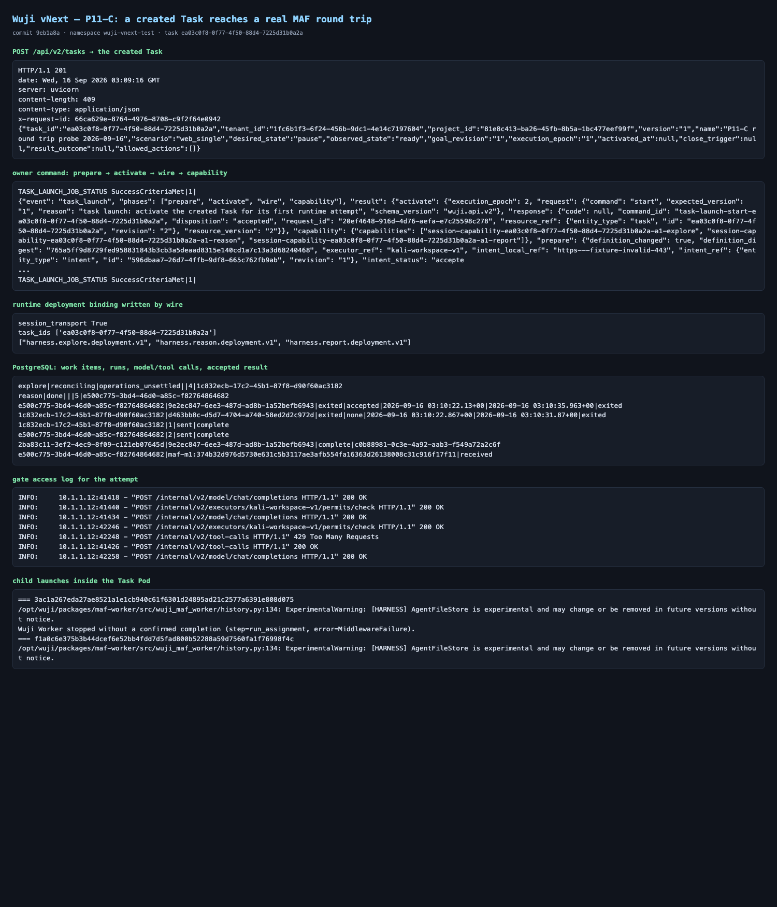

# P11-C: a Task created through the product entry reaches a real MAF round trip — 2026-09-16

Status: **verified for the isolated local slice.** A Task created by `POST /api/v2/tasks` was taken
by the owner command through `prepare → activate → wire → capability`, the scheduler admitted its
`reason` work, the Task Pod ran the real MAF child against the model and tool gates, and the run
submitted a result the platform accepted. The `explore` work of the same attempt hit the deployed
tool-call limit and is left `reconciling / operations_unsettled`; that is an open defect, not a pass.

Scope: local Docker Desktop Kubernetes (`wuji-vnext-test`), real isolated PostgreSQL
(`wuji_vnext_ui_20260915`), synthetic loopback model, one Task at a time. This package does **not**
accept P11, P12, Pod/K8s hardening, multi-Task concurrency or production identity.

- tested code: `9eb1a8a` (`codex/vnext-maf`), platform image
  `127.0.0.1:56615/wuji-vnext-platform@sha256:0b73edf628211da7940bb99002957492143241d4d5f5366277d6f43c764e502d`,
  agent `…wuji-vnext-agent@sha256:7878cfba…`, kali `…wuji-vnext-kali@sha256:97a5189b…`
- Task `ea03c0f8-0f77-4f50-88d4-7225d31b0a2a`, attempt 1, execution epoch 2, definition digest
  `765a5ff9d8729fed958831843b3cb3a5deaad8315e140cd1a7c13a3d68240468`
- Task Pod `wuji-task-v-b2a80dafb0b1f257f1603abb1fdc632b-a1` uid
  `41e5d0af-fd13-4e2a-94ee-c4b9ce513fc6`



## 1. What the run proves

| Step | Observed evidence |
| --- | --- |
| product creation entry | `POST /api/v2/tasks` → `201`, revision 1, `desired=pause`, `observed=ready` (`raw/create.headers`, `raw/create.response.json`) |
| owner command | four phases in one idempotent run; `wire` wrote `runtime-config` (`task_ids`, `session_transport=true`), `profiles.json`, `gates-config` and the Task-owned objects (`raw/launch.log`) |
| runtime host | the child's `worker-host/await-start` and `worker-host/resolve` were answered from the frozen definition and the attempt's published Session profiles; the child reached `run_assignment` (`raw/child-launches.txt`) |
| scheduler | `reason` and `explore` work admitted for the created Task (`raw/work-items.txt`) |
| real MAF child | `reason` run `e500c775-…`: 2 model calls, 1 tool call, exited at `03:10:35.963` (`raw/agent-runs.txt`, `raw/model-calls.txt`, `raw/tool-calls.txt`) |
| gates | `POST /internal/v2/model/chat/completions 200`, `POST /internal/v2/executors/kali-workspace-v1/permits/check 200`, `POST /internal/v2/tool-calls 200` (`raw/gates-access.txt`) |
| accepted result | result submission `maf-m1:374b32d9…` state `received`, run `result_state=accepted`, work item `reason` → `done` (`raw/result-submissions.txt`, `raw/work-items.txt`) |

## 2. Complete reproduction packet

### 2.1 Create the Task (operator bearer minted from the deployment identity)

```http
POST /api/v2/tasks HTTP/1.1
Host: 127.0.0.1:18454 (kubectl port-forward svc/api 18454:8443)
Authorization: Bearer <operator JWT: iss=https://identity.wuji-vnext-test.invalid,
  aud=wuji-vnext-deployment, sub=operator, roles=[operator], tenant=1fc6b1f3-…, ttl 900s>
Idempotency-Key: operator|p11c-roundtrip-20260916|<random>
Content-Type: application/json
```

```json
{"authorization_expires_at":"2099-01-01T00:00:00Z","authorization_scope":[{"host":"fixture.invalid","port":443,"protocol":"https"}],"budget":{"amount":"1","currency":"USD"},"goal":{"criteria":[{"allowed_methods":["deterministic"],"condition":"version captured","criterion_id":"version","evidence_requirements":["sealed bytes"],"object":"fixture bytes","required":true,"responsible_party":"fixture-checker"}],"text":"Read the isolated workspace version file"},"model_profile_ref":"k8s-model-v1","name":"P11-C round trip probe 2026-09-16","project_id":"81e8c413-ba26-45fb-8b5a-1bc477eef99f","runtime_profile_ref":"k8s-runtime-v1","scenario":"web_single","schema_version":"wuji.api.v2"}
```

```http
HTTP/1.1 201
date: Wed, 16 Sep 2026 03:09:16 GMT
server: uvicorn
content-length: 409
content-type: application/json
x-request-id: 66ca629e-8764-4976-8708-c9f2f64e0942
```

```json
{"task_id":"ea03c0f8-0f77-4f50-88d4-7225d31b0a2a","tenant_id":"1fc6b1f3-6f24-456b-9dc1-4e14c7197604","project_id":"81e8c413-ba26-45fb-8b5a-1bc477eef99f","version":"1","name":"P11-C round trip probe 2026-09-16","scenario":"web_single","desired_state":"pause","observed_state":"ready","goal_revision":"1","execution_epoch":"1","activated_at":null,"close_trigger":null,"result_outcome":null,"allowed_actions":[]}
```

The verbatim pair is in [`raw/create.headers`](raw/create.headers) and
[`raw/create.response.json`](raw/create.response.json); the request body, the idempotency key and the
task id are in [`raw/create.request.json`](raw/create.request.json),
[`raw/idempotency-key.txt`](raw/idempotency-key.txt) and [`raw/task-id.txt`](raw/task-id.txt).

### 2.2 One owner command takes the Task to a running attempt

```bash
scripts/vnext/uv.sh run --frozen python ops/vnext/task_launch.py --submit \
  --task ea03c0f8-0f77-4f50-88d4-7225d31b0a2a \
  --image 127.0.0.1:56615/wuji-vnext-platform@sha256:0b73edf6… \
  --agent-image 127.0.0.1:56615/wuji-vnext-agent@sha256:7878cfba… \
  --kali-image 127.0.0.1:56615/wuji-vnext-kali@sha256:97a5189b…
# TASK_LAUNCH_JOB_STATUS SuccessCriteriaMet|1|
```

The complete four-phase JSON and the persisted binding are in [`raw/launch.log`](raw/launch.log).
The attempt's deployment binding that `wire` wrote is in [`raw/runtime-config.txt`](raw/runtime-config.txt)
and [`raw/runtime-profiles.txt`](raw/runtime-profiles.txt).

## 3. Defects found and closed while making this work

Every one of these surfaced only in the live slice; the source reviews could not see them.

| # | Symptom observed in the run | Cause | Fix |
| --- | --- | --- | --- |
| 1 | child stopped at `step=load_context`, `code=CAPABILITY_UNAVAILABLE` | the Task definition froze `wuji.harness.session.v1` profiles but `wire` only refreshed `deployment.json`; the runtime host still held the older published profile set, and `session_transport` was never enabled | `wire` publishes the attempt's exact Session profile snapshots and requires `session_transport: true` (`adb4a4c`) |
| 2 | child stopped at `step=run_assignment` with no reason at all | the bounded stderr line named the phase but not the failure, and raw text could not be logged | the line now carries the exception class, and the exact traceback goes to an owner-only `child-error.txt` inside the Task Pod (`a3068ae`) |
| 3 | `installed MAF release/lock does not match published profile` | the Task was created from a published runtime profile naming a lock the shipped worker does not have; only the child could notice, after the model gate had accepted the attempt | the command measures `packages/maf-worker/uv.lock` from its own build and refuses with `INPUT_DIGEST_CONFLICT` before activation (`4357959`); the isolated catalogue was re-published as `k8s-runtime-v1` revision 2 with the shipped digest |
| 4 | `ChatClientException(APIConnectionError)` on the first model call, gate accepted nothing | `wire` rolled `runtime` before `gates`, and `wait_for_rollout` returned on the Deployment status that still described the previous ReplicaSet, so the child called a gate whose Pod did not exist yet | the gate is rolled first, and the wait now requires the observed generation, no remaining old Pod and the desired available replicas (`33dea4b`, `9eb1a8a`) |
| 5 | a launch failed permanently with `CAPABILITY_UNAVAILABLE` in `publish_capabilities` | the capability phase demanded that the attempt had registered its receiver, but registration follows the controller cycle that creates the Pod | bounded 120 s retry while the code is `CAPABILITY_UNAVAILABLE`; every other refusal still fails immediately (`33dea4b`) |

A sixth, smaller change belongs to the same diagnostic theme: `WorkerHostBridge.resolve` now emits
`{"event": "worker_resolve_refused", "step": …, "code": …}` (its `CAPABILITY_UNAVAILABLE` can come
from three different predicates), which is what turned defect 1 from a guess into a fact (`a921fdc`).

## 4. Open defects (not closed here)

1. **A refused tool call does not settle the work.** The `explore` run's tool call was answered
   `429 Too Many Requests`; the harness raised, the child exited, and the work item is left
   `reconciling / operations_unsettled` with no terminal reason (`raw/work-items.txt`,
   `raw/gates-access.txt`). A run that ends without any settlement must still reach a bounded
   terminal reason so the Scheduler can re-admit or fail it.
2. **A run that makes no tool call never settles** (carried from the previous package): the
   operation settlement row is written by the tool-admission path only.
3. **Single-Task slice.** `task-agent`/`task-kali`, the runtime `pod_runtime` and the gates executor
   binding still serve one Task at a time; multi-Task concurrency is unchanged.
4. **Capacity sizing.** The three pools were raised to capacity 4 for this harness because earlier
   probe Tasks cannot release their reservations without a real exit observation.
5. **Catalogue discipline.** The isolated catalogue had to be re-published by hand after the worker
   lock changed. A deployment should publish its runtime profile in the same step that builds the
   worker image, otherwise every Task created in between is unusable.

## 5. Validation performed

```text
tests/vnext/test_task_launch.py        6 passed  (245.06s)   on 33dea4b
tests/vnext/test_maf_child_transport.py 12 passed (41.47s)   on a3068ae
tests/vnext/test_task_creation.py + test_task_launch.py 10 passed (7.64s) on 4357959
```

The live run above is the verification for the deployment-side changes; no unit test can observe a
ReplicaSet that does not exist yet.

## 7. Follow-up: a Run now closes its own operation set (commit `27673ab`)

The defect that left work `explore` at `reconciling / operations_unsettled` is closed. A Run refused
before its first tool attempt registered no operation at all, so no producer ever published a
settlement for it; the platform now derives that empty set from its own durable records.

- contract `POST /internal/v2/tool-settlement` (empty request, bounded receipt), regenerated DTOs and
  the frozen route set updated;
- `ToolGate.close_operations` recomputes the status from durable records in a `tool_settle`
  transaction and never rewrites a settlement another producer published;
- the MAF child closes its own set on every exit path of `run_assignment`, bounded (5 s) and
  best-effort;
- schema `vnext_0020_p06_run_settlement_close` keeps the "admitted tool attempt" rule and adds the
  empty-set case (no non-terminal attempt, no in-flight model call, no unreleased resource).

Live result for Task `0c33b0bf-ba71-4f07-926d-84b1da38b1ea` (plane `d3db345d`, migration head
`vnext_0020_p06_run_settlement_close`, both children closed their set with `200`):

```text
explore|failed||process_failure|458e429b-5843-45f6-90a5-004d94191c2f
reason|failed||process_failure|8f65c1cc-8c7c-4c41-9605-3bfb96226cd2
```

```text
8f65c1cc-8c7c-4c41-9605-3bfb96226cd2|exited|accepted|2026-09-16 03:57:31.701+00|2026-09-16 03:57:45.203+00|exited
458e429b-5843-45f6-90a5-004d94191c2f|exited|incomplete|2026-09-16 03:57:32.248+00|2026-09-16 03:57:44.012+00|exited
```

```text
458e429b-5843-45f6-90a5-004d94191c2f|settled|{"basis":"run_closed_operation_set","open_operations":{"model_calls":0,"resource_reservations":0,"tool_attempts":0},"producer":"p06"}
8f65c1cc-8c7c-4c41-9605-3bfb96226cd2|settled|{"basis":"durable_tool_attempt_receipts","producer":"p06"}
```

```text
3|1|1|vnext_0020_p06_run_settlement_close
```

```text
INFO:     10.1.1.23:41104 - "POST /internal/v2/model/chat/completions HTTP/1.1" 200 OK
INFO:     10.1.1.23:41106 - "POST /internal/v2/model/chat/completions HTTP/1.1" 200 OK
INFO:     10.1.1.23:56320 - "POST /internal/v2/tool-calls HTTP/1.1" 429 Too Many Requests
INFO:     10.1.1.23:41114 - "POST /internal/v2/tool-calls HTTP/1.1" 200 OK
INFO:     10.1.1.23:56334 - "POST /internal/v2/tool-settlement HTTP/1.1" 200 OK
INFO:     10.1.1.23:56322 - "POST /internal/v2/model/chat/completions HTTP/1.1" 200 OK
INFO:     10.1.1.23:56342 - "POST /internal/v2/tool-settlement HTTP/1.1" 200 OK
```

Task Pod `wuji-task-v-0d2544f803b20edba57a5e488b444463-a1`; child launches in
[`raw/settlement/child-launches.txt`](raw/settlement/child-launches.txt). Neither work item stays at
`operations_unsettled`: the Run with no tool attempt settled through the new basis
`run_closed_operation_set`, and the Work item reached the bounded terminal reason `process_failure`.

### 7.1 Defects this run exposed (open)

1. **An accepted result can still leave the Run exiting 1.** The `reason` run's submission is
   `received` and its receipt `accepted`, yet the child's `submit_result` call answered `409` and the
   child aborted, so the Work item settled as `process_failure` instead of `done`. The 409 was
   returned after the platform had already persisted the acceptance; the next step is to name the
   refusing predicate on the receipt path and decide which one wins.
2. **A refused tool call reaches the model as a failed function.** The SDK rendered the gate's
   `429 Too Many Requests` as `Function failed. Error: Client error '429'`, and the Run then died on
   a later connection error. The refusal itself is correct (bounded limit), but the Run should end in
   a named state rather than an opaque middleware failure.
3. **The model-gate connection error is still reachable.** `458e429b` ended with
   `ChatClientException … APIConnectionError('Connection error.')`; the gate was serving (200s in the
   same log) so this needs the same bounded classification the other transports already have.

## 8. A Run keeps ownership of its own result (commits `8a57620`, `7fc993a`)

The submission that the platform had already accepted but the child reported as a refusal is
explained and fixed. `8a57620` first made the refused Host response name its predicate, and the next
live run answered `code=INPUT_DIGEST_CONFLICT`.

`PlatformWorkerHost.submit_result` accepts an existing submission only from its own writer or the
retained source writer. The supervisor recovered "produced results" for every state other than
`prepared`, so one query of a still-running child committed the very bytes the child was about to
submit; the child's own commit was then refused as another writer's replay. Recovery now happens
only in the terminal states, and a running child is still reported unchanged.

Live result for Task `78dbcb53-6884-4d5b-b6f5-9622d0f2c77e` (plane `fcfc3b3a`, agent `f1ca7f2c`):

```text
explore|failed||process_failure|bc87ba7b-4f34-49c3-8b4c-493b139ff4b0
reason|done|||47e83b4c-a07f-40f4-b08a-099c4fa847a2
```

```text
47e83b4c-a07f-40f4-b08a-099c4fa847a2|exited|accepted|2026-09-16 04:21:53.012+00|2026-09-16 04:22:07.927+00
bc87ba7b-4f34-49c3-8b4c-493b139ff4b0|exited|incomplete|2026-09-16 04:21:53.726+00|2026-09-16 04:22:03.577+00
```

```text
47e83b4c-a07f-40f4-b08a-099c4fa847a2|maf-m1:94d480c06a134246e7261da4139a94bfcab345cb0e0acefb3365d3820a5c1f2f|run.worker:47e83b4c-a07f-40f4-b08a-099c4fa847a2|received
```

```text
47e83b4c-a07f-40f4-b08a-099c4fa847a2|settled|{"basis":"durable_tool_attempt_receipts","producer":"p06"}
bc87ba7b-4f34-49c3-8b4c-493b139ff4b0|settled|{"basis":"run_closed_operation_set","open_operations":{"model_calls":0,"resource_reservations":0,"tool_attempts":0},"producer":"p06"}
```

```text
INFO:     10.1.1.41:35558 - "POST /internal/v2/model/chat/completions HTTP/1.1" 200 OK
INFO:     10.1.1.41:35578 - "POST /internal/v2/model/chat/completions HTTP/1.1" 200 OK
INFO:     10.1.1.41:35588 - "POST /internal/v2/executors/kali-workspace-v1/permits/check HTTP/1.1" 200 OK
INFO:     10.1.1.41:35596 - "POST /internal/v2/executors/kali-workspace-v1/permits/check HTTP/1.1" 200 OK
INFO:     10.1.1.41:35608 - "POST /internal/v2/tool-calls HTTP/1.1" 429 Too Many Requests
INFO:     10.1.1.41:35572 - "POST /internal/v2/tool-calls HTTP/1.1" 200 OK
INFO:     10.1.1.41:35624 - "POST /internal/v2/model/chat/completions HTTP/1.1" 200 OK
INFO:     10.1.1.41:35634 - "POST /internal/v2/tool-settlement HTTP/1.1" 200 OK
INFO:     10.1.1.41:35642 - "POST /internal/v2/tool-settlement HTTP/1.1" 200 OK
```

The `reason` work now completes end to end — the submission is written by
`run.worker:47e83b4c-…` itself and the Work item reaches `done`. The `explore` work of the same
attempt is refused with `LIMIT_BLOCKED` while the other Run still held the single workspace path
(`vnext.admission_audit`, 04:22:02.092 refusal against the 04:22:02.234 completion), which is the
bounded refusal the platform is supposed to produce for two concurrent work items; it settles as
`process_failure` instead of hanging. Raw files: `raw/result-ownership/` (including
`admission-audit.txt` and `child-stderr.txt`).

### 8.1 Notes and remaining items

- The isolated catalogue briefly carried `k8s-runtime-v1` revision 3 with
  `max_inflight_tools=2`; it was revoked again because the refusal above is the per-resource
  workspace mutex, not the in-flight limit, so the extra sizing changed nothing.
- The refused tool call still ends the Run through the SDK's `MiddlewareFailure`, and the SDK then
  reports the follow-up model request as a connection error. Both are recorded in
  `child-stderr.txt`; naming that second failure is the next diagnostic step, together with the
  product decision of whether a bounded `LIMIT_BLOCKED` should end the Run or be surfaced to the
  model as a retryable refusal.

## 6. Raw material

`raw/create.request.json`, `raw/create.headers`, `raw/create.response.json`, `raw/idempotency-key.txt`,
`raw/task-id.txt`, `raw/launch.log`, `raw/work-items.txt`, `raw/agent-runs.txt`, `raw/model-calls.txt`,
`raw/tool-calls.txt`, `raw/result-submissions.txt`, `raw/gates-access.txt`, `raw/runtime-config.txt`,
`raw/runtime-profiles.txt`, `raw/task-pod.txt`, `raw/child-launches.txt`, and the settlement
follow-up under `raw/settlement/`.
