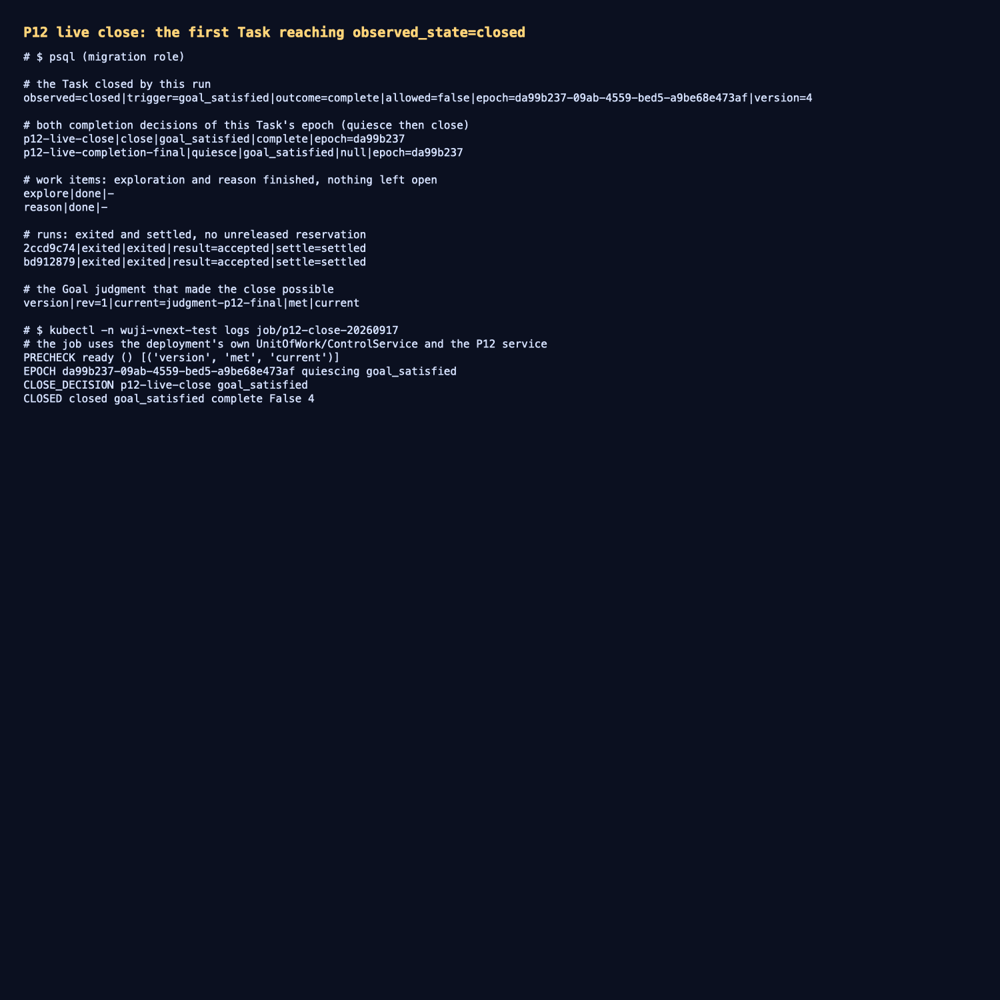

# P12 实测：Task 第一次走到 `observed_state=closed`

- 日期：2026-09-17；工作树 `work/worktrees/vnext-maf`，分支 `codex/vnext-maf`；被测代码 `3c0b3b4`。
- 集群：`docker-desktop` / `wuji-vnext-test`；迁移头 `vnext_0023_p12_judgments`；
  镜像 `127.0.0.1:56615/wuji-vnext-platform@sha256:986e95b31eedaed1c89b910ad9b92ba031f357b0e8f7b0b348002a7d56460ff5`。
- 对象：Task `fc2ff1b0-a578-4131-9fc3-4a7a80c74442`（此前已被判定为 ready 并进入 `quiescing`）。

## 1. 本切片交付

- **AC-049**：新增测试证明冻结期"拒绝新动作、继续收旧回执"——`task_can_run` 为假、工作不可派发，而在飞 Run 的
  `exited` 观测、`result_submission` 写入与 `project_run_result` 的 accepted 投影在 `quiescing` 期间仍然成功
  （`result_submission` 的插入策略只要求 `model_output` 权限与 scope，不要求 Task 正在运行）。
- **AC-052**：`CompletionService.close` 只在 `goal_satisfied` 时要求完整评审；**强制关闭**
  （budget/time/no_progress/operator）允许有未完成工作，把评审原文放进决定回执，由 P05 取消剩余工作；
  已完成的工作保持不动。`close_trigger` 与 `result_outcome` 始终是两个独立字段。

## 2. 集群实测

```text
PRECHECK ready () [('version', 'met', 'current')]
EPOCH da99b237-09ab-4559-bed5-a9be68e473af quiescing goal_satisfied
CLOSE_DECISION p12-live-close goal_satisfied
CLOSED closed goal_satisfied complete False 4        # observed_state / trigger / outcome / execution_allowed / control_version
```

数据库事实：

```text
task        observed=closed|trigger=goal_satisfied|outcome=complete|allowed=false|epoch=da99b237-…|version=4
decisions   p12-live-completion-final|quiesce|goal_satisfied|null|epoch=da99b237…
            p12-live-close|close|goal_satisfied|complete|epoch=da99b237…
work items  explore|done  reason|done
runs        2ccd9c74|exited|accepted|settle=settled ；bd912879|exited|accepted|settle=settled
judgment    version|rev=1|current=judgment-p12-final|met|current
```

即：证据 → 判定 → precheck ready → quiesce → 结算齐全 → close → **Task 关闭**，`close_trigger` 与
`result_outcome` 分开记录，未完成工作不会被写成 done。

## 3. 证据

- 实时关闭输出：[`raw/live-close.txt`](raw/live-close.txt)
- Task/决定/工作/Run/判定数据库事实：[`raw/database-state.txt`](raw/database-state.txt)
- 终端汇总截图：[`screenshots/completion-close.png`](screenshots/completion-close.png)



测试：`tests/vnext/test_completion_protocol.py` 14 passed（冻结期拒绝新动作/继续收回执、goal_satisfied 在有未完成
工作时被拒、强制关闭取消未完成工作并保留已完成工作、判定与关闭决定的身份与字段）；
相邻 `test_work_state_guards` + `test_control_integration` + `test_layouts` +
`test_session_writer_exit_migration` 41 passed。

## 4. 未覆盖与后续

- **AC-053 ReportCommit 冻结与迟到反证追加**仍未实现：关闭只是把 Task 状态与两份决定固化，没有冻结报告正文、
  也没有把迟到反证追加成补充/争议记录。
- 关闭由显式 Job（平台侧 pod-controller 身份）执行；产品入口（工作台/API）触发关闭、关闭后的报告投递与
  历史查看仍未接线。
- 判定仍是显式夹具主体写入（`assessor-p12-fixture`）；判定的自动生产来源未定。
- 多 Task 并发派发（每 Task 独立 supervisor 端点）仍未做。
