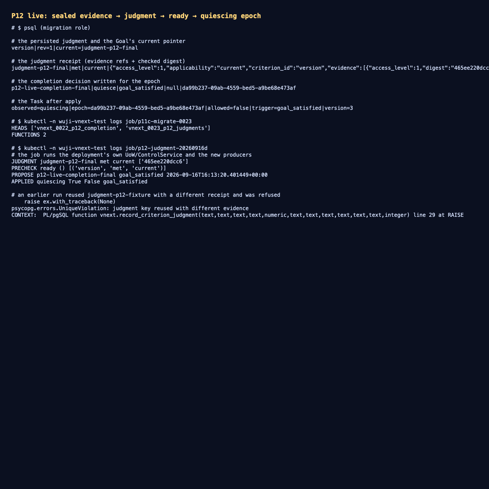

# P12 实测：封存证据 → 判定 → precheck ready → 进入完成期

- 日期：2026-09-16/17；工作树 `work/worktrees/vnext-maf`，分支 `codex/vnext-maf`；被测代码 `91a22b5`
  （判定与关闭决定来自 `267f720`，回执可重放修复来自 `91a22b5`）。
- 集群：`docker-desktop` / `wuji-vnext-test`；迁移头 `vnext_0023_p12_judgments`；
  镜像 `127.0.0.1:56615/wuji-vnext-platform@sha256:c1be9c7c3240dcb639029716d4b75f8e7c242d4d99177f5a3d5ff8a58a412e12`。
- 对象：Task `fc2ff1b0-a578-4131-9fc3-4a7a80c74442`（reason 与 explore 两个 Run 此前都已 `exit_code=0`、
  结果被接纳、work 都是 `done`，但仍因没有判定而无法进入完成）。

## 1. 本切片交付

- 迁移 `vnext_0023_p12_judgments` 两个 SECURITY DEFINER 生产者：
  - `record_criterion_judgment`：冻结判据 revision 与定义、按 judgment key 幂等、只在"该 revision 仍是最新"时
    移动 `current_judgment_id`——关于被取代 revision 的迟到反证会被记录但**不会**定义 Goal（AC-034/053）。
  - `prepare_completion_close`：为 Task 自己的完成期写 `close` 决定，`close_trigger` 与 `result_outcome`
    是两个独立字段，且必须匹配当前 epoch / control_version / board_revision（AC-052）。
- `completion.judgments`：只有 `assessor` + `can_assess` 能写判定；无证据的判定被拒；引用必须存在、**已封存**
  且在当前 clearance 下可读，回执记录实际校验过的引用与字节 digest。
- `CompletionService.close`：为已开启的完成期写关闭决定。

## 2. 集群实测输出

```text
JUDGMENT judgment-p12-final met current ['465ee220dcc6']
PRECHECK ready () [('version', 'met', 'current')]
PROPOSE p12-live-completion-final goal_satisfied 2026-09-16T16:13:20Z
APPLIED quiescing True False goal_satisfied          # epoch 已设、execution_allowed=false
```

判定引用的是一份**真实封存 artifact**（`09bc68a8-…@1`，sha256 `465ee220…`），因此这次 `ready` 不是自评：
precheck 在判定写入前对同一 Task 一直返回 `wait/criteria_unmet`（见
[completion-precheck-20260916](../completion-precheck-20260916/README.md)）。

数据库事实：`goal_criterion.version@1.current_judgment_id=judgment-p12-final`；
`completion_decision= p12-live-completion-final|quiesce|goal_satisfied|null`；
Task `observed=quiescing|allowed=false|trigger=goal_satisfied|control_version=3`。

另有一条**负向证据**：更早一次运行用同一个 `judgment-p12-fixture` 但不同回执字节重放，被生产者以
`judgment key reused with different evidence` 拒绝——判定身份的不可覆盖性是真实生效的。

## 3. 证据

- 迁移应用与实时链路输出：[`raw/live-run.txt`](raw/live-run.txt)
- 重放守卫的拒绝：[`raw/replay-guard.txt`](raw/replay-guard.txt)
- 判定/决定/Task 的数据库事实：[`raw/database-state.txt`](raw/database-state.txt)
- 终端汇总截图：[`screenshots/completion-judgment.png`](screenshots/completion-judgment.png)



测试：`tests/vnext/test_completion_protocol.py` 12 passed（判定必须有已封存证据、迟到反证不改当前、
只有 assessor 能写、关闭决定的 trigger/outcome 独立、必需工作阻止冻结、precheck ready 路径）；
相邻套件 `test_knowledge_admission` + `test_capture_transactions` 62 passed。

## 4. 未覆盖与后续

- 判定目前由**显式夹具主体** `assessor-p12-fixture` 写入（本人为它授予了 `can_assess`）；生产环境谁获得
  `can_assess`、判定由哪个服务自动产生（按判据的 `allowed_methods`/`evidence_requirements` 选择证据）仍未确定，
  这是下一项。
- 关闭决定已能写入但**没有真的关闭 Task**：`apply` 走 P05 的 `close` 分支仍要求全部 Run 已结算、
  无未释放预留；Task 现在停在 `quiescing`。AC-049（冻结期间仍可收结算回执）与 AC-053（ReportCommit 冻结 +
  迟到反证追加到报告）未实现。
- 多 Task 并发派发（每 Task 独立 supervisor 端点）仍未做。
