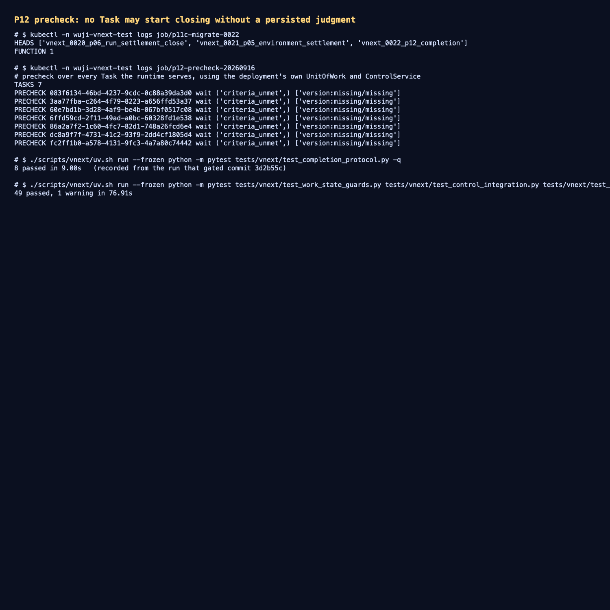

# P12 完成 precheck：没有已持久化判定，任何 Task 都不能开始关闭

- 日期：2026-09-16；工作树 `work/worktrees/vnext-maf`，分支 `codex/vnext-maf`，被测代码 `3d2b55c`。
- 集群：`docker-desktop` / `wuji-vnext-test`；迁移头 `vnext_0022_p12_completion`；
  镜像 `127.0.0.1:56615/wuji-vnext-platform@sha256:cff65cc4826be4475eed27386e7699a2455121e5a75e870608b73d86960df2b3`。

## 1. 本切片交付的范围

P12 之前只有一条**只读**的 `vnext.completion_decision` 状态机和没人调用的 `apply_completion`。本切片补上生产者与判定：

- 迁移 `vnext_0022_p12_completion`：一个 SECURITY DEFINER 生产者
  `vnext.prepare_completion_quiesce(...)`，显式校验"该 Task 的控制权限 + 已激活 + 尚未进入完成期 +
  control_version/board_revision 未变"，按 receipt key 幂等，并用不同的源字节拒绝覆盖既有决定。
- `wuji_core.completion.criteria`：只认**已持久化**的 `criterion_judgment`——缺失、`unknown`、
  `not_applicable` 与非 `current` 的适用性一律"未满足"；required 为空也永远不满足（AC-051）。
- `wuji_core.completion.precheck.CompletionService`：`precheck` 从持久的工作/运行/判定状态给出
  `wait`/`ready`/`blocked`，**不绑定提出者 Run**（AC-047）；`propose` 只在 `ready` 时写入 quiescing 决定
  （否则 `completion_precheck_incomplete`），`apply` 交给既有 P05 状态机消费。

未做：判定的真实生产（谁在什么证据下写 `criterion_judgment`）、结算/报告冻结、迟到反证。

## 2. 集群实测

迁移 Job 应用成功（head 0022、函数存在），随后用**部署自身的 UoW/ControlService**跑只读 precheck：

```text
TASKS 7
PRECHECK 083f6134-… wait ('criteria_unmet',) ['version:missing/missing']
PRECHECK 3aa77fba-… wait ('criteria_unmet',) ['version:missing/missing']
PRECHECK 60e7bd1b-… wait ('criteria_unmet',) ['version:missing/missing']
PRECHECK 6ffd59cd-… wait ('criteria_unmet',) ['version:missing/missing']
PRECHECK 86a2a7f2-… wait ('criteria_unmet',) ['version:missing/missing']
PRECHECK dc8a9f7f-… wait ('criteria_unmet',) ['version:missing/missing']
PRECHECK fc2ff1b0-… wait ('criteria_unmet',) ['version:missing/missing']
```

七个 Task 全部是 `wait/criteria_unmet`：包括 `fc2ff1b0-…`——它的 reason 与 explore 两个 Run 都已
`exit_code=0`、结果都被接纳、work item 都是 `done`，**但平台从未为它的 Goal 判据写过分判定**，因此
precheck 依旧拒绝开始关闭。这正是 AC-051 的失败闭合语义："模型/用户声称完成"或"所有工作看起来结束了"
都不等于 Goal met。

## 3. 证据

- 迁移应用（head 与函数存在）：[`raw/migration-0022.txt`](raw/migration-0022.txt)
- 七 Task 的真实 precheck 输出：[`raw/precheck-live.txt`](raw/precheck-live.txt)
- 测试命令与结果：[`raw/tests.txt`](raw/tests.txt)
- 终端汇总截图：[`screenshots/completion-precheck.png`](screenshots/completion-precheck.png)



测试：`tests/vnext/test_completion_protocol.py` 8 passed（必需工作阻止冻结、已结算 Reason 不是活跃依赖、
只有 current+met 的判定才算支持、非 controller 不能 propose、空 required 永不满足）；
相邻套件 `test_work_state_guards` + `test_control_integration` + `test_layouts` +
`test_session_writer_exit_migration` + 本文件共 49 passed。

## 4. 下一步

1. **判定生产**：从真实证据（sealed artifact / 已验证 Observation）按 Goal 判据的
   `allowed_methods`/`evidence_requirements` 写出 `criterion_judgment`，并让 `current_judgment_id` 只在
   revision/依据仍有效时更新（AC-034/AC-051）。
2. **结算与报告冻结**：quiescing 期间允许回执结算、拒绝新动作（AC-049）；`close` 决定的
   `close_trigger` 与 `result_outcome` 分开（AC-052）；`ReportCommit` 冻结与迟到反证追加（AC-053）。
3. 多 Task 并发派发（每 Task supervisor 端点）仍未做。
