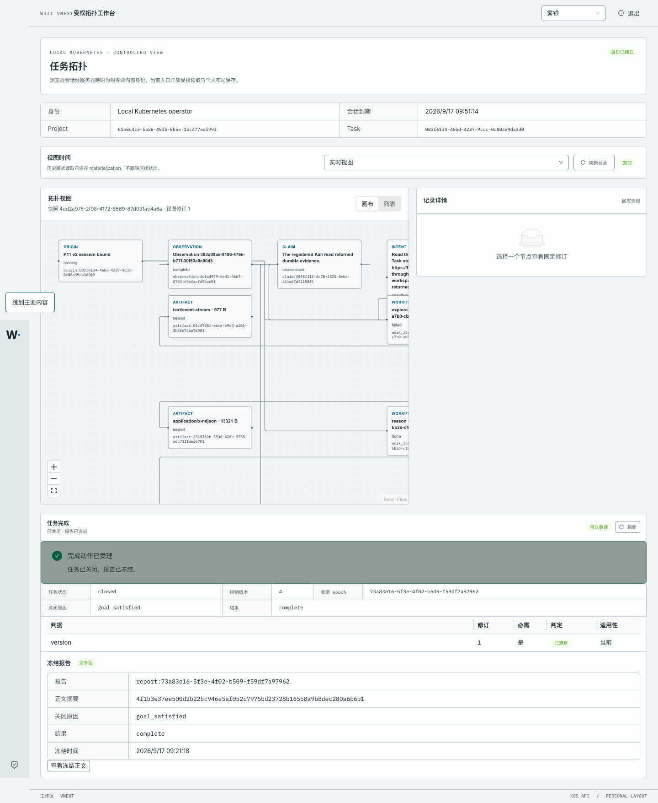

# P12-E 实测：从工作台关闭 Task 并冻结报告

- 日期：2026-09-17；工作树 `work/worktrees/vnext-maf`，分支 `codex/vnext-maf`；被测代码 `6148154`。
- 集群：`docker-desktop` / `wuji-vnext-test`；迁移头 `vnext_0024_p12_reports`；入口 `http://127.0.0.1:44180/`。
- 镜像：api 与 web pod 的 gateway sidecar `127.0.0.1:56615/wuji-vnext-platform@sha256:1ad8ddb12d9a…`；
  web `127.0.0.1:56615/wuji-web@sha256:f426f4ad5bb0…`（`source_revision` 均为 `6148154`）。
- 对象：Task `083f6134-46bd-4237-9cdc-0c88a39da3d0`（关闭前 `running`、两个 Run 已 `exited` 且操作集 `settled`、无未完成工作）。

## 1. 本切片交付

关闭与报告此前只能由平台侧 Job 触发。现在产品入口自己组合既有平台决定：

- `GET /api/v2/tasks/{task_id}/completion`：平台审核（判据、未完成工作、未结算 Run）+ 已冻结报告摘要；
- `POST /api/v2/tasks/{task_id}/completion`：`quiesce` 打开收尾 epoch，`close` 消费一条平台决定并冻结报告；
- `GET /api/v2/tasks/{task_id}/reports/{report_id}`：冻结正文、摘要、争议状态与迟到反证。

决策字节仍由 `prepare_completion_*` 生产者写、由 P05 状态机消费；审核结果与 Run 结算状态都从数据库读，
调用者只能表达意图（关闭原因 + 结果）。持有该 Task `can_control` 的 `operator` 可以操作，agent 一律排除。
工作台新增“任务完成”面板：判据表、开始收尾、完成关闭并冻结报告、查看冻结正文与“有争议”标签。

## 2. 真实 Kubernetes 链路

浏览器（Playwright/Chromium，1440×1000）实际点击：

```text
建立会话                                   -> /auth/session 200
面板显示“可以收尾”（review.decision=ready）  -> GET  /tasks/083f6134…/completion 200
点击“开始收尾”                              -> POST /tasks/083f6134…/completion 202
   body {"action":"quiesce","close_trigger":"goal_satisfied","result_outcome":"complete","deadline_seconds":900}
   resp {"disposition":"quiescing","control_version":"3","completion_epoch_id":"73a83e16-5f3e-4f02-b509-f59df7a97962"}
点击“完成关闭并冻结报告”                     -> POST /tasks/083f6134…/completion 200
   body {"action":"close","close_trigger":"goal_satisfied","result_outcome":"complete","deadline_seconds":900}
   resp {"disposition":"closed","observed_state":"closed","control_version":"4",
         "report":{"report_id":"report:73a83e16-…","dispute_state":"clear","body_digest":"4f1b3e37ee500d2b22bc…"}}
点击“查看冻结正文”                          -> GET  /tasks/083f6134…/reports/report:73a83e16-… 200
刷新状态                                    -> GET  /tasks/083f6134…/completion 200（closed + 冻结报告）
```

幂等重放（新的 Idempotency-Key，同一关闭命令）：`POST …/completion 200`，返回**同一个**报告 id 与摘要，
未产生第二份 commit。缺号报告：`GET …/reports/report-absent 404 NOT_FOUND_OR_FORBIDDEN`。

数据库事实（`raw/database-state.txt`）：

```text
task     closed|run|control_version=4|epoch=73a83e16-…|goal_satisfied|complete|execution_allowed=false
decision quiesce:5712b38baf3b…|quiesce|epoch=73a83e16-…|expected_control_version=2|goal_satisfied
decision close:7475a67ccf55…|close  |epoch=73a83e16-…|expected_control_version=3|goal_satisfied|complete
report   report:73a83e16-…|digest=4f1b3e37ee500d2b22bc946e5af052c7975bd23728b16558a9b8dec280a6b6b1|701 bytes|clear|level=1
work     process_failure → failed / done；ready_work=0
run      a7fd3791… exited|incomplete|settled ；c3e30b1f… exited|accepted|settled
judgment judgment-p12e-portal|version@1|met|current|level=1     ← 由平台侧断言主体写入（见 §4）
```

## 3. 证据

- 浏览器逐步截图：
  [`01-completion-ready.png`](screenshots/01-completion-ready.png)（可以收尾）、
  [`02-epoch-quiescing.png`](screenshots/02-epoch-quiescing.png)（epoch 已开启、动作已受理）、
  [`03-closed-report-frozen.png`](screenshots/03-closed-report-frozen.png)（已关闭 + 报告已冻结）、
  [`04-frozen-report-body.png`](screenshots/04-frozen-report-body.png)（冻结正文原文）。
- 完整 HTTP 报文：[`raw/01-login.*`](raw/01-login.headers.txt)、[`raw/02-completion-review.*`](raw/02-completion-review.headers.txt)、
  [`raw/04-close-replay.*`](raw/04-close-replay.headers.txt)（幂等重放）、
  [`raw/05-report.*`](raw/05-report.headers.txt)、[`raw/06-report-missing.*`](raw/06-report-missing.headers.txt)；
  浏览器本次的原始请求/响应（含两次 POST 的 header 与 body）见
  [`raw/browser-events.json`](raw/browser-events.json)；控制台只有登录前那次预期 401。
- 权威数据库截面：[`raw/database-state.txt`](raw/database-state.txt)；部署绑定：[`raw/deployment-state.json`](raw/deployment-state.json)。
- 检查原文：[`raw/checks-pytest.txt`](raw/checks-pytest.txt)（22 passed / exit 0）、
  [`raw/checks-web-build.txt`](raw/checks-web-build.txt)（exit 0）、
  [`raw/checks-contracts.txt`](raw/checks-contracts.txt)（exit 0）。



## 4. 未覆盖与后续

- 本 Task 的判据判定仍由平台侧断言主体（`assessor-p12e-fixture`）写入；**判定的自动生产来源**仍未定，
  这是 P12-E 之外的既有未完成项。
- 本切片只验证了 `goal_satisfied + complete` 的成功路径与幂等重放；强制关闭（`operator_finish` 等）
  在真实集群未跑，只由 `tests/vnext/test_completion_portal.py` 的真实 PostgreSQL 用例覆盖。
- 报告投递（ReportDelivery，把冻结报告送到外部消费方）与历史报告列表未实现；工作台只读当前冻结报告。
- 工作台绑定仍是**每个 web 部署一个固定 Task**；多 Task 并发派发（T8）与每 Task 独立入口仍未做。
