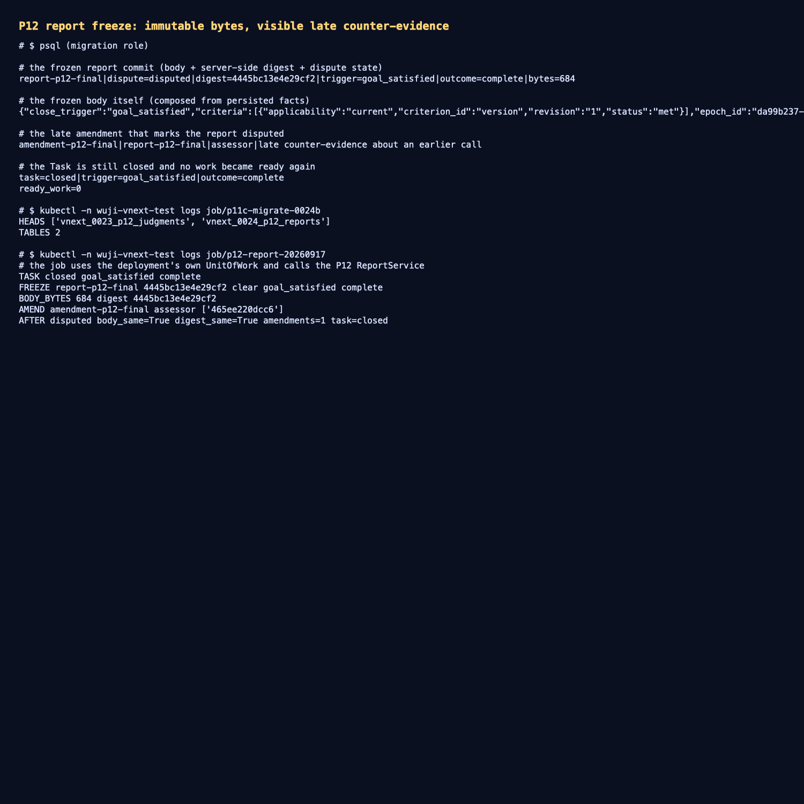

# P12 实测：报告冻结 + 迟到反证（AC-053）

- 日期：2026-09-17；工作树 `work/worktrees/vnext-maf`，分支 `codex/vnext-maf`；被测代码 `9bddbcc`。
- 集群：`docker-desktop` / `wuji-vnext-test`；迁移头 `vnext_0024_p12_reports`；
  镜像 `127.0.0.1:56615/wuji-vnext-platform@sha256:5285647da768515e11a96b108b40376e72d589dc869c99c12494a4bdc4fa080f`。
- 对象：已关闭的 Task `fc2ff1b0-a578-4131-9fc3-4a7a80c74442`（`closed`、`goal_satisfied`、`complete`）。

## 1. 本切片交付

- 迁移 `vnext_0024_p12_reports`：`report_commit` 与 `report_amendment` 两张表对应用角色只读，两个
  SECURITY DEFINER 生产者：
  - `freeze_report_commit`：只允许**该 epoch 上已关闭**的 Task 冻结；digest 由服务端对正文计算；同一 key
    不同字节、或落库正文与自身 digest 不一致，都拒绝覆盖。
  - `amend_report_commit`：追加一条争议记录并把 commit 标成 `disputed`，**永不修改正文**。
- `completion.reports`：报告正文由持久事实组装（判据判定、工作项、Run、关闭原因与结果）；反证必须引用
  存在、已封存且在当前 clearance 下可读的 artifact；生产者的 SQLSTATE 统一翻译成有界域错误码。

## 2. 集群实测

```text
TASK   closed goal_satisfied complete
FREEZE report-p12-final 4445bc13e4e29cf2 clear goal_satisfied complete
BODY   684 bytes，digest 4445bc13e4e29cf2
AMEND  amendment-p12-final assessor ['465ee220dcc6']      ← 引用真实封存 artifact
AFTER  disputed  body_same=True  digest_same=True  amendments=1  task=closed
```

冻结正文（原文）：

```json
{"close_trigger":"goal_satisfied","criteria":[{"applicability":"current","criterion_id":"version","revision":"1","status":"met"}],
 "epoch_id":"da99b237-…","result_outcome":"complete",
 "runs":[{"agent_run_id":"2ccd9c74-…","process_state":"exited","result_state":"accepted","stop_kind":"exited"},
         {"agent_run_id":"bd912879-…","process_state":"exited","result_state":"accepted","stop_kind":"exited"}],
 "schema_version":"wuji.report.v1","task_id":"fc2ff1b0-…",
 "work_items":[{"kind":"explore","state":"done","terminal_reason":null},{"kind":"reason","state":"done","terminal_reason":null}]}
```

迟到反证后：正文与 digest **完全不变**，commit 变为 `disputed`，Task 仍是 `closed`，`ready_work=0`——
历史正文不被改写，反证以补充/争议记录呈现（AC-053）。

## 3. 证据

- 迁移与实时链路输出：[`raw/live-report.txt`](raw/live-report.txt)
- commit / 正文 / amendment / Task 状态：[`raw/database-state.txt`](raw/database-state.txt)
- 终端汇总截图：[`screenshots/report-freeze.png`](screenshots/report-freeze.png)



测试：`tests/vnext/test_completion_protocol.py` 16 passed（报告只能在该 epoch 关闭后冻结、同 key 不同字节与
被动过 digest 的行都被拒、无封存证据的反证被拒、反证后正文与 digest 不变且 dispute 可见、Task 保持 closed
且没有 ready work）；相邻 5 个套件 68 passed。

## 4. 未覆盖与后续

- 报告目前只由显式 Job（平台侧身份）冻结；**产品入口**（工作台/API 触发关闭与查看报告）未接线，
  报告投递（ReportDelivery）与历史查看也未实现。
- 反证的"受信来源"目前是 assessor 或 controller 身份；生产里哪些来源算受信仍未定。
- 判定仍由显式夹具主体写入；自动判定与多 Task 并发派发仍未做。
